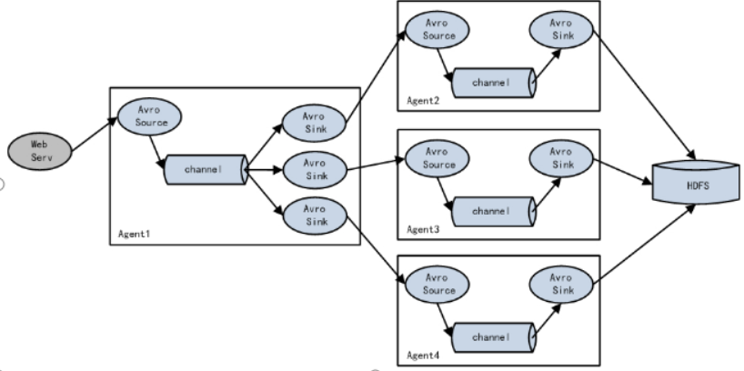

##  概述

##### Flume定义

Flume是一个高可用的，高可靠的，分布式的海量日志采集、聚合和传输的系统。Flume基于流式架构，灵活简单。

##### Flume的优点

```
1.可以和任意存储框架集成
2. 当输入速率大于写入目的地速率时，flume会进行缓冲，减小hdfs的压力
3. flume中事务基于channel,使用两个事务模型(sender+receiver),确保消息被可靠发送,分别负责从source到channel 和从 channel 到sink的时间传递，一旦事务中的所有数据全部成功提交到channel,source才认为数据读取完成，同理，只有成功被sink写出去的数据，才会从channel中移除
```

#### Flume组成架构


##### 各个组成部分功能

##### Agent

Agent是一个JVM进程，以事件形式从数据源传到目的地，是Flume传输的基本单位，Agent的三个组成部分：source, channel, sink

#####  Source

Source是接收数据的组件。Source组件可以处理各种类型、各种格式的日志数据，包括avro、thrift、exec、spooling directory、netcat、syslog。

##### Channel

​	Channel是缓冲区，Channel是线程安全的，可以同时处理多个source和多个sink读写操作

​	分类： Memory Channel(内存队列) 和File Channel(文件队列，将所有事件写入磁盘)

##### Sink 

Sink不断轮询Channel中事件, 将事件写入或存储或发送到另一个Flume

#####  Agent 

​	Flume传输的基本单位，Event包含Header 和body(byte array)

```
Header是一个key-value字符串的HashMap， body 是一个byte Array数组
```

##### 内部原理

```
接收数据-> source->Channel处理器->事件拦截器->channel选择器(多个channel时使用)->返回写入事件的channel列表-> channel选择器-> sink处理器(多个sink时使用)->写入
```


#### 拓扑结构

##### 负载均衡模式


##### 聚合模式


#### Flume安装

```
官网: http://flume.apache.org/
文档地址：http://flume.apache.org/FlumeUserGuide.html
下载地址：http://archive.apache.org/dist/flume/
```

##### 安装部署

```
1.上传并解压：apache-flume-1.7.0-bin.tar.gz
2. flume/flume-env.sh.template修改为flume-env.sh并配置JAVA_HOME
export JAVA_HOME=/opt/module/jdk1.8.0_144
```


##  开发案例demo

##### 监控端口数据官方案例

案例需求：
监听44444端口，通过netcat工具向44444发送消息,最后Flume将监听的数据显示在控制台

###### 步骤

```
1．安装netcat工具
	sudo yum install -y nc
2. 判断端口是否被占用
	sudo netstat -tunlp | grep 44444
```

```shell
需要指定 -c/ -n / -f
bin/flume-ng agent -c conf/ -n a1 -f jobs/flume-netcat-logger.conf -Dflume.root.logger=INFO,console

-Dflume.root.logger==INFO,console ：-D表示flume运行时动态修改flume.root.logger参数属性值，并将控制台日志打印级别设置为INFO级别。日志级别包括:log、info、warn、error。
```

###### netcat

​	功能描述：netstat命令是一个监控TCP/IP网络的非常有用的工具，它可以显示路由表、实际的网络连接以及每一个网络接口设备的状态信息。 
基本语法：netstat [选项]
选项参数：
​	-t或--tcp：显示TCP传输协议的连线状况； 
-u或--udp：显示UDP传输协议的连线状况；
​	-n或--numeric：直接使用ip地址，而不通过域名服务器(数字方式)
​	-l或--listening：显示监控中的服务器的Socket； 
​	-p或--programs：显示pid


##### 实时读取本地文件到HDFS案例

案例需求：实时监控Hive日志，并上传到HDFS中

```
#整体的设置
a1.sources = r1
a1.channels= c1
a1.sinks= s1

#对source的描述
a1.sources.r1.type= exec
a1.sources.r1.command = tail -F /opt/module/hive/logs/hive.log
a1.sources.r1.shell = /bin/bash -c

#对channel描述
a1.channels.c1.type=memory
a1.channels.c1.capacity=1000
a1.channels.c1.transactionCapacity =100

#对sink进行描述
a1.sinks.s1.type=hdfs
#书写的hdfs路径--并以当前时间命名 %D 月日年 %H以小时方式
a1.sinks.s1.hdfs.path=hdfs://hadoop102:9000/flume/%D/%H
#文件前缀--生成的文件以logs-为前缀
a1.sinks.s1.hdfs.filePrefix = logs-
#滚动文件--定时进行滚动文件,将写的文件封闭掉，然后生成一个新的文件
a1.sinks.s1.hdfs.rollInterval = 60
#按照文件大小滚动
a1.sinks.s1.hdfs.rollSize = 134217700
#按照事件数进行滚动
a1.sinks.s1.hdfs.rollCount = 0
#批处理大小
a1.sinks.s1.hdfs.batchSize = 1000
#文件类型--datastream 普通文件格式，
a1.sinks.s1.hdfs.fileType = DataStream
#最小块副本--datanode启动时要向namenode报告块信息，每一块的信息报告后达到99%可以
a1.sinks.s1.hdfs.minBlockReplicas = 1
#文件夹滚动
a1.sinks.s1.hdfs.round = true
#滚动的数量
a1.sinks.s1.hdfs.roundValue = 1
#这两个合起来表示按照1小时进行滚动一个文件夹
a1.sinks.s1.hdfs.roundUnit = hour
#当时用转义序列时 默认从header中获取时间数据--默认为false
a1.sinks.s1.hdfs.useLocalTimeStamp = true

a1.sources.r1.channels = c1
a1.sinks.s1.channel =c1
```

###### 启动命令

```
bin/flume-ng agent -c conf/ -n a1 -f jobs/flume-exec-hdfs.conf 
```


##### 实时读取目录文件到HDFS案例

需求：使用Flume监听整个目录的文件

要点：使用Spooldir Source监控文件夹变化

```
a3.sources = r3
a3.sinks = k3
a3.channels = c3

# Describe/configure the source
a3.sources.r3.type = spooldir
#spoolDir监听的路径
a3.sources.r3.spoolDir = /opt/module/flume/upload
#完成上传后，进行修改后缀
a3.sources.r3.fileSuffix = .COMPLETED
#是否向header中写入绝对路径
a3.sources.r3.fileHeader = true
#忽略所有以.tmp结尾的文件，不上传
a3.sources.r3.ignorePattern = ([^ ]*\.tmp)

# Describe the sink
a3.sinks.k3.type = hdfs
a3.sinks.k3.hdfs.path = hdfs://hadoop102:9000/flume/upload/%Y%m%d/%H
a3.sinks.k3.hdfs.filePrefix = upload-
a3.sinks.k3.hdfs.round = true
a3.sinks.k3.hdfs.roundValue = 1
a3.sinks.k3.hdfs.roundUnit = hour
a3.sinks.k3.hdfs.useLocalTimeStamp = true
a3.sinks.k3.hdfs.batchSize = 100
a3.sinks.k3.hdfs.fileType = DataStream
a3.sinks.k3.hdfs.rollInterval = 60
a3.sinks.k3.hdfs.rollSize = 134217700
a3.sinks.k3.hdfs.rollCount = 0

a3.channels.c3.type = memory
a3.channels.c3.capacity = 1000
a3.channels.c3.transactionCapacity = 100

# Bind the source and sink to the channel
a3.sources.r3.channels = c3
a3.sinks.k3.channel = c3
```


```
bin/flume-ng agent -c conf/ -n a3 -f jobs/flume-dir-hdfs.conf
//监控的文件夹中如果出现错误，任务就会停止
```

##### 单数据源多出口案例(选择器)


需求：使用Flume-1监控文件变动，Flume-1将变动内容传递给Flume-2，Flume-2负责存储到HDFS。同时Flume-1将变动内容传递给Flume-3，Flume-3负责输出到Local FileSystem。


```
#一个source 两个channel 两个sink
a1.sources = r1
a1.channels = c1 c2
a1.sinks = s1 s2

#配置source
a1.sources.r1.type = exec
a1.sources.r1.command = tail -F /opt/module/hive/logs/hive.log
a1.sources.r1.shell=/bin/bash -c

#配置channel
a1.channels.c1.type= memory
a1.channels.c1.capacity=1000
a1.channels.c1.transactionCapacity=100

a1.channels.c2.type= memory
a1.channels.c2.capacity=1000
a1.channels.c2.transactionCapacity=100

#配置sink属性为avro属性
#相当于数据的发送者
a1.sinks.s1.type = avro
a1.sinks.s1.hostname=hadoop102
a1.sinks.s1.port=4141

a1.sinks.s2.type=avro
a1.sinks.s2.hostname=hadoop102
a1.sinks.s2.port=4142

#对接起来
a1.sources.r1.channels=c1 c2
a1.sinks.s1.channel=c1
a1.sinks.s2.channel=c2
```

```
#进行命名
a2.sources=r1
a2.channels=c1
a2.sinks=k1

#组装source
#bind port 
a2.sources.r1.type=avro
a2.sources.r1.bind=hadoop102
a2.sources.r1.port=4141

#配置channel
a2.channels.c1.type= memory
a2.channels.c1.capacity=1000
a2.channels.c1.transactionCapacity=100

#配置sink--hdfs类型
a2.sinks.k1.type = hdfs
a2.sinks.k1.hdfs.path = hdfs://hadoop102:9000/flume2/upload/%Y%m%d/%H
a2.sinks.k1.hdfs.filePrefix = upload-
a2.sinks.k1.hdfs.round = true
a2.sinks.k1.hdfs.roundValue = 1
a2.sinks.k1.hdfs.roundUnit = hour
a2.sinks.k1.hdfs.useLocalTimeStamp = true
a2.sinks.k1.hdfs.batchSize = 100
a2.sinks.k1.hdfs.fileType = DataStream
a2.sinks.k1.hdfs.rollInterval = 60
a2.sinks.k1.hdfs.rollSize = 134217700
a2.sinks.k1.hdfs.rollCount = 0

#进行拼接绑定
a2.sources.r1.channels=c1
a2.sinks.k1.channel=c1
```

```
#进行命名
a3.sources=r1
a3.channels=c1
a3.sinks=k1

#组装source
#bind port 
a3.sources.r1.type=avro
a3.sources.r1.bind=hadoop102
a3.sources.r1.port=4142

#配置channel
a3.channels.c1.type= memory
a3.channels.c1.capacity=1000
a3.channels.c1.transactionCapacity=100

#配置sink--本地生成的文件夹必须存在
a3.sinks.k1.type=file_roll
a3.sinks.k1.sink.diretory= /opt/module/data/flume3

#进行拼接绑定
a3.sources.r1.channels=c1
a3.sinks.k1.channel=c1
```

```
bin/flume-ng agent -c conf/ -n a1 -f jobs/oup1/flume-exec-avro.conf 

bin/flume-ng agent -c conf/ -n a2 -f jobs/oup1/flume-avro-hdfs.conf 

bin/flume-ng agent -c conf/ -n a3 -f jobs/oup1/flume-avro-file.conf 
```

提示：输出的本地目录必须是已经存在的目录，如果该目录不存在，并不会创建新的目录。

```
 bin/hive
 启动hive时会在监控文件下生成日志log
```

##### sink选择器设置

```
replicating(默认):将数据拷贝给所有channel
	a1.sources.r1.selector.type=replicating
Multiplexing: 根据配置发送到特定的channel
```

###### Multiplexing

```
a1.sources = r1

a1.sources.source1.selector.type = multiplexing
a1.sources.source1.selector.header = validation # 以header中的validation对应的值作为条件
a1.sources.source1.selector.mapping.SUCCESS = c2 # 如果header中validation的值为SUCCESS，使用c2这个channel
a1.sources.source1.selector.mapping.FAIL = c1 # 如果header中validation的值为FAIL，使用c1这个channel
a1.sources.source1.selector.default = c1 # 默认使用c1这个channel
//要使用拦截器对数据进行处理，改变头部信息
```


#####  单数据源多出口案例(Sink组)

案例需求：使用Flume-1监控文件变动，Flume-1将变动内容传递给Flume-2，Flume-2负责存储到HDFS。同时Flume-1将变动内容传递给Flume-3，Flume-3也负责存储到HDFS 




```
#一个source 一个channel 多个sink，这时就有组的概念了
a1.sources = r1
a1.channels=c1
a1.sinkgroups=g1
a1.sinks=k1 k2

#配置sink组的成员
a1.sinkgroups.g1.sinks=k1 k2
a1.sinkgroups.g1.processor.type=load_balance
#指数级的退出
a1.sinkgroups.g1.processor.backoff=true
a1.sinkgroups.g1.processor.selector=random
a1.sinkgroups.g1.processor.selector.maxTimeout=10000

#配置source--绑定端口号，进行输出
a1.sources.r1.type=netcat
a1.sources.r1.bind=localhost
a1.sources.r1.port=44444

#一个channel对应多个sink，需要添加sink处理器
#故障转移  / 负载均衡load balnacing

#配置sink
a1.sinks.k1.type=avro
a1.sinks.k1.hostname=hadoop102
a1.sinks.k1.port=4141

a1.sinks.k2.type=avro
a1.sinks.k2.hostname=hadoop102
a1.sinks.k2.port=4142


#配置channel
a1.channels.c1.type=memory
a1.channels.c1.capacity=1000
a1.channels.c1.transactionCapacity =100

#进行绑定
a1.sources.r1.channels=c1
a1.sinks.k1.channel=c1
a1.sinks.k2.channel=c1
```

```
a2.sources = r1
a2.sinks = k1
a2.channels = c1

#配置sources
a2.sources.r1.type = avro
a2.sources.r1.bind = hadoop102
a2.sources.r1.port = 4141

# 配置sink
a2.sinks.k1.type = logger

# 配置channel
a2.channels.c1.type = memory
a2.channels.c1.capacity = 1000
a2.channels.c1.transactionCapacity = 100

#进行连接
a2.sources.r1.channels = c1
a2.sinks.k1.channel = c1
```

```
a3.sources = r1
a3.sinks = k1
a3.channels = c2

# Describe/configure the source
a3.sources.r1.type = avro
a3.sources.r1.bind = hadoop102
a3.sources.r1.port = 4142

# Describe the sink
a3.sinks.k1.type = logger

# Describe the channel
a3.channels.c2.type = memory
a3.channels.c2.capacity = 1000
a3.channels.c2.transactionCapacity = 100

# Bind the source and sink to the channel
a3.sources.r1.channels = c2
a3.sinks.k1.channel = c2
```

```
#启动命令
bin/flume-ng agent -c conf/ -n a1 -f jobs/group2/flume-netcat-avro.conf 

 bin/flume-ng agent -c conf/ -n a2 -f jobs/oup2/flume-avro-console1.conf -Dflume.root.logger=INFO,console

bin/flume-ng agent -c conf/ -n a3 -f jobs/oup2/flume-avro-console2.conf -Dflume.root.logger=INFO,console

```


##### 多数据源汇总案例


案例需求：
hadoop103上的Flume-1监控文件/opt/module/group.log，
hadoop102上的Flume-2监控某一个端口的数据流，
Flume-1与Flume-2将数据发送给hadoop104上的Flume-3，Flume-3将最终数据打印到控制台。

```
//hadoop105
a3.sources=r1
a3.sinks=k1
a3.channels=c1

#配置source
a3.sources.r1.type=avro
a3.sources.r1.bind=hadoop105
a3.sources.r1.port=4141

#配置sink
a3.sinks.k1.type=logger

#配置channel
a3.channels.c1.type=memory
a3.channels.c1.capacity=1000
a3.channels.c1.transactionCapacity=100

a3.sources.r1.channels=c1
a3.sinks.k1.channel=c1
```

```
//hadoop103
a1.sources = r1
a1.sinks = k1
a1.channels = c1

# Describe/configure the source
a1.sources.r1.type = exec
a1.sources.r1.command = tail -F /opt/module/group.log
a1.sources.r1.shell = /bin/bash -c

# Describe the sink
a1.sinks.k1.type = avro
a1.sinks.k1.hostname = hadoop105
a1.sinks.k1.port = 4141

# Describe the channel
a1.channels.c1.type = memory
a1.channels.c1.capacity = 1000
a1.channels.c1.transactionCapacity = 100

# Bind the source and sink to the channel
a1.sources.r1.channels = c1
a1.sinks.k1.channel = c1
```

```
//hadoop102
#定义各个组件
a2.sources= r1
a2.sinks = k1
a2.channels = c1

#配置source
a2.sources.r1.type = netcat
a2.sources.r1.bind=hadoop102
a2.sources.r1.port=44444

#配置sink
a2.sinks.k1.type=avro
a2.sinks.k1.hostname=hadoop105
#端口号一致才有聚集效果
a2.sinks.k1.port=4141
#配置channel
a2.channels.c1.type=memory
a2.channels.c1.capacity=1000
a2.channels.c1.transactionCapacity=100
#进行绑定
a2.sources.r1.channels=c1
a2.sinks.k1.channel=c1
```


4．执行配置文件

```
hadoop102:
	bin/flume-ng agent -c conf/ -n a2 -f jobs/group3/flume2-netcat-avro.conf 
hadoop103:
	bin/flume-ng agent -c conf/ -n a1 -f jobs/gup3/flume3-exec-avro.conf 
hadoop105:
	bin/flume-ng agent -c conf/ -n a3 -f jobs/group3/flume5-avro-console.conf -Dflume.root.logger=INFO,console
	
hadoop102中: nc hadoop102 44444 使用netcat发送端口消息
hadoop103中: 创建group.log日志文件，并添加消息
```

```
将多台节点的数据汇总到一个节点，进行聚合，
```


##  Flume监控之Ganglia

##### Ganglia的安装与部署

```
1.安装httpd服务与php
 sudo yum -y install httpd php
2.安装其他依赖
 sudo yum -y install rrdtool perl-rrdtool rrdtool-devel
 sudo yum -y install apr-devel
3. 安装ganglia
 sudo rpm -Uvh http://dl.fedoraproject.org/pub/epel/6/x86_64/epel-release-6-8.noarch.rpm
4. sudo yum -y install ganglia-gmetad 
5. sudo yum -y install ganglia-web
6. sudo yum install -y ganglia-gmond
```

> Ganglia由gmond、gmetad和gweb三部分组成。
> gmond（Ganglia Monitoring Daemon）是一种轻量级服务，安装在每台需要收集指标数据的节点主机上。使用gmond，你可以很容易收集很多系统指标数据，如CPU、内存、磁盘、网络和活跃进程的数据等。
> gmetad（Ganglia Meta Daemon）整合所有信息，并将其以RRD格式存储至磁盘的服务。
> gweb（Ganglia Web）Ganglia可视化工具，gweb是一种利用浏览器显示gmetad所存储数据的PHP前端。在Web界面中以图表方式展现集群的运行状态下收集的多种不同指标数据

4修改配置文件/etc/httpd/conf.d/ganglia.conf
sudo vim /etc/httpd/conf.d/ganglia.conf
修改为红颜色的配置：

```
<Location /ganglia>
  Order deny,allow
  #Deny from all
  Allow from all
  # Allow from 127.0.0.1
  # Allow from ::1
  # Allow from .example.com
</Location>

修改数据源
data_source "hadoop102" 192.168.1.102
修改配置文件/etc/ganglia/gmod.conf

```

selinux本次生效关闭必须重启，如果此时不想重启，可以临时生效之：
	sudo setenforce 0

5. 启动ganglia
   sudo service httpd start
   sudo service gmetad start
   sudo service gmond start
   6) 打开网页浏览ganglia页面
   http://192.168.1.102/ganglia
   尖叫提示：如果完成以上操作依然出现权限不足错误，请修改/var/lib/ganglia目录的权限：
   [atguigu@hadoop102 flume]$ sudo chmod -R 777 /var/lib/ganglia


## 自定义Source

官方说明：
   https://flume.apache.org/FlumeDeveloperGuide.html#source根据官方说明自定义MySource需要继承AbstractSource类并实现Configurable和PollableSource接口。

需求
   使用flume接收数据，并给每条数据添加前缀，输出到控制台。前缀可从flume配置文件中配置。


导入pom依赖

```
<dependency>
        <groupId>org.apache.flume</groupId>
        <artifactId>flume-ng-core</artifactId>
        <version>1.7.0</version>
</dependency>
```

```

/*
    总结：事件含有两部分信息 头信息和body信息，  头信息是一个map bidy是一个字节数组
     configure(Context context)//初始化context（读取配置文件内容）
   process()//获取数据封装成event并写入channel，这个方法将被循环调用。
   使用场景：读取MySQL数据或者其他文件系统
 */
public class Mysource2 extends AbstractSource implements Configurable, PollableSource {
    private Long delay ;
    private String field;

    /**
     *
     * @return
     * @throws EventDeliveryException
     */
    @Override
    public Status process() throws EventDeliveryException {
        //创建事件头信息
        HashMap<String, String> hashMap = new HashMap<>();
        //创建事件
        SimpleEvent event= new SimpleEvent();
        //循环封装事件
        for(int i=0; i<5; i++){
            //给事件设置头信息
            event.setHeaders(hashMap);
            //给事件设置内容
            event.setBody((field+i).getBytes());
            //将事件写入channel
            getChannelProcessor().processEvent(event);
            try {
                Thread.sleep(delay);
            } catch (InterruptedException e) {
                e.printStackTrace();
                return Status.BACKOFF;  //返回状态信息，回滚
            }
        }

        return Status.READY; //正常信息
    }

    @Override
    public long getBackOffSleepIncrement() {
        return 0;
    }

    @Override
    public long getMaxBackOffSleepInterval() {
        return 0;
    }

    /**
     *  获取配置信息--通过context上下文获取配置信息
     * @param context
     */
    @Override
    public void configure(Context context) {
        context.getLong("delay");
        context.getString("field","hello");
    }
}

```

######  测试

1）打包
将写好的代码打包，并放到flume的lib目录（/opt/module/flume）下。
2）配置文件

```
# Name the components on this agent
a1.sources = r1
a1.sinks = k1
a1.channels = c1

# Describe/configure the source
a1.sources.r1.type = com.atguigu.MySource
a1.sources.r1.delay = 1000
#a1.sources.r1.field = atguigu

# Describe the sink
a1.sinks.k1.type = logger

# Use a channel which buffers events in memory
a1.channels.c1.type = memory
a1.channels.c1.capacity = 1000
a1.channels.c1.transactionCapacity = 100

# Bind the source and sink to the channel
a1.sources.r1.channels = c1
a1.sinks.k1.channel = c1
```

3）开启任务

```
 bin/flume-ng agent -c conf/ -f job/mysource.conf -n a1 -Dflume.root.logger=INFO,console
```


## 自定义Sink

​	Sink不断地轮询Channel中的事件且批量地移除它们，并将这些事件批量写入到存储或索引系统、或者被发送到另一个Flume Agent。

Sink是完全事务性的。在从Channel批量删除数据之前，每个Sink用Channel启动一个事务。批量事件一旦成功写出到存储系统或下一个Flume Agent，Sink就利用Channel提交事务。事务一旦被提交，该Channel从自己的内部缓冲区删除事件。


官方也提供了自定义source的接口：
https://flume.apache.org/FlumeDeveloperGuide.html#sink根据官方说明自定义MySink需要继承AbstractSink类并实现Configurable接口。
实现相应方法：

##### 需求:

 使用flume接收数据，并在Sink端给每条数据添加前缀和后缀，输出到控制台。前后缀可在flume任务配置文件中配置。

```java
//configure(Context context)//初始化context（读取配置文件内容）
//process()//从Channel读取获取数据（event），这个方法将被循环调用。

public class MySink2 extends AbstractSink implements Configurable {
//    private Logger
    private Long delay;
    private String suffix;
    private  Logger logger;

    @Override
    public Status process() throws EventDeliveryException {
        //声明返回状态信息
        Status status;
        //获取当前sink绑定的channel
        Channel ch = getChannel();

        //获取事务
        Transaction transaction = ch.getTransaction();
        //声明事件
        Event event;
        //开启事务
        transaction.begin();
        //读取channel中的事件
        while(true){
            event = ch.take();
            if(event!= null){
                break;
            }
        }
       logger= LoggerFactory.getLogger(MySink2.class);
        try {
            logger.info(suffix+ new String(event.getBody()));
            //提交事务
            transaction.commit();
        } catch (Exception e) {
            e.printStackTrace();
            //遇到异常，事务回滚
            transaction.rollback();
            return Status.BACKOFF;
        } finally {
            //关闭事务
            transaction.close();
        }
        return Status.READY;

    }

    @Override
    public void configure(Context context) {
        suffix = context.getString("suffix");
        delay = context.getLong("delay");
    }
}
```

测试

1）打包:将写好的代码打包，并放到flume的lib目录（/opt/module/flume）下。
2）配置文件

```
# Name the components on this agent
a1.sources = r1
a1.sinks = k1
a1.channels = c1

# Describe/configure the source
a1.sources.r1.type = netcat
a1.sources.r1.bind = localhost
a1.sources.r1.port = 44444

# Describe the sink
a1.sinks.k1.type = com.atguigu.MySink
#a1.sinks.k1.prefix = wangyg:
a1.sinks.k1.suffix = :bigdata

# Use a channel which buffers events in memory
a1.channels.c1.type = memory
a1.channels.c1.capacity = 1000
a1.channels.c1.transactionCapacity = 100

# Bind the source and sink to the channel
a1.sources.r1.channels = c1
a1.sinks.k1.channel = c1
```

```
 bin/flume-ng agent -c conf/ -f job/mysink.conf -n a1 -Dflume.root.logger=INFO,console
 nc localhost 44444
```


##### 自定义source 实现断点续传操作

```java

import org.apache.commons.io.FileUtils;
import org.apache.flume.Context;
import org.apache.flume.Event;
import org.apache.flume.EventDrivenSource;
import org.apache.flume.channel.ChannelProcessor;
import org.apache.flume.conf.Configurable;
import org.apache.flume.event.EventBuilder;
import org.apache.flume.source.AbstractSource;
import org.slf4j.Logger;
import org.slf4j.LoggerFactory;

import java.io.File;
import java.io.FileNotFoundException;
import java.io.IOException;
import java.io.RandomAccessFile;
import java.nio.charset.Charset;
import java.util.concurrent.ExecutorService;
import java.util.concurrent.Executors;
import java.util.concurrent.TimeUnit;

/**
 * 自定义source，实现多点续传
 */
@SuppressWarnings("all")
public class MyFileSource2 extends AbstractSource implements Configurable, EventDrivenSource {
    //模拟实现多点续传功能
    //logger日志
    private static final Logger logger = LoggerFactory.getLogger(MyFileSource2.class);
    //文件路径
    private String filePath;
    //offsetPath --偏移量
    private String offsetPath;
    //interval 间隙
    private Long interval;
    //charset;
    private String charset;
    //juc 线程池
    private ExecutorService executorService;
    //内部类对象引用
    private  FileSourceRunnable runnable;

    /**
     * 获取配置信息
     *
     * @param context
     */
    @Override
    public void configure(Context context) {
        filePath = context.getString("filePath");
        offsetPath = context.getString("offsetPath");
        interval = context.getLong("interval", 1000L);
        charset = context.getString("charset", "UTF-8");
    }

    //start()方法
    @Override
    public synchronized void start() {
        //创建一个线程池，得到一个channel对象
        executorService = Executors.newSingleThreadExecutor();
        //获取channel
        ChannelProcessor channelProcessor = getChannelProcessor();
        //创建一个内部类对象
        runnable= new FileSourceRunnable(filePath, offsetPath, interval, charset, channelProcessor);
        //将executor放入线程池中，进行执行
        executorService.execute(runnable);

        //调用start方法
        super.start();
    }

    /**
     * 关闭方法
     */
    @Override
    public synchronized void stop() {
        //线程停止
        runnable.setFlag(false);
        //停掉线程池
        executorService.shutdown();
        while(!executorService.isTerminated()){
            logger.debug("Waiting for exec executor service to stop");
            try {
                //阻塞知道所有任务完成
                executorService.awaitTermination(500, TimeUnit.MILLISECONDS);
            } catch (InterruptedException e) {
                logger.debug("Interrupted while waiting for exec executor service "
                        + "to stop. Just exiting.");
                Thread.currentThread().interrupt();
            }
        }
        super.stop();

    }

    @SuppressWarnings("all")
    //新增一个内部类
    public static class FileSourceRunnable implements Runnable {
        private String filepath;
        private String offsetPath;
        private Long interval;
        private String charset;
        private ChannelProcessor channelProcessor;

        private Long offset = 0L;
        private File osfile;
        private boolean flag = true;
        private RandomAccessFile raf;

        public FileSourceRunnable(String filepath, String offsetPath, Long interval, String charset, ChannelProcessor channelProcessor) {
            this.filepath = filepath;
            this.offsetPath = offsetPath;
            this.interval = interval;
            this.charset = charset;
            this.channelProcessor = channelProcessor;

            //将偏移量文件装进file对象里
            osfile = new File(offsetPath);
            //判断是否有偏移量文件，如果不存在就创建一个
            if (!osfile.exists()) {
                try {
                    osfile.createNewFile();
                } catch (IOException e) {
                    logger.debug("create osfile error", e);
                }
            }
            //如果存在，判断文件里有没有内容，先得到文件中的内容转为string
            try {
                String offsetStr = FileUtils.readFileToString(osfile);
                //判断是否有内容
                if (offsetStr != null && !"".equals(offsetStr)) {
                    offset = Long.parseLong(offsetStr);
                }
            } catch (IOException e) {
                logger.debug("read offset error", e);
            }
            //如果有偏移量，就接着读，没有的话从头读，new 一个随机读取文件内容的对象
            try {
                raf = new RandomAccessFile(filepath, "r");
                raf.seek(offset);
            } catch (FileNotFoundException e) {
                e.printStackTrace();
                logger.debug("file not found error", e);
            } catch (IOException e) {
                e.printStackTrace();
                logger.debug("read offset error", e);
            }
        }

        @Override
        public void run() {
            //flag--定期读取文件，判断是否有新内容
            while (flag) {
                try {
                    String line = raf.readLine();
                    //将数据封装成event对象
                    if (line != null) {
                        Event event = EventBuilder.withBody(line, Charset.forName(charset));
                        //event对象发送给channel
                        channelProcessor.processEvent(event);
                        //获取新的偏移量，在更新偏移量
                        offset = raf.getFilePointer(); //获取新的品一辆
                        FileUtils.writeStringToFile(osfile
                                , offset + ""); //转为字符串类型
                    } else {
                        Thread.sleep(interval);
                    }
                } catch (IOException e) {
                    e.printStackTrace();
                    logger.debug("read line error", e);
                } catch (InterruptedException e) {
                    e.printStackTrace();
                    logger.debug("thread sleep error", e);
                }

            }
        }

        //对外提供一个接口，用于设置是否定期读取文件
        public void setFlag(boolean flag) {
            this.flag = flag;
        }
    }
}
```


##### 自定义MySQLSource

 自定义Source说明
实时监控MySQL，从MySQL中获取数据传输到HDFS或者其他存储框架，所以此时需要我们自己实现MySQLSource。
官方也提供了自定义source的接口：
官网说明：https://flume.apache.org/FlumeDeveloperGuide.html#source

根据官方说明自定义mysqlsource需要继承AbstractSource类并实现Configurable和PollableSource接口。
实现相应方法：

```
configure(Context context)//初始化context
process()//获取数据（从mysql获取数据，业务处理比较复杂，所以我们定义一个专门的类——SQLSourceHelper来处理跟mysql的交互），封装成event并写入channel，这个方法被循环调用
stop()//关闭相关的资源
```

PollableSource：从source中提取数据，将其发送到channel。
Configurable：实现了Configurable的任何类都含有一个context，使用context获取配置信息。
1、导入pom依赖

```
 <dependency>
        <groupId>org.apache.flume</groupId>
        <artifactId>flume-ng-core</artifactId>
        <version>1.7.0</version>
    </dependency>
    <dependency>
        <groupId>mysql</groupId>
        <artifactId>mysql-connector-java</artifactId>
        <version>5.1.27</version>
    </dependency>
```

2、添加配置信息
在classpath下添加jdbc.properties和log4j.properties
jdbc.properties:
dbDriver=com.mysql.jdbc.Driver
dbUrl=jdbc:mysql://hadoop102:3306/mysqlsource?useUnicode=true&characterEncoding=utf-8
dbUser=root
dbPassword=000000
log4j.properties:
#--------console-----------
log4j.rootLogger=info,myconsole,myfile
log4j.appender.myconsole=org.apache.log4j.ConsoleAppender
log4j.appender.myconsole.layout=org.apache.log4j.SimpleLayout
#log4j.appender.myconsole.layout.ConversionPattern =%d [%t] %-5p [%c] - %m%n

#log4j.rootLogger=error,myfile
log4j.appender.myfile=org.apache.log4j.DailyRollingFileAppender
log4j.appender.myfile.File=/tmp/flume.log
log4j.appender.myfile.layout=org.apache.log4j.PatternLayout
log4j.appender.myfile.layout.ConversionPattern =%d [%t] %-5p [%c] - %m%n
3、SQLSourceHelper
1) 属性说明：
属性	说明（括号中为默认值）
runQueryDelay	查询时间间隔（10000）
batchSize	缓存大小（100）
startFrom	查询语句开始id（0）
currentIndex	查询语句当前id，每次查询之前需要查元数据表
recordSixe	查询返回条数
table	监控的表名
columnsToSelect	查询字段（*）
customQuery	用户传入的查询语句
query	查询语句
defaultCharsetResultSet	编码格式（UTF-8）
2) 方法说明：
方法	说明
SQLSourceHelper(Context context)	构造方法，初始化属性及获取JDBC连接
InitConnection(String url, String user, String pw)	获取JDBC连接
checkMandatoryProperties()	校验相关属性是否设置（实际开发中可增加内容）
buildQuery()	根据实际情况构建sql语句，返回值String
executeQuery()	执行sql语句的查询操作，返回值List<List<Object>>
getAllRows(List<List<Object>> queryResult)	将查询结果转换为String，方便后续操作
updateOffset2DB(int size)	根据每次查询结果将offset写入元数据表
execSql(String sql)	具体执行sql语句方法
getStatusDBIndex(int startFrom)	获取元数据表中的offset
queryOne(String sql)	获取元数据表中的offset实际sql语句执行方法
close()	关闭资源
3)代码实现：

```
package com.atguigu.source;

import org.apache.flume.Context;
import org.apache.flume.conf.ConfigurationException;
import org.slf4j.Logger;
import org.slf4j.LoggerFactory;

import java.io.IOException;
import java.sql.*;
import java.text.ParseException;
import java.util.ArrayList;
import java.util.List;
import java.util.Properties;

public class SQLSourceHelper {


private static final Logger LOG = LoggerFactory.getLogger(SQLSourceHelper.class);

private int runQueryDelay, //两次查询的时间间隔
        startFrom,            //开始id
        currentIndex,	     //当前id
        recordSixe = 0,      //每次查询返回结果的条数
        maxRow;                //每次查询的最大条数

private String table,       //要操作的表
        columnsToSelect,     //用户传入的查询的列
        customQuery,          //用户传入的查询语句
        query,                 //构建的查询语句
        defaultCharsetResultSet;//编码集

//上下文，用来获取配置文件
private Context context;

//为定义的变量赋值（默认值），可在flume任务的配置文件中修改
private static final int DEFAULT_QUERY_DELAY = 10000;
private static final int DEFAULT_START_VALUE = 0;
private static final int DEFAULT_MAX_ROWS = 2000;
private static final String DEFAULT_COLUMNS_SELECT = "*";
private static final String DEFAULT_CHARSET_RESULTSET = "UTF-8";

private static Connection conn = null;
private static PreparedStatement ps = null;
private static String connectionURL, connectionUserName, connectionPassword;

//加载静态资源
static {
    Properties p = new Properties();
    try {
        p.load(SQLSourceHelper.class.getClassLoader().getResourceAsStream("jdbc.properties"));
        connectionURL = p.getProperty("dbUrl");
        connectionUserName = p.getProperty("dbUser");
        connectionPassword = p.getProperty("dbPassword");
        Class.forName(p.getProperty("dbDriver"));
    } catch (IOException | ClassNotFoundException e) {
        LOG.error(e.toString());
    }
}

//获取JDBC连接
private static Connection InitConnection(String url, String user, String pw) {
    try {
        Connection conn = DriverManager.getConnection(url, user, pw);
        if (conn == null)
            throw new SQLException();
        return conn;
    } catch (SQLException e) {
        e.printStackTrace();
    }
    return null;
}

//构造方法
SQLSourceHelper(Context context) throws ParseException {
    //初始化上下文
    this.context = context;

    //有默认值参数：获取flume任务配置文件中的参数，读不到的采用默认值
    this.columnsToSelect = context.getString("columns.to.select", DEFAULT_COLUMNS_SELECT);
    this.runQueryDelay = context.getInteger("run.query.delay", DEFAULT_QUERY_DELAY);
    this.startFrom = context.getInteger("start.from", DEFAULT_START_VALUE);
    this.defaultCharsetResultSet = context.getString("default.charset.resultset", DEFAULT_CHARSET_RESULTSET);

    //无默认值参数：获取flume任务配置文件中的参数
    this.table = context.getString("table");
    this.customQuery = context.getString("custom.query");
    connectionURL = context.getString("connection.url");
    connectionUserName = context.getString("connection.user");
    connectionPassword = context.getString("connection.password");
    conn = InitConnection(connectionURL, connectionUserName, connectionPassword);

    //校验相应的配置信息，如果没有默认值的参数也没赋值，抛出异常
    checkMandatoryProperties();
    //获取当前的id
    currentIndex = getStatusDBIndex(startFrom);
    //构建查询语句
    query = buildQuery();
}

//校验相应的配置信息（表，查询语句以及数据库连接的参数）
private void checkMandatoryProperties() {
    if (table == null) {
        throw new ConfigurationException("property table not set");
    }
    if (connectionURL == null) {
        throw new ConfigurationException("connection.url property not set");
    }
    if (connectionUserName == null) {
        throw new ConfigurationException("connection.user property not set");
    }
    if (connectionPassword == null) {
        throw new ConfigurationException("connection.password property not set");
    }
}

//构建sql语句
private String buildQuery() {
    String sql = "";
    //获取当前id
    currentIndex = getStatusDBIndex(startFrom);
    LOG.info(currentIndex + "");
    if (customQuery == null) {
        sql = "SELECT " + columnsToSelect + " FROM " + table;
    } else {
        sql = customQuery;
    }
    StringBuilder execSql = new StringBuilder(sql);
    //以id作为offset
    if (!sql.contains("where")) {
        execSql.append(" where ");
        execSql.append("id").append(">").append(currentIndex);
        return execSql.toString();
    } else {
        int length = execSql.toString().length();
        return execSql.toString().substring(0, length - String.valueOf(currentIndex).length()) + currentIndex;
    }
}

//执行查询
List<List<Object>> executeQuery() {
    try {
        //每次执行查询时都要重新生成sql，因为id不同
        customQuery = buildQuery();
        //存放结果的集合
        List<List<Object>> results = new ArrayList<>();
        if (ps == null) {
            //
            ps = conn.prepareStatement(customQuery);
        }
        ResultSet result = ps.executeQuery(customQuery);
        while (result.next()) {
            //存放一条数据的集合（多个列）
            List<Object> row = new ArrayList<>();
            //将返回结果放入集合
            for (int i = 1; i <= result.getMetaData().getColumnCount(); i++) {
                row.add(result.getObject(i));
            }
            results.add(row);
        }
        LOG.info("execSql:" + customQuery + "\nresultSize:" + results.size());
        return results;
    } catch (SQLException e) {
        LOG.error(e.toString());
        // 重新连接
        conn = InitConnection(connectionURL, connectionUserName, connectionPassword);
    }
    return null;
}

//将结果集转化为字符串，每一条数据是一个list集合，将每一个小的list集合转化为字符串
List<String> getAllRows(List<List<Object>> queryResult) {
    List<String> allRows = new ArrayList<>();
    if (queryResult == null || queryResult.isEmpty())
        return allRows;
    StringBuilder row = new StringBuilder();
    for (List<Object> rawRow : queryResult) {
        Object value = null;
        for (Object aRawRow : rawRow) {
            value = aRawRow;
            if (value == null) {
                row.append(",");
            } else {
                row.append(aRawRow.toString()).append(",");
            }
        }
        allRows.add(row.toString());
        row = new StringBuilder();
    }
    return allRows;
}

//更新offset元数据状态，每次返回结果集后调用。必须记录每次查询的offset值，为程序中断续跑数据时使用，以id为offset
void updateOffset2DB(int size) {
    //以source_tab做为KEY，如果不存在则插入，存在则更新（每个源表对应一条记录）
    String sql = "insert into flume_meta(source_tab,currentIndex) VALUES('"
            + this.table
            + "','" + (recordSixe += size)
            + "') on DUPLICATE key update source_tab=values(source_tab),currentIndex=values(currentIndex)";
    LOG.info("updateStatus Sql:" + sql);
    execSql(sql);
}

//执行sql语句
private void execSql(String sql) {
    try {
        ps = conn.prepareStatement(sql);
        LOG.info("exec::" + sql);
        ps.execute();
    } catch (SQLException e) {
        e.printStackTrace();
    }
}

//获取当前id的offset
private Integer getStatusDBIndex(int startFrom) {
    //从flume_meta表中查询出当前的id是多少
    String dbIndex = queryOne("select currentIndex from flume_meta where source_tab='" + table + "'");
    if (dbIndex != null) {
        return Integer.parseInt(dbIndex);
    }
    //如果没有数据，则说明是第一次查询或者数据表中还没有存入数据，返回最初传入的值
    return startFrom;
}

//查询一条数据的执行语句(当前id)
private String queryOne(String sql) {
    ResultSet result = null;
    try {
        ps = conn.prepareStatement(sql);
        result = ps.executeQuery();
        while (result.next()) {
            return result.getString(1);
        }
    } catch (SQLException e) {
        e.printStackTrace();
    }
    return null;
}

//关闭相关资源
void close() {
    try {
        ps.close();
        conn.close();
    } catch (SQLException e) {
        e.printStackTrace();
    }
}

int getCurrentIndex() {
    return currentIndex;
}

void setCurrentIndex(int newValue) {
    currentIndex = newValue;
}

int getRunQueryDelay() {
    return runQueryDelay;
}

String getQuery() {
    return query;
}

String getConnectionURL() {
    return connectionURL;
}

private boolean isCustomQuerySet() {
    return (customQuery != null);
}

Context getContext() {
    return context;
}

public String getConnectionUserName() {
    return connectionUserName;
}

public String getConnectionPassword() {
    return connectionPassword;
}

String getDefaultCharsetResultSet() {
    return defaultCharsetResultSet;
}


}
4、MySQLSource
代码实现：
package com.atguigu.source;

import org.apache.flume.Context;
import org.apache.flume.Event;
import org.apache.flume.EventDeliveryException;
import org.apache.flume.PollableSource;
import org.apache.flume.conf.Configurable;
import org.apache.flume.event.SimpleEvent;
import org.apache.flume.source.AbstractSource;
import org.slf4j.Logger;
import org.slf4j.LoggerFactory;

import java.text.ParseException;
import java.util.ArrayList;
import java.util.HashMap;
import java.util.List;

public class SQLSource extends AbstractSource implements Configurable, PollableSource {


//打印日志
private static final Logger LOG = LoggerFactory.getLogger(SQLSource.class);
//定义sqlHelper
private SQLSourceHelper sqlSourceHelper;

@Override
public long getBackOffSleepIncrement() {
    return 0;
}

@Override
public long getMaxBackOffSleepInterval() {
    return 0;
}

@Override
public void configure(Context context) {
    try {
        //初始化
        sqlSourceHelper = new SQLSourceHelper(context);
    } catch (ParseException e) {
        e.printStackTrace();
    }
}

@Override
public Status process() throws EventDeliveryException {
    try {
        //查询数据表
        List<List<Object>> result = sqlSourceHelper.executeQuery();
        //存放event的集合
        List<Event> events = new ArrayList<>();
        //存放event头集合
        HashMap<String, String> header = new HashMap<>();
        //如果有返回数据，则将数据封装为event
        if (!result.isEmpty()) {
            List<String> allRows = sqlSourceHelper.getAllRows(result);
            Event event = null;
            for (String row : allRows) {
                event = new SimpleEvent();
                event.setBody(row.getBytes());
                event.setHeaders(header);
                events.add(event);
            }
            //将event写入channel
            this.getChannelProcessor().processEventBatch(events);
            //更新数据表中的offset信息
            sqlSourceHelper.updateOffset2DB(result.size());
        }
        //等待时长
        Thread.sleep(sqlSourceHelper.getRunQueryDelay());
        return Status.READY;
    } catch (InterruptedException e) {
        LOG.error("Error procesing row", e);
        return Status.BACKOFF;
    }
}

@Override
public synchronized void stop() {
    LOG.info("Stopping sql source {} ...", getName());
    try {
        //关闭资源
        sqlSourceHelper.close();
    } finally {
        super.stop();
    }
}


}


```

1、jar包准备
1) 将mysql驱动包放入flume的lib目录下
[atguigu@hadoop102 flume]$ cp \
/opt/sorfware/mysql-libs/mysql-connector-java-5.1.27/mysql-connector-java-5.1.27-bin.jar \
/opt/module/flume/lib/
2) 打包项目并将jar包放入flume的lib目录下
2、配置文件准备
1）创建配置文件并打开
[atguigu@hadoop102 job]$ touch mysql.conf
[atguigu@hadoop102 job]$ vim mysql.conf 
2）添加如下内容

案例需求：
1）flume-1监控hive.log日志，flume-1的数据传送给flume-2，flume-2将数据追加到本地文件，同时将数据传输到flume-3。
2）flume-4监控本地另一个自己创建的文件any.txt，并将数据传送给flume-3。
3）flume-3将汇总数据写入到HDFS。
请先画出结构图，再开始编写任务脚本。


## 企业真实面试题

```
1.如何实现Flume数据传输的监控的
使用第三方框架Ganglia实时监控Flume。
```

```
2. 使用第三方框架Ganglia实时监控Flume
	Source组件是专门用来收集数据的，可以处理各种类型、各种格式的日志数据，包括avro、thrift、exec、jms、spooling directory、netcat、sequence generator、syslog、http、legacy
	Channel组件对采集到的数据进行缓存，可以存放在Memory或File中。
	Sink组件是用于把数据发送到目的地的组件，目的地包括Hdfs、Logger、avro、thrift、ipc、file、Hbase、solr、自定义。

	监控后台日志：exec
	监控后台产生日志的端口：netcat
	Exec  spooldir
```

```
3. Flume的Channel Selectors
	Replicating(默认) 和Multiplexing ：replicating是将所有数据全部发给所有的channel， Multiplexing可以选择发往哪个channel
```

```
4.Flume参数调优
	Source
   增加Source个数（使用Tair Dir Source时可增加FileGroups个数）可以增大Source的读取数据的能力。例如：当某一个目录产生的文件过多时需要将这个文件目录拆分成多个文件目录，同时配置好多个Source 以保证Source有足够的能力获取到新产生的数据。
   batchSize参数决定Source一次批量运输到Channel的event条数，适当调大这个参数可以提高Source搬运Event到Channel时的性能。
	2. Channel 
   type 选择memory时Channel的性能最好，但是如果Flume进程意外挂掉可能会丢失数据。type选择file时Channel的容错性更好，但是性能上会比memory channel差。
   使用file Channel时dataDirs配置多个不同盘下的目录可以提高性能。
   Capacity 参数决定Channel可容纳最大的event条数。transactionCapacity 参数决定每次Source往channel里面写的最大event条数和每次Sink从channel里面读的最大event条数。transactionCapacity需要大于Source和Sink的batchSize参数。
	3. Sink 
   增加Sink的个数可以增加Sink消费event的能力。Sink也不是越多越好够用就行，过多的Sink会占用系统资源，造成系统资源不必要的浪费。
   batchSize参数决定Sink一次批量从Channel读取的event条数，适当调大这个参数可以提高Sink从Channel搬出event的性能。
```

```
5.Flume的事务机制
   Flume的事务机制（类似数据库的事务机制）：Flume使用两个独立的事务分别负责从Soucrce到Channel，以及从Channel到Sink的事件传递。比如spooling directory source 为文件的每一行创建一个事件，一旦事务中所有的事件全部传递到Channel且提交成功，那么Soucrce就将该文件标记为完成。同理，事务以类似的方式处理从Channel到Sink的传递过程，如果因为某种原因使得事件无法记录，那么事务将会回滚。且所有的事件都会保持到Channel中，等待重新传递。
```

```
6.Flume采集数据会丢失吗?
   不会，Channel存储可以存储在File中，数据传输自身有事务。
```


## 其他

##### 查看端口是否被占用

```
netstat  -anp  |grep   端口号
netstat   -nultp | grep 端口号 
```


# Kafka


### kafka架构


```
1.生产者
		producer
2.broker
		topic(主题)
			partition(分区)
				replication(副本)
					leader--读写
					follower--数据备份
3.消费者
		consumer(消费者组(多个消费者))
	消费者组中的每一个消费者可以消费同一个topic下的不同分区的数据，提高消费数据能力
4.zookeeper
		broker--存储topic，partition的元数据信息
		consumer--0.9版本之后放在本地，将offset存放在zookeeper中
```

```
分区的原因：
1. 分布式存储
2. 提高消费者能力
3. 负载均衡
```


#### kafka配置安装

```
1.解压jar包
tar -zxvf kafka_2.11-0.11.0.0.tgz -C /opt/module/
2.修改解压后的文件名
mv kafka_2.11-0.11.0.0/ kafka
3. 在kafka中创建logs文件夹
 mkdir logs //logs中不仅存放日志还有数据
4.修改配置文件
vim server.properties
#broker的全局唯一编号，不能重复
broker.id=0  //不同节点的broker.id一定要不同
#删除topic功能使能
delete.topic.enable=true
#kafka运行日志存放的路径	
log.dirs=/opt/module/kafka/logs
zookeeper.connect=hadoop102:2181,hadoop103:2181,hadoop105:2181
```

##### kafka集群操作

```
#启动集群
bin/kafka-server-start.sh config/server.properties 
#关闭集群
bin/kafka-server-stop.sh stop
```


#### kafka命令行操作

##### topic主题相关操作

```
1. 主题help 
bin/kafka-topics.sh -help
2. 查看当前主题
bin/kafka-topics.sh --zookeeper hadoop102:2181 --list
3.创建主题 //保证kafka集群已开启
bin/kafka-topics.sh --zookeeper hadoop102:2181 --create --topic sec --partitions 3 --replication-factor 2
4. 查看某个主题
 bin/kafka-topics.sh  --zookeeper hadoop102:2181 --describe --topic sec
5.删除topic
bin/kafka-topics.sh --zookeeper hadoop102:2181 --delete --topic first
```

##### 生产者相关操作

```
 bin/kafka-console-producer.sh --broker-list hadoop102:9092 --topic sec
```

##### 消费者相关

```
1.#普通消费方式--默认消费latest.当前时间最新的
bin/kafka-console-consumer.sh --zookeeper hadoop102:2181 --topic sec
2.#--from-beginning,从头开始消费
bin/kafka-console-consumer.sh --zookeeper hadoop102:2181 --topic sec --from-beginning
3. bootstrap-server方式，0.9版本之后存放本地，以主题方式保存
bin/kafka-console-consumer.sh --bootstrap-server hadoop102:9092 --topic sec
```


### Kafka工作流程分析

##### 数据生产

###### 写入方式

```
producer采用推push模式 将数据发布到broker， 数据被追加append到分区(partition)中
顺序写磁盘(效率比随机写内存高)
```

###### 分区

```
每个分区都是一个消息队列，每个消息队列都有自己的offset

分区原则：
	指定列partition,则直接使用
	未指定partition但指定key ,通过key值hash出一个partition
	partition和key都未指定,使用轮询方式选出partition
```

###### 副本

```
同一个partition分区有多个副本replication， 多个副本之间区分leader和follwer， leader和producder和consumer进行交互，其他follower从leader中复制数据，做备份
```

###### 写入流程


> producer先从broker-list节点中找到该partition的leader
>
> producer将消息发送给leader
>
> leader接收到消息后，将消息写入本地log, 
>
> follower从leader 中拉取pull 消息, follwer写入到本地log后向leader发送ack
>
> leader接收到所有replication的ack后，向producer发送ACK

> ACK机制
> 0 ： producer不等待broker的ack
>
> 1: producer等待broker的ack, leader写入到 本地log后返回ACK
>
> all (-1) : 等待leader和follwer全部落盘成功后返回ACK， 数据一般不会丢失，但性能有降低


##### 数据保存

###### 存储方式

```
一个topic分成多个partition，每个partition物理上对应一个文件夹(文件夹中保存log和index文件)
```

###### 存储策略

```
1）基于时间：log.retention.hours=168   //7天
2）基于大小：log.retention.bytes=1073741824
```

###### zookeeper存储结构


##### 数据消费

###### 高级API

> 优点：简单，不用自行管理offset,不需要管理分区，副本等情况
>
> 缺点： 不能自行控制offset

###### 低级API

> 优点： 可以自己控制offset,可以从任何地方读取
>
> 缺点： 较为负载，需要自行控制offset

###### 消费者组

```
同一个消费者组中的消费者不能消费同一个分区数据(partition)

使多个消费者在同一个消费者组中
修改配置文件consumer.properties: vim consumer.properties
将group.id配置为同一个消费者组： group.id=test, 然后进行分发，这样就保证在同一个消费者组中
启动生产者: bin/kafka-console-producer.sh --broker-list hadoop102:9092 --topic first
启动多个消费者，启动时使用配置文件，使在同一个消费者组中：bin/kafka-console-consumer.sh --zookeeper hadoop102:2181 --topic first --consumer.config config/consumer.properties

//现象：同一时刻只有一个消费者能接收到消息
```

### kafka API

##### 环境准备

启动zk和kafka集群，在kafka集群中打开一个消费者

```
bin/kafka-console-consumer.sh --zookeeper hadoop102:2181 --topic first
```

导入pom依赖

```
<dependencies>
    <!-- https://mvnrepository.com/artifact/org.apache.kafka/kafka-clients -->
    <dependency>
        <groupId>org.apache.kafka</groupId>
        <artifactId>kafka-clients</artifactId>
        <version>0.11.0.0</version>
    </dependency>
    <!-- https://mvnrepository.com/artifact/org.apache.kafka/kafka -->
    <dependency>
        <groupId>org.apache.kafka</groupId>
        <artifactId>kafka_2.12</artifactId>
        <version>0.11.0.0</version>
    </dependency>
</dependencies>
```

##### 生产者

###### 高级API

```

import org.apache.kafka.clients.producer.KafkaProducer;
import org.apache.kafka.clients.producer.Producer;
import org.apache.kafka.clients.producer.ProducerRecord;

import java.util.Properties;

/*
    高级API
    Producerconfig---生产者API的对应属性，里面有所有属性
 */
public class KafkaAPITest {
    public static void main(String[] args) {
        Properties props = new Properties();
        //设置kafka集群的地址
        props.put("bootstrap.servers", "hadoop102:9092,hadoop103:9092,hadoop105:9092");
        //kafka应答机制，等待leader和follwer都同步完成后，相应应答
        props.put("acks", "all");
        //重试次数
        props.put("retries", 0);
        //批处理大小--基于数据大小的批处理
        props.put("batch.size", 16384);
        //延迟--基于时间的批处理，超过这个时间也会进行发送数据
        props.put("linger.ms", 1);
        //buffer大小缓冲区内存大小
        props.put("buffer.memory", 33554432);
        //序列化
        props.put("key.serializer", "org.apache.kafka.common.serialization.StringSerializer");
        //反序列化
        props.put("value.serializer", "org.apache.kafka.common.serialization.StringSerializer");
        //
        Producer<String, String> producer = new KafkaProducer<>(props);
        //第一种方式：只指定value--轮训方式
//        for (int i = 0; i < 10; i++)
//            producer.send(new ProducerRecord<>("mytopic",Integer.toString(i)));

        //第二种方式：指定key和value--按照key
//        for (int i = 0; i < 10; i++)
//            producer.send(new ProducerRecord<>("mytopic",i+"",Integer.toString(i)));

        //第三种方式，指定partition 和key和value--按照指定分区进行消费
        for (int i = 0; i < 10; i++)
            producer.send(new ProducerRecord<>("mytopic", 0, i + "", Integer.toString(i)));

        producer.close();

    }
}
```

###### 带有回调函数

```

/*
    注意点： producer记得进行关闭
 */
public class KafkaProducerWithCallbackTest {
    public static void main(String[] args) {
        //设置properties,设置的属性配置
        Properties prop = new Properties();
        prop.put(ProducerConfig.BOOTSTRAP_SERVERS_CONFIG, "hadoop102:9092,hadoop013:9092,hadoop105:9092");
        //ack
        prop.put(ProducerConfig.ACKS_CONFIG, "all");
        //重试次数
        prop.put(ProducerConfig.RETRIES_CONFIG, 2);
        //批处理大小
        prop.put(ProducerConfig.BATCH_SIZE_CONFIG, "16384");//16K
        //延迟时间
        prop.put(ProducerConfig.LINGER_MS_CONFIG, 1);
        //buffer缓存大小
        prop.put(ProducerConfig.BUFFER_MEMORY_CONFIG, "33554432");
        //序列化
        prop.put(ProducerConfig.KEY_SERIALIZER_CLASS_CONFIG, "org.apache.kafka.common.serialization.StringSerializer");
        prop.put(ProducerConfig.VALUE_SERIALIZER_CLASS_CONFIG, "org.apache.kafka.common.serialization.StringSerializer");

        Producer<String, String> producer = new KafkaProducer<String, String>(prop);
        for(int i=0; i<5; i++){
            producer.send(new ProducerRecord<>("mytopic", i + ""), new Callback() {
                //回调函数
                @Override
                public void onCompletion(RecordMetadata metadata, Exception exception) {
                    if(metadata!= null) {
                        long offset = metadata.offset();
                        System.out.println(offset);
                        System.out.println("i 输出完成");
                    }else if(exception != null){
                        System.out.println(exception.getMessage());
                    }
                }
            });
        }

        //不进行关闭，就不会输出结果
        producer.close();

    }
}
```

###### 自定义分区

```
自定义分区的分区指定算法会取代key的优先级,
优先级: 手动指定分区> key的hashcode > 轮询方式
自定义分区中指定的分区只能达到影响第二个优先级,key的hashcode方式
```

```
//在kafkaApi中指定分区类配置
//设置自定义分区
prop.put(ProducerConfig.PARTITIONER_CLASS_CONFIG, CustomerPartition.class);


import org.apache.kafka.clients.producer.Partitioner;
import org.apache.kafka.common.Cluster;
import java.util.Map;
public class CustomerPartition implements Partitioner {

    /**
     * 自定义分区的逻辑
     * @param topic
     * @param key
     * @param keyBytes
     * @param value
     * @param valueBytes
     * @param cluster
     * @return 返回值是分区号
     */
    @Override
    public int partition(String topic, Object key, byte[] keyBytes, Object value, byte[] valueBytes, Cluster cluster) {
        return 1;
    }

    /**
     * 关闭资源
     */
    @Override
    public void close() {

    }

    /**
     * 获取并添加相关属性
     * @param configs
     */
    @Override
    public void configure(Map<String, ?> configs) {

    }
}
```


##### 消费者

```java

/*
    注意： 反序列化string ： org.apache.kafka.common.serialization.StringDeserializer
    注意看报出的错误： caused by...
 */

public class KafkaConsumerTest {
    public static void main(String[] args) {
        Properties props= new Properties();
        //bootstrapserver
        props.put(ConsumerConfig.BOOTSTRAP_SERVERS_CONFIG, "hadoop102:9092,hadoop103:9092,hadoop105:9092");
        //消费者组id
        props.put(ConsumerConfig.GROUP_ID_CONFIG, "test");
        //是否自动提交offset
        props.put(ConsumerConfig.ENABLE_AUTO_COMMIT_CONFIG, true);
        //提交offset的延时
        props.put(ConsumerConfig.AUTO_COMMIT_INTERVAL_MS_CONFIG, 1000);
        //key反序列化
        props.put(ConsumerConfig.KEY_DESERIALIZER_CLASS_CONFIG, "org.apache.kafka.common.serialization.StringDeserializer");
        //value反序列化
        props.put(ConsumerConfig.VALUE_DESERIALIZER_CLASS_CONFIG, "org.apache.kafka.common.serialization.StringDeserializer");
        //创建kafkaconsumer
        KafkaConsumer<String, String> consumer = new KafkaConsumer<>(props);
        //设定主题
        consumer.subscribe(Arrays.asList("mytopic"));
        //消费消息
        while (true){
            //拉取时间
            ConsumerRecords<String, String> records = consumer.poll(1000);
            for (ConsumerRecord<String, String> record : records) {
                System.out.println("record="+record.value());
                System.out.println("partition="+record.partition());
                System.out.println("offset="+record.offset());
            }
        }
    }
}
```


###### 低级API

需求：实现使用低级API读取指定topic，指定partition,指定offset的数据。

```
TODO
```


### Kafka拦截器

##### 拦截器原理：

```
拦截器自作用时刻：
1. 发送数据到broker之前调用拦截器
2. 响应回调函数之前调用 onAcknowledgement

Interceptor需要实现org.apache.kafka.clients.producer.ProducerInterceptor
```


##### demo

需求：实现一个简单的双interceptor组成的拦截链。第一个interceptor会在消息发送前将时间戳信息加到消息value的最前部；第二个interceptor会在消息发送后更新成功发送消息数或失败发送消息数。

> 1. 实现ProducerInterceptor接口
>
> 2. 在生产者properties中进行设置属性,
>
>    ```
>    List<String> list = Arrays.asList("kafkatest.KafkaInterceptor", "kafkatest.CountInterceptor");//具有先后顺序
>    prop.put(ProducerConfig.INTERCEPTOR_CLASSES_CONFIG, list);
>    ```

- 拦截器一：对数据进行处理

```

/**
 *  kafka拦截器
 */
public class KafkaInterceptor implements ProducerInterceptor<String, String> {
    /**
     * 发送数据前
     * @param record
     * @return
     */
    @Override
    public ProducerRecord<String, String> onSend(ProducerRecord<String, String> record) {
        String value = record.value();
        String newValue = System.currentTimeMillis() + ":" + value;
        ProducerRecord<String, String> producerRecord = new ProducerRecord<>(record.topic(), newValue);
        return producerRecord;
    }

    @Override
    public void onAcknowledgement(RecordMetadata metadata, Exception exception) {

    }

    @Override
    public void close() {

    }

    @Override
    public void configure(Map<String, ?> configs) {

    }
}
```

- 拦截器二： 对返回结果进行统计处理

```
/**
 *  onSend方法不能反悔Null, 否则会报空指针异常
 */
public class CountInterceptor implements ProducerInterceptor<String, String> {
    private int success=0;
    private int error=0;

    @Override
    public ProducerRecord<String, String> onSend(ProducerRecord<String, String> record) {
        return record;
    }

    @Override
    public void onAcknowledgement(RecordMetadata metadata, Exception exception) {
        if(metadata!= null){
            success++;
        }else if(exception != null){
            error++;
        }

    }

    /**
     *  关闭的时候进行调用查看 成功多少次， 失败多少次
     */
    @Override
    public void close() {
        System.out.println("success="+success);
        System.out.println("error="+error);

    }

    @Override
    public void configure(Map<String, ?> configs) {

    }
}
```


#### kafka和flume比较

> flume: cloudera研发
>
> 适合多个生产者,
>
> 适合下游数据消费者不多的情况
>
> 适合数据安全性要求不高的场景
>
> Kafka：linkedin研发
>
> 适合数据下游消费者多的场景
>
> 适合数据安全性较高的操作


##### Flume与Kafka集成

```
# define
a1.sources = r1
a1.sinks = k1
a1.channels = c1

# source
a1.sources.r1.type = exec
a1.sources.r1.command = tail -F -c +0 /opt/module/datas/flume.log
a1.sources.r1.shell = /bin/bash -c

# sink
a1.sinks.k1.type = org.apache.flume.sink.kafka.KafkaSink
a1.sinks.k1.kafka.bootstrap.servers = hadoop102:9092,hadoop103:9092,hadoop104:9092
a1.sinks.k1.kafka.topic = first
a1.sinks.k1.kafka.flumeBatchSize = 20
a1.sinks.k1.kafka.producer.acks = 1
a1.sinks.k1.kafka.producer.linger.ms = 1

# channel
a1.channels.c1.type = memory
a1.channels.c1.capacity = 1000
a1.channels.c1.transactionCapacity = 100

# bind
a1.sources.r1.channels = c1
a1.sinks.k1.channel = c1
```


##### 常见问题

###### kafka偏移量Offset存放在哪，为什么？

```
0.9版本之前存放在zookeeper中
o.9版本以后存放在本地，zookeeper不适合频繁的写操作
```

###### kafka为什么可以实现高吞吐？单节点kafka的高吞吐比其他消息队列大?

```
分区性质
顺序读取, 零拷贝优化，减少与内核层交互
分段日志log
```

###### kafka消费者的数据如何再消费

```
低级API：
	低级API
高级API:
	atuo_offset_reset:earliest / latest
	将消费者组更换
```


## 其他

##### 显示全类名

```
#显示jps全类名
jps -l
```

