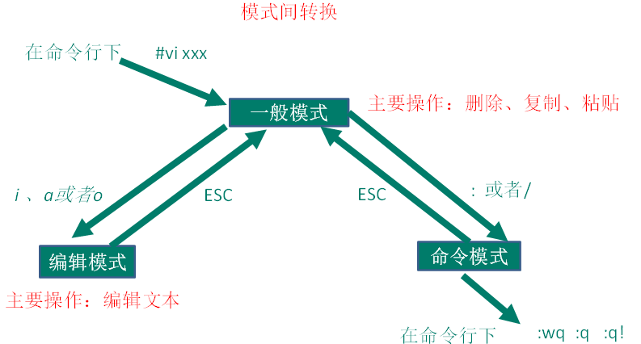

## Linux

> Linux思想： 一切皆文件


- /root: 系统管理员的主用户目录
- /bin: 二进制可执行文件
- /sbin: 存放系统超级管理员使用的系统管理程序
- /home: 存放普通用户的主目录，一般以用户名称命名
- /lib: 动态链接库共享库
- /etc: 系统所需的配置文件
- /opt: 主机额外安装的软件所存放目录
- /var:  存放不断扩充的东西，习惯将经常修改的文件存放在这个目录下

#### VI/VIM编辑器



##### IP相关

- 查看IP ： ifconfig
- ping测试连通性： ping 目的地
- 修改IP： vim /etc/sysconfig/netword-scripts/ifcfg-eth0


##### 配置主机名

- 显示主机名： hostname
- 修改主机名: vim /etc/sysconfig/network
  - 修改/etc/hosts : vim /etc/hosts
  - 若要和windows下形成映射：C:\Windows\System32\drivers\etc: 修改hosts文件


##### 防火墙

###### service后台服务管理

 service 服务名(iptables...) start/stop/status/restart :开启/关闭/查看状态/重启

###### chkconfig 设置后台服务的自启配置

chkconfig 服务名 on/off/--list : 启动/关闭/查看状态 

- 注：需要重启后才能生效


##### Linux进程运行级别：


##### 关机重启命令：

正确的关机流程：sync > shutdown > reboot > halt

sync: 将数据由内存同步到磁盘中

halt: 关机： 等同于shutdown -h now

reboot: 重启 等同于shutdown -r now

shutdown [选项] 时间

| 选项 | 功能          |
| ---- | ------------- |
| -h   | -h=halt关机   |
| -r   | -r=reboot重启 |

| 参数 | 功能                                   |
| ---- | -------------------------------------- |
| now  | 立刻关机                               |
| 时间 | 等待多久后关机（时间单位是**分钟**）。 |


### 常用基本命令

###### man 获取帮助信息

>  man [命令或配置文件] 


###### ls 列出目录的内容

> 基本语法：
>
> ls [选项] [目录或文件]

- 显示说明：


文件类型与权限 链接数 文件所属 文件属组 文件大小用Byte表示  建立时间或修改时间  名字


###### rmdir

> 递归删除一个空的目录


##### **cat 查看文件内容**

查看文件内容，从第一行开始显示。

1．基本语法

​	cat  [选项] 要查看的文件

2．选项说明

| 选项 | 功能描述                     |
| ---- | ---------------------------- |
| -n   | 显示所有行的行号，包括空行。 |


### **more 文件内容分屏查看器**

more指令是一个基于VI编辑器的文本过滤器，它以全屏幕的方式按页显示文本文件的内容。more指令中内置了若干快捷键

1．基本语法

​	more 要查看的文件

2．操作说明

| 操作           | 功能说明                                 |
| -------------- | ---------------------------------------- |
| 空白键 (space) | 代表向下翻一页；                         |
| Enter          | 代表向下翻『一行』；                     |
| q              | 代表立刻离开 more ，不再显示该文件内容。 |
| Ctrl+f         | 向下滚动一屏                             |
| Ctrl+b         | 返回上一屏                               |
| =              | 输出当前行的行号                         |
| :f             | 输出文件名和当前行的行号                 |


### **less 分屏显示文件内容**

​	less指令用来分屏查看文件内容，它的功能与more指令类似，但是比more指令更加强大，支持各种显示终端。less指令在显示文件内容时，并不是一次将整个文件加载之后才显示，而是根据显示需要加载内容，对于显示大型文件具有较高的效率。

1．基本语法

​	less 要查看的文件

2．操作说明

| 操作       | 功能说明                                           |
| ---------- | -------------------------------------------------- |
| 空白键     | 向下翻动一页；                                     |
| [pagedown] | 向下翻动一页                                       |
| [pageup]   | 向上翻动一页；                                     |
| /字串      | 向下搜寻『字串』的功能；n：向下查找；N：向上查找； |
| ?字串      | 向上搜寻『字串』的功能；n：向上查找；N：向下查找； |
| q          | 离开 less 这个程序；                               |


### **echo**

echo输出内容到控制台

1. 基本语法

​		echo [选项] [输出内容]

选项： 

  -e：  支持反斜线控制的字符转换

| 控制字符 | 作用                |
| -------- | ------------------- |
| \\       | 输出\本身           |
| \n       | 换行符              |
| \t       | 制表符，也就是Tab键 |


##### **head 显示文件头部内容**

head用于显示文件的开头部分内容，默认情况下head指令显示文件的前10行内容。

head 文件	      （功能描述：查看文件头10行内容）

head -n 5 文件      （功能描述：查看文件头5行内容，5可以是任意行数）

| 选项     | 功能                   |
| -------- | ---------------------- |
| -n<行数> | 指定显示头部内容的行数 |


##### **tail 输出文件尾部内容**

tail用于输出文件中尾部的内容，默认情况下tail指令显示文件的后10行内容。

1.	基本语法

（1）tail  文件 			（功能描述：查看文件后10行内容）

（2）tail  -n 5 文件 		（功能描述：查看文件后5行内容，5可以是任意行数）

（3）tail  -f  文件		（功能描述：实时追踪该文档的所有更新）

2．	选项说明

| 选项     | 功能                                 |
| -------- | ------------------------------------ |
| -n<行数> | 输出文件尾部n行内容                  |
| -f       | 显示文件最新追加的内容，监视文件变化 |


##### > 输出重定向 和>> 追加


##### ln软连接

> ln -s [原文件或目录] [软连接名] : 给原文创建一个软连接


##### 用户管理命令

> 基本语法
>
> useradd 用户名: 添加新用户
>
> useradd -g 组名 用户名:  添加新用户到某个组


##### who 查看登录用户信息

> whoami : 显示自身用户名称
>
> who am i  : 显示登录用户的用户名


#### 文件权限类

##### 文件属性


- 0首位表示类型
  - `-`代表文件
  - d : 目录
  - l :  链接文档


#### 搜索查找类

##### find查找文件或目录

> find [搜索范围]  [选项]

| 选项            | 功能                             |
| --------------- | -------------------------------- |
| -name<查询方式> | 按照指定的文件名查找模式查找文件 |
| -user<用户名>   | 查找属于指定用户名所有文件       |
| -size<文件大小> | 按照指定的文件大小查找文件。     |


##### grep过滤查找 | 管道符

> 管道符| 将一个命令的处理结果输出传递给后面的命令处理 

> grep 选项 查找内容 源文件


| 选项 | 功能               |
| ---- | ------------------ |
| -n   | 显示匹配行及行号。 |


##### which 查找命令

> 查找命令在哪个目录下

which 命令


#### 压缩和解压缩

##### gzip /gunzip压缩

> gzip 文件 ： 压缩文件，将文件压缩成 *.gz
>
> gunzip 文件.gz  : 解压缩文件命令

- 不能压缩目录
- 不保留原来的文件


##### zip/unzip压缩

> zip [选项]  xxx.zip  将要压缩的内容 : 压缩文件和目录的命令
>
> unzip [选项] xxx.zip ： 解压缩文件

| zip选项 | 功能     |
| ------- | -------- |
| -r      | 压缩目录 |

| unzip选项 | 功能                     |
| --------- | ------------------------ |
| -d<目录>  | 指定解压后文件的存放目录 |


##### tar 打包

> tar -zxvf/zcvf x.tar.gz 要打包的内容/解压的内容


#### 磁盘分区类

##### df查看磁盘空间的使用情况

> df 选项 ： 列出文件系统的整体磁盘使用量，检查文件系统的磁盘空间占用情况


| 选项 | 功能                                                     |
| ---- | -------------------------------------------------------- |
| -h   | 以人们较易阅读的 GBytes, MBytes, KBytes 等格式自行显示； |


##### fdisk 查看分区

> fdisk -l : 查看磁盘分区详情


#### 进程线程类

##### ps查看当前系统进程状态

> ps aux  ： 查看系统中所有的进程
>
> ps -ef : 查看父子进城之间的关系


| 选项 | 功能                   |
| ---- | ---------------------- |
| -a   | 选择所有进程           |
| -u   | 显示所有用户的所有进程 |
| -x   | 显示没有终端的进程     |

##### pstree查看进程树

> pstree [选项]

| 选项 | 功能               |
| ---- | ------------------ |
| -p   | 显示进程的PID      |
| -u   | 显示进程的所属用户 |


##### top查看系统健康状态

> top [选项]

| 选项    | 功能                                                         |
| ------- | ------------------------------------------------------------ |
| -d 秒数 | 指定top命令每隔几秒更新。默认是3秒在top命令的交互模式当中可以执行的命令： |
| -i      | 使top不显示任何闲置或者僵死进程。                            |
| -p      | 通过指定监控进程ID来仅仅监控某个进程的状态。                 |


##### netstat 显示网络统计信息和端口占用情况

> netstat -anp | grep 进程号: 查看进程网络信息
>
> netstat -nlp | grep  端口号: 查看网络端口占用情况

| 选项 | 功能                                     |
| ---- | ---------------------------------------- |
| -n   | 拒绝显示别名，能显示数字的全部转化成数字 |
| -l   | 仅列出有在listen（监听）的服务状态       |
| -p   | 表示显示哪个进程在调用                   |


##### crond系统定时任务

> crontab [选项] 

| 选项 | 功能                          |
| ---- | ----------------------------- |
| -e   | 编辑crontab定时任务           |
| -l   | 查询crontab任务               |
| -r   | 删除当前用户所有的crontab任务 |

> * * * * * 执行的任务


| 项目      | 含义                 | 范围                    |
| --------- | -------------------- | ----------------------- |
| 第一个“*” | 一小时当中的第几分钟 | 0-59                    |
| 第二个“*” | 一天当中的第几小时   | 0-23                    |
| 第三个“*” | 一个月当中的第几天   | 1-31                    |
| 第四个“*” | 一年当中的第几月     | 1-12                    |
| 第五个“*” | 一周当中的星期几     | 0-7（0和7都代表星期日） |


| 特殊符号 | 含义                                                         |
| -------- | ------------------------------------------------------------ |
| *        | 代表任何时间。比如第一个“*”就代表一小时中每分钟都执行一次的意思。 |
| ，       | 代表不连续的时间。比如“0 8,12,16 * * * 命令”，就代表在每天的8点0分，12点0分，16点0分都执行一次命令 |
| -        | 代表连续的时间范围。比如“0 5  *  *  1-6命令”，代表在周一到周六的凌晨5点0分执行命令 |
| */n      | 代表每隔多久执行一次。比如“*/10  *  *  *  *  命令”，代表每隔10分钟就执行一遍命令 |


#### RPM

###### RPM查询命令(rpm -qa)

###### 卸载命令: rpm -e

- rpm -e --nodeps  软件包 ： 强制卸载，不考虑依赖

###### RPM安装(rpm -ivh)

| 选项     | 功能                     |
| -------- | ------------------------ |
| -i       | -i=install，安装         |
| -v       | -v=verbose，显示详细信息 |
| -h       | -h=hash，进度条          |
| --nodeps | --nodeps，不检测依赖进度 |

#### YUM仓库

##### 常用命令

> yum [选项] [参数]

| 参数         | 功能                          |
| ------------ | ----------------------------- |
| install      | 安装rpm软件包                 |
| update       | 更新rpm软件包                 |
| check-update | 检查是否有可用的更新rpm软件包 |
| remove       | 删除指定的rpm软件包           |
| list         | 显示软件包信息                |
| clean        | 清理yum过期的缓存             |
| deplist      | 显示yum软件包的所有依赖关系   |

- yum方式安装

  yum -y install xxx


###### 查看IO读写

> iotop 
>
> 需要安装：yum install iotop


## Shell

###### Shell概述

Shell是一个命令行解释器，它接收应用程序/用户命令，然后调用操作系统内核


Shell还是一个功能相当强大的编程语言，易编写，易调试，灵活性强

##### Shell解析器

```
 cat /etc/shells 
/bin/sh
/bin/bash
/sbin/nologin
/bin/dash
/bin/tcsh
/bin/csh
```

> bash与sh的关系： sh 是bash的软连接


#### Shell脚本入门

###### 脚本格式

- 脚本以#!/bin/bash开头(指定解释器)

###### 脚本执行方式

- bash /sh + 脚本的相对路径和绝对路径 

```shell
sh xxx.sh  //实质是指定解释器帮你执行脚本,所以脚本不需要执行权限
```

- 采用脚本的输入的相对路径和绝对路径(必须具有可执行权限+x)  

```shell
./xxx.sh    //脚本需要自己执行，所以需要执行权限
```

##### Shell中的变量

###### 系统变量

```
$HOME : 显示当前用户的家目录
$PWD ：显示当前路径
$SHELL： 显示当前使用的哪个shell
$USER:显示当前的用户
```

###### 自定义变量

```
定义变量： 变量=值
撤销变量： unset 变量
声明静态变量： readonly 变量  
#等号两边不能有空格
```

###### 特殊变量

> $n:
>
> n为数字，$0代表脚本名称， $1-$9 代表 10以上的用{} 


> $#:
>
> 功能：获取所有输入参数个数，常用于循环

> $*  ： 变量代表命令行中的所有变量, $*把所有的参数看成一个整体
>
> $@:   变量代表命令行中所有的的参数，$@会把每个参数区分对待

> $? :  获取最后一次执行的命令的返回状态, 0表示正确执行， 非0表示不正确


#### Shell工具

## **cut**  

> 以列为单位， cut 命令从文件的每一行剪切字节、字符和字段并将这些字节、字符和字段输出。

1. 基本用法

```
cut [选项参数]  filename
```

说明：默认分隔符是制表符

2. 选项参数说明

| 选项参数 | 功能                         |
| -------- | ---------------------------- |
| -f       | 列号，提取第几列             |
| -d       | 分隔符，按照指定分隔符分割列 |

3.案例实操

- 数据准备

```
dong shen
guan zhen
wo  wo
lai  lai
le  le
```

- 切割cut.txt第一列

```
 cut -d " " -f 1 cut.txt 
```

- 切割cut.txt第二、三列

```
cut -d " " -f 2,3 cut.txt 
```

- 在cut.txt文件中切割出guan

```
cat cut.txt | grep "guan" | cut -d " " -f 1
```

- 选取系统PATH变量值，第2个“：”开始后的所有路径：

```
echo $PATH | cut -d: -f 2-
/usr/local/bin:/bin:/usr/bin:/usr/local/sbin:/usr/sbin:/sbin:/home/wangyg/bin
```

- 切割ifconfig 后打印的IP地址

```
ifconfig eth0 | grep "inet addr" | cut -d: -f 2 | cut -d" " -f1
192.168.1.102
```


## **sed** 

>  以行为单位处理数据

> sed是一种流编辑器，它一次处理一行内容。处理时，把当前处理的行存储在临时缓冲区中，称为“模式空间”，接着用sed命令处理缓冲区中的内容，处理完成后，把缓冲区的内容送往屏幕。接着处理下一行，这样不断重复，直到文件末尾。文件内容并没有改变，除非你使用重定向存储输出。

- 基本用法

> sed [选项参数]  ‘command’  filename

-  选项参数说明

| 选项参数 | 功能                                  |
| -------- | ------------------------------------- |
| -e       | 直接在指令列模式上进行sed的动作编辑。 |

-  命令功能描述

| 命令 | 功能描述                                     |
| ---- | -------------------------------------------- |
| *a*  | 新增，a的后面可以接字串，在下一行出现        |
| d    | 删除                                         |
| s    | 查找并替换  //默认只替换一次，g 可以替换多个 |
| -i   | 直接覆盖原有文件                             |

- 案例实操

- 数据准备

```
dong shen
guan zhen
wo  wo
lai  lai
le  le
```

- 将“mei nv”这个单词插入到sed.txt第二行下，打印。

```
sed '2a mei nv' sed.txt 

[wangyg@hadoop102 datas]$ cat sed.txt 
dong shen
guan zhen
wo  wo
lai  lai
le  le
```

注意：文件并没有改变

- 删除sed.txt文件所有包含wo的行

```
[wangyg@hadoop102 datas]$ sed '/wo/d' sed.txt
```

- 将sed.txt文件中wo替换为ni

```
[wangyg@hadoop102 datas]$ sed 's/wo/ni/g' sed.txt 
```

​	注意：‘g’表示global，全部替换

- 将sed.txt文件中的第二行删除并将wo替换为ni

```
[wangyg@hadoop102 datas]$ sed -e '2d' -e 's/wo/ni/g' sed.txt 
dong shen
ni  ni
lai  lai
le  le
```


## awk

> 一个强大的文本分析工具，把文件逐行的读入，以空格为默认分隔符将每行切片，切开的部分再进行分析处理。

-  基本用法

> awk [选项参数] ‘pattern1{action1}  pattern2{action2}...’ filename
>
> pattern：表示AWK在数据中查找的内容，就是匹配模式
>
> action：在找到匹配内容时所执行的一系列命令

- 选项参数说明

| 选项参数 | 功能                 |
| -------- | -------------------- |
| -F       | 指定输入文件折分隔符 |
| -v       | 赋值一个用户定义变量 |

-  案例实操

数据准备

```
[wangyg@hadoop102 datas]$ sudo cp /etc/passwd ./
```

- 搜索passwd文件以root关键字开头的所有行，并输出该行的第7列。

```
[wangyg@hadoop102 datas]$ awk -F: '/^root/{print $7}' passwd /bin/bash
```

- 搜索passwd文件以root关键字开头的所有行，并输出该行的第1列和第7列，中间以“，”号分割。

```
[wangyg@hadoop102 datas]$ awk -F: '/^root/{print $1","$7}' passwd 
root,/bin/bash
```

注意：只有匹配了pattern的行才会执行action

- 只显示/etc/passwd的第一列和第七列，以逗号分割，且在所有行前面添加列名user，shell在最后一行添加"dahaige，/bin/zuishuai"。

```
[wangyg@hadoop102 datas]$ awk -F : 'BEGIN{print "user, shell"} {print $1","$7} END{print "dahaige,/bin/zuishuai"}' passwd
user, shell
root,/bin/bash
bin,/sbin/nologin
wangyg,/bin/bash
dahaige,/bin/zuishuai
```

注意：BEGIN 在所有数据读取行之前执行；END 在所有数据执行之后执行。

- 将passwd文件中的用户id增加数值1并输出

```
[wangyg@hadoop102 datas]$ awk -v i=1 -F: '{print $3+i}' passwd
1
2
3
4
```

- awk的内置变量

| 变量     | 说明                                   |
| -------- | -------------------------------------- |
| FILENAME | 文件名                                 |
| NR       | 已读的记录数                           |
| NF       | 浏览记录的域的个数（切割后，列的个数） |

-  案例实操

统计passwd文件名，每行的行号，每行的列数

```
[wangyg@hadoop102 datas]$ awk -F: '{print "filename:"  FILENAME ", linenumber:" NR  ",columns:" NF}' passwd 
filename:passwd, linenumber:1,columns:7
filename:passwd, linenumber:2,columns:7
filename:passwd, linenumber:3,columns:7
```

- 切割IP

```
[wangyg@hadoop102 datas]$ ifconfig eth0 | grep "inet addr" | awk -F: '{print $2}' | awk -F " " '{print $1}' 
```

- 查询sed.txt中空行所在的行号

```
[wangyg@hadoop102 datas]$ awk '/^$/{print NR}' sed.txt 
5
```


## **sort**

> sort命令是在Linux里非常有用，它将文件进行排序，并将排序结果标准输出。

- 基本语法

sort(选项)(参数)

| 选项 | 说明                     |
| ---- | ------------------------ |
| -n   | 依照数值的大小排序       |
| -r   | 以相反的顺序来排序       |
| -t   | 设置排序时所用的分隔字符 |
| -k   | 指定需要排序的列         |

参数：指定待排序的文件列表

- 案例实操

数据准备

```
bb:40:5.4
bd:20:4.2
xz:50:2.3
cls:10:3.5
ss:30:1.6
```

- 按照“：”分割后的第三列倒序排序。

```
[wangyg@hadoop102 datas]$ sort -t : -nrk 3  sort.sh 

bb:40:5.4
bd:20:4.2
cls:10:3.5
xz:50:2.3
ss:30:1.6
```


# 面试题


> 问题1：使用Linux命令查询file1中空行所在的行号

```
[wangyg@hadoop102 datas]$ awk '/^$/{print NR}' sed.txt 
5
```

问题2：有文件chengji.txt内容如下:

张三 40

李四 50

王五 60

使用Linux命令计算第二列的和并输出

```
[wangyg@hadoop102 datas]$ cat chengji.txt | awk -F " " '{sum+=$2} END{print sum}'
150
```


> Shell脚本里如何检查一个文件是否存在？如果不存在该如何处理？


```shell
#!/bin/bash

if [ -f file.txt ]; then
 echo "文件存在!"
else
 echo "文件不存在!"
fi
```

> 问题1：用shell写一个脚本，对文本中无序的一列数字排序


```
[root@CentOS6-2 ~]# sort -n test.txt|awk '{a+=$0;print $0}END{print "SUM="a}'

1
2
3
4
5
6
7
8
9
10
SUM=55
```


> 问题1：请用shell脚本写出查找当前文件夹（/home）下所有的文本文件内容中包含有字符”shen”的文件名称

```
[wangyg@hadoop102 datas]$ grep -r "shen" /home | cut -d ":" -f 1

/home/wangyg/datas/sed.txt
/home/wangyg/datas/cut.txt
```

