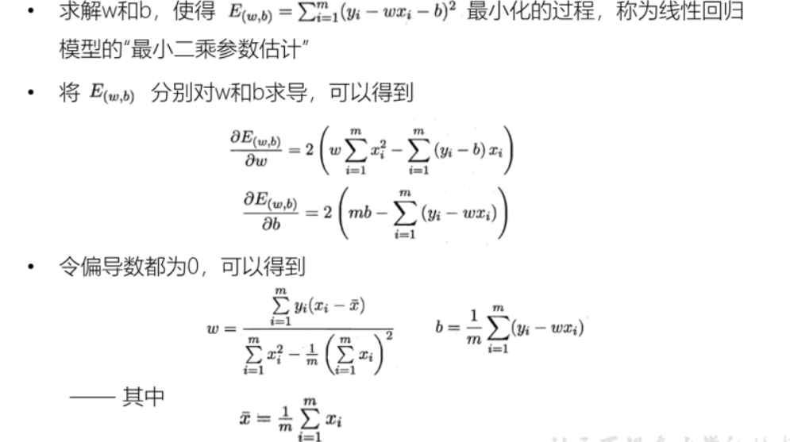

#### 函数

函数的概念：


机器学习


通过将数据进行量化，

代价函数： 错误离谱的程序


梯度下降 ：让函数变得更聪明，更准确的函数


正则化： 加一个正则化项

```
L1范数：
L2范数：
```

##### 线性回归模型

只有一次项就是线性

```
n个系数的图像就是n-1维下 线
```

  


```
统计机器学习： 李航
吴恩达  机器学习
```

##### 基于模型的协同过滤

> 基于近邻: 
>
> 基于模型:  

##### 隐语义模型

> 


