### 大数据概论

###### hadoop是什么

1. Hadoop是一个由Apache基金会所开发的分布式系统架构
2. 主要解决，海量数据的存储和海量数据的分析计算问题
3. 广义上来说，Hadoop通常指一个更广泛的概念--hadoop生态圈

##### hadoop组成

###### Hadoop1.x和hadoop2.x 区别

Hadoop1.x 组成= MapReduce(计算+资源调度) HDFS(数据存储), Common(辅助工具)

Hadoop2.x组成=MapReduce(计算),Yarn(资源调度)，HDFS(数据存储),Common(辅助工具)

> 将Mapreduce进行拆分，解耦，Mapreduce只负责计算，由yarn负责资源调度，


```
数据来源层->数据传输层->数据存储层->资源管理层->数据计算层->任务调度层->业务模型层
```

##### Hadoop运行环境搭配

###### 虚拟机环境准备

1. 修改虚拟机的静态IP(静态IP不会改变，易于管理)

2. 修改主机名

3. 关闭防火墙

4. 创建用户(以具体用户名为主)

5. 配置用户具有root权限

6. /opt目录下创建两个module, software文件夹

7. 安装JDK

   ```
   先查询是否安装java:rpm-qa | grep java
   如果有，卸载     : sudo rpm -e java
   查看jdk的安装路径 : which java
   将jdk安装包放入到/opt/software路径下:利用Xftp等传输工具
   解压jdk :  tar -zxvf jdkXXX -C /opt/module 
   配置环境变量： sudo vim /etc/profile
   在/etc/profile最后添加#JAVA_HOME相关信息
   	#JAVA_HOME
   	export JAVA_HOME=/opt/module/jdk1.8.0_144
   	export PATH=$PATH:$JAVA_HOME/bin
   保存退出，并source /etc/profile 进行刷新，使修改生效
   测试JDK是否安装成功： java -version /java /javac 出现相应提示即可
   ```

8. 安装Hadoop：

   ```
   Hadoop下载地址：(以hadoop2.7.2为例)
   	https://archive.apache.org/dist/hadoop/common/hadoop-2.7.2/
   解压到/opt/module路径下
   	tar -zxvf hadoopXXX -C /opt/module
   添加环境变量
   	##HADOOP_HOME
   	export HADOOP_HOME=/opt/module/hadoop-2.7.2
   	export PATH=$PATH:$HADOOP_HOME/bin  //将bin和sbin两个路径全部加入path
   	export PATH=$PATH:$HADOOP_HOME/sbin
   保存并刷新: source /etc/profile
   测试是否成功： hadoop version
   ```

###### Hadoop运行模式

> 本地模式，伪分布式模式，完全分布式模式

###### 完全分布式运行模式

配置集群

- 虚拟机环境准备(见上)

###### 编写集群分发脚本xsync

- scp 安全拷贝

  定义：scp可以实现服务器之间的数据拷贝

  基本语法： scp -r  $dir/$fname   $user@$host:$pdir/$fname

  -  -r(递归)
  - $pdir/$fname 要拷贝的文件路径/名称
  - $user ： 远端用户@主机：目的路径/名称

```shell
scp -r /opt/module root@hadoop102:/opt/module
```

1. 如果是以root用户传输，需要修改文件的拥有者，所属组:sudo chown XXX:XXX -R  路径

###### rsync 远程同步工具

> rsync只对差异文件做更新，scp是将所有文件都赋值过去

1. 基本语法

   ```shell
   rsync -rvl $pdir/$fname  $user@$host:$pfir/$fname
   //-r 递归  -v 显示详细过程  -l 拷贝符号链接
   ```

 ###### 集群配置

|      | hadoop102         | hadoop103                   | hadoop104                  |
| ---- | ----------------- | --------------------------- | -------------------------- |
| HDFS | NameNode DataNode | DataNode                    | SecondaryNameNode DataNode |
| YARN | NodeManager       | ResourceManager NodeManager | NodeManager                |

###### 配置集群

1. 核心配置文件

   配置core-site.xml

   ```xml
   <!-- 指定HDFS中NameNode的地址 -->
   <property>
   		<name>fs.defaultFS</name>
         <value>hdfs://hadoop102:9000</value>
   </property>
   
   <!-- 指定Hadoop运行时产生文件的存储目录 -->
   <property>
   		<name>hadoop.tmp.dir</name>
   		<value>/opt/module/hadoop-2.7.2/data/tmp</value>
   </property>
   ```

2. HDFS配置文件

      配置hadoop-env.sh

      ```shell
      export JAVA_HOME=/opt/module/jdk1.8.0_144 //配置环境变量
      ```

      配置hdfs-site.xml

      ```xml
      <!-- 指定Hadoop副本个数，默认就是3 -->
      <property>
      		<name>dfs.replication</name>
      		<value>3</value>
      </property>
      
      <!-- 指定Hadoop辅助名称节点主机配置 -->
      <property>
            <name>dfs.namenode.secondary.http-address</name>
            <value>hadoop104:50090</value>
      </property>
      ```

3. YARN配置文件

     配置yarn-env.sh

     ```
     	vi yarn-env.sh
     	export JAVA_HOME=/opt/module/jdk1.8.0_144  //导出环境变量
     ```

     配置yarn-site.xml

     ```xml
     <!-- Reducer获取数据的方式 -->
     <property>
     		<name>yarn.nodemanager.aux-services</name>
     		<value>mapreduce_shuffle</value>
     </property>
     
     <!-- 指定YARN的ResourceManager的地址 -->
     <property>
     		<name>yarn.resourcemanager.hostname</name>
     		<value>hadoop103</value>
     </property>
     ```

4. MapReduce配置文件

     配置mapred-env.sh

     ```
     vi mapred-env.sh
     export JAVA_HOME=/opt/module/jdk1.8.0_144
     ```

     配置mapred-site.xml

     ```
     <!-- 指定MR运行在Yarn上 -->
     <property>
     		<name>mapreduce.framework.name</name>
     		<value>yarn</value>
     </property>
     ```

> 在集群上分发配置好的Hadoop配置文件

###### SSH无密码配置

配置ssh

基本语法： ssh 另一台机器的IP地址

1. 生成公钥和私钥：ssh-keygen -t rsa : 三次回车，就会生成公钥和私钥

2. 将公钥拷贝到免密登录的机器上 //或者直接拷贝整个文件也可以，不过较为危险


##### 群起集群

###### 配置salves

```
/opt/module/hadoop-2.7.2/etc/hadoop //在此路径下，建立slaves文件夹
vim slaves
```

添加以下内容(不允许有空格，或空行) --配置完成后，进行分发

```
hadoop102
hadoop103
hadoop104
```

###### 启动集群

1. 如果是第一次启动，需要格式化NameNode(1.注意进程 2. 删除data和log数据3. 再进行格式化)

   ```
   bin/hdfs namenode -format
   ```

2. 启动HDFS

   ```shell
   sbin/start-dfs.sh
   ```

3. 启动YARN

   ```shell
   start-yarn.sh
   ```

4. Web端进行查看

   ```
   http://hadoop201:50070
   ```

   

##### 集群启动/停止方式总结

###### 各个服务分别启动/停止

```shell
hadoop-daemon.sh start/stop namenode/datanode/secondarynamenode
```

###### 启动、停止YARN

```shell
yarn-daemon.sh start/stop resourcemanager/nodemanager
```

###### 各个模块启动/停止-- 常用

整体启动/停止HDFS

```shell
start-dfs.sh /stop-dfs.sh
```

整体启动/停止YARN

```shell
start-yarn.sh/ stop-yarn.sh
```


##### 集群事件同步

###### 配置时间同步具体步骤(root用户)

1. 检查ntp是否安装

   ```shell
   rpm -qa | grep ntp
   ```

2. 修改ntp配置文件

   修改1：授权XXX网段上的所有机器都可以从这台机器上查询和同步时间

   ```shell
   #restrict 192.168.1.0 mask 255.255.255.0 nomodify notrap为
   restrict 192.168.1.0 mask 255.255.255.0 nomodify notrap
   ```

   修改2： 集群在局域网中，不适用其他互联网上的时间

   ```shell
   server 0.centos.pool.ntp.org iburst
   server 1.centos.pool.ntp.org iburst
   server 2.centos.pool.ntp.org iburst
   server 3.centos.pool.ntp.org iburst为
   #server 0.centos.pool.ntp.org iburst
   #server 1.centos.pool.ntp.org iburst
   #server 2.centos.pool.ntp.org iburst
   #server 3.centos.pool.ntp.org iburst //将这四个部分注释掉
   ```

   修改3： 当该节点丢失网络连接，扔可以采用本地时间作为时间服务器为其他节点提供时间同步

   ```
   server 127.127.1.0
   fudge 127.127.1.0 stratum 10
   ```

3. 修改/etc/sysconfig/ntpd文件

   ```
   vim /etc/sysconfig/ntpd
   增加内容如下（让硬件时间与系统时间一起同步）
   SYNC_HWCLOCK=yes
   ```

   

4. 重新启动ntpd服务

   ```
   service ntpd start
   ```

5. 设置ntpd服务开机启动

   ```
   chkconfig ntpd on
   ```

###### 其他机器配置(必须root用户)

​	其他机器每10分钟与时间服务器同步一次

```
crontab -e
*/10 * * * * /usr/sbin/ntpdate hadoop102  //每隔10分钟进行时间同步
```


## Hadoop之HDFS

###### HDFS产出背景

> 随着数据量的越来越大，一个操作系统中存不下所有的数据，那么就分配到更多的操作系统磁盘中，为了方便管理，需要一种系统来管理多台机器上的文件，这就是分布式文件管理系统，HDFS只是分布式文件管理系统中的一种

###### HDFS定义

> HDFS(hadoop Distributed File System) ,分布式的文件系统，用于存储文件，多台服务器联合实现其功能

**使用场景**: 适合一次写入，多次读出的场景，且不支持文件的修改,适合做数据分析


##### HDFS优缺点

###### 优点

- 高容错性: 数据自动保存多个副本，通过增加副本的方式，提高容错性
- 适合处理大数据
- 可构建在廉价的机器上，通过多副本机制，提高可靠性

###### 缺点

- 不适合低延时数据访问：效率偏低
- 无法高效的对小文件进行存储
- 不支持并发写入，文件随机修改

##### HDFS组成架构


- NameNode(nn):  Master
  - 管理HDFS的名称空间
  - 配置副本策略
  - 管理数据块(Block)映射信息
  - 处理客户端读写请求

- DataNode: Slave

  - 存储实际的数据块

  - 执行数据块的读/写操作

- Client : 客户端
  - 文件切分，文件上传HDFS时，客户端将文件切分成一个一个的Block，然后进行上传
  - 与NameNode交互，获取文件的位置信息
  - 与DataNode交互，读取或写入数据
  - Client提供一些命令管理HDFS， ex: namenode格式化
  - Client通过一些命令访问HDFS，比如HDFS增删改查等刀座
- Secondary NameNode： 非NameNode热备
  - 辅助NamNode，分担工作： 定时合并FsImage和Edits,并推送给NamNode
  - 紧急情况下，辅助修复NamNode


##### HDFS文件块大小

​	HDFS中文件在物理上是分块存储(Block)，块的大小可以通过配置参数(dfs.blocksize)来规定，默认大小Hadoop2.x版本中128M


###### 问什么块的大小不能设置太小，也不能太大?

1. HDFS块设置太小，会增加寻址时间，增加寻找块的开始位置时间

2. 如果块设置的太大，从磁盘传输数据的时间会明显大于定位这个块开始位置所需的时间，导致处理数据时，相对较慢

   **总结：HDFS块的大小设置主要取决于磁盘传输速率**

   

##### HDFS的shell 操作

###### 基本语法

```
bin/hadoop fs XX命令 或   bin/hdfs dfs XXX命令
```

###### 常用命令

- 启动Hadoop集群

```shell
sbin/start-dfs.sh
sbin/start-yarn.sh
```

- `-`help : 输出这个命令参数

```
hadoop fs -help rm
```

- `-`ls: 显示目录信息

```
hadoop fs -ls /
```

- `-`mkdir: 在HDFS上创建目录

```
hadoop fs -mkdir -p /wangyg/love/pangdi
```

- `-`moveFromLocal : 从本地剪切到HDFS上

```
hadoop fs -moveFromLoacl ./1.txt /wangyg
```

- `-`appendToFile: 追加一个文件到已经存在的文件末尾

```
hadoop fs -appendToFile 1.txt /wangyg/1.txt
```

- `-`cat: 显示文件内容
- `-` chgrp `-`chmod `-`chown:  修改文件所属权限
- `-`copyFromLocal : 从本地拷贝到HDFS中
- `-`copyToLocal : 从HDFS拷贝到本地
- `-`cp : 从HDFS的一个路径拷贝到另一个路径
- `-`mv : 在HDFS目录中移动文件
- `-`get: 等同于copyToLoacal : 从HDFS下载
- `-`getmerget: 合并下载多个文件
- `-`put: 等同于copuFromLocal : 上传
- `-`rm : 删除文件或文件夹
- `-`rmdir : 删除空目录
- `-`du: 统计文件夹的大小信息
- `-`setrep :设置HDFS中文件的副本数量


##### HDFS客户端操作

##### HDFS客户端环境准备：

1. 将编译后的相应版本的Hadoop jar包放在一个位置中(无中文，空格)


2. 配置HADOOP_HOME环境变量


3. 再将HADOOP_HOME添加到path中

4. 创建一个maven工程
5. 添加maven依赖

```xml
<dependencies>
		<dependency>
			<groupId>junit</groupId>
			<artifactId>junit</artifactId>
			<version>RELEASE</version>
		</dependency>
		<dependency>
			<groupId>org.apache.logging.log4j</groupId>
			<artifactId>log4j-core</artifactId>
			<version>2.8.2</version>
		</dependency>
		<dependency>
			<groupId>org.apache.hadoop</groupId>
			<artifactId>hadoop-common</artifactId>
			<version>2.7.2</version>
		</dependency>
		<dependency>
			<groupId>org.apache.hadoop</groupId>
			<artifactId>hadoop-client</artifactId>
			<version>2.7.2</version>
		</dependency>
		<dependency>
			<groupId>org.apache.hadoop</groupId>
			<artifactId>hadoop-hdfs</artifactId>
			<version>2.7.2</version>
		</dependency>
		<dependency>
			<groupId>jdk.tools</groupId>
			<artifactId>jdk.tools</artifactId>
			<version>1.8</version>
			<scope>system</scope>
			<systemPath>${JAVA_HOME}/lib/tools.jar</systemPath>
		</dependency>
</dependencies>
```

- 创建目录--mkdir

```java
import org.apache.hadoop.conf.Configuration;
import org.apache.hadoop.fs.FileSystem;
import org.apache.hadoop.fs.Path;
import org.junit.Test;

import java.io.IOException;
import java.net.URI;
import java.net.URISyntaxException;

public class HdfsClient {
    @Test
    public void testMkdir() throws URISyntaxException, IOException, InterruptedException {
        //获取文件系统
        Configuration conf = new Configuration();
        //配置在集群上运行
        conf.set("fs.defaultFS", "hdfs://hadoop201:9000");

        FileSystem fs = FileSystem.get(new URI("hdfs://hadoop201:9000"), conf, "wangyg");

        // 2 创建目录
        fs.mkdirs(new Path("/wangyg/pangdi"));

        // 3 关闭资源
        fs.close();
    }
}
```


##### HDFS的API操作

###### HDFS文件上传

```
@Test
    public void testCopyFromLocalFile() throws IOException, URISyntaxException, InterruptedException {
        //获取文件系统
        Configuration conf = new Configuration();
        conf.set("dfs.replication", "2"); //设置副本个数
        //获取文件系统
        FileSystem fileSystem = FileSystem.get(new URI("hdfs://hadoop201:9000"),conf,"wangyg");
        //上传文件
        fileSystem.copyFromLocalFile(new Path("C:\\Users\\wangyg\\Desktop\\TODO.txt"),
                new Path("/wangyg"));

        //上传完毕后，关闭资源
        fileSystem.close();

        System.out.println("上传完毕...");
    }
```


> 参数优先级: 客户端代码中的值 > ClassPath下的配置> 服务器的默认配置


###### HDFS文件下载

```
    @Test
    public void testCopyToLocalFile() throws URISyntaxException, IOException, InterruptedException {
        //获取文件系统
        Configuration conf = new Configuration();
        FileSystem fs = FileSystem.get(new URI("hdfs://hadoop201:9000"),
                conf, "wangyg");
        fs.copyToLocalFile(false,new Path("/wangyg/TODO.txt")
                , new Path("D:\\"));

        System.out.println("下载完成...");

    }
```

###### HDFS文件夹删除

```
 @Test
    public void testDelete() throws URISyntaxException, IOException, InterruptedException {
        //获取配置
        Configuration conf = new Configuration();
        //获取文件系统
        FileSystem fs = FileSystem.get(new URI("hdfs://hadoop201:9000"), conf, "wangyg");
        boolean delete = fs.delete(new Path("/wangyg/"), true);
        if (delete) {
            System.out.println("删除成功...");
        }
        //关闭资源
        fs.close();

    }
```

###### HDFS文件名更改

```java
  @Before
    public void before() throws URISyntaxException, IOException, InterruptedException {
        //获取配置
        Configuration conf = new Configuration();
        //获取文件系统
        fs = FileSystem.get(new URI("hdfs://hadoop201:9000"), conf, "wangyg");
    }
    //HDFS文件名更改
    @Test
    public void testRename() throws IOException {
        boolean rename = fs.rename(new Path("/1.txt"), new Path("/2.txt"));

        if(rename){
            System.out.println("修改名称成功...");
        }
        //关闭资源
        fs.close();
    }
```

###### HDFS文件详情查看

```
 //HDFS文件详情查看
    @Test
    public void testListFiles() throws IOException {
        RemoteIterator<LocatedFileStatus> listFiles = fs.listFiles(new Path("/"), true);
        while (listFiles.hasNext()) {
            LocatedFileStatus next = listFiles.next();
            //文件名称--输出详情
            System.out.println(next.getPath().getName());
            //长度
            System.out.println(next.getLen());
            //权限
            System.out.println(next.getPermission());
            //获取分组
            System.out.println(next.getGroup());

            //获取存储的块信息
            BlockLocation[] blockLocations = next.getBlockLocations();
            for (BlockLocation blockLocation : blockLocations) {
                //获取块存储的主节点
                String[] hosts = blockLocation.getHosts();
                for (String host : hosts) {
                    System.out.println(host);
                }
            }
        }
        //关闭资源
        fs.close();

    }
```

###### HDFS文件和文件夹判断

```java
  //hdfs文件和文件夹判断
    @Test
    public void testListStatus() throws IOException {
        FileStatus[] listStatus = fs.listStatus(new Path("/"));
        for (FileStatus fileStatus : listStatus) {
            //如果是文件
            if(fileStatus.isFile()){
                System.out.println("f:"+fileStatus.getPath().getName());
            }else{//文件夹
                System.out.println("d:"+fileStatus.getPath().getName());
            }
        }
    }
```


### HDFS的数据流

##### HDFS写数据流程


1. 客户端通过Distributed FileSystem模块向Namenode请求上传文件，NameNode检查目标文件是否存在
2. NamNode返回是否可以上传
3. 客户端请求第一个Block上传到那几个DataNode上
4. NamNode返回三个DataNode节点，分别是dn1, dn2,dn3
5. 客户端通过FsDataOutputStream模块请求dn1 上传数据，dn1收到请求继续调用dn2,dn2调用dn3，将通信管道建立完成
6. dn1,dn2,dn3逐级应答客户端
7. 客户端开始向dn1 上传第一个Block，以Packet为单位，dn1收到一个packet(64K)就会传给dn2,dn2传给dn3,dn1每传一个packet会让如一个应答队列等待应答
8. 当一个Block传输完成之后，客户端再次请求NamNode上传第二个Block的服务器(重复操作)


###### 网络拓扑-节点距离计算

> 节点距离： 两个节点到达最近的共同祖先的距离总和

###### 机架感知(副本存储节点选择)

```
1. 第一个副本在client所处节点上(本机)--目的是效率方面考虑
2. 第二个副本在同机架不同节点
3. 第三个是不同机架的不同节点上
```

###### HDFS读数据流程

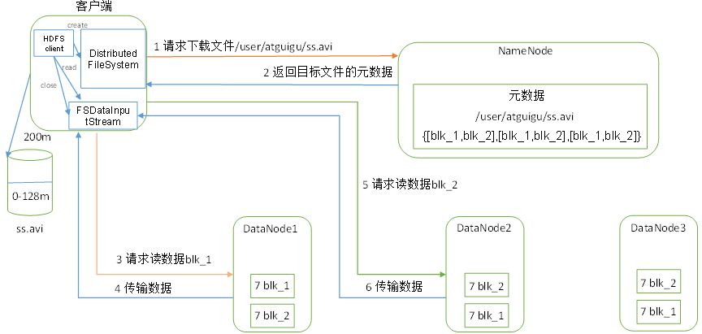

1. 客户端通过Distributed FIleSystem 向NamNode请求下载文件，NameNode通过查询元数据，吵到文件所在的DataNode地址
2. 挑选一台DataNode(就近原则)服务器，请求读取数据
3. DataNode开始传输数据给客户端(以Packet为单位来做校验)
4. 客户端以Packet为单位接收，先在本地缓存，然后写入目标文件

##### NamNode和SecondaryNameNode

###### NN和2NN工作机制

> 如果元数据只放入内存中，一旦断电，元数据就会丢失==》 引入FsImage
>
> 当元数据更新时，更新FsImage，效率过低 ==》引入Edits log(只进行追加操作，效率高)
>
> 引入一个新的节点SecondaryNamNode，专门用于FsImage和Edits合并

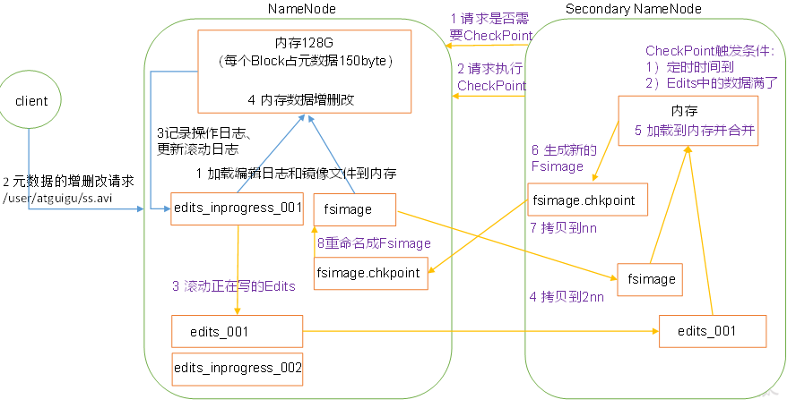

###### 第一阶段： NamNode启动

1. 第一次启动NamNode格式化后，创建Fsimage和Edits文件，如果不是第一次启动，直接加载编辑日志和镜像文件到内存
2. 客户端对元数据进行增删改的请求
3. NamNode记录操作日志，更新滚动日志Edits
4. namenode对内存中的数据进行增删改操作

###### 第二阶段： secondary NameNode工作

1.  2NN 询问NameNode是否需要CheckPoint，直接带回namenode是否检查结果
2. 2NN请求执行checkpoin
3. NameNode滚动正在写的Edits日志
4. 将滚动前的边记日志和镜像文件(Fsimage) 拷贝到2NN中
5. 2NN加载边记日志和镜像文件，并进行合并
6. 生成新的镜像文件Fsimage.chkpoint
7. 拷贝Fsimage.chkpoint到NamNode
8. NamNode将fsimage.chkpoint重新命名成fsimage


###### Fsimage和Edits解析

> oiv查看Fsimage文件

```
基本语法： hdfs oiv -p 文件类型 -i 镜像文件 -o 转换后的文件输出路径
hdfs oiv -p XML -i fsimage_0000000000000000025 -o /opt/module/hadoop-2.7.2/fsimage.xml
```

> oev查看Edits文件

```
基本语法：hdfs oev -p 文件类型 -i 边记日志 -o 转换后文件输出路径
hdfs oev -p XML -i edits_0000000000000000012-0000000000000000013 -o /opt/module/hadoop-2.7.2/edits.xml
```

###### CheckPoint时间设置

[hdfs-default.xml]

- 2nn每隔一小时执行一次

```xml
<property>
  <name>dfs.namenode.checkpoint.period</name>
  <value>3600</value>
</property>
```

- 一分钟检查一次操作次数  :当操作次数达到一百万时，2nn执行一次

```xml
<property>
  <name>dfs.namenode.checkpoint.txns</name>
  <value>1000000</value>
<description>操作动作次数</description>
</property>

<property>
  <name>dfs.namenode.checkpoint.check.period</name>
  <value>60</value>
<description> 1分钟检查一次操作次数</description>
</property >
```


##### NameNode故障处理

###### 方法一：

> 将2nn中数据拷贝到Namenode存储目录

1. kill -9 namenode进程
2. 删除namenode存储的数据(/opt/module/hadoop-2.7.2/data/tmp/dfs/name)

```
rm -rf /opt/module/hadoop-2.7.2/data/tmp/dfs/name/*
```

3. 拷贝2NN中数据到原Namenode存储数据目录

```shell
scp -r wangyg@hadoop201:/opt/module/hadoop-2.7.2/data/tmp/dfs/namesecondary/* ./name/
```

4. 重新启动Namenode

```shell
sbin/hadoop-daemon.sh start namenode
```

###### 方法二： 

> 使用-importCheckpoint选项启动NameNode守护进程，从而将2NN中数据拷贝到Namenode目录中

1. 修改hdfs-site.xml

```xml
<property>
  <name>dfs.namenode.checkpoint.period</name>
  <value>120</value>
</property>

<property>
  <name>dfs.namenode.name.dir</name>
  <value>/opt/module/hadoop-2.7.2/data/tmp/dfs/name</value>
</property>
```

2. kill -9 NameNode进程
3. 删除NameNode存储的数据

```
rm -rf /opt/module/hadoop-2.7.2/data/tmp/dfs/name/*
```

4. 如果SecondaryNameNode不和NameNode在一个主机节点上，需要将SecondaryNameNode存储数据的目录拷贝到NameNode存储数据的平级目录，并删除in_use.lock文件

```
scp -r wangyg@hadoop104:/opt/module/hadoop-2.7.2/data/tmp/dfs/namesecondary ./
 rm -rf in_use.lock
```

5. 导入检查点数据(等待一会ctrl +c结束掉)

```
bin/hdfs namenode -importCheckpoint
```

6. 启动NameNode

```
sbin/hadoop-daemon.sh start namenode
```


##### 集群安全模式

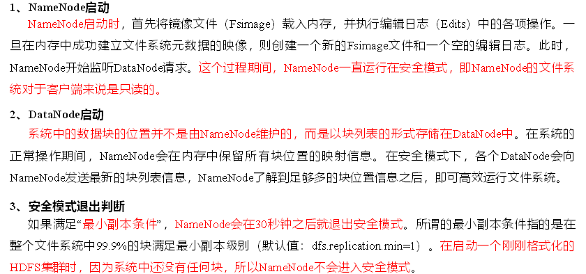

###### 基本语法

集群处于安全模式，不能执行重要操作(写操作)，集群启动完成后，自动退出安全模式

- bin/hdfs dfsadmin -safemode get : 查看安全模式状态
- bin/hdfs dfsadmin -safemode enter: 进入安全模式
- bin/hdfs dfsadmin -safemode leave: 离开安全模式
- bin/hdfs dfsadmin -safemode wait : 等待安全模式状态


##### DataNode工作机制

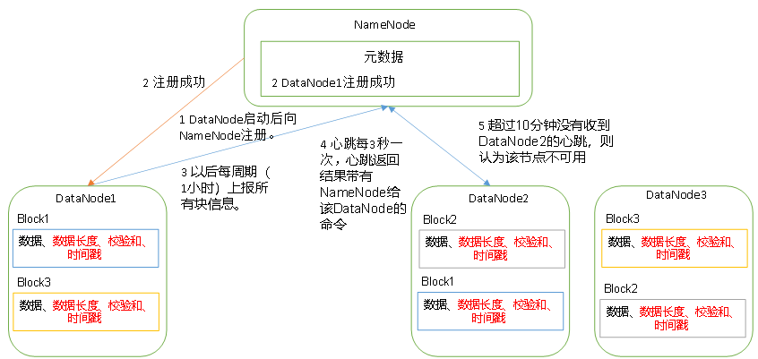

1. 一个数据块在DataNode上以文件形式存储在磁盘上，包括两个文件，一个数据本身，一个是元数据包括数据块的长度，块数据校验和，以及时间戳
2. DataNode启动后，向Namenode进行注册，通过后，周期性(1小时)向Namenode上报所有的块信息
3. 心跳是每3秒一次，心跳返回结果带有NamNode给该DataNode的命令 ，如赋值数据到另一台机器，或删除某个数据块，如果超过10分钟没有收到某个DataNode的心跳，则认为该节点不可用
4. 集群运行中可以安全加入和退出一些机器

###### DataNode掉线时限参数设置

```
TimeOut = 2* dfs.namenode.heartbeat.recheck-interval +10*dfs.heartbeat.interval // 10分钟 30s
```

```xml
<property>
    <name>dfs.namenode.heartbeat.recheck-interval</name>
    <value>300000</value>
</property>
<property>
    <name>dfs.heartbeat.interval</name>
    <value>3</value>
</property>
```

###### 服役新节点

1. 环境准备

   一个新的主机hadoop105

   修改IP地址和主机名称

   格式化(删除原有残留文件): /opt/module/hadoop/data/log

   source /etc/profile

2. 服役新节点具体步骤

   1. 直接启动DataNode，即可关联到集群

   ```shell
   sbin/hadoop-daemon.sh start datanode
   sbin/hadoop-daemon.sh start nodemanager
   ```

   2. 如果数据不平衡，可用命令实现集群的再平衡

   ```
   ./start-balancer.sh 
   ```

   ##### 退役旧数据节点

   ###### 添加白名单

   > 添加白名单的主机节点，都允许访问namenode,不在白名单的主机节点，都会被退出

   1. 在NameNode的/opt/module/hadoop-2.7.2/etc/hadoop目录下创建dfs.hosts文件

   ```shell
   pwd            #/opt/module/hadoop-2.7.2/etc/hadoop
   touch dfs.hosts
   vim dfs.hosts
   ```

   ​	添加如下主机名称

   ```
   hadoop201
   hadoop202
   hadoop203
   ```

   2. 在NamNode的hdfs-site.xml配置文件中增加dfs.hosts属性

   ```xml
   <property>
   <name>dfs.hosts</name>
   <value>/opt/module/hadoop-2.7.2/etc/hadoop/dfs.hosts</value>
   </property>
   ```

   3. 配置文件分发

   ```
   scp分发
   ```

   4. 刷新NameNode

   ```
   hdfs dfsadmin -refreshNodes
   ```

   5. 更新ResourceManager节点

   ```
   yarn rmadmin -refreshNodes
   ```

   6. 在web浏览器上查看

   7. 如果数据不均衡，可用命令时限集群的在平衡

   ```
   ./start-balancer.sh
   ```

   ###### 黑名单退役

   > 黑名单上面的主机都会被强制退出

   1. 在NameNode的 /opt/module/hadoop-2.7.2/etc/hadoop 目录下创建dfs.hosts.exclude文件

   ```shell
   pwd        #/opt/module/hadoop-2.7.2/etc/hadoop
   touch dfs.hosts.exclude
   vim dfs.hosts.exclude
   ```

   2. 在namenode的hdfs-site.xml配置文件中增加dfs.hosts.exclude属性

   ```xml
   <property>
   <name>dfs.hosts.exclude</name>
   <value>/opt/module/hadoop-2.7.2/etc/hadoop/dfs.hosts.exclude</value>
   </property>
   ```

   3. 刷新namenode， 刷新ResourceManager

   ```shell
   hdfs dfsadmin -refreshNodes  //刷新namenode
   yarn rmadmin -refreshNodes  //刷新resoucemanager
   ```

   4. Web浏览器端检查--等待退役节点状态改为decommissioned 后

      ```shell
      sbin/hadoop-daemon.sh stop datanode
      sbin/hadoop-daemon.sh stop nodemanager
      ```

   5. 若数据不平衡，使用sbin/start-balancer.sh


##### HDFS HA高可用

> 双NamNode消除单点故障

- 内存中各自保存一份元数据、

- Edits日志只有Active状态的NameNode节点可以做写操作

  **TODO**


## Hadoop 之 MapReduce

###### MapReduce定义

> 分布式运算程序的编程框架，是用户开发 基于hadoop的数据分析应用的和新框架

> MapReduce核心功能是将用户编写的业务逻辑代码和自带默认组件 整合成一个完整的分布式运算程序，并发运行在一个Hadoop集群上

###### MapReduce优缺点

###### 优点：

1. MapReduce易于编程
2. 良好的 扩展性--计算资源不够可以增加机器
3. 高容错性： 一台机器挂了，可以把上面的计算任务转移到另外一个节点上运行，不至于把这个任务运行失败

4. 适合PB级以上海量数据的离线处理

###### 缺点：

1. 不擅长实时计算:
2. 不擅长流式计算: 流式计算的输入数据是动态的,mapreduce的输入数据是静态的
3. 不擅长DAG(有向图)计算


##### MapReduce核心思想

- 第一个阶段的MapTask并发实例，完全并行运行，互不相干
- 第二个阶段的ReduceTask并发实例不互相干，他们的数据依赖于上一个阶段的所有MapTask的输出

###### MapReduce进程

一个完整的MapReduce程序有三类实例进程

- MrAppMaster: 负责整个程序的过程调度及状态协调
- MapTask： 负责map阶段的数据处理流程
- ReduceTask： 负责Reduce阶段的数据处理流程


###### 常用数据序列化类型

| **Java类型** | **Hadoop Writable类型** |
| ------------ | ----------------------- |
| boolean      | BooleanWritable         |
| byte         | ByteWritable            |
| int          | IntWritable             |
| float        | FloatWritable           |
| long         | LongWritable            |
| double       | DoubleWritable          |
| String       | Text                    |
| map          | MapWritable             |
| array        | ArrayWritable           |

###### MapReduce编程规范

> Mapper  Reducer和Driver

Mapper阶段

```
1. 用户自定义的Mapper要继承自己的父类
2. Mapper的输入数据时K V对的形式(K V的类型可自定义)
3. Mapper中业务逻辑写在map()方法中
4.Mapper的输出类型kv对形式
5. map()方法对每一个<k,v>调用一次
```

###### Reducer阶段

```
1. 用户自定义的Reducer要继承自己的父类
2. Reducer的输入数据类型对应Mapper的输出数据类型，也是KV
3. Reducer的业务逻辑写在reduce()方法中
4. ReduceTask进程对每一组相同的<KV>组调用一次reduce()方法
```

###### Driver阶段

​	封装MapReduce相关参数，job对象设置

###### WordCount案例实操

需求： 给定的文本文件中统计输出一个单词出现的总次数

```java
//Mapper阶段
public class WordCountMapper extends Mapper<LongWritable,Text,Text,IntWritable> {
    private Text word = new Text();
    private IntWritable one = new IntWritable(1);

    @Override
    protected void map(LongWritable key, Text value, Context context) throws IOException, InterruptedException {
        //获取一行
        String string = value.toString();
        //以空格进行切分
        String[] split = string.split(" ");
        //输出
        for (String word : split) {
            this.word.set(word);
            context.write(this.word,one);
        }
    }
}
```

编写Reducer类

```java

public class WordCountReducer extends Reducer<Text, IntWritable,Text, IntWritable >{
    private int sum=0;
    private IntWritable v = new IntWritable();
    @Override
    protected void reduce(Text key, Iterable<IntWritable> values, Context context) throws IOException, InterruptedException {
        sum=0;
        for (IntWritable value : values) {
            sum+= value.get();
        }
        
        //输出
        v.set(sum);
        context.write(key, v);
    }
}
```

编写Driver驱动类

```java
public class WordCountDriver {
    public static void main(String[] args) throws IOException, ClassNotFoundException, InterruptedException {
        //获取job实例
        Configuration conf = new Configuration();
        Job job = Job.getInstance(conf);

        //设置路径
        job.setJarByClass(WordCountDriver.class);
        //设置mapper
        job.setMapperClass(WordCountMapper.class);
        //设置reducer
        job.setReducerClass(WordCountReducer.class);
        //设置map阶段和reducer阶段的输出类型
        job.setMapOutputKeyClass(Text.class);
        job.setMapOutputValueClass(IntWritable.class);
        job.setOutputKeyClass(Text.class);
        job.setOutputValueClass(IntWritable.class);
        //设置输入路径和输出路径
        FileInputFormat.setInputPaths(job, new Path(args[0]));
        FileOutputFormat.setOutputPath(job, new Path(args[1]));

        //提交job等待运行
        boolean b = job.waitForCompletion(true);
        System.out.println(b);
        //三目运算符
        System.exit(b?0:1);
    }
}
```

添加编译

```xml
<build>
		<plugins>
			<plugin>
				<artifactId>maven-compiler-plugin</artifactId>
				<version>2.3.2</version>
				<configuration>
					<source>1.8</source>
					<target>1.8</target>
				</configuration>
			</plugin>
			<plugin>
				<artifactId>maven-assembly-plugin </artifactId>
				<configuration>
					<descriptorRefs>
						<descriptorRef>jar-with-dependencies</descriptorRef>
					</descriptorRefs>
					<archive>
						<manifest>
							<mainClass>XXXX.driver</mainClass>
						</manifest>
					</archive>
				</configuration>
				<executions>
					<execution>
						<id>make-assembly</id>
						<phase>package</phase>
						<goals>
							<goal>single</goal>
						</goals>
					</execution>
				</executions>
			</plugin>
		</plugins>
	</build>
```


##### Hadoop序列化

> 序列化就是把内存中的对象，转换成字节序列，以便存储，持久化和网络传输

> 反序列化就是把字节序列或磁盘的持久化数据，转换成内存中的对象

目的：便于将字节序列在网络中传输

Haoop序列化特点：

- 紧凑：高效实用存储空间
- 快速： 读写数据的额外开销小
- 可扩展： 随着通信协议的升级而升级
- 互操作： 支持多语言的交互

###### 自定义bean对象实现序列化接口(Writable)

1. 必须实现W日table接口

2. 反序列化，需要反射调用空参构造函数，所以必须有空参构造

   ```
   public FlowBean() {
   	super();
   }
   ```

3. 重写序列化方法

   ```
   @Override
   public void write(DataOutput out) throws IOException {
   	out.writeLong(upFlow);
   	out.writeLong(downFlow);
   	out.writeLong(sumFlow);
   }
   ```

4. 重写反序列化方法

   ```
   @Override
   public void readFields(DataInput in) throws IOException {
   	upFlow = in.readLong();
   	downFlow = in.readLong();
   	sumFlow = in.readLong();
   }
   ```

5. 注意反序列化的顺序和序列化的顺序要完全相同

6. 要想把结果显示在文件中，需要重写toString() , 可用"\t"分开

7. 如果自定义bean类型要放在key位置传输，需要实现Comparable接口，会对key进行排序

###### 序列化案例

> 需求：同一每一个手机号的总上行流量，下行流量，总流量

1. bean对象

```
import java.io.DataInput;
import java.io.DataOutput;
import java.io.IOException;

public class FlowBean  implements Writable {
    private long upFlow;
    private long downFlow;
    private long sumFlow;

    //空参构造
    public FlowBean() {
        super();
    }

    public FlowBean(long upFlow, long downFlow) {
        this.upFlow = upFlow;
        this.downFlow = downFlow;
        this.sumFlow = upFlow+ downFlow;
    }
    //toString方法
    @Override
    public String toString() {
        return upFlow +
                "\t" + downFlow +
                "\t" + sumFlow ;
    }

    public long getUpFlow() {
        return upFlow;
    }

    public void setUpFlow(long upFlow) {
        this.upFlow = upFlow;
    }

    public long getDownFlow() {
        return downFlow;
    }

    public void setDownFlow(long downFlow) {
        this.downFlow = downFlow;
    }

    public long getSumFlow() {
        return sumFlow;
    }

    public void setSumFlow(long sumFlow) {
        this.sumFlow = sumFlow;
    }

    //序列化方法
    @Override
    public void write(DataOutput out) throws IOException {
        out.writeLong(upFlow);
        out.writeLong(downFlow);
        out.writeLong(sumFlow);
    }
    //反序列化方法
    @Override
    public void readFields(DataInput in) throws IOException {
        this.upFlow = in.readLong();
        this.downFlow = in.readLong();
        this.sumFlow = in.readLong();
    }
}
```

2. Mapper类

```java

public class FlowCountReducer extends Reducer<Text,FlowBean, Text,FlowBean> {

    @Override
    protected void reduce(Text key, Iterable<FlowBean> values, Context context) throws IOException, InterruptedException {
        long sumUpFlow =0;
        long sumDownFlow=0;
        for (FlowBean value : values) {
            sumUpFlow+= value.getUpFlow();
            sumDownFlow+= value.getDownFlow();
        }
        //封装对象
        FlowBean flowBean = new FlowBean(sumUpFlow, sumDownFlow);
        context.write(key, flowBean);
        
    }
}
```

3. 编写Driver驱动类

```java

public class FlowCountDriver {
    public static void main(String[] args) throws IOException, ClassNotFoundException, InterruptedException {
        Configuration conf = new Configuration();
        Job job = Job.getInstance(conf);
        //设置类路径
        job.setJarByClass(FlowCountDriver.class);
        //指定本业务job要使用的map
        job.setMapperClass(FlowCountMapper.class);
        //指定job的reduce类
        job.setReducerClass(FlowCountReducer.class);
        //设置map阶段输出类型
        job.setMapOutputKeyClass(Text.class);
        job.setMapOutputValueClass(FlowBean.class);
        //设置reduce阶段输出类型
        job.setOutputKeyClass(Text.class);
        job.setOutputValueClass(FlowBean.class);
        //设置job输入路径
        FileInputFormat.setInputPaths(job, new Path(args[0]));
        //设置job的输出路径
        FileOutputFormat.setOutputPath(job, new Path(args[1]));
        //提交Job,并运行
        boolean b = job.waitForCompletion(true);
        System.out.println(b);
        
    }
}
```


#### MapReduce框架原理

##### 切片与MapTask并行决定机制

###### 切块与切片：

数据块：Block是HDFS物理上把数据分成一块一块

数据切片：数据切片只是在逻辑上对输入进行分片，并不会在磁盘上切分，只是逻辑意义

- 一个job的Map阶段并行度由客户端在提交job时切片数决定
- 每一个切片分配一个Maptask并行实例处理
- 默认情况下，切片大小=blocksize
- 切片不考虑数据集整体，而是针对每一个文件单独切片


###### Job提交流程源码和切片源码详解

```java
waitForCompletion()

submit();

// 1建立连接
	connect();	
		// 1）创建提交Job的代理
		new Cluster(getConfiguration());
			// （1）判断是本地yarn还是远程
			initialize(jobTrackAddr, conf); 

// 2 提交job
submitter.submitJobInternal(Job.this, cluster)
	// 1）创建给集群提交数据的Stag路径
	Path jobStagingArea = JobSubmissionFiles.getStagingDir(cluster, conf);

	// 2）获取jobid ，并创建Job路径
	JobID jobId = submitClient.getNewJobID();

	// 3）拷贝jar包到集群
copyAndConfigureFiles(job, submitJobDir);	
	rUploader.uploadFiles(job, jobSubmitDir);

// 4）计算切片，生成切片规划文件
writeSplits(job, submitJobDir);
		maps = writeNewSplits(job, jobSubmitDir);
		input.getSplits(job);

// 5）向Stag路径写XML配置文件
writeConf(conf, submitJobFile);
	conf.writeXml(out);

// 6）提交Job,返回提交状态
status = submitClient.submitJob(jobId, submitJobDir.toString(), job.getCredentials());
```

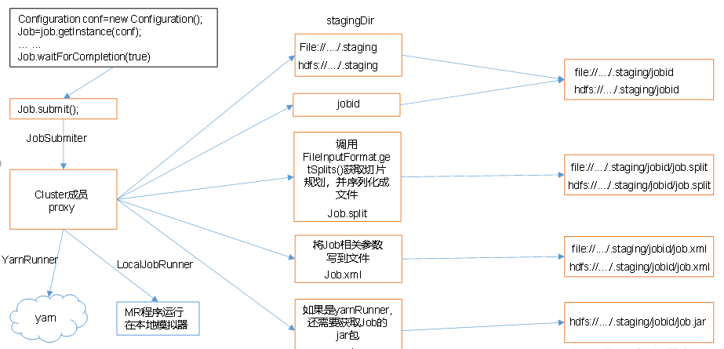

###### FileInputFormat切片机制：

切片机制：

- 简单的按照文件的内容长度进行切分，切分大小，默认等于Block大小
- 切片时不考虑数据集整体，而是逐个对每一个文件单独切片


#####  CombineTextInputFormat切片机制

> 背景
>
> 框架默认的TextInputFormat切片机制是对任务按文件规划切片，不管文件多小，都会是一个单独的切片，都会交给一个MapTask，这样如果有大量小文件，就会产生大量的MapTask，处理效率极其低下。

- 应用场景：
  **CombineTextInputFormat用于小文件过多的场景**，它可以将多个小文件从逻辑上规划到一个切片中，这样，多个小文件就可以交给一个MapTask处理。

- 虚拟存储切片最大值设置

  ```
  CombineTextInputFormat.setMaxInputSplitSize(job, 4194304);// 4m
  ```

  注意：虚拟存储切片最大值设置最好根据实际的小文件大小情况来设置具体的值。

- 切片机制(分为两部分)

  - 虚拟存储过程
  - 切片过程二部分。

  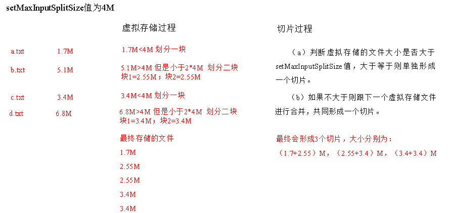

- 虚拟存储过程：
  将输入目录下所有文件大小，依次和设置的setMaxInputSplitSize值比较，如果不大于设置的最大值，逻辑上划分一个块。如果输入文件大于设置的最大值且大于两倍，那么以最大值切割一块；当剩余数据大小超过设置的最大值且不大于最大值2倍，此时将文件均分成2个虚拟存储块（防止出现太小切片）。
  例如setMaxInputSplitSize值为4M，输入文件大小为8.02M，则先逻辑上分成一个4M。剩余的大小为4.02M，如果按照4M逻辑划分，就会出现0.02M的小的虚拟存储文件，所以将剩余的4.02M文件切分成（2.01M和2.01M）两个文件。

- 切片过程：
  （a）判断虚拟存储的文件大小是否大于setMaxInputSplitSize值，大于等于则单独形成一个切片。
  （b）**如果不大于则跟下一个虚拟存储文件进行合并**，共同形成一个切片。
  （c）测试举例：有4个小文件大小分别为1.7M、5.1M、3.4M以及6.8M这四个小文件，则虚拟存储之后形成6个文件块，大小分别为：
  1.7M，（2.55M、2.55M），3.4M以及（3.4M、3.4M）
  最终会形成3个切片，大小分别为：
  （1.7+2.55）M，（2.55+3.4）M，（3.4+3.4）M

  

  #### CombineTextInputFormat案例实操

  > 需求：将输入的大量小文件合并成一个切片统一处理。

- 输入数据
  准备4个小文件

- 期望: 期望一个切片处理4个文件

  

  实现过程

  1. 不做任何处理，运行1.6节的WordCount案例程序，观察切片个数为4。

  2. 在WordcountDriver中增加如下代码，运行程序，并观察运行的切片个数为3。

     ```
     // 如果不设置InputFormat，它默认用的是TextInputFormat.class
     job.setInputFormatClass(CombineTextInputFormat.class);
     
     //虚拟存储切片最大值设置4m
     CombineTextInputFormat.setMaxInputSplitSize(job, 4194304);
     
     运行如果为3个切片。
     ```

3.  在WordcountDriver中增加如下代码，运行程序，并观察运行的切片个数为1。

      （a）驱动中添加代码如下：
      // 如果不设置InputFormat，它默认用的是TextInputFormat.class
        job.setInputFormatClass(CombineTextInputFormat.class);

      //虚拟存储切片最大值设置20m
      CombineTextInputFormat.setMaxInputSplitSize(job, 20971520);
      （b）运行如果为1个切片。

#### FileInputFormat实现类

##### FileInputFormat常见的接口实现类：

```
TextInputFormat： 默认
KeyValueTextInputFormat
NLineInputFormat
CombineTextInputFormat
自定义InputFormat等
```

###### TextInputFormat:

> 默认的FileInputFormat实现类，按行读取每条记录
>
> key是存储行在整个文件中的起始字节偏移量，LongWritable类型
>
> value值是这行的内容，不包括终止符(回车换行符)， Text类型

###### KeyValueTextInputFormat

> 每一行为一条记录，通过分隔符分隔为key, value 可以通过Driver中设置conf.set(KeyValueLineRecordReader.KEY_VALUE_SEPERATOR,'\t');设置分隔符，默认分隔符就是tab ('\t')


###### KeyValueTextInputFormat使用案例

需求:统计输入文件中每一行的第一个单词相同的行数。

```
//输入数据
banzhang ni hao
xihuan hadoop banzhang
banzhang ni hao
xihuan hadoop banzhang
```

```
//期望结果数据
banzhang	2
xihuan	2
```

- code

```java
package keyvalueTextInputFormat;

import org.apache.hadoop.conf.Configuration;
import org.apache.hadoop.fs.Path;
import org.apache.hadoop.io.IntWritable;
import org.apache.hadoop.io.Text;
import org.apache.hadoop.mapreduce.Job;
import org.apache.hadoop.mapreduce.lib.input.FileInputFormat;
import org.apache.hadoop.mapreduce.lib.input.KeyValueLineRecordReader;
import org.apache.hadoop.mapreduce.lib.input.KeyValueTextInputFormat;
import org.apache.hadoop.mapreduce.lib.output.FileOutputFormat;

import java.io.IOException;

public class KVTextDriver {
    //主方法
    public static void main(String[] args) throws IOException, ClassNotFoundException, InterruptedException {

        args = new String[]{"",""};
        //设置conf
        Configuration conf = new Configuration();
        //设置分隔符
        conf.set(KeyValueLineRecordReader.KEY_VALUE_SEPERATOR, " ");

        Job job = Job.getInstance(conf);

        //设置输入格式
        job.setInputFormatClass(KeyValueTextInputFormat.class);

        job.setJarByClass(KVTextDriver.class);

        job.setMapperClass(KVTextMapper.class);
        job.setReducerClass(KVTextReducer.class);

        job.setMapOutputKeyClass(Text.class);
        job.setMapOutputValueClass(IntWritable.class);

        job.setOutputKeyClass(Text.class);
        job.setOutputValueClass(IntWritable.class);

        FileInputFormat.setInputPaths(job, new Path(args[0]));
        FileOutputFormat.setOutputPath(job, new Path(args[1]));

        boolean b = job.waitForCompletion(true);

        System.out.println(b);
    }
}
```


```java
package keyvalueTextInputFormat;

import org.apache.hadoop.io.IntWritable;
import org.apache.hadoop.io.Text;
import org.apache.hadoop.mapreduce.Mapper;
import java.io.IOException;
//
public class KVTextMapper extends Mapper<Text, Text,Text, IntWritable> {
    private IntWritable v = new IntWritable(1);

    @Override
    protected void map(Text key, Text value, Context context) throws IOException, InterruptedException {
        //1. 封装对象
        //什么也不需要做, 使用keyvalueTextInputFormat的话就key直接是第一个
        //写出
        context.write(key, v);

    }
}
```


```java
package keyvalueTextInputFormat;

import org.apache.hadoop.io.IntWritable;
import org.apache.hadoop.io.Text;
import org.apache.hadoop.mapreduce.Reducer;

import java.io.IOException;

public class KVTextReducer extends Reducer<Text, IntWritable, Text, IntWritable> {
    private IntWritable v = new IntWritable();


    @Override
    protected void reduce(Text key, Iterable<IntWritable> values, Context context) throws IOException, InterruptedException {
        int sum=0;
        for (IntWritable value : values) {
            sum+= value.get();
        }
        v.set(sum);
        context.write(key, v);
    }
}
```


###### NLineInputFormat

> 每个map进程处理的InputSplit不在按Block块去划分，而是按NLineInputFormat指定的行数N来划分

##### NLineInputFormat使用案例

> 需求：对每个单词进行个数统计，要求根据每个输入文件的行数来规定输出多少个切片。此案例要求每三行放入一个切片中。


- 输入数据

  ```
  banzhang ni hao
  xihuan hadoop banzhang
  banzhang ni hao
  xihuan hadoop banzhang
  banzhang ni hao
  xihuan hadoop banzhang
  banzhang ni hao
  xihuan hadoop banzhang
  banzhang ni hao
  xihuan hadoop banzhang banzhang ni hao
  xihuan hadoop banzhang
  ```

- 期望输出数据

  ```
  Number of splits:4
  ```

  ###### code代码实现

  ```
  package NLineInputFormat;
  
  import org.apache.hadoop.conf.Configuration;
  import org.apache.hadoop.fs.Path;
  import org.apache.hadoop.io.LongWritable;
  import org.apache.hadoop.io.Text;
  import org.apache.hadoop.mapreduce.Job;
  import org.apache.hadoop.mapreduce.lib.input.FileInputFormat;
  import org.apache.hadoop.mapreduce.lib.input.NLineInputFormat;
  import org.apache.hadoop.mapreduce.lib.output.FileOutputFormat;
  
  import java.io.IOException;
  
  public class NLineInputDriver {
      public static void main(String[] args) throws IOException, ClassNotFoundException, InterruptedException {
          // 输入输出路径需要根据自己电脑上实际的输入输出路径设置
          args = new String[] { "e:/input/inputword", "e:/output1" };
  
          // 1 获取job对象
          Configuration configuration = new Configuration();
          Job job = Job.getInstance(configuration);
  
          //7设置每个切片InputSplit中划分三条记录
          NLineInputFormat.setNumLinesPerSplit(job, 3);
  
          // 8使用NLineInputFormat处理记录数
          job.setInputFormatClass(NLineInputFormat.class);
  
          // 2设置jar包位置，关联mapper和reducer
          job.setJarByClass(NLineInputDriver.class);
          job.setMapperClass(NLineInputMapper.class);
          job.setReducerClass(NLineInputReducer.class);
  
          // 3设置map输出kv类型
          job.setMapOutputKeyClass(Text.class);
          job.setMapOutputValueClass(LongWritable.class);
  
          // 4设置最终输出kv类型
          job.setOutputKeyClass(Text.class);
          job.setOutputValueClass(LongWritable.class);
  
          // 5设置输入输出数据路径
          FileInputFormat.setInputPaths(job, new Path(args[0]));
          FileOutputFormat.setOutputPath(job, new Path(args[1]));
  
          // 6提交job
          boolean b = job.waitForCompletion(true);
          System.out.println(b);
      }
  }
  ```


```
package NLineInputFormat;

import org.apache.hadoop.io.LongWritable;
import org.apache.hadoop.io.Text;
import org.apache.hadoop.mapreduce.Mapper;

import java.io.IOException;

public class NLineInputMapper extends Mapper<LongWritable,Text,Text,LongWritable> {
    private Text k = new Text();
    private LongWritable v = new LongWritable(1);
    @Override
    protected void map(LongWritable key, Text value, Context context) throws IOException, InterruptedException {
        //获取一行
        String string = value.toString();
        //切割
        String[] split = string.split(" ");
        //循环写出
        for (String word : split) {
            k.set(word);
            context.write(k, v);
        }

    }
}

```


```java
package NLineInputFormat;

import org.apache.hadoop.io.IntWritable;
import org.apache.hadoop.io.Text;
import org.apache.hadoop.mapreduce.Reducer;

import java.io.IOException;

public class NLineInputReducer extends Reducer<Text, IntWritable,Text, IntWritable > {
    private IntWritable v = new IntWritable();
    @Override
    protected void reduce(Text key, Iterable<IntWritable> values, Context context) throws IOException, InterruptedException {
        //累加求和
        int sum=0;
        for (IntWritable value : values) {
            sum+= value.get();
        }
        v.set(sum);
        context.write(key,v );
    }
}
```

#### 自定义InputFormat

> Hadoop自带的inputFormat类型不能满足所有场景，需要自定义InputFormat来解决实际问题

- 自定义InputFormat步骤

```
1. 自定义一个类继承FileInputFormat
2. 改写RecordReader， 实现一次读取一个完整文件封装为KV
3. 输出时使用sequenceFileOutPutFormat输出合并文件
```

#### 自定义InputFormat案例

> 可以自定义InputFormat实现小文件的合并。
> 需求:将多个小文件合并成一个SequenceFile文件（SequenceFile文件是Hadoop用来存储二进制形式的key-value对的文件格式），SequenceFile里面存储着多个文件，存储的形式为文件路径+名称为key，文件内容为value。

- code

```
package WholeFileInputformat;

import org.apache.hadoop.conf.Configuration;
import org.apache.hadoop.fs.Path;
import org.apache.hadoop.io.BytesWritable;
import org.apache.hadoop.io.Text;
import org.apache.hadoop.mapreduce.Job;
import org.apache.hadoop.mapreduce.lib.input.FileInputFormat;
import org.apache.hadoop.mapreduce.lib.output.FileOutputFormat;
import org.apache.hadoop.mapreduce.lib.output.SequenceFileOutputFormat;

import java.io.IOException;

public class WholeFileInputDriver {
    public static void main(String[] args) throws IOException, ClassNotFoundException, InterruptedException {
        // 输入输出路径需要根据自己电脑上实际的输入输出路径设置
        args = new String[] { "d:/input/inputinputformat", "d:/output1" };

        //获取job实例
        Configuration conf = new Configuration();
        Job job = Job.getInstance(conf);
        //设置类路径
        job.setJarByClass(WholeFileInputDriver.class);
        //设置inputformat

        job.setInputFormatClass(WholeFileInputFormat.class);
        //设置outputformat
        job.setOutputFormatClass(SequenceFileOutputFormat.class);

        //设置mapper和Reducer
        job.setMapperClass(WholeFileInputMapper.class);
        job.setReducerClass(WholeFileInputReducer.class);

        //设置map和reduce输出格式
        job.setMapOutputKeyClass(Text.class);
        job.setMapOutputValueClass(BytesWritable.class);

        job.setOutputKeyClass(Text.class);
        job.setOutputValueClass(BytesWritable.class);
        //设置输入路径和输出路径
        FileInputFormat.setInputPaths(job, new Path(args[0]));
        FileOutputFormat.setOutputPath(job, new Path(args[1]));

        // 6 提交job
        boolean result = job.waitForCompletion(true);
        System.out.println(result);
        System.exit(result ? 0 : 1);
    }
}

```


```
package WholeFileInputformat;

import org.apache.hadoop.fs.Path;
import org.apache.hadoop.io.BytesWritable;
import org.apache.hadoop.io.Text;
import org.apache.hadoop.mapreduce.InputSplit;
import org.apache.hadoop.mapreduce.JobContext;
import org.apache.hadoop.mapreduce.RecordReader;
import org.apache.hadoop.mapreduce.TaskAttemptContext;
import org.apache.hadoop.mapreduce.lib.input.FileInputFormat;

import java.io.IOException;

public class WholeFileInputFormat extends FileInputFormat<Text, BytesWritable> {

    @Override
    public RecordReader<Text, BytesWritable> createRecordReader(InputSplit split, TaskAttemptContext context) throws IOException, InterruptedException {
        WholeRecordReader wholeRecordReader = new WholeRecordReader();
        //调用
      //  wholeRecordReader.initialize(split, context);
        return wholeRecordReader;
    }

    /**
     * 是否切割的判断--重写后不进行切割
     * @param context
     * @param filename
     * @return
     */
    @Override
    protected boolean isSplitable(JobContext context, Path filename) {
        return false;
    }
}

```


```
package WholeFileInputformat;

import org.apache.hadoop.io.BytesWritable;
import org.apache.hadoop.io.Text;
import org.apache.hadoop.mapreduce.Mapper;

import java.io.IOException;

/*
继承FileInputFormat
    重写isSplitable()方法，返回false 不可切割
    重写cretateRedordReader(),创建自定义的RecordReader对象

改写RedcordReader

Driver驱动设置为sewqunenceFIle
 */
public class WholeFileInputMapper extends Mapper<Text, BytesWritable, Text, BytesWritable> {

    @Override
    protected void map(Text key, BytesWritable value, Context context) throws IOException, InterruptedException {
        context.write(key, value);
    }
}

```


```
package WholeFileInputformat;

import org.apache.hadoop.io.BytesWritable;
import org.apache.hadoop.io.Text;
import org.apache.hadoop.mapreduce.Reducer;

import java.io.IOException;

public class WholeFileInputReducer extends Reducer<Text, BytesWritable,Text, BytesWritable> {
    @Override
    protected void reduce(Text key, Iterable<BytesWritable> values, Context context) throws IOException, InterruptedException {
        for (BytesWritable value : values) {
            context.write(key, value);
        }
    }
}

```

```
package WholeFileInputformat;

import org.apache.hadoop.conf.Configuration;
import org.apache.hadoop.fs.FSDataInputStream;
import org.apache.hadoop.fs.FileSystem;
import org.apache.hadoop.fs.Path;
import org.apache.hadoop.io.BytesWritable;
import org.apache.hadoop.io.IOUtils;
import org.apache.hadoop.io.Text;
import org.apache.hadoop.mapreduce.InputSplit;
import org.apache.hadoop.mapreduce.RecordReader;
import org.apache.hadoop.mapreduce.TaskAttemptContext;
import org.apache.hadoop.mapreduce.lib.input.FileSplit;

import java.io.IOException;

public class WholeRecordReader extends RecordReader<Text, BytesWritable> {
    //标记位--flag为true,表示文件没有去读，false-表示读完
    private boolean flag = true;
    private Configuration conf=null;
    private FileSplit split = null;
    private Text k = new Text();
    private BytesWritable v = new BytesWritable();
    private FSDataInputStream fs ;
    /**
     *  初始化方法--框架会自动调用一次
     * @param split
     * @param context
     * @throws IOException
     * @throws InterruptedException
     */
    @Override
    public void initialize(InputSplit split, TaskAttemptContext context) throws IOException, InterruptedException {
        //获取文件切片--强转
        this.split = (FileSplit) split;
        //获取配置信息
        this.conf = context.getConfiguration();
        //读取数据--开流准备
        Path path =(this.split).getPath();
//        FileSystem fileSystem = FileSystem.get(context.getConfiguration());
        FileSystem fileSystem = path.getFileSystem(context.getConfiguration());
        this.fs = fileSystem.open(path);

    }

    /**
     * 核心方法--读取下一组key value值
     * @return 读到返回true,否则返回false
     * @throws IOException
     * @throws InterruptedException
     */
    @Override
    public boolean nextKeyValue() throws IOException, InterruptedException {
        if(flag){
            //读取文件
            byte[] bytes = new byte[(int) split.getLength()];
            fs.read(bytes);
            String path = split.getPath().toString();
            v.set(bytes, 0, bytes.length);
            k.set(path);

            flag =false;
            return true;
        }

        return false;
    }

    /**
     *  获取当前key
     * @return
     * @throws IOException
     * @throws InterruptedException
     */
    @Override
    public Text getCurrentKey() throws IOException, InterruptedException {
        return k;
    }

    @Override
    public BytesWritable getCurrentValue() throws IOException, InterruptedException {
        return v;
    }

    /**
     *  获取当前进度
     * @return
     * @throws IOException
     * @throws InterruptedException
     */
    @Override
    public float getProgress() throws IOException, InterruptedException {
        return flag? 0:1;
    }

    /**
     * 关闭方法
     * @throws IOException
     */
    @Override
    public void close() throws IOException {
        IOUtils.closeStream(fs);
    }
}

```


### MapReduce工作流程

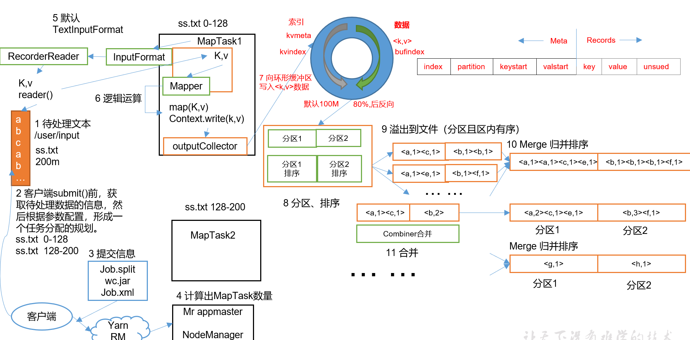

- 先判断在哪个分区中，然后将数据进行序列化，写入到环形缓冲去中

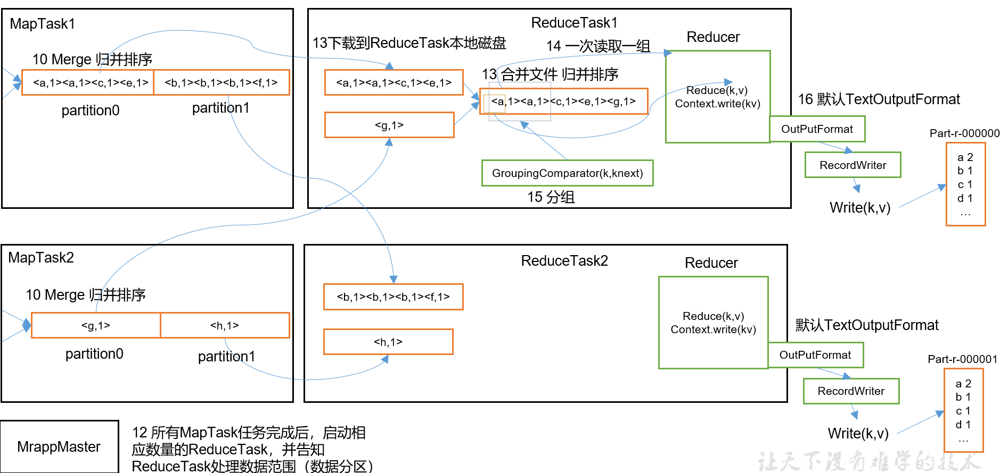

- reduce阶段：

  - 有几个分区启动几个ReduceTask,每个分区从全部的MapTask进行拷贝相应分区数据

  - 合并文件，归并排序

    

```
具体Shuffle过程详解，如下：
1. MapTask收集我们的map()方法输出的kv对，放到内存缓冲区中
2. 从内存缓冲区不断溢出本地磁盘文件，可能会溢出多个文件
3. 多个溢出文件会被合并成大的溢出文件
4. 在溢出过程及合并的过程中，都要调用Partitioner进行分区和针对key进行排序
5. ReduceTask根据自己的分区号，去各个MapTask机器上取相应的结果分区数据
6. ReduceTask会取到同一个分区的来自不同MapTask的结果文件，ReduceTask会将这些文件再进行合并（归并排序）
7. 合并成大文件后，Shuffle的过程也就结束了，后面进入ReduceTask的逻辑运算过程（从文件中取出一个一个的键值对Group，调用用户自定义的reduce()方法）
```

- 注意

  ```
  Shuffle中的缓冲区大小会影响到MapReduce程序的执行效率，原则上说，缓冲区越大，磁盘io的次数越少，执行速度就越快。
  缓冲区的大小可以通过参数调整，参数：io.sort.mb默认100M
  ```

  

- 4．源码解析流程

  ```
  context.write(k, NullWritable.get());
  output.write(key, value);
  collector.collect(key, value,partitioner.getPartition(key, value, partitions));
  	HashPartitioner();
  collect()
  	close()
  	collect.flush()
  sortAndSpill()
  	sort()   QuickSort
  mergeParts();
  	
  collector.close();
  ```

  


#### Shuffle机制

> Map方法之后，Reduce方法之前的数据处理过程称为Shuffle

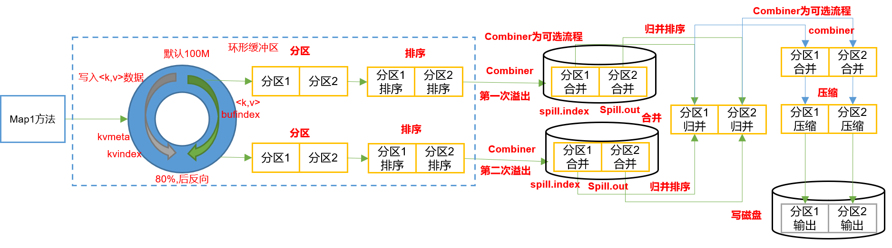

##### Partition分区

> 要求将统计结果按照条件输出到不同的文件中(分区中)

###### 默认Partition分区

```
public class HashPartitioner<K2, V2> implements Partitioner<K2, V2>{
	public int getPartition(K2 key, V2 value,
                          int numReduceTasks) {
    return (key.hashCode() & Integer.MAX_VALUE) % numReduceTasks;
  	}
  	//默认分区是根据key的hashCode对ReduceTasks个数取模得到的
```

> 默认分区是根据key的hashCode对ReduceTasks个数取模得到的


##### 自定义Partitioner分区

步骤

- 自定义类继承Partitioner ,重写getPartition()方法
- Job驱动中设置自定义Partitioner
- 自定义Partition后，根据自定义Partition的逻辑设置相应数量的ReduceTask
  - job.setNumReduceTasks(X)

###### Partition分区案例

> 需求:将统计结果按照手机归属地不同省份输出到不同文件中（分区）

> 期望输出数据:	手机号136、137、138、139开头都分别放到一个独立的4个文件中，其他开头的放到一个文件中。

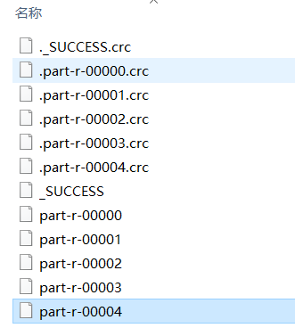

- code

```
package Partition;

import org.apache.hadoop.conf.Configuration;
import org.apache.hadoop.fs.Path;
import org.apache.hadoop.io.Text;
import org.apache.hadoop.mapreduce.Job;
import org.apache.hadoop.mapreduce.lib.input.FileInputFormat;
import org.apache.hadoop.mapreduce.lib.output.FileOutputFormat;

import java.io.IOException;
@SuppressWarnings("all")
public class FlowDriver {
    public static void main(String[] args) {
        args = new String[]{"D:\\input\\phone.txt","D:\\output"};

        //设置job和configuration
        Configuration conf = new Configuration();
        try {

            Job job = Job.getInstance(conf);
            //设置jar路径
            job.setJarByClass(FlowDriver.class);
            //设置map和reduce
            job.setMapperClass(FlowMapper.class);
            job.setReducerClass(FlowReducer.class);
            //设置map阶段输出类型
            job.setMapOutputKeyClass(Text.class);
            job.setMapOutputValueClass(FlowBean.class);
            //设置reduce阶段输出类型
            job.setOutputKeyClass(Text.class);
            job.setOutputValueClass(FlowBean.class);
            //设置输入输出参数路径
            FileInputFormat.setInputPaths(job, new Path(args[0]));
            FileOutputFormat.setOutputPath(job, new Path(args[1]));

            ////增加自定义数据分区设置和reduceTask数量设置
            job.setPartitionerClass(ProvincePartitioner.class);
            job.setNumReduceTasks(5);

            //提交job
            boolean b = job.waitForCompletion(true);
            System.out.println(b);
        } catch (IOException e) {
            e.printStackTrace();
        } catch (InterruptedException e) {
            e.printStackTrace();
        } catch (ClassNotFoundException e) {
            e.printStackTrace();
        }
    }
}

```

```
package Partition;

import org.apache.hadoop.io.Writable;

import java.io.DataInput;
import java.io.DataOutput;
import java.io.IOException;

public class FlowBean implements Writable {
    private long upFlow;
    private long downFlkow;
    private long sumFlow;

    //无参构造
    public FlowBean() {
    }
    //设置方法
    public void set(long upFlow, long downFlkow){
        this.upFlow = upFlow;
        this.downFlkow = downFlkow;
        this.sumFlow = this.upFlow+ this.downFlkow;
    }

    public long getUpFlow() {
        return upFlow;
    }

    public void setUpFlow(long upFlow) {
        this.upFlow = upFlow;
    }

    public long getDownFlkow() {
        return downFlkow;
    }

    public void setDownFlkow(long downFlkow) {
        this.downFlkow = downFlkow;
    }

    public long getSumFlow() {
        return sumFlow;
    }

    public void setSumFlow(long sumFlow) {
        this.sumFlow = sumFlow;
    }

    @Override
    public String toString() {
        return  upFlow +
                " " + downFlkow +
                " " + sumFlow;
    }

    @Override
    public void write(DataOutput out) throws IOException {
        out.writeLong(upFlow);
        out.writeLong(downFlkow);
        out.writeLong(sumFlow);
    }

    @Override
    public void readFields(DataInput in) throws IOException {
        upFlow = in.readLong();
        downFlkow=in.readLong();
        sumFlow = in.readLong();
    }
}

```

```
package Partition;

import org.apache.hadoop.io.LongWritable;
import org.apache.hadoop.io.Text;
import org.apache.hadoop.mapreduce.Mapper;

import java.io.IOException;

@SuppressWarnings("all")
public class FlowMapper  extends Mapper<LongWritable, Text, Text, FlowBean> {
    Text k = new Text();
    FlowBean v = new FlowBean();

    //重写map方法
    @Override
    protected void map(LongWritable key, Text value, Context context) throws IOException, InterruptedException {

        /**
         * 7 	13560436666	120.196.100.99		1116		 954			200
         * id	手机号码		网络ip			   上行流量     下行流量     网络状态码
         */
        //获取一行
        String line = value.toString();
        //以空格切割 获取手机号 上流量 下流量
        String[] strings = line.split("\t");
        //获取手机号，上流量，下流量
        String phone = strings[1];
        String upflow = strings[strings.length-3];//上行流量
        String downflow = strings[strings.length-2]; //下行流量

        //封装对象
        k.set(phone);
        v.set(Long.parseLong(upflow), Long.parseLong(downflow));

        //写出
        context.write(k, v);
    }
}

```

```
package Partition;

import org.apache.hadoop.io.Text;
import org.apache.hadoop.mapreduce.Reducer;

import java.io.IOException;
@SuppressWarnings("all")
public class FlowReducer extends Reducer<Text, FlowBean, Text, FlowBean> {
    private FlowBean sumFlow = new FlowBean();
    @Override
    protected void reduce(Text key, Iterable<FlowBean> values, Context context) throws IOException, InterruptedException {
        long upSum=0;
        long downSum =0;
        for (FlowBean value : values) {
            upSum += value.getUpFlow();
            downSum+= value.getDownFlkow();

            sumFlow.set(upSum, downSum);
            context.write(key, sumFlow);
        }

    }
}

```


```
package Partition;

import io.netty.handler.codec.marshalling.ThreadLocalMarshallerProvider;
import org.apache.hadoop.io.Text;
import org.apache.hadoop.mapreduce.Partitioner;

public class ProvincePartitioner extends Partitioner<Text, FlowBean> {

    @Override
    public int getPartition(Text text, FlowBean flowBean, int numPartitions) {
        String preNum = text.toString().substring(0, 3);
        int partition=4;

        if("136".equals(preNum)){
            partition=0;
        }else if("137".equals(preNum)){
            partition=1;
        }else if("138".equals(preNum)){
            partition =2;
        }else if("139".equals(preNum)){
            partition=3;
        }
        return  partition;
    }
}

```

```
总结：
1. ReduceTaks个数为1时，自定义分区无效 
2. 设置的ReduceTask个数<分区的结果，报出IO异常
3. ReduceTask个数> 分区的数 ，会有一部分空数据文件
```


#### WritableComparable排序

> 排序是MapReduce框架中最重要的操作之一
>
> MapTask和ReduceTask都会对数据按照**key**进行排序，任何应用程序中的数据都会被排序，而不管逻辑上是否需要

- 默认按照**字典顺序排序**，且排序方法**快速排序**
- MapTask : 环形缓冲区达到阈值后，对缓冲区中数据**进行一次快速排序**，溢写到磁盘中后，会**对磁盘上所有数据进行归并排序**
- ReduceTask： **从每个MapTask上拷贝相应的数据文件，磁盘上的数量达到一定的阈值，进行一次归并排序生成更大的文件**，当**所有数据拷贝完后，ReduceTask统一对内存和磁盘上的所有数据进行一次归并排序**

###### 排序的分类

- 部分排序
  - MapReduce根据数据的 键key 对数据集排序，保证输出的每个文件内部有序
- 全排序
  - 最终的输出结果只有一个文件，且文件内部有序， 实现方式：只设置一个ReduceTask，缺点： 效率低
- 辅助排序(Grouping Comparator分组)
  - 对Reduce端对key进行分组

- 二次排序
  - 在自定义排序过程中，如果compareTo中判断条件为两个即为二次排序


##### 自定义排序WritableComparable

> 原理：bean对象做为key传输，需要实现**WritableComparable接口**重写**compareTo**方法，就可以实现排序。

```java
@Override
public int compareTo(FlowBean o) {

	int result;
		
	// 按照总流量大小，倒序排列
	if (sumFlow > bean.getSumFlow()) {
		result = -1;
	}else if (sumFlow < bean.getSumFlow()) {
		result = 1;
	}else {
		result = 0;
	}

	return result;
}
```


##### WritableComparable排序案例(全排序)

> 需求：FlowBean产生的结果再次对总流量进行排序。


```
期望输出数据--对数据结果进行降序排序
13509468723	7335	110349	117684
13736230513	2481	24681	27162
13956435636	132		1512	1644
13846544121	264		0		264
```

```
FlowBean实现WritebaleCOmparable接口重写compareTO方法:按照倒叙排列
Mapper类： 输出context.write(bean,手机号) //以bean对象作为key使排列
Reducer类：循环写出
```


```
//FlowBean
package FlowCountSorted;

import org.apache.hadoop.io.WritableComparable;

import java.io.DataInput;
import java.io.DataOutput;
import java.io.IOException;

public class FlowBean implements WritableComparable<FlowBean> {

    private long upFlow;
    private long downFLow;
    private long sumFlow;

    /**
     * 默认无参构造
     */
    public FlowBean() {
    }

    /**
     * 有参构造
     *
     * @param upFlow
     * @param downFLow
     */
    public FlowBean(long upFlow, long downFLow) {
        set(upFlow, downFLow);
    }

    public void set(long upFlow, long downFLow) {
        this.upFlow = upFlow;
        this.downFLow = downFLow;
        this.sumFlow = this.upFlow + this.downFLow;
    }

    /**
     * compareTo方法
     *
     * @param o
     * @return
     */
    @Override
    public int compareTo(FlowBean o) {
        //按照总流量的大小进行排序
        if (this.sumFlow > o.sumFlow) {
            return -1;
        } else if (sumFlow < o.sumFlow) {
            return 1;
        } else {
            return 0;
        }
    }


    public long getUpFlow() {
        return upFlow;
    }

    public void setUpFlow(long upFlow) {
        this.upFlow = upFlow;
    }

    public long getDownFLow() {
        return downFLow;
    }

    public void setDownFLow(long downFLow) {
        this.downFLow = downFLow;
    }

    public long getSumFlow() {
        return sumFlow;
    }

    public void setSumFlow(long sumFlow) {
        this.sumFlow = sumFlow;
    }

    @Override
    public String toString() {
        return upFlow +
                "\t" + downFLow +
                "\t" + sumFlow;
    }

    /**
     * 序列化方法
     *
     * @param out
     * @throws IOException
     */
    @Override
    public void write(DataOutput out) throws IOException {
        out.writeLong(upFlow);
        out.writeLong(downFLow);
        out.writeLong(sumFlow);
    }

    /**
     * 反序列化方法
     *
     * @param in
     * @throws IOException
     */
    @Override
    public void readFields(DataInput in) throws IOException {
        //顺数保持一致即可
        this.upFlow = in.readLong();
        this.downFLow = in.readLong();
        this.sumFlow = in.readLong();
    }
}
```

```
package FlowCountSorted;

import org.apache.hadoop.conf.Configuration;
import org.apache.hadoop.fs.Path;
import org.apache.hadoop.io.Text;
import org.apache.hadoop.mapreduce.Job;
import org.apache.hadoop.mapreduce.lib.input.FileInputFormat;
import org.apache.hadoop.mapreduce.lib.output.FileOutputFormat;

import java.io.IOException;

public class FlowBeanSortDriver {
    public static void main(String[] args) throws IOException, ClassNotFoundException, InterruptedException {

        // 输入输出路径需要根据自己电脑上实际的输入输出路径设置
        args = new String[]{"d:/output1","d:/output2"};

        // 1 获取配置信息，或者job对象实例
        Configuration configuration = new Configuration();
        Job job = Job.getInstance(configuration);

        // 2 指定本程序的jar包所在的本地路径
        job.setJarByClass(FlowBeanSortDriver.class);

        // 3 指定本业务job要使用的mapper/Reducer业务类
        job.setMapperClass(FlowBeanSortMapper.class);
        job.setReducerClass(FlowBeanSortReducer.class);

        // 4 指定mapper输出数据的kv类型
        job.setMapOutputKeyClass(FlowBean.class);
        job.setMapOutputValueClass(Text.class);

        // 5 指定最终输出的数据的kv类型
        job.setOutputKeyClass(Text.class);
        job.setOutputValueClass(FlowBean.class);

        // 6 指定job的输入原始文件所在目录
        FileInputFormat.setInputPaths(job, new Path(args[0]));
        FileOutputFormat.setOutputPath(job, new Path(args[1]));

        // 7 将job中配置的相关参数，以及job所用的java类所在的jar包， 提交给yarn去运行
        boolean result = job.waitForCompletion(true);
        System.out.println(result);
        System.exit(result ? 0 : 1);
    }
}
```

```
package FlowCountSorted;

import org.apache.hadoop.io.LongWritable;
import org.apache.hadoop.io.Text;
import org.apache.hadoop.mapreduce.Mapper;

import java.io.IOException;

public class FlowBeanSortMapper extends Mapper<LongWritable,Text,FlowBean,Text> {
    private FlowBean k = new FlowBean();
    private Text v = new Text();

    @Override
    protected void map(LongWritable key, Text value, Context context) throws IOException, InterruptedException {
        //原始数据：手机号  上行流量  下行流量  总流量
        String line = value.toString();

        //切割
        String[] split = line.split("\t");

        //获取对应数据
        String phoneNum = split[0];

        long upFlow = Long.parseLong(split[1]);
        long downFlow = Long.parseLong(split[2]);
        long sumFlow = Long.parseLong(split[3]);

        //封装对象
        k.setDownFLow(downFlow);
        k.setUpFlow(upFlow);
        k.setSumFlow(sumFlow);

        v.set(phoneNum);

        context.write(k, v);

    }
}

```


```
package FlowCountSorted;


import org.apache.hadoop.io.Text;
import org.apache.hadoop.mapreduce.Reducer;

import java.io.IOException;

public class FlowBeanSortReducer extends Reducer<FlowBean, Text, Text, FlowBean> {
    @Override
    protected void reduce(FlowBean key, Iterable<Text> values, Context context) throws IOException, InterruptedException {
        for (Text text : values) {
            context.write(text, key);
        }
    }
}
```


#### WritableComparable排序案例（区内排序）

> 需求：要求每个省份手机号输出的文件中按照总流量内部排序。

> 需求分析：基于前一个需求，增加自定义分区类，分区按照省份手机号设置。


- code

```
//增加自定义分区类
public class ProvincePartitioner extends Partitioner<FlowBean, Text> {

	@Override
	public int getPartition(FlowBean key, Text value, int numPartitions) {
		
		// 1 获取手机号码前三位
		String preNum = value.toString().substring(0, 3);
		
		int partition = 4;
		
		// 2 根据手机号归属地设置分区
		if ("136".equals(preNum)) {
			partition = 0;
		}else if ("137".equals(preNum)) {
			partition = 1;
		}else if ("138".equals(preNum)) {
			partition = 2;
		}else if ("139".equals(preNum)) {
			partition = 3;
		}

		return partition;
	}
}
```

- 在驱动类中设置分区类和ReduceTask个数

```
// 加载自定义分区类
job.setPartitionerClass(ProvincePartitioner.class);

// 设置Reducetask个数
job.setNumReduceTasks(5);
```


#### Combiner合并

> 需求：统计过程中对每一个MapTask的输出进行局部汇总，以减小网络传输量即采用Combiner功能。

期望：Combine输入数据多，输出时经过合并，输出数据降低。


- code

```
import java.io.IOException;
import org.apache.hadoop.io.IntWritable;
import org.apache.hadoop.io.Text;
import org.apache.hadoop.mapreduce.Reducer;

public class WordcountCombiner extends Reducer<Text, IntWritable, Text, IntWritable>{
IntWritable v = new IntWritable();
	@Override
	protected void reduce(Text key, Iterable<IntWritable> values, Context context) throws IOException, InterruptedException {
        // 1 汇总
		int sum = 0;
		for(IntWritable value :values){
			sum += value.get();
		}
		v.set(sum);
		// 2 写出
		context.write(key, v);
	}
}
```

- 在WordcountDriver驱动中指定Combiner

```
// 指定需要使用combiner，以及用哪个类作为combiner的逻辑
job.setCombinerClass(WordcountCombiner.class);
```

##### 案例二

将WordcountReducer作为Combiner在WordcountDriver驱动类中指定

```
// 指定需要使用Combiner，以及用哪个类作为Combiner的逻辑
job.setCombinerClass(WordcountReducer.class);
```


#### GroupingComparator分组（辅助排序）

> 对Reduce阶段的数据根据某一个或几个字段进行分组。

- 分组排序步骤：

  ```
  自定义类继承WritableComparator
  重写compare()方法
  ```

##   Yarn资源调度器

##### 架构

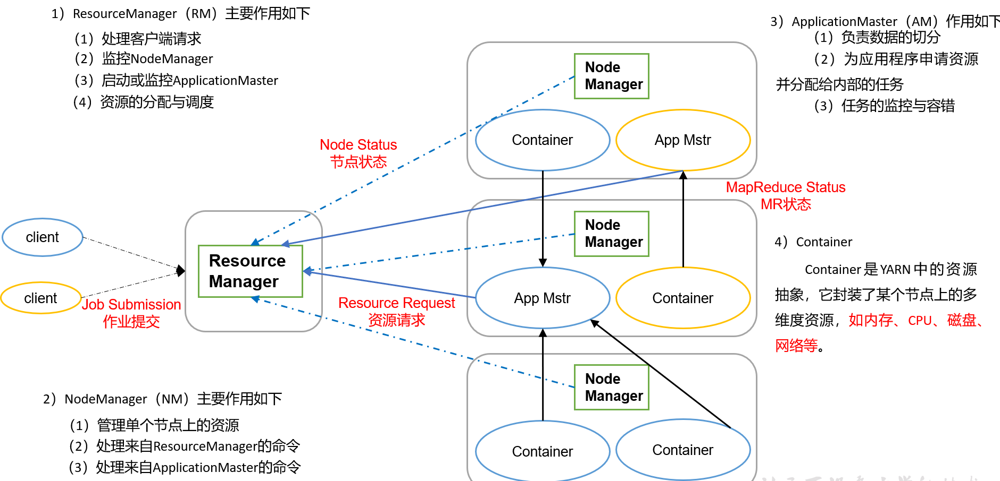


##### yarn工作机制：

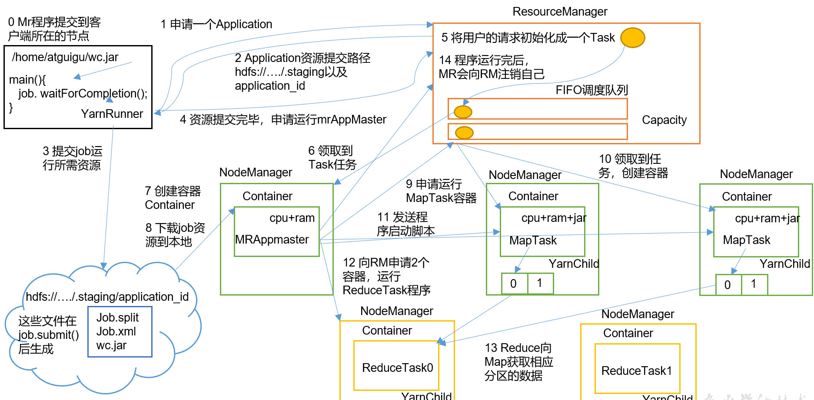

```
	（1）MR程序提交到客户端所在的节点。
	（2）YarnRunner向ResourceManager申请一个Application。
	（3）RM将该应用程序的资源路径返回给YarnRunner。
	（4）该程序将运行所需资源提交到HDFS上。
	（5）程序资源提交完毕后，申请运行mrAppMaster。
	（6）RM将用户的请求初始化成一个Task。
	（7）其中一个NodeManager领取到Task任务。
	（8）该NodeManager创建容器Container，并产生MRAppmaster。
	（9）Container从HDFS上拷贝资源到本地。
	（10）MRAppmaster向RM 申请运行MapTask资源。
	（11）RM将运行MapTask任务分配给另外两个NodeManager，另两个NodeManager分别领取任务并创建容器。
	（12）MR向两个接收到任务的NodeManager发送程序启动脚本，这两个NodeManager分别启动MapTask，MapTask对数据分区排序。
	（13）MrAppMaster等待所有MapTask运行完毕后，向RM申请容器，运行ReduceTask。
	（14）ReduceTask向MapTask获取相应分区的数据。
	（15）程序运行完毕后，MR会向RM申请注销自己。
```

##### 资源调度器

```
作业调度器分为三种： FIFO, Capacity Scheduler 和 Fair Scheduler，
默认是CapacityScheduler
```

```
<property>
    <description>The class to use as the resource scheduler.</description>
    <name>yarn.resourcemanager.scheduler.class</name>
<value>org.apache.hadoop.yarn.server.resourcemanager.scheduler.capacity.CapacityScheduler</value>
</property>//默认是Capacity Scheduler
```

###### 三种调度器

```
FIFO调度器: 队列方式，先进先出
容器调度器 : 多个FIFO调度器
公平调度器 ：按照缺额排序，缺额越大越优先(缺额就是作业需要的资源)，每个队列中的Job按照优先级分配资源，优先级越高分配的资源越多，同一个队列中也有多个作业同时运行
```

##### 任务推测执行

​	若存在某个任务的执行速度远小于其他任务的平均速度，会为这个任务开启另一个任务，然后两个任务同时运行，哪个线运行完，就使用哪个任务的结果

###### 前提条件

```
1. 每个Task只能有一个辈分任务
2. 当前job已完成Task必须> 5%
3. 推测执行参数，默认是打开的
```

###### 不能启用推测执行的情况

```
任务存在严重的负载均衡
特殊任务：向数据库写数据
```

###### 推测执行算法原理 

```
算出 
1.推测运行时间= (当前时间-任务启动时刻)/任务运行比例
2. 推测执行完成时刻： 推测时间+任务启动时刻
3. 备份任务推测完成时刻 = 当前时刻+ 任务平均完成时刻
```


## Hadoop企业优化

###### 考虑方面：

```
数据输入，map阶段，IO阶段,reduce阶段，数据倾斜，常用参数及调优 六个方面进行调优 
```

##### 数据输入

```
1. 合并小文件
2. 采用CombineTextInputFormat
```

#####  Map阶段

```
1. 减少溢写(splill次数):
	调整io.sort.mb和sort.spill.percent参数，增大触发Spill的内存上线，减少Spill次数，减少IO
2. 减少合并Merge次数
	调整io.sort.factor参数,减少Merge次数
3. 在不影响业务前提下，提前进行combine处理，减少IO
```

##### Reduce阶段

```
1. 设置Map，Reduce共存: 调整slowstart.completemaps参数，默认为0.05
2. 规避使用Reduce，能使用map join，就使用
3.设置Reduce端的Buffer：设置参数来配置，使Buffer中部分数据可以直接传送给reduce，减少IO
```

##### IO

```
1. 采用数据压缩方式：使用Snappy和LZO 压缩
2. 使用SequenceFile二进制文件
```

##### 数据倾斜

```
1. 采用抽样查询方式
2. 自定义分区，避免出现数据倾斜
3. Combine，提前进行部分聚合
4. 采用Mapjoin，尽量避免Reduce join
```

##### 常用调优参数

| 配置参数                                      | 参数说明                                              |
| --------------------------------------------- | ----------------------------------------------------- |
| mapred.reduce.shuffle.merge.percent           | Buffer中数据默认达到0.66比例开始写入磁盘              |
| mapreduce.reduce.shuffle.input.buffer.percent | Buffer大小占Reduce可用内存比例，默认是0.7             |
| mapreduce.reduce.input.buffer.percent         | 指定多少比例的内存用来存放Buffer中的数据，默认值是0.0 |
| mapreduce.task.io.sort.mb                     | Shuffle的环形缓冲去大小，默认100m                     |
| mapreduce.map.sort.spill.percent              | 环形缓冲区溢出的阈值，默认80%                         |

##### HDFS小文件解决方案：

###### 弊端：

```
hdfs中文件都需要在namenode上建立索引，然后保存在namenode上，这样会产生两个弊端：
1. 会大量占用namenode的内存
2. 进行检索文件的时候速度变慢
```

###### 解决方案：

```
1. SequenceFile: Sequence File若key是文件名，value是文件内容，可以将大量小文件合并成一个大文件
2. CombineFileInputFormat: 将多个文件合并成一个split
3. 开启JVM重用： 重复使用同一个JVM进程
```


## Hadoop扩展

#### 调优参数：mapreduce.job.reduce.slowstart.completedmaps

https://blog.csdn.net/qq1010234991/article/details/87864654

