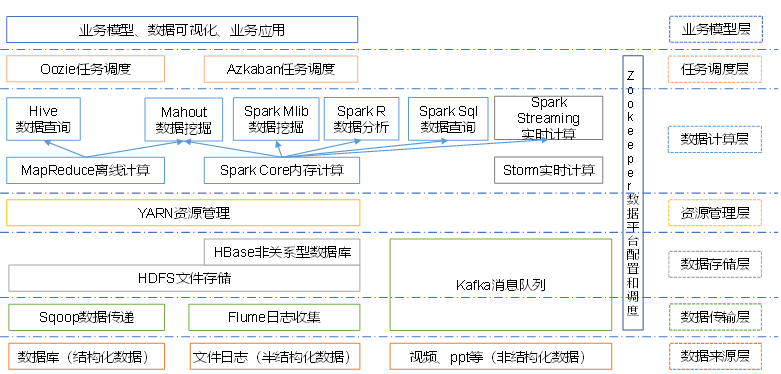
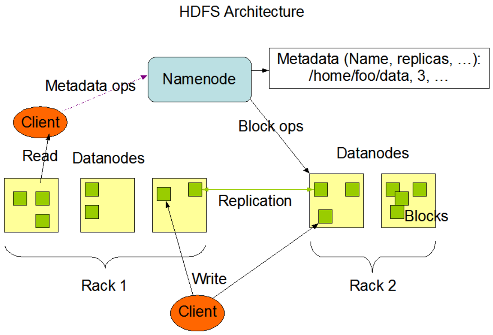
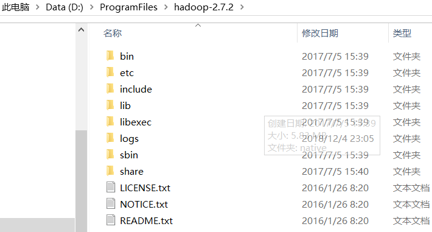

### 大数据概论

###### hadoop是什么

1. Hadoop是一个由Apache基金会所开发的分布式系统架构
2. 主要解决，海量数据的存储和海量数据的分析计算问题
3. 广义上来说，Hadoop通常指一个更广泛的概念--hadoop生态圈

##### hadoop组成

###### Hadoop1.x和hadoop2.x 区别

Hadoop1.x 组成= MapReduce(计算+资源调度) HDFS(数据存储), Common(辅助工具)

Hadoop2.x组成=MapReduce(计算),Yarn(资源调度)，HDFS(数据存储),Common(辅助工具)

> 将Mapreduce进行拆分，解耦，Mapreduce只负责计算，由yarn负责资源调度，



```
数据来源层->数据传输层->数据存储层->资源管理层->数据计算层->任务调度层->业务模型层
```

##### Hadoop运行环境搭配

###### 虚拟机环境准备

1. 修改虚拟机的静态IP(静态IP不会改变，易于管理)

2. 修改主机名

3. 关闭防火墙

4. 创建用户(以具体用户名为主)

5. 配置用户具有root权限

6. /opt目录下创建两个module, software文件夹

7. 安装JDK

   ```
   先查询是否安装java:rpm-qa | grep java
   如果有，卸载     : sudo rpm -e java
   查看jdk的安装路径 : which java
   将jdk安装包放入到/opt/software路径下:利用Xftp等传输工具
   解压jdk :  tar -zxvf jdkXXX -C /opt/module 
   配置环境变量： sudo vim /etc/profile
   在/etc/profile最后添加#JAVA_HOME相关信息
   	#JAVA_HOME
   	export JAVA_HOME=/opt/module/jdk1.8.0_144
   	export PATH=$PATH:$JAVA_HOME/bin
   保存退出，并source /etc/profile 进行刷新，使修改生效
   测试JDK是否安装成功： java -version /java /javac 出现相应提示即可
   ```

8. 安装Hadoop：

   ```
   Hadoop下载地址：(以hadoop2.7.2为例)
   	https://archive.apache.org/dist/hadoop/common/hadoop-2.7.2/
   解压到/opt/module路径下
   	tar -zxvf hadoopXXX -C /opt/module
   添加环境变量
   	##HADOOP_HOME
   	export HADOOP_HOME=/opt/module/hadoop-2.7.2
   	export PATH=$PATH:$HADOOP_HOME/bin  //将bin和sbin两个路径全部加入path
   	export PATH=$PATH:$HADOOP_HOME/sbin
   保存并刷新: source /etc/profile
   测试是否成功： hadoop version
   ```

###### Hadoop运行模式

> 本地模式，伪分布式模式，完全分布式模式

###### 完全分布式运行模式

配置集群

- 虚拟机环境准备(见上)

###### 编写集群分发脚本xsync

- scp 安全拷贝

  定义：scp可以实现服务器之间的数据拷贝

  基本语法： scp -r  $dir/$fname   $user@$host:$pdir/$fname

  -  -r(递归)
  - $pdir/$fname 要拷贝的文件路径/名称
  - $user ： 远端用户@主机：目的路径/名称

```shell
scp -r /opt/module root@hadoop102:/opt/module
```

1. 如果是以root用户传输，需要修改文件的拥有者，所属组:sudo chown XXX:XXX -R  路径

###### rsync 远程同步工具

> rsync只对差异文件做更新，scp是将所有文件都赋值过去

1. 基本语法

   ```shell
   rsync -rvl $pdir/$fname  $user@$host:$pfir/$fname
   //-r 递归  -v 显示详细过程  -l 拷贝符号链接
   ```

 ###### 集群配置

|      | hadoop102         | hadoop103                   | hadoop104                  |
| ---- | ----------------- | --------------------------- | -------------------------- |
| HDFS | NameNode DataNode | DataNode                    | SecondaryNameNode DataNode |
| YARN | NodeManager       | ResourceManager NodeManager | NodeManager                |

###### 配置集群

1. 核心配置文件

   配置core-site.xml

   ```xml
   <!-- 指定HDFS中NameNode的地址 -->
   <property>
   		<name>fs.defaultFS</name>
         <value>hdfs://hadoop102:9000</value>
   </property>
   
   <!-- 指定Hadoop运行时产生文件的存储目录 -->
   <property>
   		<name>hadoop.tmp.dir</name>
   		<value>/opt/module/hadoop-2.7.2/data/tmp</value>
   </property>
   ```

2. HDFS配置文件

      配置hadoop-env.sh

      ```shell
      export JAVA_HOME=/opt/module/jdk1.8.0_144 //配置环境变量
      ```

      配置hdfs-site.xml

      ```xml
      <!-- 指定Hadoop副本个数，默认就是3 -->
      <property>
      		<name>dfs.replication</name>
      		<value>3</value>
      </property>
      
      <!-- 指定Hadoop辅助名称节点主机配置 -->
      <property>
            <name>dfs.namenode.secondary.http-address</name>
            <value>hadoop104:50090</value>
      </property>
      ```

3. YARN配置文件

     配置yarn-env.sh

     ```
     	vi yarn-env.sh
     	export JAVA_HOME=/opt/module/jdk1.8.0_144  //导出环境变量
     ```

     配置yarn-site.xml

     ```xml
     <!-- Reducer获取数据的方式 -->
     <property>
     		<name>yarn.nodemanager.aux-services</name>
     		<value>mapreduce_shuffle</value>
     </property>
     
     <!-- 指定YARN的ResourceManager的地址 -->
     <property>
     		<name>yarn.resourcemanager.hostname</name>
     		<value>hadoop103</value>
     </property>
     ```

4. MapReduce配置文件

     配置mapred-env.sh

     ```
     vi mapred-env.sh
     export JAVA_HOME=/opt/module/jdk1.8.0_144
     ```

     配置mapred-site.xml

     ```
     <!-- 指定MR运行在Yarn上 -->
     <property>
     		<name>mapreduce.framework.name</name>
     		<value>yarn</value>
     </property>
     ```

> 在集群上分发配置好的Hadoop配置文件

###### SSH无密码配置

配置ssh

基本语法： ssh 另一台机器的IP地址

1. 生成公钥和私钥：ssh-keygen -t rsa : 三次回车，就会生成公钥和私钥

2. 将公钥拷贝到免密登录的机器上 //或者直接拷贝整个文件也可以，不过较为危险


##### 群起集群

###### 配置salves

```
/opt/module/hadoop-2.7.2/etc/hadoop //在此路径下，建立slaves文件夹
vim slaves
```

添加以下内容(不允许有空格，或空行) --配置完成后，进行分发

```
hadoop102
hadoop103
hadoop104
```

###### 启动集群

1. 如果是第一次启动，需要格式化NameNode(1.注意进程 2. 删除data和log数据3. 再进行格式化)

   ```
   bin/hdfs namenode -format
   ```

2. 启动HDFS

   ```shell
   sbin/start-dfs.sh
   ```

3. 启动YARN

   ```shell
   start-yarn.sh
   ```

4. Web端进行查看

   ```
   http://hadoop201:50070
   ```

   

##### 集群启动/停止方式总结

###### 各个服务分别启动/停止

```shell
hadoop-daemon.sh start/stop namenode/datanode/secondarynamenode
```

###### 启动、停止YARN

```shell
yarn-daemon.sh start/stop resourcemanager/nodemanager
```

###### 各个模块启动/停止-- 常用

整体启动/停止HDFS

```shell
start-dfs.sh /stop-dfs.sh
```

整体启动/停止YARN

```shell
start-yarn.sh/ stop-yarn.sh
```


##### 集群事件同步

###### 配置时间同步具体步骤(root用户)

1. 检查ntp是否安装

   ```shell
   rpm -qa | grep ntp
   ```

2. 修改ntp配置文件

   修改1：授权XXX网段上的所有机器都可以从这台机器上查询和同步时间

   ```shell
   #restrict 192.168.1.0 mask 255.255.255.0 nomodify notrap为
   restrict 192.168.1.0 mask 255.255.255.0 nomodify notrap
   ```

   修改2： 集群在局域网中，不适用其他互联网上的时间

   ```shell
   server 0.centos.pool.ntp.org iburst
   server 1.centos.pool.ntp.org iburst
   server 2.centos.pool.ntp.org iburst
   server 3.centos.pool.ntp.org iburst为
   #server 0.centos.pool.ntp.org iburst
   #server 1.centos.pool.ntp.org iburst
   #server 2.centos.pool.ntp.org iburst
   #server 3.centos.pool.ntp.org iburst //将这四个部分注释掉
   ```

   修改3： 当该节点丢失网络连接，扔可以采用本地时间作为时间服务器为其他节点提供时间同步

   ```
   server 127.127.1.0
   fudge 127.127.1.0 stratum 10
   ```

3. 修改/etc/sysconfig/ntpd文件

   ```
   vim /etc/sysconfig/ntpd
   增加内容如下（让硬件时间与系统时间一起同步）
   SYNC_HWCLOCK=yes
   ```

   

4. 重新启动ntpd服务

   ```
   service ntpd start
   ```

5. 设置ntpd服务开机启动

   ```
   chkconfig ntpd on
   ```

###### 其他机器配置(必须root用户)

​	其他机器每10分钟与时间服务器同步一次

```
crontab -e
*/10 * * * * /usr/sbin/ntpdate hadoop102  //每隔10分钟进行时间同步
```


## Hadoop之HDFS

###### HDFS产出背景

> 随着数据量的越来越大，一个操作系统中存不下所有的数据，那么就分配到更多的操作系统磁盘中，为了方便管理，需要一种系统来管理多台机器上的文件，这就是分布式文件管理系统，HDFS只是分布式文件管理系统中的一种

###### HDFS定义

> HDFS(hadoop Distributed File System) ,分布式的文件系统，用于存储文件，多台服务器联合实现其功能

**使用场景**: 适合一次写入，多次读出的场景，且不支持文件的修改,适合做数据分析


##### HDFS优缺点

###### 优点

- 高容错性: 数据自动保存多个副本，通过增加副本的方式，提高容错性
- 适合处理大数据
- 可构建在廉价的机器上，通过多副本机制，提高可靠性

###### 缺点

- 不适合低延时数据访问：效率偏低
- 无法高效的对小文件进行存储
- 不支持并发写入，文件随机修改

##### HDFS组成架构



- NameNode(nn):  Master
  - 管理HDFS的名称空间
  - 配置副本策略
  - 管理数据块(Block)映射信息
  - 处理客户端读写请求

- DataNode: Slave

  - 存储实际的数据块

  - 执行数据块的读/写操作

- Client : 客户端
  - 文件切分，文件上传HDFS时，客户端将文件切分成一个一个的Block，然后进行上传
  - 与NameNode交互，获取文件的位置信息
  - 与DataNode交互，读取或写入数据
  - Client提供一些命令管理HDFS， ex: namenode格式化
  - Client通过一些命令访问HDFS，比如HDFS增删改查等刀座
- Secondary NameNode： 非NameNode热备
  - 辅助NamNode，分担工作： 定时合并FsImage和Edits,并推送给NamNode
  - 紧急情况下，辅助修复NamNode


##### HDFS文件块大小

​	HDFS中文件在物理上是分块存储(Block)，块的大小可以通过配置参数(dfs.blocksize)来规定，默认大小Hadoop2.x版本中128M


###### 问什么块的大小不能设置太小，也不能太大?

1. HDFS块设置太小，会增加寻址时间，增加寻找块的开始位置时间

2. 如果块设置的太大，从磁盘传输数据的时间会明显大于定位这个块开始位置所需的时间，导致处理数据时，相对较慢

   **总结：HDFS块的大小设置主要取决于磁盘传输速率**

   

##### HDFS的shell 操作

###### 基本语法

```
bin/hadoop fs XX命令 或   bin/hdfs dfs XXX命令
```

###### 常用命令

- 启动Hadoop集群

```shell
sbin/start-dfs.sh
sbin/start-yarn.sh
```

- `-`help : 输出这个命令参数

```
hadoop fs -help rm
```

- `-`ls: 显示目录信息

```
hadoop fs -ls /
```

- `-`mkdir: 在HDFS上创建目录

```
hadoop fs -mkdir -p /wangyg/love/pangdi
```

- `-`moveFromLocal : 从本地剪切到HDFS上

```
hadoop fs -moveFromLoacl ./1.txt /wangyg
```

- `-`appendToFile: 追加一个文件到已经存在的文件末尾

```
hadoop fs -appendToFile 1.txt /wangyg/1.txt
```

- `-`cat: 显示文件内容
- `-` chgrp `-`chmod `-`chown:  修改文件所属权限
- `-`copyFromLocal : 从本地拷贝到HDFS中
- `-`copyToLocal : 从HDFS拷贝到本地
- `-`cp : 从HDFS的一个路径拷贝到另一个路径
- `-`mv : 在HDFS目录中移动文件
- `-`get: 等同于copyToLoacal : 从HDFS下载
- `-`getmerget: 合并下载多个文件
- `-`put: 等同于copuFromLocal : 上传
- `-`rm : 删除文件或文件夹
- `-`rmdir : 删除空目录
- `-`du: 统计文件夹的大小信息
- `-`setrep :设置HDFS中文件的副本数量


##### HDFS客户端操作

##### HDFS客户端环境准备：

1. 将编译后的相应版本的Hadoop jar包放在一个位置中(无中文，空格)



2. 配置HADOOP_HOME环境变量


3. 再将HADOOP_HOME添加到path中

4. 创建一个maven工程
5. 添加maven依赖

```xml
<dependencies>
		<dependency>
			<groupId>junit</groupId>
			<artifactId>junit</artifactId>
			<version>RELEASE</version>
		</dependency>
		<dependency>
			<groupId>org.apache.logging.log4j</groupId>
			<artifactId>log4j-core</artifactId>
			<version>2.8.2</version>
		</dependency>
		<dependency>
			<groupId>org.apache.hadoop</groupId>
			<artifactId>hadoop-common</artifactId>
			<version>2.7.2</version>
		</dependency>
		<dependency>
			<groupId>org.apache.hadoop</groupId>
			<artifactId>hadoop-client</artifactId>
			<version>2.7.2</version>
		</dependency>
		<dependency>
			<groupId>org.apache.hadoop</groupId>
			<artifactId>hadoop-hdfs</artifactId>
			<version>2.7.2</version>
		</dependency>
		<dependency>
			<groupId>jdk.tools</groupId>
			<artifactId>jdk.tools</artifactId>
			<version>1.8</version>
			<scope>system</scope>
			<systemPath>${JAVA_HOME}/lib/tools.jar</systemPath>
		</dependency>
</dependencies>
```

- 创建目录--mkdir

```java
import org.apache.hadoop.conf.Configuration;
import org.apache.hadoop.fs.FileSystem;
import org.apache.hadoop.fs.Path;
import org.junit.Test;

import java.io.IOException;
import java.net.URI;
import java.net.URISyntaxException;

public class HdfsClient {
    @Test
    public void testMkdir() throws URISyntaxException, IOException, InterruptedException {
        //获取文件系统
        Configuration conf = new Configuration();
        //配置在集群上运行
        conf.set("fs.defaultFS", "hdfs://hadoop201:9000");

        FileSystem fs = FileSystem.get(new URI("hdfs://hadoop201:9000"), conf, "wangyg");

        // 2 创建目录
        fs.mkdirs(new Path("/wangyg/pangdi"));

        // 3 关闭资源
        fs.close();
    }
}
```


##### HDFS的API操作

###### HDFS文件上传

```
@Test
    public void testCopyFromLocalFile() throws IOException, URISyntaxException, InterruptedException {
        //获取文件系统
        Configuration conf = new Configuration();
        conf.set("dfs.replication", "2"); //设置副本个数
        //获取文件系统
        FileSystem fileSystem = FileSystem.get(new URI("hdfs://hadoop201:9000"),conf,"wangyg");
        //上传文件
        fileSystem.copyFromLocalFile(new Path("C:\\Users\\wangyg\\Desktop\\TODO.txt"),
                new Path("/wangyg"));

        //上传完毕后，关闭资源
        fileSystem.close();

        System.out.println("上传完毕...");
    }
```


> 参数优先级: 客户端代码中的值 > ClassPath下的配置> 服务器的默认配置


###### HDFS文件下载

```
    @Test
    public void testCopyToLocalFile() throws URISyntaxException, IOException, InterruptedException {
        //获取文件系统
        Configuration conf = new Configuration();
        FileSystem fs = FileSystem.get(new URI("hdfs://hadoop201:9000"),
                conf, "wangyg");
        fs.copyToLocalFile(false,new Path("/wangyg/TODO.txt")
                , new Path("D:\\"));

        System.out.println("下载完成...");

    }
```

###### HDFS文件夹删除

```
 @Test
    public void testDelete() throws URISyntaxException, IOException, InterruptedException {
        //获取配置
        Configuration conf = new Configuration();
        //获取文件系统
        FileSystem fs = FileSystem.get(new URI("hdfs://hadoop201:9000"), conf, "wangyg");
        boolean delete = fs.delete(new Path("/wangyg/"), true);
        if (delete) {
            System.out.println("删除成功...");
        }
        //关闭资源
        fs.close();

    }
```

###### HDFS文件名更改

```java
  @Before
    public void before() throws URISyntaxException, IOException, InterruptedException {
        //获取配置
        Configuration conf = new Configuration();
        //获取文件系统
        fs = FileSystem.get(new URI("hdfs://hadoop201:9000"), conf, "wangyg");
    }
    //HDFS文件名更改
    @Test
    public void testRename() throws IOException {
        boolean rename = fs.rename(new Path("/1.txt"), new Path("/2.txt"));

        if(rename){
            System.out.println("修改名称成功...");
        }
        //关闭资源
        fs.close();
    }
```

###### HDFS文件详情查看

```

```

