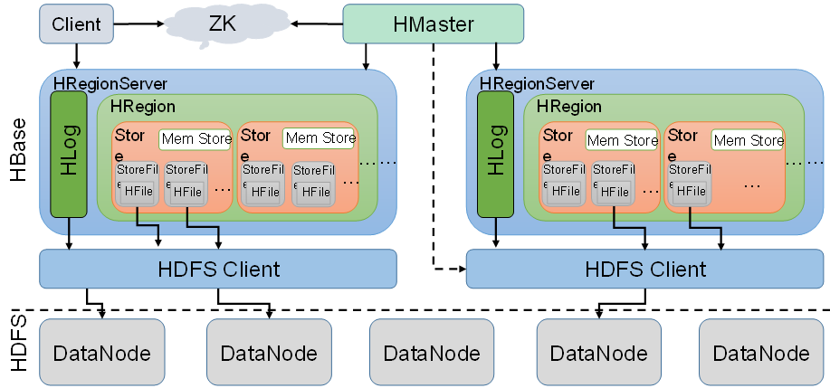

##### HBase概述

> HBase原型受Google的BigTable论文，收到该论文思想的启发

​	HBase是一个高可靠型，高性能，面向列，可伸缩的**分布式存储系统**


###### Hbase特点

- 海量存储： Hbase适合存储PB级别的海量数据
- 列式存储： 列族存储，Hbase是根据列族来存储数据的，列族下面可以有多个列，列族在创建表的时候必须指定
- 易扩展： 扩展性体现在两个方面： 一： 上层处理能力的扩展 二：基于存储的扩展HDFS
- 高并发： Hbase的单个IO延迟下降并不多，能获得高并发，低延迟的服务
- 稀疏： Hbase列的灵活性，在列族中，可以指定任意多的列, 如果不存，不会产生内存空间


HBase架构



Hbase有client ,Zookeeper，master，HRegionServer, HDFS等组件组成

1. Client: 

   包含了访问HBase的接口，另外Client维护了对应的cache来加速Hbase的访问

2. Zookeeper

   通过zookeeper来做master的高可用，regionserver的监控，元数据的入口以及集群配置的维护

   - 通过zookeeper来保证集群中只有一个master来运行，如果master异常，通过竞争机制来产生新的master提供服务
   - 通过zookeeper来监控regionServer的状态，当RegionServer有异常时，通过回调的形式通知Master RegionServer上下线的信息
   - 通过Zookeeper存储元数据的统一入口地址

3. Hmaster

   - 为RegionServer分配Region
   - 维护整个集群的负载均衡
   - 维护集群的元数据信息
   - 发现失效的region，并将失效的Region分配到正常的Regionserver上
   - 当RegionServer失效的时候，协调Hlog的拆分

4. HregionServer

   HregionServer直接对接用户的读写请求，

   - 管理master分配的region
   - 处理来自客户端的读写请求
   - 负责和底层的HDFS交互，存储数据到HDFS
   - 负责Region变大后的拆分
   - 负责Storefile的合并工作

5. HSFS

   为HBase提供最终的底层数据存储服务，同时为Hbase提供高可用(Hlog存储在HDFS)的支持

   - 提供元数据和表数据的底层存储服务
   - 数据多副本，保证高可靠和高可用性

Hbase表名词概念：


#### Hbase安装

- Zookeeper正常启动：

  ```shell
  bin/zkServer.sh start
  ```

- Hadoop正常部署

  ```shell
  start-dfs.sh 
  start-yarn.sh
  ```

- Hbase解压

  ```shell
  tar -zxvf hbaseXXX -C /opt/module
  ```

- Hbase配置

  - hbase-env.sh修改

  ```
  export JAVA_HOME=/opt/module/jdk1.8.0_144
  export HBASE_MANAGES_ZK=false
  JDK1.8需要注释
  #export HBASE_MASTER_OPTS。。。。
  #export HBASE_REGIONSERVER_OPTS。。。
  ```

  - hbase-site.xml修改内容

    ```xml
    <configuration>
    	<property>     
    		<name>hbase.rootdir</name>     
    		<value>hdfs://hadoop102:9000/hbase</value>   
    	</property>
    
    	<property>   
    		<name>hbase.cluster.distributed</name>
    		<value>true</value>
    	</property>
    
       <!-- 0.98后的新变动，之前版本没有.port,默认端口为60000 -->
    	<property>
    		<name>hbase.master.port</name>
    		<value>16000</value>
    	</property>
    
    	<property>   
    		<name>hbase.zookeeper.quorum</name>
    	     <value>hadoop102:2181,hadoop103:2181,hadoop104:2181</value>
    	</property>
    
    	<property>   
    		<name>hbase.zookeeper.property.dataDir</name>
    	     <value>/opt/module/zookeeper-3.4.10/zkData</value>
    	</property>
    </configuration>
    ```

  - regionservers

    ```shell
    hadoop201
    hadoop202
    hadoop203
    ```

  - 软连接hadoop配置文件到Hbase

    ```
    ln -s /opt/module/hadoop-2.7.2/etc/hadoop/core-site.xml 
    /opt/module/hbase/conf/core-site.xml
    ln -s /opt/module/hadoop-2.7.2/etc/hadoop/hdfs-site.xml 
    /opt/module/hbase/conf/hdfs-site.xml
    ```

- 分发到其他机器上 scp

##### Hbase服务启动

###### 启动方式1：

```shell
hbase-daemeon.sh start master
hbase-daemon.sh start regionserver //若有时间不同步的，会启动异常
```

###### 启动方式2:

```
start-hbase.sh
stop-hbase.sh
```

###### 查看Hbase页面

```shell
hadoop201:16010
```


##### Hbase Shell操作

###### 基本操作

1. 进入hbase客户端命令行

   ```
   bin/hbase shell
   ```

2. 查看帮助命令

   ```
   help
   ```

3. 查看当前数据库中有哪些表

   ```
   list
   ```

##### 表的操作

1. 创建表

   ```
   create 'student','info'
   ```

2. 插入数据到表

   ```shell
   put 'student','1001','info:sex','male' #put '表名','rowkey','cf:列','value'
   ```

3. 扫描查看表数据

   ```
   scan 'student' # scam '表名'  ==> 全表扫描
   ```

4. 查看表结构

   ```
   describe 'student'
   ```

5. 更新指定字段的数据

   ```
   put 'student','1001','info:name','Nick'
   ```

6. 查看指定行货指定列族：列的数据

   ```shell
   get 'student','1001'
   get 'student','1001','info:name'
   ```

7. 统计表数据行数

   ```
   count 'student'
   ```

8. 删除数据 //逻辑删除，不会真正删除

   ```shell
   deleteall 'student','1001'
   //删除某rowkey的某一列数据
   deleteall 'student','1002','info:sex'
   ```

9. 清空表数据

   ```shell
   truncate 'student'
   ```

10. 删除表

    ```shell
    //先禁用
    disable 'student'
    //后删除
    drop 'student'
    ```

11. 变更表信息

    ```
    alter 'stduent',{NAME=>'info',VERSION=>3}
    ```

##### Hbase数据结构

###### Rowkey

​	Rowkey是用来检索记录的主键，访问Habse table中的行，有三种方式：

1. 通过单个RowKey访问(get)
2. 通过Rowkey的range(正则)(like)
3. 全表扫描(scan)

RowKey可以是任意字符串(最长64KB , 实际应用一般为10-100bytes) Hbase内部，Rowkey保存为字节数组，存储时，数据按照Rowkey的字典序排序存储

###### Column Family

​	列族：在Hbase表中的每个列，都归属于某个列族，列族是表的schema的一部分

###### Cell

由{rowkey,cf:column, version (timestamp 时间戳)}唯一确定的单元，cell中的数据时没有数据类型的，全都是字节码形式存储

###### Time Stamp

​	时间戳64位整型，时间戳可以由HBASE自动赋予，也可以程序员手动赋予

为了避免数据版本存在过多造成的管理负担，Hbase提供了两种数据版本回收方式： 一：保存数据的最后n个版本 二： 保存固定时间的数据，超过一定时间(默认7天)，数据被回收


###### 命名空间：(类似于database数据库)

```
创建命名空间: create_namespace bigdata(命名空间名称)
创建表在指定的命名空间： create 'bigdata:student','info'
展示所有的命名空间： list_namespace  #默认命名空间：default hbase
删除命名空间： drop_namespace 
```


##### Hbase原理

###### 读流程


1. Client先访问zookeeper,从meta表读取region的位置，所以先找到meta表的位置

2. 返回meta表所在RegionServer所在的位置(hadoop201)

3. 然后向对应的机器(hadoop201)请求rowkey所在的regionserver锁在的位置

4. 返回rowkey所在regionserver(hadoop204)

5. 向hadoop204中发起请求

6. 返回结果，先内存，后磁盘

###### 细化部分(细化读取过程--查找到具体机器后)

1. 先从MemStore(写缓存)中进行查找，如果查找到返回，
2. 如果没有，先从BlockCache中进行查找，如果还没有找到
3. 就从HFile中进行查找，查找到后，先将数据存放在BlockCache(读缓存)中
4. 然后返回Client中返回


###### 写数据流程


1. client客户端发送请求，获取meta表所在的regionserver位置
2. zookeeper返回meta表所在RS
3. 从RS中获取meta表
4. 返回meta表数据
5. 向对应机器发送写入数据请求
6. 先写入hlog，在将数据写入memstore中
7. 反馈client写成功

###### 写数据流程细化步骤

1. 将数据写入到wal(Hlog)，为了保证数据的安全性和完整性
2. 将数据写入到memstore(写缓存)
3. 将wal同步到hdfs中，如果同步失败，会rollback,把**wal和memstore数据**清除，全部回滚


###### 数据flush过程

> regionServer全局的memstore的大小，超过堆的40%时，当前的flush会阻塞写流程
>
> global.memstore.size.lower.limit: 0.95(40%的0.95)
>
> memstore.block.multiplier: 4*128 ==>必须进行刷写，flush

1. 当MemStore数据达到阈值(128M),将数据刷到硬盘，将内存中的数据删除，同时删除Hlog中的历史数据
2. 将数据存储到HDFS中
3. 在Hlog中做标记点

###### 数据合并过程

1. 当数据达到3块，Hmaster触发合并操作，Region将数据块加载到本地，进行合并(major_compact, minor_compact)
2. 当合并的数据达到256M,进行拆分，将拆分后的region分配给不同HregionServer管理
3. 当HregionServer宕机后，将HregionServer上的hlog拆分，然后分配给不同的HregionServer加载，修改.META
4. Hlog会同步到HDFS


##### Hbase API操作

- 判断表是否存在

  ```
  admin.tableExists(tableName)
  ```

- 创建表

  ```
  	//创建表属性对象,表名需要转字节
  		HTableDescriptor descriptor = new HTableDescriptor(TableName.valueOf(tableName));
  		//创建多个列族
  		for(String cf : columnFamily){
  			descriptor.addFamily(new HColumnDescriptor(cf));
  		}
  		//根据对表的配置，创建表
  		admin.createTable(descriptor);
  ```


```java
public class HbaseApi {
    public static void main(String[] args) throws IOException {
        //1.导入依赖jar包
        //2.获取依赖对象
        Configuration conf = HBaseConfiguration.create();
        //添加配置项目--增加zookeeper相关配置
        conf.set("hbase.zookeeper.quorum", "hadoop102");
        conf.set("hbase.zookeeper.property.clientPort", "2181");
        //建立和hbase数据库的连接
        //降配置信息
        Connection connection = ConnectionFactory.createConnection(conf);
        System.out.println(connection);

        //操作hbase数据库
        //获取admin管理对象--类似于master
        Admin admin = connection.getAdmin();
        System.out.println(admin);
        TableName tn = TableName.valueOf("student");

        //判断表是否存在
        if (admin.tableExists(tn)) { //存在将原表删除
            //需要将表进行禁用
            admin.disableTable(tn);
            //将表进行删除
            admin.deleteTable(tn);
            System.out.println("删除完成..");
        }

        //可以进行创建表等操作
        //不能传入string类型，因为参数为string的是一个private对象
        HTableDescriptor desc = new HTableDescriptor(tn);
        //添加列族
        HColumnDescriptor columnDescriptor = new HColumnDescriptor("info");
        desc.addFamily(columnDescriptor);
        admin.createTable(desc);


        //向表中添加数据
        //shell: put 'student','1001','info:name','xxx'
        //增加数据之前获取表格对象
        Table table = connection.getTable(tn);
        //put操作
        String rowkey = "1001";
        byte[] byteRowkey = Bytes.toBytes(rowkey);
        Put put = new Put(byteRowkey);

        byte[] family = Bytes.toBytes("info");
        byte[] name = Bytes.toBytes("name");
        byte[] value = Bytes.toBytes("dilireba");
        put.addColumn(family, name, value);
        table.put(put);
        System.out.println("数据保存完成..");


        //查询数据
        Get get = new Get(byteRowkey);

        Result result = table.get(get);
        //result进行遍历
        for (Cell cell : result.rawCells()) {
            System.out.println(Bytes.toString(CellUtil.cloneValue(cell)));
        }

        //删除数据
        Delete delete = new Delete(byteRowkey);
        table.delete(delete);
        System.out.println("删除完成...");
    }

}
```


##### MapReduce

###### 自定义HBase-MapReduce

> 将fruit表中的数据，通过MR嵌入到fruit_mr表中

- Test类

```
public class TestHbaseMr {
    public static void main(String[] args) {
        Configuration conf = HBaseConfiguration.create();
        int status = 0;
        try {
            status = ToolRunner.run(new HbaseMRTools(), args);
        } catch (Exception e) {
            e.printStackTrace();
        }
        System.exit(status);
    }
}

```

- Tools类

```
//Tools类
public class HbaseMRTools implements  Tool{

    @Override
    public int run(String[] args) throws Exception {
        Configuration conf  =new Configuration();
        Job job = Job.getInstance(conf);

        //设置类路径
        job.setJarByClass(HbaseMRTools.class);
        //设置map
        Scan scan = new Scan();
        TableMapReduceUtil.initTableMapperJob("fruit",  //表名
                scan, //扫描全表的方式
                HbaseMapper.class, //mapper的class
                ImmutableBytesWritable.class, //key输出类型
                Put.class, //value的输出类型
                job);

        //设置输出
        //TableMapReduceUtil.initTableReducerJob("fruit_mr", HbaseMRReduce.class, job);
        TableMapReduceUtil.initTableReducerJob("fruit_mr",
                HbaseMRReduce.class,//reducer .class
                job);


        boolean b = job.waitForCompletion(true);

        return b?JobStatus.State.SUCCEEDED.getValue():JobStatus.State.FAILED.getValue();
    }

    @Override
    public void setConf(Configuration conf) {

    }

    @Override
    public Configuration getConf() {
        return null;
    }
}
```

- mapper

```java
//第一个参数类型为row key ==》byte[]数组累心
//put类型，put类型是数据插入的类型，所以输出类型为put
public class HbaseMapper extends TableMapper<ImmutableBytesWritable, Put> { //指定两个参数类型，keyout,valueout

    @Override
    protected void map(ImmutableBytesWritable key, Result value, Context context) throws IOException, InterruptedException {
        //通过map将数据返回成put
        Put put = new Put(key.get());
        //遍历rauCells封装成put
        for (Cell cell : value.rawCells()) {
           byte[] family = CellUtil.cloneFamily(cell);
           byte[] name = CellUtil.cloneQualifier(cell);
           byte[] val = CellUtil.cloneValue(cell);
            put.addColumn(family, name , val);

        }
        context.write(key, put);
    }
}
```

- Reduce

```java

//public abstract class TableReducer<KEYIN, VALUEIN, KEYOUT>
//指定
public class HbaseMRReduce extends TableReducer<ImmutableBytesWritable, Put,NullWritable> {
    @Override
    protected void reduce(ImmutableBytesWritable key, Iterable<Put> values, Context context) throws IOException, InterruptedException {
        for (Put put : values) {
            context.write(NullWritable.get(), put);
        }
    }
}
```

###### 自定义HBase-MapReduce2

> 实现将HDFS中的数据写入到HBase表中

```java
//mapper
public class ReadFruitFromHDFSMapper extends Mapper<LongWritable, Text, ImmutableBytesWritable, Put> {
	@Override
	protected void map(LongWritable key, Text value, Context context) throws IOException, InterruptedException {
		//从HDFS中读取的数据
		String lineValue = value.toString();
		//读取出来的每行数据使用\t进行分割，存于String数组
		String[] values = lineValue.split("\t");
		
		//根据数据中值的含义取值
		String rowKey = values[0];
		String name = values[1];
		String color = values[2];
		
		//初始化rowKey
		ImmutableBytesWritable rowKeyWritable = new ImmutableBytesWritable(Bytes.toBytes(rowKey));
		
		//初始化put对象
		Put put = new Put(Bytes.toBytes(rowKey));
		
		//参数分别:列族、列、值  
        put.add(Bytes.toBytes("info"), Bytes.toBytes("name"),  Bytes.toBytes(name)); 
        put.add(Bytes.toBytes("info"), Bytes.toBytes("color"),  Bytes.toBytes(color)); 
        
        context.write(rowKeyWritable, put);
	}
}
```


##### Hbase优化

- 高可用

  ```shell
  1. 关闭Hbase集群
  2. 在conf目录下创建backup-masters文件 touch conf/backup-masters
  3. 在backup-masters文件中配置高可用Hmaster节点  echo hadoop203> conf/backup-masters
  4. 在整个conf目录scp到其他节点  
  ```

- 预分区

  > 每一个region维护startRowkey与endRowKey, 如果加入的数据复合某个region的rowkey范围，则数据由这个region维护，依照这个原则，可以将数据所投放的分区提前大致的规划好，以提高Hbase性能

  1. 手动设定预分区

  ```shell
   create 'staff1','info','partition1',SPLITS => ['1000','2000','3000','4000']
  ```

  2. 生成16进制序列预分区

     ```\
     create 'staff2','info','partition2',{NUMREGIONS => 15, SPLITALGO => 'HexStringSplit'}
     ```

  3. 按照文件中设定的规则预分区

     ```
     文件中设定规则: splits.txt 
     aaaa
     bbbb
     cccc
     dddd//顺序不重要，会自动调整
     //执行下列分区规则
     create 'staff3','partition3',SPLITS_FILE => 'splits.txt'
     ```


#### **基础优化**

1．允许在HDFS的文件中追加内容

hdfs-site.xml、hbase-site.xml

```
属性：dfs.support.append解释：开启HDFS追加同步，可以优秀的配合HBase的数据同步和持久化。默认值为true。
```

2．优化DataNode允许的最大文件打开数

hdfs-site.xml

```
属性：dfs.datanode.max.transfer.threads解释：HBase一般都会同一时间操作大量的文件，根据集群的数量和规模以及数据动作，设置为4096或者更高。默认值：4096
```

属性：dfs.datanode.max.transfer.threads解释：HBase一般都会同一时间操作大量的文件，根据集群的数量和规模以及数据动作，设置为4096或者更高。默认值：4096

hdfs-site.xml

```
属性：dfs.image.transfer.timeout解释：如果对于某一次数据操作来讲，延迟非常高，socket需要等待更长的时间，建议把该值设置为更大的值（默认60000毫秒），以确保socket不会被timeout掉。
```

属性：dfs.image.transfer.timeout解释：如果对于某一次数据操作来讲，延迟非常高，socket需要等待更长的时间，建议把该值设置为更大的值（默认60000毫秒），以确保socket不会被timeout掉。

mapred-site.xml

```
属性：mapreduce.map.output.compressmapreduce.map.output.compress.codec解释：开启这两个数据可以大大提高文件的写入效率，减少写入时间。第一个属性值修改为true，第二个属性值修改为：org.apache.hadoop.io.compress.GzipCodec或者其他压缩方式。
```

属性：mapreduce.map.output.compressmapreduce.map.output.compress.codec解释：开启这两个数据可以大大提高文件的写入效率，减少写入时间。第一个属性值修改为true，第二个属性值修改为：org.apache.hadoop.io.compress.GzipCodec或者其他压缩方式。

hbase-site.xml

```
属性：hbase.regionserver.handler.count解释：默认值为30，用于指定RPC监听的数量，可以根据客户端的请求数进行调整，读写请求较多时，增加此值。
```

属性：hbase.regionserver.handler.count解释：默认值为30，用于指定RPC监听的数量，可以根据客户端的请求数进行调整，读写请求较多时，增加此值。

hbase-site.xml

```
属性：hbase.hregion.max.filesize解释：默认值10737418240（10GB），如果需要运行HBase的MR任务，可以减小此值，因为一个region对应一个map任务，如果单个region过大，会导致map任务执行时间过长。该值的意思就是，如果HFile的大小达到这个数值，则这个region会被切分为两个Hfile。
```

属性：hbase.hregion.max.filesize解释：默认值10737418240（10GB），如果需要运行HBase的MR任务，可以减小此值，因为一个region对应一个map任务，如果单个region过大，会导致map任务执行时间过长。该值的意思就是，如果HFile的大小达到这个数值，则这个region会被切分为两个Hfile。

hbase-site.xml

```
属性：hbase.client.write.buffer解释：用于指定HBase客户端缓存，增大该值可以减少RPC调用次数，但是会消耗更多内存，反之则反之。一般我们需要设定一定的缓存大小，以达到减少RPC次数的目的。
```

8．指定scan.next扫描HBase所获取的行数

hbase-site.xml

```
属性：hbase.client.scanner.caching解释：用于指定scan.next方法获取的默认行数，值越大，消耗内存越大。
```

属性：hbase.client.scanner.caching解释：用于指定scan.next方法获取的默认行数，值越大，消耗内存越大。

```

涉及属性：

即：128M就是Memstore的默认阈值

hbase.hregion.memstore.flush.size：134217728

即：这个参数的作用是当单个HRegion内所有的Memstore大小总和超过指定值时，flush该HRegion的所有memstore。RegionServer的flush是通过将请求添加一个队列，模拟生产消费模型来异步处理的。那这里就有一个问题，当队列来不及消费，产生大量积压请求时，可能会导致内存陡增，最坏的情况是触发OOM。

hbase.regionserver.global.memstore.upperLimit：0.4hbase.regionserver.global.memstore.lowerLimit：0.38

即：当MemStore使用内存总量达到hbase.regionserver.global.memstore.upperLimit指定值时，将会有多个MemStores flush到文件中，MemStore flush 顺序是按照大小降序执行的，直到刷新到MemStore使用内存略小于lowerLimit
```

