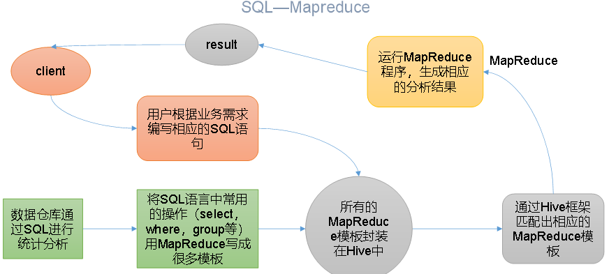
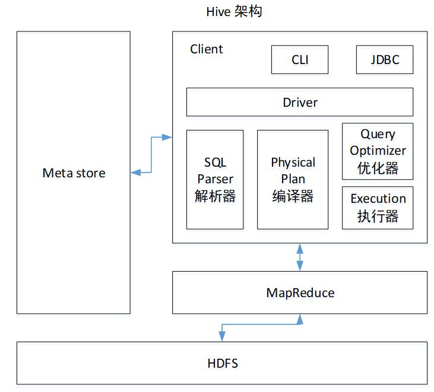
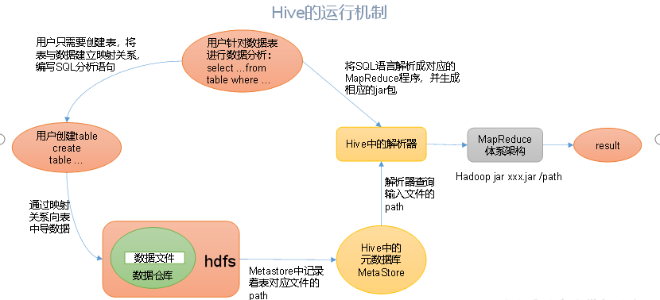
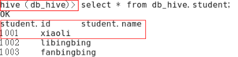

Hive基本概念

###### 什么是Hive

> Hive是基于hadoop的一个数据仓库工具，可以将结构化数据映射成一张表，并提供类sql查询功能

> 本质：将HQL转换成MapReduce程序



1. Hive处理的数据存储在HDFS
2. Hive分析数据底层的实现是MapReduce
3. 执行程序运行在yarn上

##### Hive优缺点

###### 优点：

- 操作接口采用类SQL语法，简单，易上手， 避免了去写MapReduce，减少开发人员的学习成本
- Hive调度执行延迟较高，因此Hive常用于数据分析，对实时性要求不高的场合
- Hive支持用户自定义函数，用户可以根据自己的需求来实现自己的函数

###### 缺点：

- Hive的HQL表达能力优先
- Hive的效率比较低

##### Hive架构原理

1. 用户接口：client

> Cli, JDBC 方式访问hive

2. 元数据Metastore

> 元数据包括：表名，表所属的数据库，表的拥有者，列/分区字段，表的类型(外部表) , 表的数据所在目录
>
> 默认存储在自带的derby数据库中，推荐使用MySQL存储Metastore

3. Hadoop

> 使用HDFS进行存储，使用MapReduce进行计算

4. 驱动器Driver

> 解析器： 将sql字符串转换成抽象语法树AST(是源代码的抽象语法结构的树状表示)，一般使用第三方工具库完成
>
> 编译器：将AST编译生成逻辑执行计划
>
> 优化器： 对逻辑执行计划进行优化
>
> 执行器： 将逻辑执行计划转换成可执行的物理计划，就是MR/SPARK



###### Hive(数据仓库)和数据库的比较

- 查询语言

  由于SQL被广泛的应用在数据仓库中，熟悉SQL开发的开发者可以很方便的使用Hive进行开发

- 数据存储位置

  Hive是建立在Hadoop之上的，Hive的数据都是存储在HDFS中，数据库可以将数据保存在本地文件系统中国

- 数据更新

  数据仓库的内容是读多写少，因此，Hive中不建议对数据的改写，所有的数据都是在加载的时候确定好的

  数据库中的数据通常需要进行修改，增删改查操作比较多.

- 执行

  Hive中大多数就查询通过转换成Hadoop的mapreduce来进行，数据库通常由自己的执行引擎

- 执行延迟

  Hive查询数据时，延迟较高，1.没有索引机制 2. MapReduce框架计算本身延迟较高

  Mysql查询延迟较小

- 可扩展性

  Hive是建立在Hadoop上的，因此可扩展性大

  数据库mysql由于acid语义的限制，扩展性有限

- 数据规模
  支持很大规模的数据

  mysql数据库可支持的数据规模较小

##### Hive安装

###### Hive安装部署及配置

1. 上传并解压hive安装包

   ```shell
   tar -zxvf apache-hive-1.2.1-bin.tar.gz -C /opt/module/
   //将压缩文件名称修改为hive(根据个人喜好)
   mv apache-hive-1.2.1-bin/ hive
   ```

2. 修改hive.env.sh.template修改为hive.env.sh

   ```
   mv hive-env.sh.template hive-env.sh
   ```

3. 配置hive-env.sh文件

   ```
   //配置HADOOP_HOME路径
   export HADOOP_HOME=/opt/module/hadoop-2.7.2
   //配置HIVE_CONF_DIR路径
   export HIVE_CONF_DIR=/opt/module/hive/conf
   ```

###### Hadoop集群配置

1. 必须启动hdfs和yarn

   ```shell
   start-dfs.sh
   start-yarn.sh
   ```

2. Hive基本操作

   ```
   启动hive: bin/hive
   查看数据库：show databases;
   打开默认数据库： use default;
   显示default数据库中的表： show tables;
   创建一张表: create table student(id int, name string);
   显示数据库中所有表： show tables;
   查看表结构： desc tables(表名)
   向表中插入数据： insert into student values(1000,"xxx")
   查询表中数据(select * from student)
   退出hive: quit
   ```

##### derby替换MySql

###### Mysql安装:(derby不能并发访问)

```shell
1. 查看是否安装原有mysql:
rpm -qa | grep mysql
2. 卸载
 rpm -e --nodeps mysql-libs-5.1.73-7.el6.x86_64
3.解压mysql安装包：
	unzip mysql-libs.zip
4.安装mysql服务端：(进入解压文件后)
	rpm -ivh MySQL-server-5.6.24-1.el6.x86_64.rpm
	查看产生的随机密码: cat /root/.mysql_secret
	查看mysql状态： service mysql status
	启动mysql:service mysql start
5. 安装MySQL客户端
	rpm -ivh  MySQL-client-5.6.24-1.el6.x86_64.rpm
	mysql -uroot -pXXX(刚才查看随机产生的密码)
	修改密码: SET PASSWORD=PASSWORD('重新设置的密码')
	退出mysql: exit
6. Mysql中user表中主机配置
	配置只要是root用户+密码，在任何主机上都能登录mysql数据库
	1. 进入mysql: mysql -uroot -pXXX
	2. 显示数据库: show databases;
	3. 使用mysql数据库： use mysql; 
	4.显示mysql数据库中所有表： show tables;
	5.展示user表的结构： desc user
	6.select User,Host,Password from user;
	7.修改User表，把Host表内容修改为%
		update user set host='%' where host='localhost';
	8.删除root用户的其他host
		delete from user where host !='%'
	9.刷新 flush privileges;
	10. 退出quit
```

###### Hive元数据配置到Mysql中

```xml
1. 驱动拷贝：tar -zxvf mysql-connector-java-5.1.27.tar.gz
#将驱动拷贝到hive/lib中
2. cp mysql-connector-java-5.1.27-bin.jar /opt/module/hive/lib/
3. 配置Metastore到Mysql
	1.在/opt/module/hive/conf目录下创建一个hive-site.xml: touch hive-site.xml
	2. 根据官方文档配置参数，拷贝数据到hive-site.xml
	<?xml version="1.0"?>
<?xml-stylesheet type="text/xsl" href="configuration.xsl"?>
<configuration>
	<property>
	  <name>javax.jdo.option.ConnectionURL</name>
	  <value>jdbc:mysql://hadoop102:3306/metastore?createDatabaseIfNotExist=true</value>
	  <description>JDBC connect string for a JDBC metastore</description>
	</property>

	<property>
	  <name>javax.jdo.option.ConnectionDriverName</name>
	  <value>com.mysql.jdbc.Driver</value>
	  <description>Driver class name for a JDBC metastore</description>
	</property>

	<property>
	  <name>javax.jdo.option.ConnectionUserName</name>
	  <value>root</value>
	  <description>username to use against metastore database</description>
	</property>

	<property>
	  <name>javax.jdo.option.ConnectionPassword</name>
	  <value>000000</value>
	  <description>password to use against metastore database</description>
	</property>
</configuration>
```


###### HiveJDBC访问

```shell
1. 启动hiveserver2服务 : bin/hiveserver2
2. 另一个窗口启动beeline : bin/beeline
3. 连接hiveserver2: 
	!connect jdbc:hive2://hadoop201:10000(回车)
	输入hiveserver2 登录的用户: wangyg(回车)
	回车
4. 登录成功后可以各种操作
```

###### Hive常用交互命令

```shell
bin/hive-help
 -e : 执行sql语句
 	hive -e "select id from student;"
 -f : 执行sql脚本
 	hive -f /XXX/hive.sql
```

```
cli:
	dfs: 访问hdfs
	！ ： 访问本地文件系统
jdbc:
	!sh :  !sh ls 访问linux本地文件系统
	!sh hadoop fs -ls /
```


#### Hive常见属性配置

##### **Hive数据仓库位置配置**

​	1. Default数据仓库的最原始位置是在hdfs上的：/user/hive/warehouse路径下。

​	2. 在仓库目录下，没有对默认的数据库default创建文件夹。如果某张表属于default数据库，直接在数据仓库目录下创建一个文件夹。

​	3. 修改default数据仓库原始位置（将hive-default.xml.template如下配置信息拷贝到hive-site.xml文件中）。

```xml
<property>
<name>hive.metastore.warehouse.dir</name> //warehouse目录
<value>/user/hive/warehouse</value>
<description>location of default database for the warehouse</description>
</property>
```

配置同组用户有执行权限

```shell
bin/hdfs dfs -chmod g+w /user/hive/warehouse
```

##### **查询后信息显示配置**

1）在hive-site.xml文件中添加如下配置信息，就可以实现显示当前数据库，以及查询表的头信息配置。

```xml
<property>
	<name>hive.cli.print.header</name>
	<value>true</value>
</property>

<property>
	<name>hive.cli.print.current.db</name>
	<value>true</value>
</property>
```

​	2）重新启动hive(可在查询显示时显示数据库和表头信息)

 

### **Hive运行日志信息配置**

1．Hive的log默认存放在/tmp/atguigu/hive.log目录下（当前用户名下）

2．修改hive的log存放日志到/opt/module/hive/logs

```
#修改/opt/module/hive/conf/hive-log4j.properties.template文件名称为hive-log4j.properties
mv hive-log4j.properties.template hive-log4j.properties
#在hive-log4j.properties文件中修改log存放位置
hive.log.dir=/opt/module/hive/logs
```

​	

##### **参数配置方式**

```
三种方式：
第一种：配置文件hive-default.xml
第二种：启动时：bin/hive --hiveconf mapred.reduce.tasks=10;//仅对本地会话有效
第三种：hive启动后：set mapred.reduce.tasks=10;//仅对本次会话有效
```

 	上述三种设定方式的优先级依次递增。即配置文件<命令行参数<参数声明。注意某些系统级的参数，

#### **Hive数据类型**

##### **基本数据类型**

| Hive数据类型 | Java数据类型 | 长度                                                 | 例子                                 |
| ------------ | ------------ | ---------------------------------------------------- | ------------------------------------ |
| TINYINT      | byte         | 1byte有符号整数                                      | 20                                   |
| SMALINT      | short        | 2byte有符号整数                                      | 20                                   |
| INT          | int          | 4byte有符号整数                                      | 20                                   |
| BIGINT       | long         | 8byte有符号整数                                      | 20                                   |
| BOOLEAN      | boolean      | 布尔类型，true或者false                              | TRUE  FALSE                          |
| FLOAT        | float        | 单精度浮点数                                         | 3.14159                              |
| DOUBLE       | double       | 双精度浮点数                                         | 3.14159                              |
| STRING       | string       | 字符系列。可以指定字符集。可以使用单引号或者双引号。 | ‘now is the time’ “for all good men” |
| TIMESTAMP    |              | 时间类型                                             |                                      |
| BINARY       |              | 字节数组                                             |                                      |

对于Hive的String类型相当于数据库的varchar类型，该类型是一个可变的字符串，不过它不能声明其中最多能存储多少个字符，理论上它可以存储2GB的字符数。

#### **集合数据类型**

| 数据类型 | 描述                                                         | 语法示例                                       |
| -------- | ------------------------------------------------------------ | ---------------------------------------------- |
| STRUCT   | 和c语言中的struct类似，都可以通过“点”符号访问元素内容。ex: STRUCT{first STRING, last STRING},那么第1个元素可以通过字段.first来引用。 | struct()例如struct<street:string, city:string> |
| MAP      | MAP是一组键-值对元组集合，使用数组表示法可以访问数据。例如，如果某个列的数据类型是MAP，其中键->值对是’first’->’John’和’last’->’Doe’，那么可以通过字段名[last]获取最后一个元素 | map()例如map<string, int>                      |
| ARRAY    | 数组是一组具有相同类型和名称的变量的集合。这些变量称为数组的元素，每个数组元素都有一个编号，编号从零开始。例如，数组值为[‘John’, ‘Doe’]，那么第2个元素可以通过数组名[1]进行引用。 | Array()例如array<string>                       |

​	Hive有三种复杂数据类型ARRAY、MAP 和 STRUCT。ARRAY和MAP与Java中的Array和Map类似，而STRUCT与C语言中的Struct类似，它封装了一个命名字段集合，复杂数据类型允许任意层次的嵌套。

hive (default)> select friends[1],children['xiao song'],address.city from testwhere name="songsong";OK_c0     _c1     citylili    18      beijingTime taken: 0.076 seconds, Fetched: 1 row(s)

#### 类型转化

​	Hive的原子数据类型是可以进行隐式转换的，类似于Java的类型转换，例如某表达式使用INT类型，TINYINT会自动转换为INT类型，但是Hive不会进行反向转化，例如，某表达式使用TINYINT类型，INT不会自动转换为TINYINT类型，它会返回错误，除非使用CAST操作。

1．隐式类型转换规则如下

```
1.任何整数类型都可以隐式地转换为一个范围更广的类型，如TINYINT可以转换成INT，INT可以转换成BIGINT。
2. 所有整数类型、FLOAT和STRING类型都可以隐式地转换成DOUBLE。//string可以转，前提是可以解析成功
3. TINYINT、SMALLINT、INT都可以转换为FLOAT。
BOOLEAN类型不可以转换为任何其它的类型。
```

2．可以使用CAST操作显示进行数据类型转换

```
CAST('1' AS INT)将把字符串'1' 转换成整数1；如果强制类型转换失败，如执行CAST('X' AS INT)，表达式返回空值 NULL。//a1 不能解析成数字
select '1'+2, cast('1'as int) + 2;
```


#### DDL数据定义

##### 创建数据库

```
CREATE DATABASE [IF NOT EXISTS] database_name
[COMMENT database_comment] //创建描述信息
[LOCATION hdfs_path]//指定存储位置
[WITH DBPROPERTIES (property_name=property_value, ...)]; //数据库属性
```

1. 创建一个数据库，数据库在HDFS上的默认存储路径是/user/hive/warehouse/*.db。

```
hive (default)> create database db_hive;
```

2. 避免要创建的数据库已经存在错误，增加if not exists判断。（标准写法）

   ```
   create database if not exists db_hive;
   ```

3. 创建一个数据库，指定数据库在HDFS上存放的位置 //不能指定为根目录，删除时全删

   ```
   create database db_hive2 location '/db_hive2.db';
   ```

### 查询数据库

##### 显示数据库

1．显示数据库

```
show databases;
```

2．过滤显示查询的数据库

```
show databases like 'db_hive*';
```

##### 查看数据库详情

1. 显示数据库信息

```
desc database db_hive;
```

2. 显示数据库详细信息，extended

```
desc database extended db_hive;
```

3. 切换当前数据库

```
use db_hive;
```


#### 修改数据库

​	用户可以使用**ALTER DATABASE**命令为某个数据库的DBPROPERTIES设置键-值对属性值，来描述这个数据库的属性信息。**数据库的其他元数据信息都是不可更改的，包括数据库名和数据库所在的目录位置**

```
alter database db_hive set dbproperties('createtime'='20170830');
在hive中查看修改结果:
desc database extended db_hive;
```


#### 删除数据库

1．删除空数据库

```
drop database db_hive2;
```

2．如果删除的数据库不存在，最好采用 if exists判断数据库是否存在

```
drop database if exists db_hive2;
```

3．如果数据库不为空，可以采用cascade命令，强制删除

```
drop database db_hive cascade;
```

#### 创建表

1. 建表语法

```
CREATE [EXTERNAL] TABLE [IF NOT EXISTS] table_name 
[(col_name data_type [COMMENT col_comment], ...)] 
[COMMENT table_comment] 
[PARTITIONED BY (col_name data_type [COMMENT col_comment], ...)] 
[CLUSTERED BY (col_name, col_name, ...)  //分桶表
[SORTED BY (col_name [ASC|DESC], ...)] INTO num_buckets BUCKETS] 
[ROW FORMAT row_format] //行格式化
[STORED AS file_format] 
[LOCATION hdfs_path]
[TBLPROPERTIES (property_name=property_value, ...)]
[AS select_statement]
```

external:外部表partitioned by :分区表

2. 字段解释说明 

```
（1）CREATE TABLE 创建一个指定名字的表。如果相同名字的表已经存在，则抛出异常；用户可以用 IF NOT EXISTS 选项来忽略这个异常。
（2）EXTERNAL关键字可以让用户创建一个外部表，在建表的同时可以指定一个指向实际数据的路径（LOCATION），在删除表的时候，内部表的元数据和数据会被一起删除，而外部表只删除元数据，不删除数据。
（3）COMMENT：为表和列添加注释。
（4）PARTITIONED BY 创建分区表
（5）CLUSTERED BY创建分桶表
（6）SORTED BY不常用，对桶中的一个或多个列另外排序
（7）ROW FORMAT 
	DELIMITED [FIELDS TERMINATED BY char] [COLLECTION ITEMS TERMINATED BY char] [MAP KEYS TERMINATED BY char] [LINES TERMINATED BY char]| SERDE serde_name [WITH SERDEPROPERTIES (property_name=property_value, property_name=property_value, ...)] //serde：序列化，反序列化
	用户在建表的时候可以自定义SerDe(序列化)或者使用自带的SerDe。如果没有指定ROW FORMAT 或者ROW FORMAT DELIMITED，将会使用自带的SerDe。在建表的时候，用户还需要为表指定列，用户在指定表的列的同时也会指定自定义的SerDe，Hive通过SerDe确定表的具体的列的数据。
SerDe是Serialize/Deserilize的简称， hive使用Serde进行行对象的序列与反序列化。
（8）STORED AS指定存储文件类型
常用的存储文件类型：SEQUENCEFILE（二进制序列文件）、TEXTFILE（文本）、RCFILE（列式存储格式文件）
如果文件数据是纯文本，可以使用STORED AS TEXTFILE。如果数据需要压缩，使用 STORED AS SEQUENCEFILE。
（9）LOCATION ：指定表在HDFS上的存储位置。
（10）AS：后跟查询语句，根据查询结果创建表。
（11）LIKE允许用户复制现有的表结构，但是不复制数据。
```


### 管理表

1．理论

​	默认创建的表都是管理表，有时称为内部表。因为这种表，Hive会（或多或少地）控制着数据的生命周期。Hive默认情况下会将这些表的数据存储在由配置项hive.metastore.warehouse.dir(例如，/user/hive/warehouse)所定义的目录的子目录下。	

当我们删除一个管理表时，Hive也会删除这个表中数据。管理表不适合和其他工具共享数据。

2．案例实操

1. 普通创建表

```
create table if not exists student2(
id int, name string
)
row format delimited fields terminated by '\t'
stored as textfile
location '/user/hive/warehouse/student2';
```

2. 根据查询结果创建表

```
create table if not exists student3 as select id, name from student;
```

3. 根据已经存在的表结构创建表

```
create table if not exists student4 like student;
```

4. 查询表的类型

```
desc formatted student2; 
```


### 外部表

1. 理论 

​	因为表是外部表，所以Hive并非认为其完全拥有这份数据。**删除该表并不会删除掉这份数据，不过描述表的元数据信息会被删除掉**

2. 管理表和外部表的使用场景

​	每天将收集到的网站日志定期流入HDFS文本文件。在外部表（原始日志表）的基础上做大量的统计分析，用到的中间表、结果表使用内部表存储，数据通过SELECT+INSERT进入内部表。

3. 案例实操

分别创建部门和员工外部表，并向表中导入数据。

- 上传数据到HDFS

```
hive (default)> dfs -mkdir /student;
hive (default)> dfs -put /opt/module/datas/student.txt /student;
```

- 建表语句
  创建外部表

```
hive (default)>  create external table stu_external(
id int, 
name string) 
row format delimited fields terminated by '\t' 
location '/student';
```

​	查看创建的表

```
select * from stu_external;
```

​	查看表格式化数据

```
hive (default)> desc formatted dept;
```

​	删除外部表

```
hive (default)> drop table stu_external;
```

外部表删除后，hdfs中的数据还在，但是metadata中stu_external的元数据已被删除

### 管理表与外部表的互相转换

（1）查询表的类型

```
hive (default)> desc formatted student2;
```

（2）修改内部表 转为外部表

```
alter table student2 set tblproperties('EXTERNAL'='TRUE');
```

（3）查询表的类型

```
hive (default)> desc formatted student2;
```

（4）修改外部表student2为内部表

```
alter table student2 set tblproperties('EXTERNAL'='FALSE');
```

（5）查询表的类型

```
hive (default)> desc formatted student2;
```

注意：('EXTERNAL'='TRUE')和('EXTERNAL'='FALSE')为固定写法，区分大小写！

####  分区表

​	分区表实际上就是对应一个HDFS文件系统上的独立的文件夹，该文件夹下是该分区所有的数据文件。**Hive中的分区就是分目录**，把一个大的数据集根据业务需要分割成小的数据集。在查询时通过WHERE子句中的表达式选择查询所需要的指定的分区，这样的**查询效率会提高很多**

### 分区表基本操作

1. 引入分区表（需要根据日期对日志进行管理）

```
/user/hive/warehouse/log_partition/20170702/20170702.log
/user/hive/warehouse/log_partition/20170703/20170703.log
/user/hive/warehouse/log_partition/20170704/20170704.log
```

2. 创建分区表语法

```
hive (default)> create table dept_partition(
deptno int, dname string, loc string
)
partitioned by (month string)
row format delimited fields terminated by '\t';
```

​	注意：分区字段不能是表中已经存在的数据，可以将分区字段看作表的伪列。

3. 加载数据到分区表中  //分区相当于一层文件夹

```
hive (default)> load data local inpath '/opt/module/datas/dept.txt' into table default.dept_partition partition(month='201709');
hive (default)> load data local inpath '/opt/module/datas/dept.txt' into table default.dept_partition partition(month='201708');
hive (default)> load data local inpath '/opt/module/datas/dept.txt' into table default.dept_partition partition(month='201707’);
```

注意：分区表加载数据时，必须指定分区

4. 查询分区表中数据

- 单分区查询

```
hive (default)> select * from dept_partition where month='201709';
```

- 多分区联合查询//使用 union

```
select * from dept_partition where month='201709'
              union
              select * from dept_partition where month='201708'
              union
              select * from dept_partition where month='201707';
```

5．增加分区

​	创建单个分区

```
hive (default)> alter table dept_partition add partition(month='201706') ;
```

​	同时创建多个分区  //无逗号

```
hive (default)> alter table dept_partition add partition(month='201705') partition(month='201704');
```

6．删除分区

​	删除单个分区 

```
hive (default)> alter table dept_partition drop partition (month='201704');
```

同时删除多个分区 //有逗号，

```
hive (default)> alter table dept_partition drop partition (month='201705'), partition (month='201706');
```

7．查看分区表有多少分区

```
hive> show partitions dept_partition;
```

8．查看分区表结构

```
hive> desc formatted dept_partition;
```


### 分区表注意事项

1. 创建二级分区表

```
hive (default)> create table dept_partition2(
               deptno int, dname string, loc string
               )
               partitioned by (month string, day string)
               row format delimited fields terminated by '\t';
```

2. 正常的加载数据

- 加载数据到二级分区表中

```
hive (default)> load data local inpath '/opt/module/datas/dept.txt' into table
 default.dept_partition2 partition(month='201709', day='13');
```

（2）查询分区数据

```
hive (default)> select * from dept_partition2 where month='201709' and day='13';
```

3．把数据直接上传到分区目录上，让分区表和数据产生关联的三种方式

（1）方式一：上传数据后修复

​	

```
//上传数据
hive (default)> dfs -mkdir -p
/user/hive/warehouse/dept_partition2/month=201709/day=12;

hive (default)> dfs -put /opt/module/datas/dept.txt  /user/hive/warehouse/dept_partition2/month=201709/day=12;

//执行修复命令：
hive> msck repair table dept_partition2;

再次查询数据
hive (default)> select * from dept_partition2 where month='201709' and day='12';
```

（2）方式二：上传数据后添加分区

​	上传数据

```
hive (default)> dfs -mkdir -p
/user/hive/warehouse/dept_partition2/month=201709/day=11;

hive (default)> dfs -put /opt/module/datas/dept.txt  /user/hive/warehouse/dept_partition2/month=201709/day=11;

//执行添加分区
hive (default)> alter table dept_partition2 add partition(month='201709', day='11');
//查询数据
hive (default)> select * from dept_partition2 where month='201709' and day='11';
```

（3）方式三：创建文件夹后load数据到分区

```shell
//创建目录
hive (default)> dfs -mkdir -p
 /user/hive/warehouse/dept_partition2/month=201709/day=10;

//上传数据
hive (default)> load data local inpath '/opt/module/datas/dept.txt' into table dept_partition2 partition(month='201709',day='10');
//查询数据
hive (default)> select * from dept_partition2 where month='201709' and day='10';
```


## **修改表**

##### 重命名表

1. 语法

```
ALTER TABLE table_name RENAME TO new_table_name
```

2. 实操案例

```
hive (default)> alter table dept_partition2 rename to dept_partition3;
```

#### 增加/修改/替换列信息

1. 更新列语法

```
ALTER TABLE table_name CHANGE [COLUMN] col_old_name col_new_name column_type [COMMENT col_comment] [FIRST|AFTER column_name]
```

2. 增加和替换列

```
ALTER TABLE table_name ADD|REPLACE COLUMNS (col_name data_type [COMMENT col_comment], ...) 
```

​	注：ADD是代表新增一字段，字段位置在所有列后面(partition列前)，REPLACE则是表示替换表中所有字段。

###### 2．实操案例

（1）查询表结构

```
hive> desc dept_partition;
```

（2）添加列

```
hive (default)> alter table dept_partition add columns(deptdesc string);
```

（3）查询表结构

```
hive> desc dept_partition;
```

（4）更新列

```
hive (default)> alter table dept_partition change column deptdesc desc int;
```

（5）查询表结构

```
hive> desc dept_partition;
```

（6）替换列

```
hive (default)> alter table dept_partition replace columns(deptno string, dname string, loc string);
```

（7）查询表结构

```
hive> desc dept_partition;
```

##### 删除表

```
hive (default)> drop table dept_partition;
```

## DML数据操作

### 数据导入

#### 向表中装载数据(Load)

```
语法：
load data [local] inpath '/opt/module/datas/student.txt' [overwrite] into table student [partition (partcol1=val1,…)];
```

（1）load data:表示加载数据

（2）local:表示从本地加载数据到hive表；否则从HDFS加载数据到hive表

（3）inpath:表示加载数据的路径

（4）overwrite:表示覆盖表中已有数据，否则表示追加

（5）into table:表示加载到哪张表

（6）student:表示具体的表

（7）partition:表示上传到指定分区

2．实操案例

（0）创建一张表

```
hive (default)> create table student(id string, name string) row format delimited fields terminated by '\t';
```

（1）加载本地文件到hive

```
hive (default)> load data local inpath '/opt/module/datas/student.txt' into table default.student;
```

（2）加载HDFS文件到hive中

​	上传文件到HDFS

```
hive (default)> dfs -put /opt/module/datas/student.txt /user/atguigu/hive;
```

加载HDFS上数据

```
hive (default)> load data inpath '/user/atguigu/hive/student.txt' into table default.student;
```

（3）加载数据覆盖表中已有的数据

上传文件到HDFS

```
hive (default)> dfs -put /opt/module/datas/student.txt /user/atguigu/hive;
```

加载数据覆盖表中已有的数据

```
hive (default)> load data inpath '/user/atguigu/hive/student.txt' overwrite into table default.student;
```


##### **通过查询语句向表中插入数据（Insert）**

1．创建一张分区表

hive (default)> create table student(id int, name string) partitioned by (month string) row format delimited fields terminated by '\t';

2．基本插入数据

hive (default)> insert into table  student partition(month='201709') values(1,'wangwu'),(2,’zhaoliu’);

3．基本模式插入（根据单张表查询结果）

hive (default)> insert overwrite table student partition(month='201708')

​             select id, name from student where month='201709';

insert into：以追加数据的方式插入到表或分区，原有数据不会删除

insert overwrite：会覆盖表或分区中已存在的数据

注意：insert不支持插入部分字段

4．多表（多分区）插入模式（根据多张表查询结果）

hive (default)> from student

​              insert overwrite table student partition(month='201707')

​              select id, name where month='201709'

​              insert overwrite table student partition(month='201706')

​              select id, name where month='201709';

### **查询语句中创建表并加载数据（As Select）**

详见4.5.1章创建表。

根据查询结果创建表（查询的结果会添加到新创建的表中）

create table if not exists student3

as select id, name from student;

### **创建表时通过Location指定加载数据路径**

1．上传数据到hdfs上

hive (default)> dfs -mkdir /student;

hive (default)> dfs -put /opt/module/datas/student.txt /student;

2.	创建表，并指定在hdfs上的位置

hive (default)> create external table if not exists student5(

​              id int, name string

​              )

​              row format delimited fields terminated by '\t'

​              location '/student;

3．查询数据

hive (default)> select * from student5;

### **Import数据到指定Hive表中**

注意：先用export导出后，再将数据导入。//路径只能是hdfs上的路径

hive (default)> import table student2 partition(month='201709') from

 '/user/hive/warehouse/export/student';

## **数据导出**

#### **Insert导出**

1．将查询的结果导出到本地 //导出时只能是overwrite

hive (default)> insert overwrite local directory '/opt/module/datas/export/student'

​            select * from student;

2．将查询的结果格式化导出到本地

hive(default)>insert overwrite local directory '/opt/module/datas/export/student1'

​           ROW FORMAT DELIMITED FIELDS TERMINATED BY '\t'             select * from student;

3．将查询的结果导出到HDFS上(没有local)

hive (default)> insert overwrite directory '/user/atguigu/student2'

​             ROW FORMAT DELIMITED FIELDS TERMINATED BY '\t' 

​             select * from student;

### **Hadoop命令导出到本地**

hive (default)> dfs -get /user/hive/warehouse/student/month=201709/000000_0

/opt/module/datas/export/student3.txt;

### **Hive Shell 命令导出**

基本语法：（hive -f/-e 执行语句或者脚本 > file）

[atguigu@hadoop102 hive]$ bin/hive -e 'select * from default.student;' >

 /opt/module/datas/export/student4.txt;

### **Export导出到HDFS上**

(defahiveult)> export table default.student to

 '/user/hive/warehouse/export/student';

export和import主要用于两个Hadoop平台集群之间Hive表迁移。//里面还有metadata

### **Sqoop导出**

后续课程专门讲。

## **清除表中数据（Truncate）**

注意：Truncate只能删除管理表，不能删除外部表中数据//只能删除管理表，不能删除外部表数据 

hive (default)> truncate table student;

## 查询

<https://cwiki.apache.org/confluence/display/Hive/LanguageManual+Select>

查询语句语法：

[WITH CommonTableExpression (, CommonTableExpression)*]    (Note: Only available starting with Hive 0.13.0)SELECT [ALL | DISTINCT] select_expr, select_expr, ...  FROM table_reference  [WHERE where_condition]  [GROUP BY col_list]  [ORDER BY col_list]  [CLUSTER BY col_list    | [DISTRIBUTE BY col_list] [SORT BY col_list]  ] [LIMIT number]

#### **基本查询（Select…From）**

##### **全表和特定列查询**

创建部门表

create table if not exists dept(deptno int,dname string,loc int)row format delimited fields terminated by '\t';

​		创建员工表

create table if not exists emp(empno int,ename string,job string,mgr int,hiredate string, sal double, comm double,deptno int)row format delimited fields terminated by '\t';

​		导入数据

hive (default)> load data local inpath '/opt/module/datas/dept.txt' into table

dept;

hive (default)> load data local inpath '/opt/module/datas/emp.txt' into table emp;

1．全表查询

hive (default)> select * from emp;

2．选择特定列查询

hive (default)> select empno, ename from emp;

注意：

（1）SQL 语言大小写不敏感。 

（2）SQL 可以写在一行或者多行

（3）关键字不能被缩写也不能分行

（4）各子句一般要分行写。

（5）使用缩进提高语句的可读性。

##### **列别名**

1．重命名一个列

2．便于计算

3．紧跟列名，也可以在列名和别名之间加入关键字‘AS’ 

4．案例实操

查询名称和部门

hive (default)> select ename AS name, deptno dn from emp;

##### **算术运算符**

| 运算符 | 描述           |
| ------ | -------------- |
| A+B    | A和B 相加      |
| A-B    | A减去B         |
| A*B    | A和B 相乘      |
| A/B    | A除以B         |
| A%B    | A对B取余       |
| A&B    | A和B按位取与   |
| A\|B   | A和B按位取或   |
| A^B    | A和B按位取异或 |
| ~A     | A按位取反      |

案例实操

​	  查询出所有员工的薪水后加1显示。

hive (default)> select sal +1 from emp;

##### **常用函数**

1．求总行数（count）

hive (default)> select count(*) cnt from emp;

2．求工资的最大值（max）

hive (default)> select max(sal) max_sal from emp;

3．求工资的最小值（min）

hive (default)> select min(sal) min_sal from emp;

4．求工资的总和（sum）

hive (default)> select sum(sal) sum_sal from emp; 

5．求工资的平均值（avg）

hive (default)> select avg(sal) avg_sal from emp;

##### **Limit语句**

典型的查询会返回多行数据。LIMIT子句用于限制返回的行数。

hive (default)> select * from emp limit 5;

#### **Where语句**

1．使用WHERE子句，将不满足条件的行过滤掉

2．WHERE子句紧随FROM子句

3．案例实操

查询出薪水大于1000的所有员工

hive (default)> select * from emp where sal >1000;

注意：where子句中不能使用字段别名。//执行顺序先执行where ，所以不知道是哪个？

##### **比较运算符（Between/In/ Is Null）**

1）下面表中描述了谓词操作符，这些操作符同样可以用于JOIN…ON和HAVING语句中。

| 操作符                  | 支持的数据类型 | 描述                                                         |
| ----------------------- | -------------- | ------------------------------------------------------------ |
| A=B                     | 基本数据类型   | 如果A等于B则返回TRUE，反之返回FALSE                          |
| A<=>B //安全等于        | 基本数据类型   | 如果A和B都为NULL，则返回TRUE，其他的和等号（=）操作符的结果一致，如果任一为NULL则结果为NULL |
| A<>B, A!=B              | 基本数据类型   | A或者B为NULL则返回NULL；如果A不等于B，则返回TRUE，反之返回FALSE |
| A<B                     | 基本数据类型   | A或者B为NULL，则返回NULL；如果A小于B，则返回TRUE，反之返回FALSE |
| A<=B                    | 基本数据类型   | A或者B为NULL，则返回NULL；如果A小于等于B，则返回TRUE，反之返回FALSE |
| A>B                     | 基本数据类型   | A或者B为NULL，则返回NULL；如果A大于B，则返回TRUE，反之返回FALSE |
| A>=B                    | 基本数据类型   | A或者B为NULL，则返回NULL；如果A大于等于B，则返回TRUE，反之返回FALSE |
| A [NOT] BETWEEN B AND C | 基本数据类型   | 如果A，B或者C任一为NULL，则结果为NULL。如果A的值大于等于B而且小于或等于C，则结果为TRUE，反之为FALSE。如果使用NOT关键字则可达到相反的效果。 |
| A IS NULL               | 所有数据类型   | 如果A等于NULL，则返回TRUE，反之返回FALSE                     |
| A IS NOT NULL           | 所有数据类型   | 如果A不等于NULL，则返回TRUE，反之返回FALSE                   |
| IN(数值1, 数值2)        | 所有数据类型   | 使用 IN运算显示列表中的值                                    |
| A [NOT] LIKE B          | STRING 类型    | B是一个SQL下的简单正则表达式，也叫通配符模式，如果A与其匹配的话，则返回TRUE；反之返回FALSE。B的表达式说明如下：‘x%’表示A必须以字母‘x’开头，‘%x’表示A必须以字母’x’结尾，而‘%x%’表示A包含有字母’x’,可以位于开头，结尾或者字符串中间。如果使用NOT关键字则可达到相反的效果。 |
| A RLIKE B, A REGEXP B   | STRING 类型    | B是基于java的正则表达式，如果A与其匹配，则返回TRUE；反之返回FALSE。匹配使用的是JDK中的正则表达式接口实现的，因为正则也依据其中的规则。例如，正则表达式必须和整个字符串A相匹配，而不是只需与其字符串匹配。 |

2）案例实操

（1）查询出薪水等于5000的所有员工

hive (default)> select * from emp where sal =5000;

（2）查询工资在500到1000的员工信息

hive (default)> select * from emp where sal between 500 and 1000;

（3）查询comm为空的所有员工信息

hive (default)> select * from emp where comm is null;

（4）查询工资是1500或5000的员工信息

hive (default)> select * from emp where sal IN (1500, 5000);

##### **Like和RLike**

1）使用LIKE运算选择类似的值

2）选择条件可以包含字符或数字:

% 代表零个或多个字符(任意个字符)。

_ 代表一个字符。

3）RLIKE子句是Hive中这个功能的一个扩展，其可以通过Java的正则表达式这个更强大的语言来指定匹配条件。

4）案例实操

​	（1）查找以2开头薪水的员工信息

hive (default)> select * from emp where sal LIKE '2%';

​	（2）查找第二个数值为2的薪水的员工信息

hive (default)> select * from emp where sal LIKE '_2%';

​	（3）查找薪水中含有2的员工信息

hive (default)> select * from emp where sal RLIKE '[2]';

##### **逻辑运算符（And/Or/Not）**

| 操作符 | 含义   |
| ------ | ------ |
| AND    | 逻辑并 |
| OR     | 逻辑或 |
| NOT    | 逻辑否 |

案例实操

​	（1）查询薪水大于1000，部门是30

hive (default)> select * from emp where sal>1000 and deptno=30;

​	（2）查询薪水大于1000，或者部门是30

hive (default)> select * from emp where sal>1000 or deptno=30;

​	（3）查询除了20部门和30部门以外的员工信息

hive (default)> select * from emp where deptno not IN(30, 20);

##### **分组**

##### **Group By语句**

GROUP BY语句通常会和聚合函数一起使用，按照一个或者多个列队结果进行分组，然后对每个组执行聚合操作。

案例实操：

​	（1）计算emp表每个部门的平均工资

hive (default)> select t.deptno, avg(t.sal) avg_sal from emp t group by t.deptno;

​	（2）计算emp每个部门中每个岗位的最高薪水

hive (default)> select t.deptno, t.job, max(t.sal) max_sal from emp t group by

 t.deptno, t.job;

##### **Having语句**

1．having与where不同点

（1）where后面不能写分组函数，而having后面可以使用分组函数。

（2）having只用于group by分组统计语句。

2．案例实操

（1）求每个部门的平均薪水大于2000的部门

求每个部门的平均工资

hive (default)> select deptno, avg(sal) from emp group by deptno;

​	  求每个部门的平均薪水大于2000的部门

hive (default)> select deptno, avg(sal) avg_sal from emp group by deptno having

 avg_sal > 2000;

#### **Join语句**

##### **等值Join**

Hive支持通常的SQL JOIN语句，但是只支持等值连接，不支持非等值连接。

案例实操

（1）根据员工表和部门表中的部门编号相等，查询员工编号、员工名称和部门名称；

hive (default)> select e.empno, e.ename, d.deptno, d.dname from emp e join dept d on e.deptno = d.deptno;

##### **表的别名**

1．好处

（1）使用别名可以简化查询。

（2）使用表名前缀可以提高执行效率。

2．案例实操

合并员工表和部门表

hive (default)> select e.empno, e.ename, d.deptno from emp e join dept d on e.deptno

 = d.deptno;

##### **内连接**

内连接：只有进行连接的两个表中都存在与连接条件相匹配的数据才会被保留下来。

hive (default)> select e.empno, e.ename, d.deptno from emp e join dept d on e.deptno

 = d.deptno;

##### **左外连接**

左外连接：JOIN操作符左边表中符合WHERE子句的所有记录将会被返回。

hive (default)> select e.empno, e.ename, d.deptno from emp e left join dept d on e.deptno = d.deptno;

**右外连接**

右外连接：JOIN操作符右边表中符合WHERE子句的所有记录将会被返回。

hive (default)> select e.empno, e.ename, d.deptno from emp e right join dept d on e.deptno = d.deptno;

##### **满外连接**

​	满外连接：将会返回所有表中符合WHERE语句条件的所有记录。如果任一表的指定字段没有符合条件的值的话，那么就使用NULL值替代。

hive (default)> select e.empno, e.ename, d.deptno from emp e full join dept d on e.deptno

 = d.deptno;

##### **多表连接**

注意：连接 n个表，至少需要n-1个连接条件。例如：连接三个表，至少需要两个连接条件。

数据准备

1．创建位置表

create table if not exists location(loc int,loc_name string)row format delimited fields terminated by '\t';

2．导入数据

hive (default)> load data local inpath '/opt/module/datas/location.txt' into table location;

3．多表连接查询

hive (default)>SELECT e.ename, d.dname, l.loc_name

FROM   emp e 

JOIN   dept d

ON     d.deptno = e.deptno 

JOIN   location l

ON     d.loc = l.loc;

大多数情况下，Hive会对每对JOIN连接对象启动一个MapReduce任务。本例中会首先启动一个MapReduce job对表e和表d进行连接操作，然后会再启动一个MapReduce job将第一个MapReduce job的输出和表l;进行连接操作。

注意：为什么不是表d和表l先进行连接操作呢？这是因为Hive总是按照从左到右的顺序执行的。

优化：当对3个或者更多表进行join连接时，如果每个on子句都使用相同的连接键的话，那么只会产生一个MapReduce job。

笛卡尔积

1．笛卡尔集会在下面条件下产生

（1）省略连接条件

（2）连接条件无效

（3）所有表中的所有行互相连接

2．案例实操

hive (default)> select empno, dname from emp, dept;

##### **连接谓词中不支持or**

hive join目前不支持在on子句中使用谓词or

hive (default)> select e.empno, e.ename, d.deptno from emp e join dept d on e.deptno

= d.deptno or e.ename=d.ename;   错误的

#### 排序

##### 全局排序（Order By）

```
Order by: 全局排序，只有一个reuder
asc : 升序 (默认)
desc: 降序
```

##### 每个MapReduce内部排序(Sort By)

​	sort by 分区内部进行排序

```
分区规则：随机分配
set mapreduce.job.reduces=3;
```

##### 分区排序（Distribute By)

Distribute By：根据distribute by 后面的字段进行分区, 结合sort by使用。 

distribute by的分区规则是根据分区字段的hash码与reduce的个数进行模除后，余数相同的分到一个区。

Hive要求DISTRIBUTE BY语句要写在SORT BY语句之前。

##### Cluster By

当distribute by和sorts by字段相同时，可以使用cluster by方式。

缺点是，只能升序排序，不能降序

#### 分桶及抽样查询

##### 分桶表数据存储

分区时针对数据的存储路径，分桶针对的是数据文件，

创建分桶表时，需要设置一个属性: ==set hive.enforce.bucketing=true;==

```
1. 先创建普通表
create table stu(id int, name string)
row format delimited fields terminated by '\t';
2. 向普通stu表中导入数据
load data local inpath '/opt/module/datas/student.txt' into table stu;
3. 创建分桶表
create table stu_buck(id int, name string)
clustered by (id)
into 4 buckets
row format delimited fields terminated by '\t';
4. insert into table stu_buck select id, name from stu;
```

###### 分桶规则：

Hive分桶规则： 根据分桶字段的值的hashcode 模除桶的个数求余数

##### 分桶抽样查询

使用场景： 大的数据集可进行抽样查询

```shell
select * from stu_buck tablesample(bucket 1 out of 4 on id);
//tablesample, 语法： tablesample(bucket x out of y)
// y 是bucket桶的个数，或因子    x 是 从哪个桶进行抽样
```


#### 其他常用查询函数

#####  **空字段赋值**

功能：为字段为NULL的数据赋值 ， NVL(value, default_value) , 

案例：
select comm, nvl(comm, mgr) from emp;

##### CASE WHEN

```
select 
  dept_id,
  sum(case sex when '男' then 1 else 0 end) male_count,
  sum(case sex when '女' then 1 else 0 end) female_count
from 
  emp_sex
group by
  dept_id;
```

##### 行转列

CONCAT (string a, string b...): 返回字符串拼接

CONCAT_WS(separator, str1, str2,...)： 分隔符和剩余字符进行拼接

COLLECT_SET(col)：只接受基本数据类型，进行去重汇总，产生array类型字段

```
select
    t1.base,
    concat_ws('|', collect_set(t1.name)) name
from
    (select
        name,
        concat(constellation, ",", blood_type) base
    from
        person_info) t1
group by
    t1.base;
```


##### 列转行

###### 爆炸函数

EXPLODE(col) :将array 或map进行拆分成多行,多列

注： select 后面 + 爆炸函数时，只能加一个爆炸函数,不能同时使用多个函数

###### 测写视图

```
LATERVAL VIEW udtf(expression) 表名(不重要) AS  列名(重要)
//案例--将category炸开，然后当成一列进行查询
//爆炸函数和测写视图经常一起使用
 select movie, category_info
 from movie_info
 lateral view explode(category) tmp_val as category_info;
```


#### 窗口函数（开窗函数）

适用场景：当需要查询的数据既要有聚合前的数据，又要有聚合后的数据，就需要开窗函数

###### 语法

1. udaf over() : over 决定聚合范围，默认是整个窗口，聚合函数会被窗口中的每一条调用一次

2. over() 中加partition by 

3. 窗口聚合范围动态变化 : order by :  功能：排序， 影响聚合范围(默认从最开始到当前行)

4.  窗口子句： 动态改变窗口范围：在order by 后面 rows between XX and XX

   1. CURRENT ROW：当前行

      n PRECEDING：往前n行数据

      n FOLLOWING：往后n行数据

      UNBOUNDED PRECEDING  起点

       UNBOUNDED FOLLOWING 终点

5. LAG(col,n,default_val)：往前第n行数据

   LEAD(col,n, default_val)：往后第n行数据

6. NTILE(n)：把有序分区中的行分发到指定数据的组中，各个组有编号，编号从1开始，对于每一行，NTILE返回此行所属的组的编号。注意：n必须为int类型。

7. rows必须在Order by后面


###### 需求一：查询在2017年4月份购买过的顾客及总人数

```
select name ,count(*) over()
from business
where orderdate like '2017-04%'
group by name;
```

###### 查询顾客的购买明细及月购买总额

```
//将当月所有明细显示出来(聚合前)，然后在增加月购买总额(聚合后)--按照月聚合
//前面是购买名字，udaf() over( ) over中加partition by 聚合字段
select name, orderdate, cost, sum(cost) over(partition by month(orderdate)) from business
```

###### 上述的场景, 将每个顾客的cost按照日期进行累加

```
//每次累加范围动态变化
select name, orderdate,cost, sum(cost) over(partition by name order by orderdate)
from business;

+-------+-------------+-------+---------------+--+
| name  |  orderdate  | cost  | sum_window_0  |
+-------+-------------+-------+---------------+--+
| jack  | 2017-01-01  | 10    | 10            |
| jack  | 2017-01-05  | 46    | 56            |
| jack  | 2017-01-08  | 55    | 111           |
| jack  | 2017-02-03  | 23    | 134           |
| jack  | 2017-04-06  | 42    | 176           |
| mart  | 2017-04-08  | 62    | 62            |
| mart  | 2017-04-09  | 68    | 130           |
| mart  | 2017-04-11  | 75    | 205           |
| mart  | 2017-04-13  | 94    | 299           |
| neil  | 2017-05-10  | 12    | 12            |
| neil  | 2017-06-12  | 80    | 92            |
| tony  | 2017-01-02  | 15    | 15            |
| tony  | 2017-01-04  | 29    | 44            |
| tony  | 2017-01-07  | 50    | 94            |
+-------+-------------+-------+---------------+--+

```

###### 查询每个顾客上次的购买时间

```
两个聚合函数：udaf 后面加over()使用
LAG(col,n,default_val)：往前第n行数据
LEAD(col,n, default_val)：往后第n行数据
//code
select name,orderdate, cost, lag(orderdate, 1,'first') over(partition by name order by orderdate)
from business;
```

###### 查询前20%时间的订单信息

```
//前提，必须有序
NTILE(n)：把有序分区中的行分发到指定数据的组中，各个组有编号，编号从1开始，对于每一行，NTILE返回此行所属的组的编号。注意：n必须为int类型。
//通过子查询的方式进行
select name, orderdate, cost
from (select name, orderdate, cost, ntile(5) over(order by orderdate ) num 
from business) t1 where num =1 ;
```

##### Rank

```
rank() : 总数不变，会有重复
dense_rank(): 总数改变，会有重复
row_number(): 不会重复
```


## 函数

##### 系统内置函数

```
查看系统自带函数: show functions;
显示自带的函数用法： desc function uper;
显示详细的自带函数用法：desc function extended uper;
```

##### 自定义函数

可以自定义UDF函数扩展功能

UDF函数分为3类

```
UDF: 一进一出 
UDAF:聚合函数，多进一出
UDTF: 一进多出
```

###### 编程步骤

```
1. 继承org.apache.hadoop.hive.ql.UDF
2. 需要实现evaluate函数，evaluate函数支持重载
3. hive的命令行窗口创建函数
	添加jar: add jar path(linux_jar_path)
	创建function: create [temporary] function [dbname.]function_name AS class_name;
4. hive命令行窗口删除函数
	drop [temporary] function [if exists] [dbname.]function_name
#UDF必须有返回值，可以返回null,不能是void
```


##### 自定义UDF函数

1．创建一个Maven工程Hive

2．导入依赖

```
<dependencies>
		<!-- https://mvnrepository.com/artifact/org.apache.hive/hive-exec -->
		<dependency>
			<groupId>org.apache.hive</groupId>
			<artifactId>hive-exec</artifactId>
			<version>1.2.1</version>
		</dependency>
</dependencies>
```

3．创建一个类

```
package com.atguigu.hive;
import org.apache.hadoop.hive.ql.exec.UDF;
public class Lower extends UDF {
	public String evaluate (final String s) {
		if (s == null) {
			return null;
		}
		return s.toLowerCase();
	}
}
```

4．打成jar包上传到服务器/opt/module/jars/udf.jar

5．将jar包添加到hive的classpath

```
hive (default)> add jar /opt/module/datas/udf.jar;
```

6．创建临时函数与开发好的java class关联

```
hive (default)> create temporary function mylower as "com.atguigu.hive.Lower";
```

7．即可在hql中使用自定义的函数strip 

```
hive (default)> select ename, mylower(ename) lowername from emp;
```


#### **压缩和存储**

hive表的数据存储格式一般选择：orc或parquet。压缩方式一般选择snappy，lzo。

## 企业级调优

##### Fetch抓取

> 定义：Hive中对某些情况的查询可以不必使用MapReduce计算(有些sql语句不用转换成mr程序，就可以得到结果)

```
有三种模式：none,minimal, more
#none:所有都会转化成mapreduce程序
	  0:none : disable hive.fetch.task.conversion
      1. minimal : SELECT STAR, FILTER on partition columns, LIMIT only
      2. more  : SELECT, FILTER, LIMIT only (support TABLESAMPLE and virtual columns
```


##### 本地模式

大部分job需要大型完整集群进行处理，有的时候，处理数据量非常小，可以通过本地模式在单台机器上处理所有的任务，对于小的数据集，执行时间可以明显缩短

> 不需要进行跨网络传输，只适合小数据量

###### 开启本地模式

==set hive.exec.mode.local.auto=true//默认是false==;

```
set hive.exec.mode.local.auto=true//默认是false;
//设置local mr的最大输入数据量，当输入数据量小于这个值时采用local  mr的方式，默认为134217728，即128M
set hive.exec.mode.local.auto.inputbytes.max=50000000;
//设置local mr的最大输入文件个数，当输入文件个数小于这个值时采用local mr的方式，默认为4
set hive.exec.mode.local.auto.input.files.max=10;
```


## 表的优化

### 小表、大表Join

join查询时，将小表放在左边(驱动位置)，大表放在右边，但==新版已经做了优化，位置在左右无区别==


### 大表Join大表

###### 空Key过滤

（空key指的是join连接的key）,查询时异常的key太多，比如为**null**

###### 怎么做：将key为null的数据过滤掉

```hive
//利用子查询的方式，先将为null的过滤，然后进行Join内联查询
insert overwrite table jointable select n.* from (select * from nullidtable where id is not null ) n  left join ori o on n.id = o.id;
```

###### 空key转换

定义： 某个join的key为null,但是数据不是异常数据，必须包含在join的结果中，可以为空key产生一个随机的值，均匀的分布在不同的reducer中，防止出现数据倾斜问题

怎么做：

```hive
1. set mapreduce.job.reduces = 5;
2. insert overwrite table jointable
select n.* from nullidtable n left join ori b on n.id = b.id;
```

消除了数据倾斜，负载均衡reducer的资源消耗 

##### MapJoin(小表join大表)

将小表缓存在内存中，然后进行mapReduce,只有Map阶段，没有reduce，没有shuffle，所以效率会很高

###### 设置：

```
//设置自动选择Mapjoin
set hive.auto.convert.join = true; 默认为true
//大表小表的阈值设置（默认25M一下认为是小表）：
set hive.mapjoin.smalltable.filesize=25000000;
```

原理：将小表的数据转换成一个HashTable的数据结构，并写入到本地文件中，加载到分布式缓存中

##### Group By

在不影响业务的逻辑下，提前在Map端做一些聚合工作，最后在Reduce端得出最终结果

```
1.开启map端聚合参数
set hive.map.aggr = true //默认为true
2. 在Map端进行聚合操作的条目数目
set hive.groupby.mapaggr.checkinterval = 100000
3.有数据倾斜的时候进行负载均衡(默认false)
	set hive.groupby.skewindata=true
	#生成的查询计划会有两个MR job,第一个job先分散到不同reduce端，做一些聚合
```


##### Count(Distinct) 去重统计

​	不论设置reduce任务个数多少个(set mapred.reduce.tasks = 100)，都会启动一个reducer，**一般COUNT DISTINCT使用先GROUP BY再COUNT的方式替换：**

```
优化前：select count(distinct id) from bigtable;
优化后：select count(id) from (select id from bigtable group by id) a;
```


##### **笛卡尔积**

> 尽量避免笛卡尔积，join的时候不加on条件，或者无效的on条件，Hive只能使用1个reducer来完成笛卡尔积。
>

##### 行列过滤

​	列处理：select查询字段中，只写需要的列名，不写*

​	行处理：使用子查询(先进行where过滤，再进行两表查询)

案例实操：

1. 测试先关联两张表，再用where条件过滤

```
hive (default)> select o.id from bigtable b
join ori o on o.id = b.id
where o.id <= 10;
```

​	Time taken: 34.406 seconds, Fetched: 100 row(s)

2. 通过子查询后，再关联表

```
hive (default)> select b.id from bigtable b
join (select id from ori where id <= 10 ) o on b.id = o.id;
```

Time taken: 30.058 seconds, Fetched: 100 row(s)

### 动态分区调整

特点：自动将最后一个字段当做分区字段进行分配

定义：插入数据时，数据库会自动根据分区字段，将数据插入到相应的分区内，hive也有类似的机制，成为动态分区

###### 怎么做: 

- 开启动态分区，默认true开启

```
hive.exec.dynamic.partition=true
```

- 严格模式设置为非严格模式，否则冲突

```
hive.exec.dynamic.partition.mode=nonstrict
```

- 在所有执行MR的节点上，最大一共可以创建多少个动态分区。默认1000

```
hive.exec.max.dynamic.partitions=1000
```

- 在每个执行MR的节点上，最大可以创建多少个动态分区。**该参数需要根据实际的数据来设定**。

```
hive.exec.max.dynamic.partitions.pernode=100
```

- 整个MR Job中，最大可以创建多少个HDFS文件。默认100000

```
hive.exec.max.created.files=100000
```

- 当有空分区生成时，是否抛出异常。一般不需要设置。默认false

```
hive.error.on.empty.partition=false
```

###### 2．案例实操

> 需求：将dept表中的数据按照地区（loc字段），插入到目标表dept_partition的相应分区中。
>

1. 创建目标分区表

```
hive (default)> create table dept_partition(id int, name string) partitionedby (location int) row format delimited fields terminated by '\t';
```

2. 设置动态分区

```
set hive.exec.dynamic.partition.mode = nonstrict;hive (default)> insert into table dept_partition partition(location) select deptno, dname, loc from dept;
//默认按照最后的字段进行分区
```

3. 查看目标分区表的分区情况

```
hive (default)> show partitions dept_partition;
```


### **分桶**

进行抽样查询，减少数量

### **分区**

进行查询效率

##### 合理设置Map及Reduce数

##### 复杂文件增加Map数

​	当map阶段执行很慢时，增加Map数，使map处理的数据量减少，从而提高任务执行效率

```
增加map的方法为：根据computeSliteSize(Math.max(minSize,Math.min(maxSize,blocksize)))
//maxsize默认是long的最大值，minsize 是1
blocksize=128M公式，调整maxSize最大值。让maxSize最大值低于blocksize就可以增加map的个数。
//要想增加map数量，就减小切片大小
```

**案例实操：**

1．执行查询

```
hive (default)> select count(*) from emp;
Hadoop job information for Stage-1: number of mappers: 1; number of reducers: 1
```

2．设置最大切片值为100个字节

```
hive (default)> set mapreduce.input.fileinputformat.split.maxsize=100;
hive (default)> select count(*) from emp;
Hadoop job information for Stage-1: number of mappers: 6; number of reducers: 1
```

 

### **小文件进行合并**

map执行前合并小文件，减少map数

```
使用combineHibeInputFormat具有对小文件进行合并功能

set hive.input.format= org.apache.hadoop.hive.ql.io.CombineHiveInputFormat;
```

Map-Reduce任务结束时合并小文件

```
在map-only任务结束时合并小文件，默认true
SET hive.merge.mapfiles = true;


在map-reduce任务结束时合并小文件，默认false
SET hive.merge.mapredfiles = true;

合并文件的大小，默认256M
SET hive.merge.size.per.task = 268435456;

当输出文件的平均大小小于该值时，启动一个独立的map-reduce任务进行文件merge
SET hive.merge.smallfiles.avgsize = 16777216;
```


##### 合理设置Reduce数

设置reduce个数方式

```
参数1：每个Reduce处理的数据量默认是256MB
hive.exec.reducers.bytes.per.reducer=256000000

参数2：每个任务最大的reduce数，默认为1009
	hive.exec.reducers.max=1009
	
3.计算reducer数的公式
	N=min(参数2，总输入数据量/参数1) //1009 和总大小/reduce处理数据量的较小值
```

2. 调整reduce个数方法二

```
在hadoop的mapred-default.xml文件中修改
#设置每个job的Reduce个数
set mapreduce.job.reduces = 15;
```

3. reduce个数并不是越多越好

```
1.过多的启动和初始化reduce也会消耗时间和资源；
2. 另外，有多少个reduce，就会有多少个输出文件，如果生成了很多个小文件，那么如果这些小文件作为下一个任务的输入，则也会出现小文件过多的问题；
```

​	

##### 并行执行

> 是什么：
>
> 一个job会包含很多阶段，这些阶段可能不是互相依赖，可以并行执行

> 怎么做：设置 hive.exec.parallel值为true
>

```
set hive.exec.parallel=true;              //打开任务并行执行
set hive.exec.parallel.thread.number=16;  //同一个sql允许最大并行度，默认为8。
```

##### 严格模式

是什么：防止可能出现不好的结果

> 防止出现三种场景：
>
> 1. 分区表查询中没有写where分区过滤条件
> 2. orderby 中没有写limit
> 3. 不允许出现笛卡尔积

hive.mapred.mode值为**默认**是非严格模式nonstrict 。

> 怎么用：
>
> 修改hive.mapred.mode值为strict，

```xml
<property>
    <name>hive.mapred.mode</name>
    <value>strict</value>
    <description>
      The mode in which the Hive operations are being performed. 
      In strict mode, some risky queries are not allowed to run. They include:
        Cartesian Product.
        No partition being picked up for a query.
        Comparing bigints and strings.
        Comparing bigints and doubles.
        Orderby without limit.
	</description>
</property>
```


## JVM重用

> 重要方式

> 是什么：
>
> 一个JVM实例在一个job中重复使用N次 , 避免了重复申请，启动，释放的过程

> 怎么用：
>
> 在Hadoop的mapred-site.xml中配置 mapreduce.job.jvm.numtasks --10-20

```
<property>
  <name>mapreduce.job.jvm.numtasks</name>
  <value>10</value>
  <description>How many tasks to run per jvm. If set to -1, there is
  no limit. 
  </description>
</property>
```

​	**缺点**:  会一直占用资源，若出现task不平衡情况，会一直占用资源不释放

## **推测执行**

> 是什么：
>
> 推测可能执行的很慢的任务，然后启动一个备份任务，一起执行，哪个任务先执行完，使用哪个的结果。

> 为什么：
>
> 由于bug或负载不均衡等原因，某个任务执行比其他任务慢很多，为了避免这种场景，Hadoop采用推测之心方式，

> 怎么用：
>
> 开启推测执行，在mapred-site.xml中配置,默认已开启

设置开启推测执行参数：Hadoop的mapred-site.xml文件中进行配置，默认是true

```
<property>
  <name>mapreduce.map.speculative</name>
  <value>true</value>
  <description>If true, then multiple instances of some map tasks 
               may be executed in parallel.</description>
</property>

<property>
  <name>mapreduce.reduce.speculative</name>
  <value>true</value>
  <description>If true, then multiple instances of some reduce tasks 
               may be executed in parallel.</description>
</property>
```

不过hive本身也提供了配置项来控制reduce-side的推测执行：默认是true

```
  <property>
    <name>hive.mapred.reduce.tasks.speculative.execution</name>
    <value>true</value>
    <description>Whether speculative execution for reducers should be turned on. </description>
  </property>
```

==注：推测执行在两种情况下不能使用：一：数据倾斜， 二：写数据库时==

## **执行计划（Explain）**

1．基本语法

> EXPLAIN [extended | dependency | authorization] query语句
>

2．案例实操

查看执行计划：explain +sql语句

```
hive (default)> explain select deptno, avg(sal) avg_sal from emp group by deptno;
```

查看更详细执行计划：explain extended + sql语句

```
hive (default)> explain extended select * from emp;
```


# 常见错误及解决方案

1）SecureCRT 7.3出现乱码或者删除不掉数据，免安装版的SecureCRT 卸载或者用虚拟机直接操作或者换安装版的SecureCRT 

2）连接不上mysql数据库

> （1）导错驱动包，应该把mysql-connector-java-5.1.27-bin.jar导入/opt/module/hive/lib的不是这个包。错把mysql-connector-java-5.1.27.tar.gz导入hive/lib包下。
>
> （2）修改user表中的主机名称没有都修改为%，而是修改为localhost

3）hive默认的输入格式处理是CombineHiveInputFormat，会对小文件进行合并。

```
hive (default)> set hive.input.format;
hive.input.format=org.apache.hadoop.hive.ql.io.CombineHiveInputFormat
//可以采用HiveInputFormat就会根据分区数输出相应的文件。
hive (default)> set hive.input.format=org.apache.hadoop.hive.ql.io.HiveInputFormat;
```

4）不能执行mapreduce程序

​	可能是hadoop的yarn没开启。

5）启动mysql服务时，报MySQL server PID file could not be found! 异常。

> 在/var/lock/subsys/mysql路径下创建hadoop102.pid，并在文件中添加内容：4396
>

6）报service mysql status MySQL is not running, but lock file (/var/lock/subsys/mysql[失败])异常。

​	解决方案：在/var/lib/mysql 目录下创建：

```
 -rw-rw----. 1 mysql mysql        5 12月 22 16:41 hadoop102.pid 
```

​	并修改权限为 777。

7）JVM堆内存溢出

描述：java.lang.OutOfMemoryError: Java heap space

解决：在yarn-site.xml中加入如下代码

```xml
<property>
	<name>yarn.scheduler.maximum-allocation-mb</name>
	<value>2048</value>
</property>
<property>
  	<name>yarn.scheduler.minimum-allocation-mb</name>
  	<value>2048</value>
</property>
<property>
	<name>yarn.nodemanager.vmem-pmem-ratio</name>
	<value>2.1</value>
</property>
<property>
	<name>mapred.child.java.opts</name>
	<value>-Xmx1024m</value>
</property>
```

本地模式大表和小表大表大表mapjoingroup by 动态分区调整分桶和分区并行执行JVM重用


## hql练习记录

```
#创建数据库
#if not exists，如果存在不创建，防止出现问题
create database if not exists hive_db2 
comment "first db"
location "/hive_db2" 
with dbproperties("createtime"="2018-12-18");

#查看数据库详细信息--扩展信息
desc database extended hive_db2;

#查看数据库
show databases;
#采用模糊查询的方式进行
show databases like 'hive*';

#修改数据库--只能修改属性
alter database hive_db2 set dbproperties("createtime"="2019-2-16");
```


## 不熟部分

> 显示数据库的详细信息
>
> desc database extended 数据库名
>
> 显示表的详细信息
>
> descextended/formatted 表名


> 创建并插入数据
>
> create table student2
>
> as select * from student

> 创建表时复制某张表的结构方式创建
>
> create table if not exists student4 like student

> 外部表适合做数据分析--只会删除metastore中元数据
>
> 一般和location结合使用， location只能指定到路径，location的路径是表在HDFS上的路径，表在HDFS上的表现形式是文件夹


> 判断表中能否查到数据条件：
>
> 1. 有没有元数据2 HDFS中有没有数据3.两者是否做了关联


> 外部表和内部表转化：
>
> alter table student(表名) set tblproperties('EXTERNAL'='FALSE');


> 分区表：
>
> 好处：可以提高效率
>
> partitioned by (month string) //分区字段不能是表中的字段，是一个路径
>
> 分区表load数据
> load data local inpath '/opt/module/datas/student.txt' into table stu_par 
>
> partition(month='12'_
>
> 显示分区表的分区： show partitions stu_par