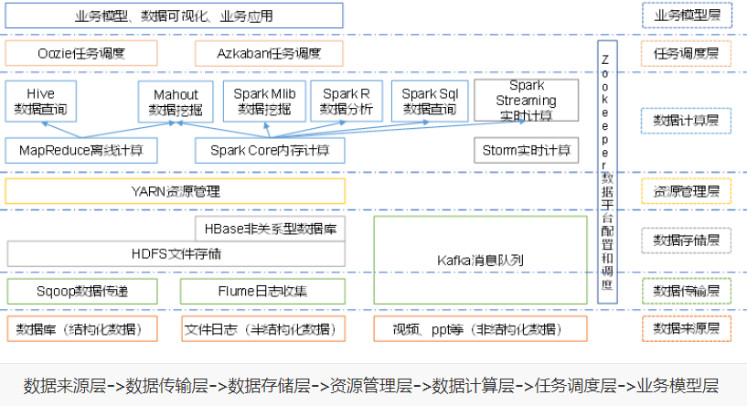
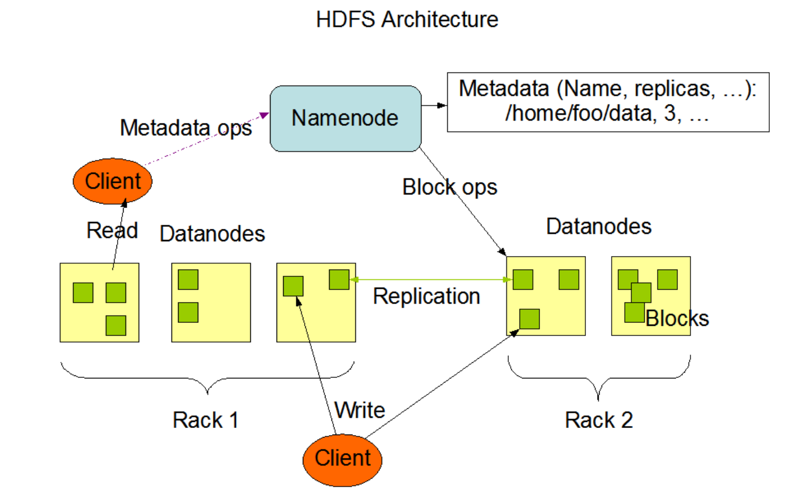

## 请简述zookeeper的选举机制

- 半数机制（Paxos协议):集群中只要半数以上的机器存活，集群就能使用,所以zookeeper适合在基数台的机器上

- zookeeper 在配置中没有指定leader和follower,是在启动时，进行选举出来的

- 以三台服务器的选举过程为例：

  ```
  1.服务器1启动，进行一次选举，服务器1投自己一票，此时只有一票，不能达到半数以上要求，服务器1进入looking状态
  2. 服务器2启动，进行一次选举，服务器1投票自己，服务器2投票自己，然后交换选票信息，服务器1发现服务器2的ID比自己大，就该选为服务器2，此时服务器2两票，达到半数以上，服务器2为leader，服务器1为follower
  3.服务器3启动，发起一次选举，服务器1,2，都不是looking 状态，不会更改选票信息，服务器3服从多数，更改选票信息为服务器3，并更改状态为following
  ```

  ## Zookeeper的监听原理是什么

  1. 首先有一个main()线程
  2. 在main线程中创建zookeeper客户端，此时会创建两个线程，一个负责网络通信(connect)--sendthread，一个负责监听(listener)--enventThread
  3. 通过connect线程将注册的监听事件发送给zookeeper
  4. 在zookeeper的监听器列表中将注册的监听事件添加到列表中
  5. zookeeper监听到有数据或路径变化，就会将这个消息发送给listener线程
  6. listenner线程内部调用了process()方法

  ## zookeeper的部署方式有几种？集群中的角色有哪些？集群最少需要几台机器

  1. 单机模式，伪集群模式和集群模式
  2. leader和follower
  3. 3

## Hadoop

- 集群的最主要瓶颈：磁盘IO

###### 列举几个hadoop生态圈的组件并做简要描述

1. zookeeper：开源的分布式应用程序协调服务，基于zookeeper可以实现同步服务，配置维护，命名服务

2. Flume:高可用的高可靠的，分布式的海量日志采集，聚合和传输的系统

3. Hbase：分布式的，面向列的开源数据库，利用hadoop HDFS作为其存储系统

4. Hive:基于Hadoop的一个数据仓库工具，可以将结构化的数据映射为一张数据库表，并提供简单的sql查询功能，可以将sql语句转换成MapReduce任务进行运行

5. sqoop:将一个关系型数据库中的数据到进到Hadoop的HDFS中，可以将HDFS的数据到进到关系型数据库中   

   ## 简要描述如何安装hadoop                                            

6. 使用root账户登录
7. 修改IP
8. 修改host主机名
9. 配置ssh免密登录
10. 关闭防火墙
11. 安装jdk
12. 解压hadoop安装包
13. 配置hadoop核心文件：hadoop-env.sh core-site.xml mapred-site.xml hdfs-site.xml
14. 配置hadoop环境变量
15. 格式化hadoop namenode-format
16. 启动节点start-all.sh


## 解释hadoop和hadoop生态系统两个概念

hadoop是指hadoop框架本身，hadoop2.0包括hdfs，MapReduce，yarn

Hadoop生态系统包括许多框架




## Hadoop中需要哪些配置文件，其作用是什么？

1. 核心配置文件--TODO

   配置core-site.xml

   ```xml
   <!-- 指定HDFS中NameNode的地址 -->
   <property>
   		<name>fs.defaultFS</name>
         <value>hdfs://hadoop102:9000</value>
   </property>
   
   <!-- 指定Hadoop运行时产生文件的存储目录 -->
   <property>
   		<name>hadoop.tmp.dir</name>
   		<value>/opt/module/hadoop-2.7.2/data/tmp</value>
   </property>
   ```

2. HDFS配置文件

   配置hadoop-env.sh

   ```shell
   export JAVA_HOME=/opt/module/jdk1.8.0_144 //配置环境变量
   ```

   配置hdfs-site.xml

   ```xml
   <!-- 指定Hadoop副本个数，默认就是3 -->
   <property>
   		<name>dfs.replication</name>
   		<value>3</value>
   </property>
   
   <!-- 指定Hadoop辅助名称节点主机配置 -->
   <property>
         <name>dfs.namenode.secondary.http-address</name>
         <value>hadoop104:50090</value>
   </property>
   ```

3. YARN配置文件

   配置yarn-env.sh

   ```
   	vi yarn-env.sh
   	export JAVA_HOME=/opt/module/jdk1.8.0_144  //导出环境变量
   ```

   配置yarn-site.xml

   ```xml
   <!-- Reducer获取数据的方式 -->
   <property>
   		<name>yarn.nodemanager.aux-services</name>
   		<value>mapreduce_shuffle</value>
   </property>
   
   <!-- 指定YARN的ResourceManager的地址 -->
   <property>
   		<name>yarn.resourcemanager.hostname</name>
   		<value>hadoop103</value>
   </property>
   ```

4. MapReduce配置文件

   配置mapred-env.sh

   ```
   vi mapred-env.sh
   export JAVA_HOME=/opt/module/jdk1.8.0_144
   ```

   配置mapred-site.xml

   ```
   <!-- 指定MR运行在Yarn上 -->
   <property>
   		<name>mapreduce.framework.name</name>
   		<value>yarn</value>
   </property>
   ```

> 在集群上分发配置好的Hadoop配置文件


## 简述Hadoop几个默认端口及含义

```
50070：namenode访问地址
50090:2nn辅助节点访问端口号
50010:datanode访问端口号
9000: hdfs的rpc端口
8088: yarn 访问端口号
19888: web历史访问端口
```


## 列出几个配置文件优化hadoop,怎么做数据平衡，列出步骤

> MapReduce优化主要从6个方面考虑：数据输入，map阶段，reduce阶段，IO传输，数据倾斜问题和常用的调优参数


> 数据平衡：
>
> sbin/start-balancer.sh 

## Hadoop架构图



HDFS采用master/slave架构，一个HDFS集群由一个namenode和一定的datanode组成，


## Hadoop中RecordReader的作用是什么

通过RecordReader，从输入InputSplit中解析出key/value，

系统默认的LineRecordReader是按照每行的偏移量作为map输出的key值，每行的内容作为map的value值


## Hadoop中Job和Tasks之间的区别

事先编写MapReduce程序，一个MapReduce程序就是一个job，一个job中可以有多个Task，task任务又分为MapTask 和Reduce Task


## 文件大小默认从64M改为128M有啥影响

> 增加文件大小，需要增加磁盘的传输速率


## HDFS的存储机制


1. 客户端通过Distributed FileSystem模块向Namenode请求上传文件，NameNode检查目标文件是否存在
2. NamNode返回是否可以上传
3. 客户端请求第一个Block上传到那几个DataNode上
4. NamNode返回三个DataNode节点，分别是dn1, dn2,dn3
5. 客户端通过FsDataOutputStream模块请求dn1 上传数据，dn1收到请求继续调用dn2,dn2调用dn3，将通信管道建立完成
6. dn1,dn2,dn3逐级应答客户端
7. 客户端开始向dn1 上传第一个Block，以Packet为单位，dn1收到一个packet(64K)就会传给dn2,dn2传给dn3,dn1每传一个packet会让如一个应答队列等待应答
8. 当一个Block传输完成之后，客户端再次请求NamNode上传第二个Block的服务器(重复操作)


1. 客户端通过Distributed FIleSystem 向NamNode请求下载文件，NameNode通过查询元数据，吵到文件所在的DataNode地址
2. 挑选一台DataNode(就近原则)服务器，请求读取数据
3. DataNode开始传输数据给客户端(以Packet为单位来做校验)
4. 客户端以Packet为单位接收，先在本地缓存，然后写入目标文件


## 2NN工作机制

> 如果元数据只放入内存中，一旦断电，元数据就会丢失==》 引入FsImage
>
> 当元数据更新时，更新FsImage，效率过低 ==》引入Edits log(只进行追加操作，效率高)
>
> 引入一个新的节点SecondaryNamNode，专门用于FsImage和Edits合并


###### 第一阶段： NamNode启动

1. 第一次启动NamNode格式化后，创建Fsimage和Edits文件，如果不是第一次启动，直接加载编辑日志和镜像文件到内存
2. 客户端对元数据进行增删改的请求
3. NamNode记录操作日志，更新滚动日志Edits
4. namenode对内存中的数据进行增删改操作

###### 第二阶段： secondary NameNode工作

1. 2NN 询问NameNode是否需要CheckPoint，直接带回namenode是否检查结果
2. 2NN请求执行checkpoin
3. NameNode滚动正在写的Edits日志
4. 将滚动前的边记日志和镜像文件(Fsimage) 拷贝到2NN中
5. 2NN加载边记日志和镜像文件，并进行合并
6. 生成新的镜像文件Fsimage.chkpoint
7. 拷贝Fsimage.chkpoint到NamNode
8. NamNode将fsimage.chkpoint重新命名成fsimage


## 基础算法相关

##### 快速排序

```
 @Test
    public void test(){
        int[] arr = {9, -16, 21, 23, -30, -49, 21, 30, 30};
        //int[] arr = {9, -16, 21};
        quickSort(arr,0,arr.length-1);
        for (int i : arr) {
            System.out.print(i+" ");
        }
    }
    private void quickSort(int[] arr, int left, int right) {
        if(left>=right){
            return;
        }
        int single = SingleSort(arr, left, right);
        quickSort(arr, left, single-1);
        quickSort(arr, single+1, right);
    }
    private int SingleSort(int[] arr, int left, int right) {
        int key = arr[right];
        while(left<right){
            while(left<right && arr[left]<= key){
                left++;
            }
            arr[right] = arr[left];
            while(left<right && arr[right] >= key){
                right--;
            }
            arr[left] = arr[right];
        }
        arr[left] = key;
        return left; // 返回下标
    }
```

##### 归并排序

```java
   @Test
    public void test() {
        int[] arr = {9, -16, 21, 23, -30, -49, 21, 30, 30};
//        int[] arr = {9, -16, 21};
        int[] tmp = new int[arr.length];
        mergeSort(arr, 0, arr.length - 1, tmp);
        for (int i : arr) {
            System.out.print(i + " ");
        }
    }

    private void mergeSort(int[] arr, int left, int right, int[] tmp) {
        if(left<right){
            //必须left<right
            int mid = (left+right)/2;
            mergeSort(arr, left, mid, tmp);
            mergeSort(arr, mid+1, right, tmp);

            //合并
            merge(arr,left,mid,right,tmp);
        }
    }

    private void merge(int[] arr, int left, int mid, int right, int[] tmp) {
        int l = left;
        int r = mid+1;
        int t=0;// 下标
        while(l<=mid && r<=right){
            if(arr[l] <arr[r]){
                tmp[t++]=arr[l++];
            }else{
                tmp[t++] = arr[r++];
            }
        }
        while(l<=mid){
            tmp[t++]=arr[l++];
        }
        while(r<=right){
            tmp[t++] = arr[r++];
        }
        //将tmp中数据拷贝到arr中
        t=0;//重置
        int tmpLeft=left;
        while(tmpLeft<=right){
            arr[tmpLeft++] = tmp[t++];
        }

    }
```

##### 冒泡排序

```java
import org.junit.Test;

public class BubbleSort {
    @Test
    public void test(){
        int[] data = { 9, -16, 21, 23, -30, -49, 21, 30, 30 };
        bubbleSort(data, 0,data.length-1);
        for (int num : data) {
            System.out.print(num+" ");
        }
    }
    public void bubbleSort(int[] arr, int left, int right){
        for(int i=0; i<arr.length-1; i++){
            for(int j=0; j<arr.length-i-1; j++){
                if(arr[j] >arr[j+1]){
                    int tmp = arr[j];
                    arr[j] = arr[j+1];
                    arr[j+1] = tmp;
                }
            }
        }
    }
}
```

##### 二分查找

```
import org.junit.Test;

public class binarySearchTest{
    @Test
    public void test(){
        int[] arr = new int[]{1,3,5,7,9,10};
        System.out.println(binarySearch(arr, 5));
    }

    private int binarySearch(int[] arr, int num) {
        int left =0;
        int right = arr.length-1;
        int mid = (left+right)/2;
        while(left<=right){
            if(arr[mid] == num){
                return mid;
            }else if(num > arr[mid] ){
                left=mid+1;
                mid = (left+right)/2;
            }else{
                right=mid-1;
                mid = (left+right)/2;
            }
        }
        return -1;
    }
}

```


##### 手写Spark-WordCount--六种方式

```scala
1. sc.textFile("/2.txt").flatMap(_.split(" ")).map((_,1)).reduceByKey(_+_).collect
2.	 sc.makeRDD(Array("one", "two", "two", "three","three","three")).map((_,1)).groupByKey.map(x=>(x._1,x._2.sum)).collect
3.  sc.textFile("/2.txt").flatMap(_.split(" ")).map((_,1)).aggregateByKey(0)(_+_,_+_).collect
4. sc.textFile("/2.txt").flatMap(_.split(" ")).map((_,1)).foldByKey(0)(_+_).collect
5. sc.makeRDD(Array("one", "two", "two", "three","three","three")).map((_,1)).combineByKey(x=>x,(x:Int,v)=>(x+v),(x:Int,y:Int)=>(x+y)).collect
6. rdd.groupBy(x=>x).map(t=>(t._1, t._2.toList.length)).collect
```


## Scala/Spark

创建一个RDD，使其一个分区的数据转变为一个String。例如(Array("a","b","c","d"),2)=>("ab","cd")

```scala
sc.parallelize(Array("a","b","c","d"),2).glom.map(x=>x.reduce(_ + _)).map(x=>x).collect
```


## Linux

常用的linux命令:

top: 显示内存

ls :显示文件系统

df : 查看磁盘情况

ps : 查看进程相关

netstat : 查看网络相关

ifconfig: 查看ip地址


#### shell工具

##### awk 

```shell
-f : 列号，提取第几列
-d : 分隔符
//-f :指定提取的列 -d :指定分隔符
cut -f 1 -d " " ./README.txt 
```

##### sed

利用模式空间的方式，将数据缓存在临时缓冲区中，然后进行处理，不改变原有数据

```shell
基本用法： sed [选项参数] 'command' 文件名称 
选项参数： -e  直接在指令模式上进行sed编辑
command: a : 下一行新增字符
		 d: 删除
		 s ： s/regexp/replacement/g  ,g可以替换多个
		 i ： 覆盖原有文件
```

##### awk

把文件以行为当为读入，默认以空格切分

```
基本语法：awk [选项参数] 'pattern1 {action1} pattern2 {action2}...' filename
选项参数： -F: 指定分隔符
		-v : 赋值一个用户定义的变量

```

##### sort

将文件进行排序，并将排序结果输出

```
基本语法： sort (选项) (参数)
选项： -n :依照数值大小排序
		-r : 逆序
		-t: 设置排序分隔符
		-k: 指定排序的列
```


