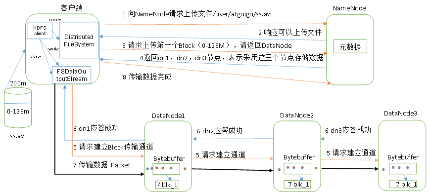
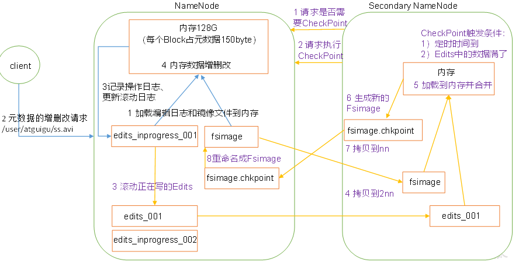

## 请简述zookeeper的选举机制

- 半数机制（Paxos协议):集群中只要半数以上的机器存活，集群就能使用,所以zookeeper适合在基数台的机器上

- zookeeper 在配置中没有指定leader和follower,是在启动时，进行选举出来的

- 以三台服务器的选举过程为例：

  ```
  1.服务器1启动，进行一次选举，服务器1投自己一票，此时只有一票，不能达到半数以上要求，服务器1进入looking状态
  2. 服务器2启动，进行一次选举，服务器1投票自己，服务器2投票自己，然后交换选票信息，服务器1发现服务器2的ID比自己大，就该选为服务器2，此时服务器2两票，达到半数以上，服务器2为leader，服务器1为follower
  3.服务器3启动，发起一次选举，服务器1,2，都不是looking 状态，不会更改选票信息，服务器3服从多数，更改选票信息为服务器3，并更改状态为following
  ```

  ## Zookeeper的监听原理是什么

  1. 首先有一个main()线程
  2. 在main线程中创建zookeeper客户端，此时会创建两个线程，一个负责网络通信(connect)--sendthread，一个负责监听(listener)--enventThread
  3. 通过connect线程将注册的监听事件发送给zookeeper
  4. 在zookeeper的监听器列表中将注册的监听事件添加到列表中
  5. zookeeper监听到有数据或路径变化，就会将这个消息发送给listener线程
  6. listenner线程内部调用了process()方法

  ## zookeeper的部署方式有几种？集群中的角色有哪些？集群最少需要几台机器

  1. 单机模式，伪集群模式和集群模式
  2. leader和follower
  3. 3

## Hadoop

- 集群的最主要瓶颈：磁盘IO

###### 列举几个hadoop生态圈的组件并做简要描述

1. zookeeper：开源的分布式应用程序协调服务，基于zookeeper可以实现同步服务，配置维护，命名服务

2. Flume:高可用的高可靠的，分布式的海量日志采集，聚合和传输的系统

3. Hbase：分布式的，面向列的开源数据库，利用hadoop HDFS作为其存储系统

4. Hive:基于Hadoop的一个数据仓库工具，可以将结构化的数据映射为一张数据库表，并提供简单的sql查询功能，可以将sql语句转换成MapReduce任务进行运行

5. sqoop:将一个关系型数据库中的数据到进到Hadoop的HDFS中，可以将HDFS的数据到进到关系型数据库中   

   ## 简要描述如何安装hadoop                                            

6. 使用root账户登录
7. 修改IP
8. 修改host主机名
9. 配置ssh免密登录
10. 关闭防火墙
11. 安装jdk
12. 解压hadoop安装包
13. 配置hadoop核心文件：hadoop-env.sh core-site.xml mapred-site.xml hdfs-site.xml
14. 配置hadoop环境变量
15. 格式化hadoop namenode-format
16. 启动节点start-all.sh


## 解释hadoop和hadoop生态系统两个概念

hadoop是指hadoop框架本身，hadoop2.0包括hdfs，MapReduce，yarn

Hadoop生态系统包括许多框架


## Hadoop中需要哪些配置文件，其作用是什么？

1. 核心配置文件--TODO

   配置core-site.xml

   ```xml
   <!-- 指定HDFS中NameNode的地址 -->
   <property>
   		<name>fs.defaultFS</name>
         <value>hdfs://hadoop102:9000</value>
   </property>
   
   <!-- 指定Hadoop运行时产生文件的存储目录 -->
   <property>
   		<name>hadoop.tmp.dir</name>
   		<value>/opt/module/hadoop-2.7.2/data/tmp</value>
   </property>
   ```

2. HDFS配置文件

   配置hadoop-env.sh

   ```shell
   export JAVA_HOME=/opt/module/jdk1.8.0_144 //配置环境变量
   ```

   配置hdfs-site.xml

   ```xml
   <!-- 指定Hadoop副本个数，默认就是3 -->
   <property>
   		<name>dfs.replication</name>
   		<value>3</value>
   </property>
   
   <!-- 指定Hadoop辅助名称节点主机配置 -->
   <property>
         <name>dfs.namenode.secondary.http-address</name>
         <value>hadoop104:50090</value>
   </property>
   ```

3. YARN配置文件

   配置yarn-env.sh

   ```
   	vi yarn-env.sh
   	export JAVA_HOME=/opt/module/jdk1.8.0_144  //导出环境变量
   ```

   配置yarn-site.xml

   ```xml
   <!-- Reducer获取数据的方式 -->
   <property>
   		<name>yarn.nodemanager.aux-services</name>
   		<value>mapreduce_shuffle</value>
   </property>
   
   <!-- 指定YARN的ResourceManager的地址 -->
   <property>
   		<name>yarn.resourcemanager.hostname</name>
   		<value>hadoop103</value>
   </property>
   ```

4. MapReduce配置文件

   配置mapred-env.sh

   ```
   vi mapred-env.sh
   export JAVA_HOME=/opt/module/jdk1.8.0_144
   ```

   配置mapred-site.xml

   ```
   <!-- 指定MR运行在Yarn上 -->
   <property>
   		<name>mapreduce.framework.name</name>
   		<value>yarn</value>
   </property>
   ```

> 在集群上分发配置好的Hadoop配置文件


## 简述Hadoop几个默认端口及含义

```
50070：namenode访问地址
50090:2nn辅助节点访问端口号
50010:datanode访问端口号
9000: hdfs的rpc端口
8088: yarn 访问端口号
19888: web历史访问端口
```


## 列出几个配置文件优化hadoop,怎么做数据平衡，列出步骤

> MapReduce优化主要从6个方面考虑：数据输入，map阶段，reduce阶段，IO传输，数据倾斜问题和常用的调优参数


> 数据平衡：
>
> sbin/start-balancer.sh 

## Hadoop架构图


HDFS采用master/slave架构，一个HDFS集群由一个namenode和一定的datanode组成，


## Hadoop中RecordReader的作用是什么

通过RecordReader，从输入InputSplit中解析出key/value，

系统默认的LineRecordReader是按照每行的偏移量作为map输出的key值，每行的内容作为map的value值


## Hadoop中Job和Tasks之间的区别

事先编写MapReduce程序，一个MapReduce程序就是一个job，一个job中可以有多个Task，task任务又分为MapTask 和Reduce Task


## 文件大小默认从64M改为128M有啥影响

> 增加文件大小，需要增加磁盘的传输速率


## HDFS的存储机制



1. 客户端通过Distributed FileSystem模块向Namenode请求上传文件，NameNode检查目标文件是否存在
2. NamNode返回是否可以上传
3. 客户端请求第一个Block上传到那几个DataNode上
4. NamNode返回三个DataNode节点，分别是dn1, dn2,dn3
5. 客户端通过FsDataOutputStream模块请求dn1 上传数据，dn1收到请求继续调用dn2,dn2调用dn3，将通信管道建立完成
6. dn1,dn2,dn3逐级应答客户端
7. 客户端开始向dn1 上传第一个Block，以Packet为单位，dn1收到一个packet(64K)就会传给dn2,dn2传给dn3,dn1每传一个packet会让如一个应答队列等待应答
8. 当一个Block传输完成之后，客户端再次请求NamNode上传第二个Block的服务器(重复操作)


1. 客户端通过Distributed FIleSystem 向NamNode请求下载文件，NameNode通过查询元数据，吵到文件所在的DataNode地址
2. 挑选一台DataNode(就近原则)服务器，请求读取数据
3. DataNode开始传输数据给客户端(以Packet为单位来做校验)
4. 客户端以Packet为单位接收，先在本地缓存，然后写入目标文件


## 2NN工作机制

> 如果元数据只放入内存中，一旦断电，元数据就会丢失==》 引入FsImage
>
> 当元数据更新时，更新FsImage，效率过低 ==》引入Edits log(只进行追加操作，效率高)
>
> 引入一个新的节点SecondaryNamNode，专门用于FsImage和Edits合并



###### 第一阶段： NamNode启动

1. 第一次启动NamNode格式化后，创建Fsimage和Edits文件，如果不是第一次启动，直接加载编辑日志和镜像文件到内存
2. 客户端对元数据进行增删改的请求
3. NamNode记录操作日志，更新滚动日志Edits
4. namenode对内存中的数据进行增删改操作

###### 第二阶段： secondary NameNode工作

1. 2NN 询问NameNode是否需要CheckPoint，直接带回namenode是否检查结果
2. 2NN请求执行checkpoin
3. NameNode滚动正在写的Edits日志
4. 将滚动前的边记日志和镜像文件(Fsimage) 拷贝到2NN中
5. 2NN加载边记日志和镜像文件，并进行合并
6. 生成新的镜像文件Fsimage.chkpoint
7. 拷贝Fsimage.chkpoint到NamNode
8. NamNode将fsimage.chkpoint重新命名成fsimage