### Java概述

java是SUN公司在1995年开发的一门完全面向对象的，开源的高级编程语言

##### java的发展历史

```
1995年诞生，1996年发布第一个版本，现在已经出到了Java第九个版本。

1995年 Java诞生

1996年 jdk1.0发布

1998年 jdk1.2发布 J2SE（1.2，1.3，1.4）

2004年 jdk1.5发布 JavaSE

2014年 jdk1.8发布 有些功能不向下兼容
```


##### java语言运行机制及运行过程

##### Java语言的最主要特点

- 面向对象：三大特性：封装，继承，多态

- 健壮 性: 提供了一套安全的 内存管理和访问机制 

- 跨平台性：

  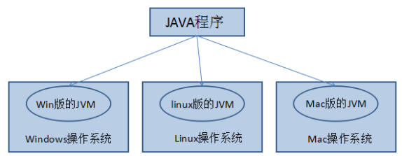


##### 开发环境搭配

###### JVM:

> JVM(java virtual machine):java虚拟机,java虚拟机机制屏蔽了底层运行平台的差别，实现了一次编译，到处运行

###### JRE

> (java runtime environment --java运行环境):包括java虚拟机和java程序所需要的核心类库等

###### JDK

> (Java development kit --java开发工具包): JDK是提供给java开发人员使用的，包含了java的开发工具，也包括JRE

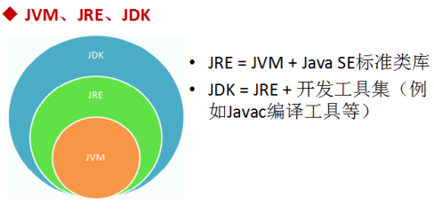

##### Hello Java

```
//其中//表示单行注释：表示该行的内容不属于代码
//编写一个Java程序的步骤：
//1、编辑：文件的后缀名是.java，文件内容都是class 类名{}的结构
//2、编译：使用javac.exe编译工具把.java的源文件编译成一个或者多个.class的字节码文件
//		   编译的命令格式：javac 文件名.java
//3、运行：使用java.exe工具运行，命令格式：java 类名
class HelloWorld{
	//Java程序的入口是main()方法，它有固定的书写格式：public static void main(String[] args)  {...}
	public static void main(String[] args){
		//System.out.println("");在控制台打印内容，""中的内容原样显示
		//每一个语句以;结尾
		System.out.println("hello world");
	}
}
```

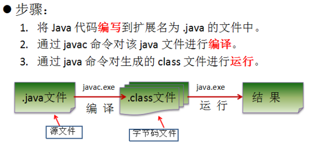

### 基础语法

##### 标识符

> Java对各种变量，方法和类等要素 命名时使用的字符序列称为标识符，范式可以自己起名字的地方都叫做标识符

###### 标识符命名规则：

- 由26个英文字母大小写，数字0-9,或$组成
- 数字不可以开头
- 不可以使用关键字和保留字(能包含)
- Java中严格区分大小写，长度无限制
- 标识符不能包含空格

###### 标识符命名规范

- 总的规范：为了提高阅读性：见名知意
- 包名：多单词组成的所有字母都小写：xxxyyyzz
- 类名，接口名：首字母大写：XxxYyyZzz
- 变量名，方法名，第一个单词字母小写，第二个单词开始首字母大写：xxxYyZz
- 常量名：所有字母都大写，多单词是使用下划线:XXX_YY_ZZ

##### 数据类型

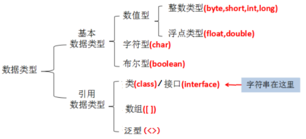

###### 基本数据类型：byte,short,int,long, float,double,char,boolean

###### 基本类型的转换

1. 自动类型转换

   ```
   byte,short,char ->int ->long->float->double
   ```

2. 强制类型转换

   ```
   double ->float ->long->int->byte,short,char
   ```

   ###### 原码，反码，补码

   原码：第一位表示符号位，其余位表示值

   反码：正数的反码是本身

   ​	    负数的反码：在原码的基础上，符号位不变，其余各个位取反

   补码：正数的补码就是其本身

   ​	    负数的补码：在反码的基础上+1


##### 运算符

###### 算数运算符

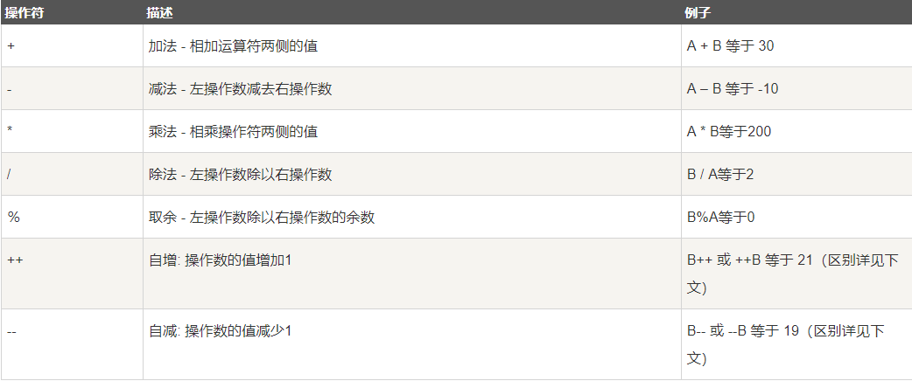

###### 关系运算符

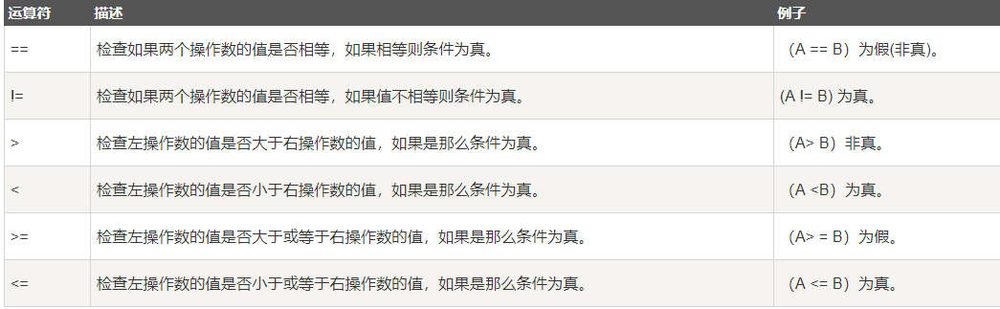

###### 位运算符

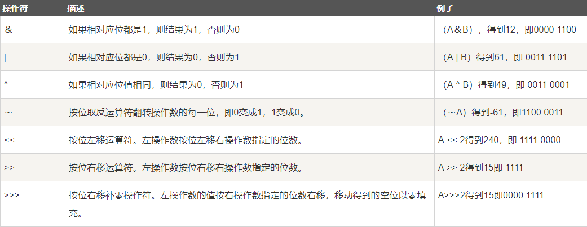

###### 逻辑运算符

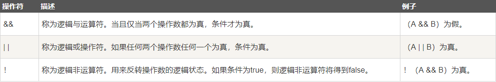

###### 赋值运算符

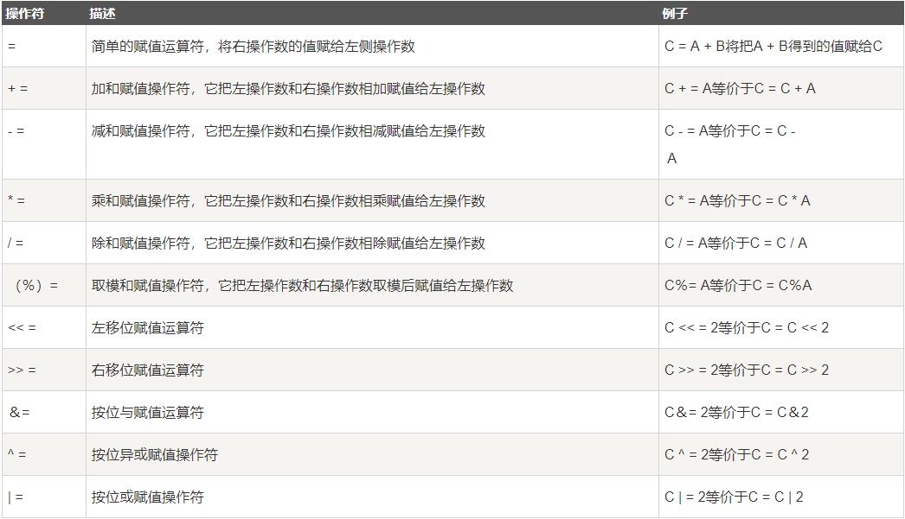

###### 条件运算符

```
三目运算符：? :
```

#### 流程控制语句结构

顺序结构：从上到下，顺序执行

分支结构：根据不同的条件，执行不同的代码 if ..else  和 switch .. case

循环结构： 根据条件循环重复执行某代码 :for(普通for和增强for) while 和do while

###### break ,continue关键字

```
break表示结束真个循环，continue表示结束当前循环，执行下一次循环
```

### 面向对象基础

##### 面向对象编程思想

```
把数据和行为放在一起，用一个叫做类的东西封装起来，程序的最小单元变为类
```

> 面向对象是以对象为中心，将对象的内部组织与外部环境区分开来，将表征对象的内部属性数据与外部隔离开来，其行为与属性构成一个整体，而系统功能则表现为一些列对象之间的相互作用的序列，能更加形象的模拟或表达现实世界


##### 面向对象的基本特征

##### 封装

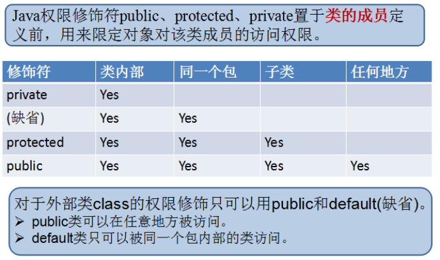

###### 构造器

```
格式
[访问权限控制修饰符] 类名(){}  //无参
[访问权限控制修饰符] 类名(形参列表){} //带有参数
```

特点

- 构造器名称必须与类名相同
- 构造器没有返回值类型
- 若类中没有显式的提供任何构造器时，系统会默认提供一个无参构造器
- 若类中显式声明了任何构造器，那么系统不会再提供默认的无参构造器
- 一个类中可以重载多个构造器(方法名相同，形参列表不同)

作用：

- 与new 一起使用创建对象
- 为对象属性进行初始化

###### this关键字

this表示当前对象

1. 在方法内部使用，表示调用该方法的对象

2. 在构造方法中，表示正在初始化的对象

###### 包

包的作用：

-  避免类的重名
- 用于控制访问权限
- 用户划分项目的结构层次，通常将功能相近的类划分到同一个包中

##### 继承

当多个类中存在相同属性和行为时，将这个内容抽取到单独一个类中，然后继承这个类即可，提高了代码的复用性，同时利于维护

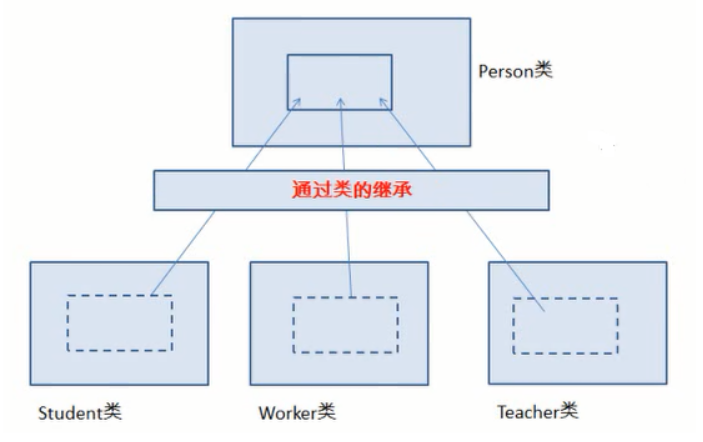

###### 继承语法

```
class B extends A{}
```

###### 继承的特点

- 子类可以继承父类所有的属性和方法，包括私有的(子类会继承所有父类的成员，只是会因为访问控制符的原因，子类不能对继承的私有成员直接进行访问，可通过继承的共有方法来访问)
- 子类不会继承父类的构造器，但是一定会调用父类的构造器
- 子类可以扩展父类没有的属性和方法
- Java中只支持范吉成，不允许多继承

###### 重写

- 方法名：必须完全一致

- 形参列表：必须完全一致

- 返回值类型：

  - 如果是基本数据类型和void, 必须完全一致

  - 如果是引用数据类型，必须<=，重写的方法的返回值<=被重写方法的返回值类型

- 修饰符： 重写的方法的修饰符范围>= 被重写方法的修饰符范围
- 抛出的异常：重写的方法抛出的异常不能超出父类被重写方法的范围

###### super关键字

- super.属性--表示使用父类的属性
- super.方法--表示使用父类被重写的方法
- super()或super(实参列表)--显式调用父类的构造方法

##### 多态

###### 什么是多态

> 一种事物的多种形态
>
> 重载：在一个类中一个方法功能的多种表现形态
>
> 重写：父子类对于同一个方法表现出不同的形态
>
> 对象的多态性：父类的引用指向子类的对象--编译时：看左边(父类的引用),运行时： 看右边(子类的对象)

###### 向上转型和向下转型

- 向上转型: 子类转父类， 系统自动完成
- 向下转型：父类转子类，需要使用强制转换()

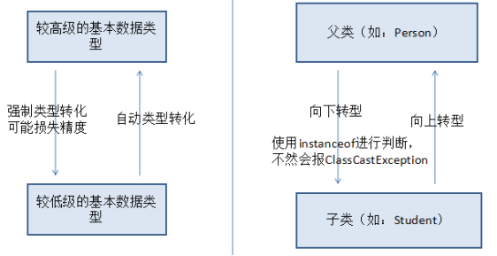

###### instanceof 

```
x instanceof A:检验x是否为类A的对象，返回值为boolean值
```

#### 面向对象的高级特性

###### 根父类java.lang.Object

Object类是所有java类的根父类--如果为使用extends关键字指明父类，则默认父类为Object

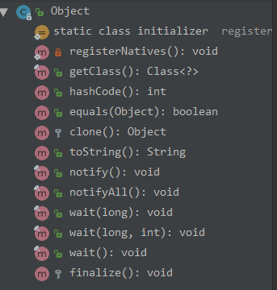

##### static关键字

> 希望某些数据无论产生多少对象，只生成一份

###### 类属性，类方法的设计思想

类属性(类变量)作为该类各个对象之间共享的变量

类方法：由于不需要创建对象就可以调用类方法

###### static修饰的范围

> static可以修饰： 属性，方法，代码块，内部类

类变量：静态变量

类方法：静态方法

###### 类的成员：代码块

> 代码块一般用于类或实例成员变量的初始化，分为静态代码块和非静态代码块(构造代码块)

###### 静态代码块

- 可以为类变量(静态的属性)初始化
- 随着类的初始化而初始化，**只执行一次**
- 如果子类初始化时，会首先初始化父类
- 静态代码块中不能访问非静态成员(属性，方法，内部类)
- 静态代码块中不能使用this和super关键字

###### 非静态代码块(构造块)

- 可以为实例变量(非静态属性)初始化
- 随着对象的创建而初始化，**每创建一个对象，就执行一次**
- 创建子类对象时，需要先为从父类继承的属性进行初始化，所以会导致父类的构造快和构造器先执行
- 本类的非静态代码块优先于构造器执行

```
初始化顺序：
	<clinit>--只执行一次
		1. 类变量显式初始化和静态代码块--按照上下顺序执行
		2. 执行子类的<clinit>方法时，会先执行父类的<clinit>方法
	<init>
		1. 执行子类的<init>方法时，会先执行父类的<init>方法
		2. 非静态显式初始化，非静态代码块
		3. 构造器
```

#### 其他关键字

##### final：表示最终的

- 类：final 标记的类不能被继承，提高安全性，程序的可读性
- 方法：final标记的方法不能被子类重写
- 变量：final标记的变量为常量，只能被赋值一次

##### native关键字

native方法是使用C/C++等非java语言实现的，目的是为了与底层操作系统或硬件交互的情况，它为我们提供了一个非常简洁的接口，无需了解java应用之外的繁琐的细节

###### 关键字常见问题：

```
构造器只能有访问权限修饰符
外部类不能使用static修饰，可以使用final修饰
属性可以同时使用static和final修饰，叫做全局常量
方法可以同时使用static和final修饰，都不能被重写
局部变量只能使用final修饰
代码块只能使用static修饰
```

##### 抽象类

###### 抽象方法：

> 用abstract来修饰一个方法时，该方法叫做抽象方法，只有方法的声明，没有方法的实现，以分号结束

```
[访问控制修饰符] abstract 返回值类型 方法名([形参列表]);
```

- 含有抽象方法的类必须是抽象类
- 子类继承抽象类时，子类也会继承父类的抽象方法，因此必须对父类的抽象方法进行重写

###### 抽象类

> 使用abstract修饰的类成为抽象类

```
[访问控制修饰符] abstract class 抽象类名 [extends 父类名]{}
```

- 拥有一个或多个抽象方法的类 必须是抽象类
- 抽象类不能直接创建对象，即不能实例化
- 有时抽象类没有抽象方法(目的就不想让你创建对象)
- 抽象类就是用来被继承的，子类继承时，必须对父类的抽象方法进行实现，否则也是抽象类
- 抽象类不能创建对象，为什么还有构造器？ 供子类调用，子类创建对象时，需要从父类继承的属性初始化

###### 不能和abstract一起使用的关键字

abstract只能修饰类与方法

- final
- static
- private
- abstract不能修饰属性，构造器，局部变量，代码块

#### 接口

###### 接口的概念： 

> 接口可以实现多重继承的效果
>
> 接口就是一个规范，一个标砖

###### 声明接口

```
interface关键字
访问权限控制符 interface 接口名{}
```

使用接口

```
1. 类实现接口：implements关键字
	格式：[修饰符] class 实现类名 implements 接口名1，接口名2...{}
2. 接口继承几口；用extends关键字
	格式： [修饰符] interface 子接口名 extends 接口名1,接口名2...{}
```

###### 接口的特点

- 接口不能直接实例化

- 接口中的成员

  ```
  jdk1.8之前：接口是抽象方法和常量值的定义的集合
  	接口中所有的成员变量都默认是public static final 修饰的
  	接口中的所有方法都默认是由public ablstract 修饰的
  jdk1.8.之后
  	接口新增：默认方法和静态方法
  	默认方法：default 关键字修饰
  	静态方法：static 关键字修饰
  ```

- 接口没有构造器，代码块(因为接口中没有类变量和实例变量需要初始化，接口中只有常量)
- 接口就是用来被实现的，当类实现了接口时，该类需要实现接口所有的抽象方法，否则也是抽象类

> 接口的本质是契约，规范，标准

##### JDK1.8接口新特性

###### 默认方法：

```
public class Testinterface {
    public static void main(String[] args) {
        new SubA().methodA();
    }
}
interface A{
    default void methodA(){
        System.out.println("A的默认实现...");
    }
}

class SubA implements A{
    //继承接口A后，即使什么也不写，也有一个默认方法methodA
}

```

###### 静态方法

> 静态方法：使用static关键字修饰，可以通过接口名直接调用静态方法

```
public class Testinterface {
    public static void main(String[] args) {
        A.testA(); //静态方法通过接口直接调用
    }
}
interface A{
    public static void testA(){
        System.out.println("A的静态方法...");
    }
}
```

###### 特殊情况：接口中的默认方法冲突问题

> 当一个实现类实现类多个接口，而多个接口中出现了相同的默认方法(方法名与形参列表相同),必须重写默认方法，以解决冲突问题，即放弃接口中的默认实现，改为实现类字节提供的实现，如果想要保留其中一个父接口中的方法实现，那么只能通过"父接口.super.默认方法"方式

```

interface Filial{ //孝顺的
    default void help(){
        System.out.println("老妈.我来救你了...");
    }
}
interface Spoony{
    default void help(){
        System.out.println("老婆.我来救你了...");
    }
}
class Main implements Filial,Spoony{
    //当实现了两个接口后，编译器直接提示不能编译通过，两个默认方法冲突，
    @Override
    public void help() {
        Filial.super.help(); //保留Filial的默认方法
        Spoony.super.help(); //保留Spoony的默认方法
        System.out.println("快跑..."); //或者重新实现
    }
}
```

> 当一个子类继承某个父类，同时实现一个父接口时，父类和接口中的默认方法相同时，子类默认选择父类中的方法，忽略接口中的默认方法，也可以根据自己的情况，重新实现同名方法

```
class Father{
    public void help(){
        System.out.println("儿子，救我老婆");
    }
}
class Man extends Father implements Filial,Spoony{
    @Override
    public void help() {
        Filial.super.help(); //保留Filial的默认方法
        Spoony.super.help(); //保留Spoony的默认方法
        System.out.println("快跑..."); //或者重新实现
    }
}

public class Testinterface1 {

    public static void main(String[] args) {
        Man m = new Man();
        m.help();  //默认调用的是父类中的同名方法
    }
}
```


#### 内部类Inner Class

> 一个事物的内部，还有一部分需要一个完整的结构进行描述，而这个内部的完整的结构又只为外部事物提供服务，那么整个内部的完整结构最好使用内部类，内部类可以直接使用或访问外部类的所有成员，包括私有的

###### 内部类分类

- 静态内部类

- 非静态内部类

  - 成员内部类
  - 局部内部类
  - 匿名内部类

#### 枚举与注解

##### 枚举

###### 定义枚举类型

- 私有化类的构造器，保证不能再类的外部创建对象
- 在类的内部创建枚举类的实例，声明为：public static final

```
jkd1.5之前:
public class TestEnumType {
    public static void main(String[] args) {
        Season season = Season.SPRINT;
    }
}
class Season{
    //创建具体的枚举对象
    public static final Season SPRINT= new Season();
    public static final Season SUMMER= new Season();
    public static final Season AUTUMN= new Season();
    public static final Season WINTER= new Season();

    //私有化构造器
    private Season(){}
}
```

```
public class TestEnumType {
    public static void main(String[] args) {
        //jdk1.5之前
        //Season season = Season.SPRINT;
        Season winter = Season.WINTER;
        System.out.println(winter);
    }
}
enum Season{
    SPRING,
    SUMMER,
    AUTUMN,
    WINTER
}
```

##### 注解Annotation

###### Annotation作用：

- 注解不是程序本身，可以对程序作出解释(这一点和注释类似)
- 可以被其他程序读取(编译器，框架)

###### Annotation格式

```
@注释名 ，还可以添加一些参数值   例如@SuppressWarnings(value=”unchecked”)
```

###### Annotation使用范围

```
注解可以向修饰符一样被使用，可以修饰包，类，构造器，方法，成员变量，参数，局部变量，相当于给他们添加了额外的辅助信息，而且有些注解可以通过反射机制编程实现对这些元数据的访问
```

常见的注解

- 生成文档

  - @author @version @see @since @param @return @throws/@exception

- 编译时进行格式检查
  - @Override :按照重写的要求检查方法的格式
  - @Depreacted:过时，表示不鼓励程序员使用这样的元素，存在风险或有更好的方法
  - @SuppressWarnings

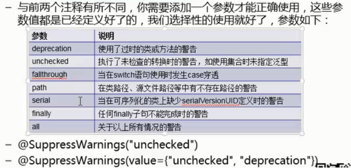


- 实现替代配置文件功能

  ```
  Servlet3.0中提供了注解(Annotation)，不需要再web.xml中进行Servlet的部署
  ```

- JUnit注解
  - @Test:标记在非静态的测试方法上
  - @Test(timeout=1000): 设置超时时间，如果测试时间超过了定义的timeout，测试失败
  - @Test(expected): 申明会发生的异常
  - @BeforeClass: 标记在静态方法上，只执行一次，在类初始化时执行
  - @AfterClass:标记在静态方法上，只执行一次，在所有方法完成后执行
  - @Before: 标记在非静态方法上，在@Test方法前执行，而且在每一个@Test方法前面都执行
  - @After: 标记在非静态方法上，在@Test 方法后面执行，在每一个@Test方法后面都执行
  - @ignore: 暂不参与此次测试

##### 元注解

java 5.0定义了4个标准的meta-annotation类型，他们被用来提供对其他annotation类型做说明,在java.lang.annotation包

- @Target
- Retention
- Documented
- Inherited

###### 1. @Target

作用：用于描述注解的使用范围(即：被描述的注解可以在什么地方使用)

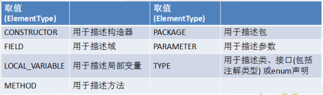

###### 2. @Retention

作用：表示需要什么级别保存该注释信息，用于描述注解的生命周期

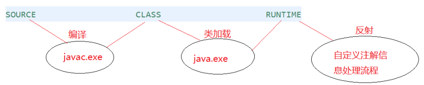

###### 3. @Documented

作用：表名这个注解应该被javadoc工具记录，默认情况下，javadoc是不包括注解的，若指定，会被处理

###### 4. @Inherited

作用： 允许子类继承父类中的注解


### Java异常处理

###### 异常的分类：

- 编译时异常(受检异常Checked) 

  指程序中必须接受检查和处理的异常，由Exception类表示

- 运行时异常 (非受检异常UnChecked)

  程序中可以不接受检查和处理，或致命性错误异常，由RuntimeException或Error

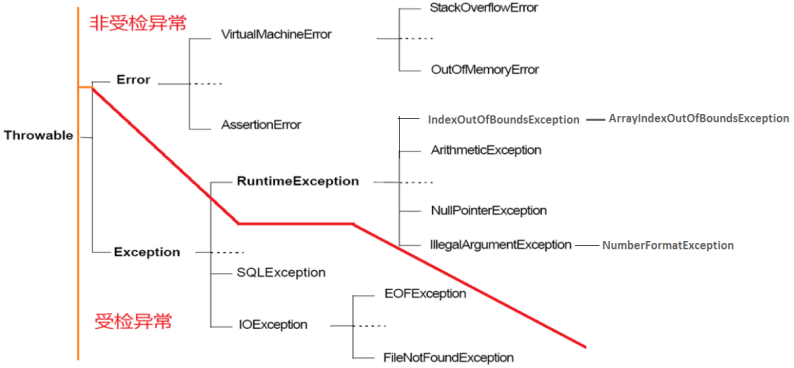

###### Throwable

```
Throwable类是Java语言中所有错误或异常的超类，两个子类的实例：Error和Exception，通常用于指示发生了异常情况。
```

###### Error

```
Error在正常情况下，不大可能出现的情况，绝大部分的Error都会导致程序处于非正常、不可恢复状态
```

###### Exception

```
Exception是程序中正常运行中，可以预料道德意外情况，可以被捕获，进行相关的处理
```

- checkedException: 受检异常，这一类异常，编译时必须对其进行处理，如果不处理，编译不通过
- RuntimeException:  (uncheckedException): 运行时异常(非受检异常), 不可检查异常就是运行时异常，类似NullPointerException、ArrayIndexOutOfBoundsException，通常是可以通过编码避免的逻辑错误，具体根据需要判断是否需要捕获，并不会在编译期强制要求

###### 异常处理机制

```
try{
    
}catch(<异常类型>(异常引用变量)){
    //引发相应异常触发的部分
}finally{
    //无论如何都会执行的部分
}
```

###### 显示声明抛出异常(throws)

```
	public static void readFile(String filename) throws FileNotFoundException,IOException{
		FileReader fr = new FileReader("d:/a.txt");
		char c = (char) fr.read();
		System.out.println(c);
		fr.close();
	}
```

###### 重写方法对throws异常的要求

重写方法不能抛出比被重写方法范围更大的异常类型，多态的情况下，对重写方法的调用--异常的捕获按父类声明的异常处理,

-  父类被重写的方法没有声明抛出checked受检异常，那么重写的方法也不能声明抛出异常
- 子类重写方法声明抛出的异常类型和父类被重写的方法声明抛出异常类型一致或是子类
- 子类重写方法可以在方法内部处理异常，而不声明抛出异常

###### 手动抛出异常throw

Java异常类对象在程序执行过程中出现异常时由系统自动生成并抛出，也可根据需要手动创建并抛出，可以抛出的异常必须是Throwable或子类的实例

```java
throw 异常对象
```

throw语句可以替代return 语句结束方法

```java
public class TestThrow {
	public static void check(String username,String password){
		if(username==null || "".equals(username.trim())){
			throw new RuntimeException("用户名不能为空");
		}
		if(password==null || "".equals(password.trim())){
			throw new RuntimeException("密码不能为空");
		}
	}
}
```

##### 自定义异常

程序中，可能会根据自己的需求进行创建自己的异常类

- 从Exception类或它的子类派生一个子类即可

- 习惯上，自定义异常应该包含2个构造器：一个无参构造，另一个是带有详细的构造器

- 自定义的异常只能通过throw抛出

  ```
  class WrongUsernameOrPassWordException extends Exception{
  	private static final long serialVersionUID = 1L;
  
  	public WrongUsernameOrPassWordException() {
  		super();
  	}
  
  	public WrongUsernameOrPassWordException(String message) {
  		super(message);
  	}
  }
  ```

  

### 常用类

##### 包装类Wrapper

> 将基本数据类型转为对象,便于操作

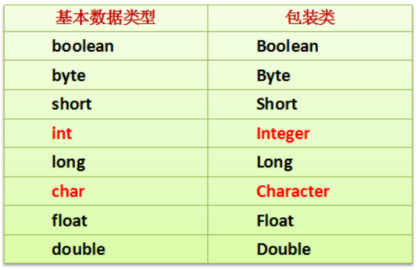

###### 自动装箱与自动拆箱

自动装箱：基本数据类型自动的封装到包装类中

自动拆箱：包装类对象自动转换成基本数据类型

###### 包装类的作用：

1. 数据类型的范围

   ​	MIN_VALUE, MAX_VALUE

2. 数据类型的转换

   - 字符串转包装类

     - 使用包装类的构造方法 : Integer t2=new Integer("500")

     - 使用包装类的valueOf方法： Integer i=Integer.valueOf("500");

   - 字符串转成基本数据类型:
     - parseXxx(String s)静态方法: int i=Integer.parseInt("500");

###### 缓存问题

> 有一些值可能大量使用，如果每次在堆中开辟，相当不划算

```
byte Byte -128–127
short Short -128–127
int Integer -128—127
long Long -128—127
float Float 不缓存
double Double 不缓存
char Character 0–127
boolean Boolean  true,false
```

#### 字符串String类

###### String特点

-  String是个final类

-  String是不可变的字符序列: 底层使用final char value[] 数组存储

###### String 对象的创建:

- String str ="hello"

- 通过String类的构造器

  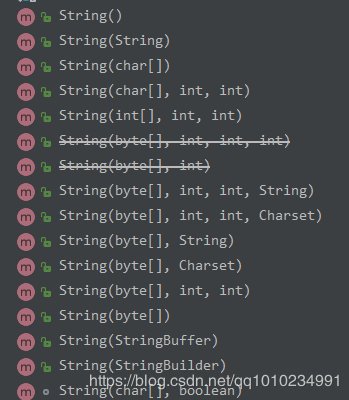

###### String字符串拼接

- 常量与常量的拼接结果在常量池
- 只要有一个是变量，结果就在堆中
- 如果拼接的结果调用 intern() 方法，结果就在常量池中

###### String对象的比较

- == 比较的是地址
- equals比较的是字符串的内容，重写了Object的equals方法

###### String类的常用方法

```java
int length():返回字符串的长度
boolean isEmpty():判断是否是空字符串
char charAt(int index): 返回某索引处的字符
String trim()：返回字符串的副本，忽略前导空白和尾部空白。
boolean endsWith(String suffix)：测试此字符串是否以指定的后缀结束。 
boolean startsWith(String prefix)：测试此字符串是否以指定的前缀开始。
String substring(int beginIndex, int endIndex) 
          返回一个新字符串，它是此字符串从beginIndex开始截取到endIndex(不包含)的一个子字符串
String[] split(String regex)：根据给定正则表达式的匹配拆分此字符串。
int indexOf(String str)：返回str的索引
```


```
concat : 字符串连接，返回连接后的字符串
equals :比较字符序列是否相同，区分大小写
equalsIgnoreCase: 比较字符序列是否相同， 不区分大小写
toUpperCase: 全部转为大写
toLowerCase: 全部转为小写
indexOf : 首次出现的位置索引，没有返回-1
lastIndexOf : 最后一次出现的位置索引
replace : 提出按字符串
compareTo： 字符串比较大小
contains : 是否包含指定参数的字符串，包含true, 不包含false
toCharArray(): 把字符串转为字符数组
```

##### 可变字符序列： 字符串缓冲区

###### StringBuffer， StringBuilder， String的区别

- String : 定长字符串，每次修改实质上都会生成一个新的对象
- StringBuffer: 线程安全的，效率相对低些
- StringBuilder: 非线程安全的，效率相对高些

##### StringBuffer 和StringBuilder不同的api

###### 构造器

```
StringBuffer或StringBuilder对象的创建必须用new+构造器。
StringBuffer()   初始容量为16的字符串缓冲区
StringBuffer(int size)   构造指定容量的字符串缓冲区
StringBuffer(String str)  将内容初始化为指定字符串内容
```

###### 字符串序列改变相关方法

```
StringBuffer append(xx)：提供了很多的append()方法，用于进行字符串拼接
StringBuffer delete(int start,int end)：删除指定位置的内容
StringBuffer insert(int offset, xx)：在指定位置插入xx
StringBuffer replace(int start, int end, String str)：把[start,end)位置替换为str
StringBuffer reverse() ：把当前字符序列逆转
```

##### System系统类

System类包含一些有用的类字段和方法，它不能被实例化

###### 常用方法

```
void arraycopy(Object src, int srcPos, Object dest, int destPos, int length) ：从指定源数组中复制一个数组，复制从指定的位置开始，到目标数组的指定位置结束。
long currentTimeMillis() ：返回以毫秒为单位的当前时间。  
void exit(int status) ：终止当前正在运行的 Java 虚拟机。
void gc()：运行垃圾回收器。  
Properties getProperties()：确定当前的系统属性。 
String getProperty(String key)：获取指定键指示的系统属性。 
void setErr(PrintStream err) ：重新分配“标准”错误输出流。 
void setIn(InputStream in)：重新分配“标准”输入流。 
void setOut(PrintStream out)：重新分配“标准”输出流。 
String setProperty(String key, String value) ：设置指定键指示的系统属性。
```

##### Java.text.DateFormat 和SimpleDateFormat

作用：完成字符串和时间对象的转换

- String format(date)
- Date parse(string)

```
	public static void main(String[] args) {
		Date date = new Date();
		SimpleDateFormat sf = new SimpleDateFormat("yyyy-MM-dd HH:mm:ss 是本年的第几D");
		System.out.println(sf.format(date));
		
		String s = "2016-12-01 14:12:23";
		SimpleDateFormat sf2 = new SimpleDateFormat("yyyy-MM-dd HH:mm:ss");
		try {
			Date d = sf2.parse(s);
			System.out.println(d);
		} catch (ParseException e) {
			e.printStackTrace();
		}
	}
```

##### 比较器：自然排序与定制排序

###### 自然排序：Java.lang.Comparable

Comparable接口强行对实现它的每个类的对象进行整体排序，这种排序被称为类的自然排序，compareTo(T t)被称为自然比较方法

###### 定制排序：java.util.Comparator

当元素的类型没有实现java.lang.Comparable接口而又不方便修改代码，或者实现了java.lang.Comparable接口的排序规则不适合当前的操作，那么就可以考虑使用Comparator对象来排序


##### JDK1.8新增日期时间类型

###### java.time:本地日期(LocalDate), 本地时间(LocalTime) ,本地日期时间(LocalDateTime)

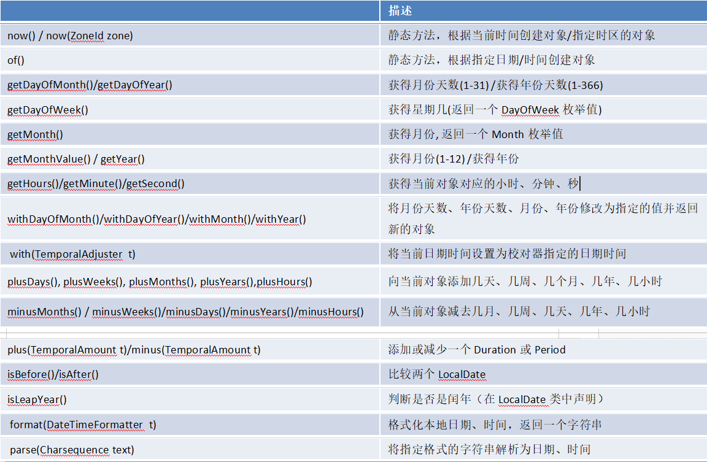


### 集合框架

###### 数组

- 逻辑结构： 线性的
- 物理结构：顺序的存储结构，一次申请一大段连续的空间，申请后，内存固定
- 优缺点
  - 优点：按索引查询效率高
  - 缺点：添加/删除效率低，都需要移动元素


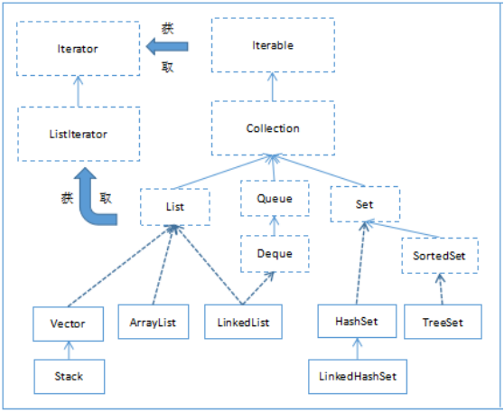

- Collection:


> Collection是一个接口，是高度抽象出来的集合，JDK不提供此接口的任何直接实现，它提供更具体的子接口（如Set何List，Queue）实现

```
public interface Collection<E> extends Iterable<E> {
...
}
```

- List :有序的collction, 可以通过索引对插入进行精确控制，也可以更具元素的索引，访问元素

```
List的实现类有：LinkedList, ArrayList, Vector, Stack
```

- Queue:
  队列，通常以FIFO方式排序各个元素，优先级队列和LIFO(栈)除外
- Set:
  Set是一个不允许有重复元素的集合。
  Set的实现类有HastSet和TreeSet。HashSet依赖于HashMap，它实际上是通过HashMap实现的；TreeSet依赖于TreeMap，它实际上是通过TreeMap实现的。

- Map
  Map是一个映射接口，即key-value键值对。Map中的每一个元素包含“一个key”和“key对应的value”。
  AbstractMap是个抽象类，它实现了Map接口中的大部分API。而HashMap，TreeMap，WeakHashMap都是继承于AbstractMap。
  Hashtable虽然继承于Dictionary，但它实现了Map接口。


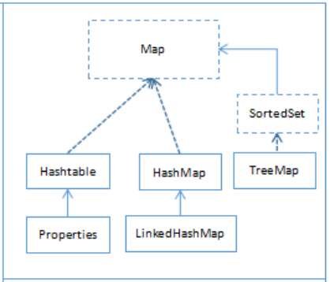

###### 集合常用方法

- 添加元素

```
add(Object obj):
addAll(Collection other):
```

- 删除元素

  ```java
  boolean remove(Object obj): 从当前集合中删除第一个
  Boolean removeAll(Collection coll): 从当前集合中删除所有与coll集合中相同的元素
  ```

- 判断元素

  ```java
  boolean isEmpty()
  boolean contains(Object obj): //判断是否包含
  boolean containsAll(Collection c):判断c集合中元素是否都在
  ```

- 其他

   ```java
   int size()： 获取当前集合中实际存储的元素个数
   boolean retainAll(Collection c):当前集合仅仅保留与C集合中的元素相同的元素
   Object[] toArray(): 返回包含当前集合中所有元素的数组
   ```

    

##### Collection集合的遍历

###### foreach循环遍历

> 特点：只适用于查看/查找集合中的元素，不能再遍历集合时删除或增加元素

```
Collection coll = new ArrayList();
coll.add(1);
coll.add(2);
coll.add(3);
coll.add(4);

for(Object obj : coll){
System.out.println(obj);
}
```

###### Iterator迭代器遍历

Collection接口继承了java.lang.Iterable接口，该接口有一个iterator()方法，那么所有实现了Collection接口的集合类都有一个iterator()方法，返回一个实现Iterator接口的对象，用于迭代集合中的元素

常用方法:

- boolean hashNext(): 还有元素迭代，返回true
- Object next():返回迭代的下一个元素
- void remove(): 从迭代器指向的collection中移除迭代器返回的最后一个元素

##### List集合

> List集合类中元素有序，且可重复，

###### List接口的方法

List除了从Collection集合继承的方法外，list集合里添加了一些根据索引操作集合元素的方法

1. 添加元素

​	n void add(int index, Object ele)

​	n boolean addAll(int index, Collection eles)

2. 获取元素

   n Object get(int index)

   n List subList(int fromIndex, int toIndex)

3. 获取元素索引

   n int indexOf(Object obj)

   n int lastIndexOf(Object obj)

4. 删除和替换元素

   n Object remove(int index)

   n Object set(int index, Object ele)

###### List接口的实现类

- Vector ：动态数组
- ArrayList类： 动态数组
- Stack类： 堆栈
- LinkedList： 双向链表，从JDK1.6之后又实现了双端队列

#### **ArrayList与Vector的区别与联系？**

-  它们的底层物理结构都是数组，我们称为动态数组。

- 数组的初始化容量，如果在构建ArrayList与Vector的集合对象时，没有显式指定初始化容量，那么Vector初始化为10，而ArrayList在JDK1.6时也是10，而之后的版本初始化为默认的空数组，如果ArrayList一开始初始化为默认的空数组，那么添加第一个元素时，扩容为默认大小为10的数组。

- 之后当容量不够时，ArrayList扩容增加原来的50%，Vector扩容增加原来的1倍或按照用户指定的capacityIncrement增长。

- ArrayList线程不安全，效率高，Vector线程安全，效率低。

-  Vector因为版本古老，支持Enumeration 迭代器。但是该迭代器不支持快速失败。而Iterator和ListIterator迭代器支持快速失败。如果在迭代器创建后的任意时间从结构上修改了向量（通过迭代器自身的 remove 或 add 方法之外的任何其他方式），则迭代器将抛出 ConcurrentModificationException。因此，面对并发的修改，迭代器很快就完全失败，而不是冒着在将来不确定的时间任意发生不确定行为的风险。

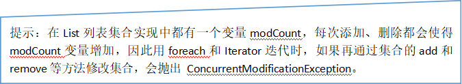

#### **2、Vector与Stack的区别与联系？**

​	Stack类是Vector的子类。

​	Stack类表示后进先出（LIFO）的对象堆栈。它通过五个操作对类 Vector 进行了扩展 ，允许将向量视为堆栈。它提供了通常的 push 和 pop 操作，以及取堆栈顶点的 peek 方法、测试堆栈是否为空的 empty 方法、在堆栈中查找项并确定到堆栈顶距离的 search 方法。

#### **3、LinkedList类**

​	除了实现 List 接口外，LinkedList 类还为在列表的开头及结尾 get、remove 和 insert 元素提供了统一的命名方法。这些操作允许将链接列表用作堆栈、队列或双端队列。

代码示例一：作为List的普通列表形式

```
	public static void main(String[] args) {
		LinkedList list = new LinkedList();
		list.add(1);
		list.add(2);
		list.add(3);
		list.add(4);
		list.add(5);
		
		for (Object object : list) {
			System.out.println(object);
		}
	}
```

JDK1.6之后LinkedList实现了Deque接口。双端队列也可用作 LIFO（后进先出）堆栈。如果要使用堆栈结构的集合，可以考虑使用LinkedList，而不是Stack。

| 堆栈方法 | 等效Deque方法                      |
| -------- | ---------------------------------- |
| push(e)  | addFirst(e)                        |
| pop()    | removeFirst()//删除栈顶元素        |
| peek()   | peekFirst() //获取栈顶元素，不删除 |

代码示例二：

```java
	public static void main(String[] args) {
		LinkedList list = new LinkedList();
		//入栈
		list.addFirst(1);
		list.addFirst(2);
		list.addFirst(3);
		
		//出栈： LIFO（后进先出）
		System.out.println(list.removeFirst());//3
		System.out.println(list.removeFirst());//2
		System.out.println(list.removeFirst());//1
		//栈空了，会报异常java.util.NoSuchElementException
		System.out.println(list.removeFirst());
	}
```

用作队列时，将得到 FIFO（先进先出）行为。将元素添加到双端队列的末尾，从双端队列的开头移除元素。

| Queue 方法 | 等效 Deque 方法 |
| ---------- | --------------- |
| add(e)     | addLast(e)      |
| offer(e)   | offerLast(e)    |
| remove()   | removeFirst()   |
| poll()     | pollFirst()     |
| element()  | getFirst()      |
| peek()     | peekFirst()     |

代码示例三：

```java
	public static void main(String[] args) {
		LinkedList list = new LinkedList();
		//入队
		list.addLast(1);
		list.addLast(2);
		list.addLast(3);
		
		//出队， FIFO（先进先出）
		System.out.println(list.pollFirst());//1
		System.out.println(list.pollFirst());//2
		System.out.println(list.pollFirst());//3
		//队空了，返回null
		System.out.println(list.pollFirst());//null
	}
```

每种方法都存在两种形式：一种形式在操作失败时抛出异常，另一种形式返回一个特殊值（null 或 false，具体取决于操作）。

|          | 第一个元素（头部） | 最后一个元素（尾部） |              |              |
| -------- | ------------------ | -------------------- | ------------ | ------------ |
| 抛出异常 | 特殊值             | 抛出异常             | 特殊值       |              |
| 插入     | addFirst(e)        | offerFirst(e)        | addLast(e)   | offerLast(e) |
| 移除     | removeFirst()      | pollFirst()          | removeLast() | pollLast()   |
| 检查     | getFirst()         | peekFirst()          | getLast()    | peekLast()   |

#### Set集合

​	Set接口是Collection的子接口，set接口没有提供额外的方法。因此Set集合支持的遍历方式和Collection集合一样：foreach和Iterator。

​	Set 集合不允许包含相同的元素，如果试把两个相同的元素加入同一个 Set 集合中，则添加操作失败。

​	Set的常用实现类有：HashSet、TreeSet、LinkedHashSet。

### **HashSet和LinkedHashSet**

​	HashSet 是 Set 接口的典型实现，大多数时候使用 Set 集合时都使用这个实现类。

​	HashSet 和LinkedHashSet按 Hash 算法来存储集合中的元素，因此具有很好的存取和查找性能。HashSet 和LinkedHashSet集合判断两个元素相等的标准：两个对象通过 hashCode() 方法比较相等，并且两个对象的 equals() 方法返回值也相等。因此，存储到HashSet和LinkedHashSet的元素要重写hashCode和equals方法。

​	LinkedHashSet是HashSet的子类，它在HashSet的基础上，在结点中增加两个属性before和after维护了结点的前后添加顺序。LinkedHashSet插入性能略低于 HashSet，但在迭代访问 Set 里的全部元素时有很好的性能。

代码示例：

```
//HashSet
HashSet set = new HashSet();
set.add("张三");
set.add("李四");
set.add("王五");
set.add("张三");
		
System.out.println("元素个数：" + set.size());
for (Object object : set) {
	System.out.println(object);
}
//linkedHashSet
LinkedHashSet set = new LinkedHashSet();
set.add("张三");
set.add("李四");
set.add("王五");
set.add("张三");
		
System.out.println("元素个数：" + set.size());
for (Object object : set) {
	System.out.println(object);
}
```

重写equals()方法的原则：

- 对称性：如果x.equals(y)返回是“true”，那么y.equals(x)也应该返回是“true”。

- 自反性：x.equals(x)必须返回是“true”。

-  类推性：如果x.equals(y)返回是“true”，而且y.equals(z)返回是“true”，那么z.equals(x)也应该返回是“true”。

- 一致性：如果x.equals(y)返回是“true”，只要x和y内容一直不变，不管你重复x.equals(y)多少次，返回都是“true”。

- 任何情况下，x.equals(null)，永远返回是“false”；x.equals(和x不同类型的对象)永远返回是“false”。

###### 重写 hashCode() 方法的基本原则

- 在程序运行时，同一个对象多次调用 hashCode() 方法应该返回相同的值

- 当两个对象的 equals() 方法比较返回 true 时，这两个对象的 hashCode() 方法的返回值也应相等

- 对象中用作 equals() 方法比较的属性Field，都应该用来计算 hashCode 值

### **TreeSet**

TreeSet 是 SortedSet 接口的实现类，TreeSet 可以确保集合元素处于排序状态。

使用元素的自然顺序(Comparable)对元素进行排序，或者根据创建 set 时提供的 Comparator 进行排序，具体取决于使用的构造方法。 

#### **1、自然排序**

如果试图把一个对象添加到 TreeSet 时，则该对象的类必须实现 Comparable 接口。实现 Comparable 的类必须实现 compareTo(Object obj) 方法，两个对象即通过 compareTo(Object obj) 方法的返回值来比较大小。对于 TreeSet 集合而言，它判断两个对象是否相等的唯一标准是：两个对象通过 compareTo(Object obj) 方法比较返回值为0。

代码示例一：

```
TreeSet set = new TreeSet();
set.add("zhangsan");  //String它实现了java.lang.Comparable接口
set.add("lisi");
set.add("wangwu");
set.add("zhangsan");
		
System.out.println("元素个数：" + set.size());
for (Object object : set) {
	System.out.println(object);
}
```

代码示例二：

```
public class TestTreeSet {
	public static void main(String[] args) {
		TreeSet set = new TreeSet();
		set.add(new Student(3,"张三"));  //Student实现了java.lang.Comparable接口
		set.add(new Student(1,"李四"));
		set.add(new Student(2,"王五"));
		set.add(new Student(3,"张三风"));
		
		System.out.println("元素个数：" + set.size());
		for (Object object : set) {
			System.out.println(object);
		}
	}
}
class Student implements Comparable{
	private int id;
	private String name;
	public Student(int id, String name) {
		super();
		this.id = id;
		this.name = name;
	}
	//......这里省略了get/set方法
	
@Override
	public int compareTo(Object o) {
		Student other = (Student) o;
		return this.id - other.id;
	}
	@Override
	public String toString() {
		return "Student [id=" + id + ", name=" + name + "]";
	}
}
运行结果：
元素个数：3
Student [id=1, name=李四]
Student [id=2, name=王五]
Student [id=3, name=张三]
```

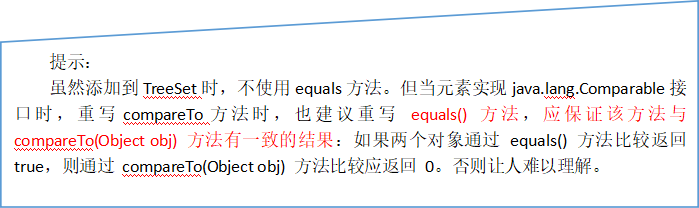

#### **2、定制排序**

​	如果放到TreeSet中的元素的自然排序（Comparable）规则不符合当前排序需求时，或者元素的类型没有实现Comparable接口。那么在创建TreeSet时，可以单独指定一个Comparator的对象。使用定制排序判断两个元素相等的标准是：通过Comparator比较两个元素返回了0。

代码示例：

```
public class TestTreeSet {
	public static void main(String[] args) {
		TreeSet set = new TreeSet(new Comparator(){

			@Override
			public int compare(Object o1, Object o2) {
				Student s1 = (Student) o1;
				Student s2 = (Student) o2;
				return s1.getId() - s2.getId();
			}
			
		});
		set.add(new Student(3,"张三"));
		set.add(new Student(1,"李四"));
		set.add(new Student(2,"王五"));
		set.add(new Student(3,"张三风"));
		
		System.out.println("元素个数：" + set.size());
		for (Object object : set) {
			System.out.println(object);
		}
	}
}
class Student{
	private int id;
	private String name;
	public Student(int id, String name) {
		super();
		this.id = id;
		this.name = name;
	}
	public int getId() {
		return id;
	}
	public void setId(int id) {
		this.id = id;
	}
	//......这里省略了name属性的get/set
	@Override
	public String toString() {
		return "Student [id=" + id + ", name=" + name + "]";
	}
}
运行结果：
元素个数：3
Student [id=1, name=李四]
Student [id=2, name=王五]
Student [id=3, name=张三]
```


## **Map集合**

#####  Map概述 

- Map 中的 key 和 value 都可以是任何引用类型的数据

- Map 中的 key 不允许重复

- key 和 value 之间存在单向一对一关系，即通过指定的 key 总能找到唯一的、确定的 value。

  Map 接口提供三种collection 视图，允许以键集、值集或键-值映射关系集的形式查看某个映射的内容。映射顺序 定义为迭代器在映射的 collection 视图上返回其元素的顺序。某些映射实现可明确保证其顺序，如 TreeMap 类；另一些映射实现则不保证顺序，如 HashMap 类。 

### **Map的方法**

1. 添加操作

- Object put(Object key,Object value)

- void putAll(Map t)

2. 删除

- void clear()

- Object remove(Object key)

3. 元素查询的操作

- Object get(Object key)

- boolean containsKey(Object key)

- boolean containsValue(Object value)

- boolean isEmpty()

4. 元视图操作的方法：

- Set keySet()

- Collection values()

- Set entrySet() 

5. 其他方法

- int size()

 

### **Map的遍历**

Collection集合的遍历：

（1）foreach（2）通过Iterator对象遍历

Map的遍历，不能支持foreach

（1）分开遍历：单独遍历所有key

​           单独遍历所有value

（2）成对遍历：遍历的是映射关系Map.Entry

Map.Entry是Map接口的内部接口。每一种Map内部有自己的Map.Entry的实现类

在Map中存储数据，实际上是将Key---->value的数据存储在Map.Entry接口的实例中，再在Map集合中插入Map.Entry的实例化对象，如图示： 

 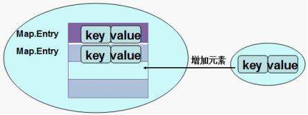

代码示例：

**public** **class** TestMap {	**public** **static** **void** main(String[] args) {		HashMap map = **new** HashMap();		map.put("许仙", "白娘子");		map.put("董永", "七仙女");		map.put("牛郎", "织女");		map.put("许仙", "小青");				System.**out**.println("所有的key:");		Set keySet = map.keySet();		**for** (Object key : keySet) {			System.**out**.println(key);		}				System.**out**.println("所有的value：");		Collection values = map.values();		**for** (Object value : values) {			System.**out**.println(value);		}				System.**out**.println("所有的映射关系");		Set entrySet = map.entrySet();		**for** (Object entry : entrySet) {			System.**out**.println(entry);		}	}}

```
public class TestMap {
	public static void main(String[] args) {
		HashMap map = new HashMap();
		map.put("许仙", "白娘子");
		map.put("董永", "七仙女");
		map.put("牛郎", "织女");
		map.put("许仙", "小青");
		
		System.out.println("所有的key:");
		Set keySet = map.keySet();
		for (Object key : keySet) {
			System.out.println(key);
		}
		
		System.out.println("所有的value：");
		Collection values = map.values();
		for (Object value : values) {
			System.out.println(value);
		}
		
		System.out.println("所有的映射关系");
		Set entrySet = map.entrySet();
		for (Object entry : entrySet) {
			System.out.println(entry);
		}
	}
}
```

### **Map的实现类**

Map接口的常用实现类：HashMap、TreeMap、LinkedHashMap和Properties。其中HashMap是 Map 接口使用频率最高的实现类。

#### **1、HashMap和Hashtable的区别与联系**

HashMap和Hashtable都是哈希表。

HashMap和Hashtable判断两个 key 相等的标准是：两个 key 的hashCode 值相等，并且 equals() 方法也返回 true。因此，为了成功地在哈希表中存储和获取对象，用作键的对象必须实现 hashCode 方法和 equals 方法。

Hashtable是线程安全的，任何非 null 对象都可以用作键或值。

HashMap是线程不安全的，并允许使用 null 值和 null 键。

#### **2、LinkedHashMap**

LinkedHashMap 是 HashMap 的子类。此实现与 HashMap 的不同之处在于，后者维护着一个运行于所有条目的双重链接列表。此链接列表定义了迭代顺序，该迭代顺序通常就是将键插入到映射中的顺序（插入顺序）。

#### **3、TreeMap**

基于红黑树（Red-Black tree）的 NavigableMap 实现。该映射根据其键的自然顺序进行排序，或者根据创建映射时提供的 Comparator 进行排序，具体取决于使用的构造方法。

#### **4、Properties**

Properties 类是 Hashtable 的子类，Properties 可保存在流中或从流中加载。属性列表中每个键及其对应值都是一个字符串。

存取数据时，建议使用setProperty(String key,String value)方法和getProperty(String key)方法。

代码示例：

```java
public static void main(String[] args) {
		Properties properties = System.getProperties();
		String p2 = properties.getProperty("file.encoding");//当前源文件字符编码
		System.out.println(p2);
	}
```


### 泛型

##### 泛型的引入

​	JDK1.5改写了集合框架中的全部接口和类，为这些接口，类增加了类型形参，这个类型形参将在声明变量，创建对象时确定，即传入实际的类型，成为类型实参，我们把**参数化的类型**称为泛型

```java
ArrayList<E> 中的<E>就是类型形参
```

###### 定义泛型类，接口

```
public class ArrayList<E>{
    public boolean add(E e){
    }
}

public interface Iterator<E>{
    boolean hasNext();
    E next();
}
```

> 泛型类或泛型接口上的泛型形参， 不能用于声明静态变量，也不能用在静态方法中

###### 泛型实参的要求

> 泛型实参必须是引用数据类型，不能是基本数据类型，因为集合中只能存储对象

###### 什么时候指定泛型实参

> 1. 在用泛型类，接口声明变量时
> 2. 在继承泛型类或实现泛型接口时，如果子类不延续使用该泛型，必须明确指出实际类型，此时子类不在是泛型类

###### 定义泛型方法

> [修饰符] <泛型形参列表>  返回类型  方法名([形参列表]) 抛出的异常列表{	
>
> }

###### 设定类型通配符的上限

> <? extends Type > ：通配符表示必须是Type本身，或是Type的子类

###### 设定通配符的线下

> <? super Type> ：表示必须是Type本身或是Type的父类


#### Collections工具类

Collections是一个操作Set，List，Map等集合的工具类，Collections中提供了一些列静态的方法对集合元素进行排序，查询和修改等操作，还提供了对集合对象设置不可变，对集合中对象实现同步控制等方法

```
1. public static <T> boolean addAll(Collection<? super T> c,T... elements)将所有指定元素添加到指定 collection 中。
2. public static <T> int binarySearch(List<? extends Comparable<? super T>> list,T key)在List集合中查找某个元素的下标，但是List的元素必须是T或T的子类对象，而且必须支持自然排序的。而且集合也事先必须是有序的，否则结果不确定。
3. public static <T> int binarySearch(List<? extends T> list,T key,Comparator<? super T> c)在List集合中查找某个元素的下标，但是List的元素必须是T或T的子类对象，而且集合也事先必须是按照c比较器规则进行排序过的，否则结果不确定。
4. public static <T extends Object & Comparable<? super T>> T max(Collection<? extends T> coll)在coll集合中找出最大的元素，集合中的对象必须是T或T的子类对象，而且支持自然排序
5. public static <T> T max(Collection<? extends T> coll,Comparator<? super T> comp)在coll集合中找出最大的元素，集合中的对象必须是T或T的子类对象，按照比较器comp找出最大者
6. public static void reverse(List<?> list)反转指定列表List中元素的顺序。
7. public static void shuffle(List<?> list) List 集合元素进行随机排序，类似洗牌
8. public static <T extends Comparable<? super T>> void sort(List<T> list)根据元素的自然顺序对指定 List 集合元素按升序排序
9. public static <T> void sort(List<T> list,Comparator<? super T> c)根据指定的 Comparator 产生的顺序对 List 集合元素进行排序
10. public static void swap(List<?> list,int i,int j)将指定 list 集合中的 i 处元素和 j 处元素进行交换
11. public static int frequency(Collection<?> c,Object o)返回指定集合中指定元素的出现次数
12. public static <T> void copy(List<? super T> dest,List<? extends T> src)将src中的内容复制到dest中
13. public static <T> boolean replaceAll(List<T> list，T oldVal，T newVal)：使用新值替换 List 对象的所有旧值
14. Collections 类中提供了多个 synchronizedXxx() 方法，该方法可使将指定集合包装成线程同步的集合，从而可以解决多线程并发访问集合时的线程安全问题
15. Collections类中提供了多个unmodifiableXxx()方法，该方法返回指定 Xxx的不可修改的视图。
```

### I/O

##### java.io.File类

> File类是java.io包下代表与平台无关的文件和目录，File类能新建，删除，重命名文件和目录

File类只是文件或目录的路径，而不是文件本身

###### 路径名

File类可以使用文件路径字符串创建FIle实例

- String getName():返回此File对象所表示的文件名
- String getPath(): 返回此File对象所对应的路径名
- String getAbsolutePath()：返回此File对象所对应的绝对路径名。
- File getAbsoluteFile()：返回此File对象所对应的绝对路径名所对应的File对象
-  String getCanonicalPath()：返回此File对象所对应的规范路径名。所谓规范路径名，即对路径中的“..”等进行解析后的路径名。
-  File getCanonicalFile()：返回此File对象所对应的规范路径名所对应的File对象
- String getParent()：返回此File对象的父目录名
- File getParentFile()：返回此File对象的父目录名所对应的File对象

###### 文件和目录检测方法：

- boolean exists()：判断File对象对应的文件或目录是否存在
-  canRead()：判断File对象对应的文件或目录是否可读
-  canWrite()：判断File对象对应的文件或目录是否可写
-  isHidden()：判断File对象对应的文件或目录是否是否隐藏
-  isFile()：判断File对象对应的是否是文件
-  isDirectory()：判断File对象对应的是否是目录
-  isAbsolute()：判断File对象对应的文件或目录是否是绝对路径

- long lastModified(): 返回FIle对象对应的文件或目录的最后修改时间
- long length(): 返回FIle对象对应的文件的内容的长度，如果File对象对应的是目录，结果是不确定的

#### 操作文件

##### 创建文件

- 创建文件: 

```java
boolean createNewFile() throws IOException //如果指定的文件不存在并成功的创建，返回true,若已存在，返回false
```

- 创建临时文件(通常会结合deleteOnExit()使用)

  ```
  public static File createTempFile(String prefix,String suffix) throws IOException //
  ```

  

```
	@Test
	public void test3() throws IOException{
		File tempFile = File.createTempFile("Hello", ".tmp");
		System.out.println(tempFile.getAbsolutePath());
	}
```

###### 删除文件

boolean delete(): 当且仅当成功删除文件时，返回true, 否则返回false

public void deleteOnExit(): 当退出jvm时，删除文件，一般用于删除临时文件

```java
	@Test
	public void test3(){
		File tempFile = File.createTempFile("Hello", ".tmp");
		tempFile.deleteOnExit();
	}
```

###### 文件重命名

boolean renameTo(File dest):

###### 创建目录

boolean mkdir(): 必须确保父目录存在，否则创建失败

boolean mkdirs() : 如果父目录链不存在，会一同创建父目录链

###### 列出目录内容

public String[] list(): 列出当前目录的下级目录或文件的名称

public File[] listFiles() : 列出当前目录的下级目录或文件对应的File对象--配合递归，列出所有

```java
public void listSubFiles(File dir) {
		if (dir != null && dir.isDirectory()) {
			File[] listFiles = dir.listFiles();
			if (listFiles != null) {
				for (File sub : listFiles) {
					listSubFiles(sub);
				}
			}
		}
		System.out.println(dir);
	}
```

###### 删除目录

Boolean delete(): 只能删除空目录，否则需要先清除目录下的内容

```java
public void forceDeleteDir(File dir) {
		if (dir != null && dir.isDirectory()) {
			File[] listFiles = dir.listFiles();
			if(listFiles!=null){
				for (File sub : listFiles) {
					forceDeleteDir(sub);
				}
			}
		}
		dir.delete();
	}
```

#### java.io包中的IO流

###### 最基本分类：4个

- 字节输入流： InputStream
- 字节输出流： OutputStream
- 字符输入流：Reader
- 字符输出流：Writer


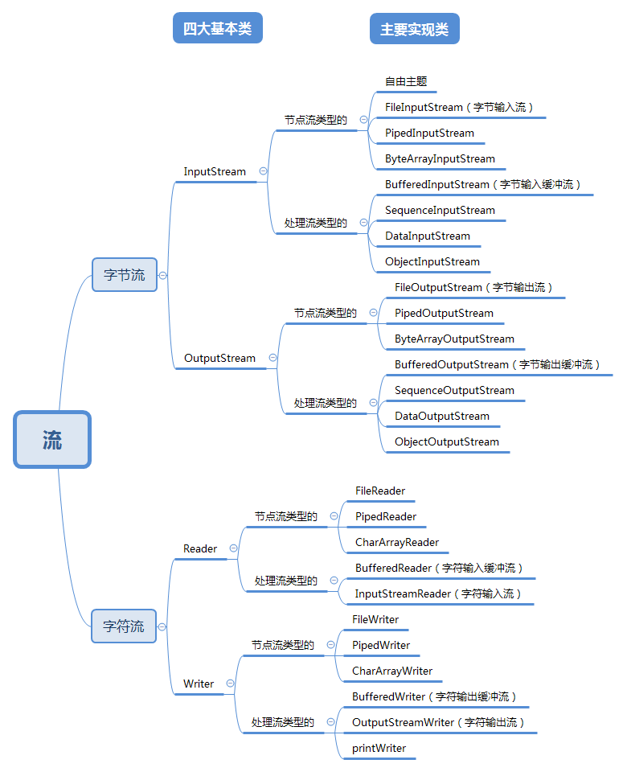

- 文件IO 
  - 从文件读取：FileInputStream/FileReader
  - 写入文件： FileOutputStream /FileWriter
- 缓冲IO流

  - 读取 : BufferedInputStream /BufferedReader

  - 写入：BufferedOutputStream/BufferedWriter
- 转换流(带有编解码功能) 

  - 读取，解码： InputStreamReader

  - 写入，并编码：InputStreamWriter
- 数据流(与机器无关方式读取基本java数据类型)
  - 读取： DataInputStream
  - 写入： DataOutputStream

- 对象流

  - 序列化： ObjectOutputStream
  - 反序列化：ObjectInputStream

- 打印流
  - PrintStream
  - PrintWriter

##### 抽象基类常用方法

###### InputStream

- int read(): 从输入流中读取的下一个字节,返回0-255范围内的int字节值，到达文件末尾，则返回-1
- int read(byte[] b): 从此输入流中将最多b.length个字节数据读取到byte[]数组中，-1表示到达末尾
- int read(byte[] b,int off,int len): 输入最多Len个数据字节读取到byte[]数组中，可指定偏移位置
- public void close() throws IOException: 关闭输入流并释放资源

###### OutputStream

- void write(int b): 将指定的字节写入输出流
- void write(byte[] b): 将b.length个字节从指定的byte数组写入到输出流中
- void write(byte[] b,int off, int len): 将byte[]数组从偏移量off开始的len个字节写入到输出流中
- public void flush() throws IOException: 刷新此输出并强制写出所有字节
- public void close() throws IOException: 关闭输出流并释放资源

###### **Reader**

- int read()

读取单个字符。作为整数读取的字符，范围在 0 到 65535 之间 (0x00-0xffff)（2个字节的Unicode码），如果已到达流的末尾，则返回 -1 

- int read(char[] cbuf)

将字符读入数组。如果已到达流的末尾，则返回 -1。否则返回本次读取的字符数。

- int read(char[] cbuf,int off,int len)

将字符读入数组的某一部分。存到数组cbuf中，从off处开始存储，最多读len个字符。如果已到达流的末尾，则返回 -1。否则返回本次读取的字符数。

- public void close() throws IOException关闭此输入流并释放与该流关联的所有系统资源。 

###### **Writer**

- void write(int c)、Writer append(char c)

写入单个字符。要写入的字符包含在给定整数值的 16 个低位中，16 高位被忽略。 即写入0 到 65535 之间的Unicode码。

- void write(char[] cbuf)、Writer append(CharSequence csq)

写入字符数组。 

- void write(char[] cbuf,int off,int len)、Writer append(CharSequence csq, int start, int end)

写入字符数组的某一部分。从off开始，写入len个字符

- void write(String str)

写入字符串。 

- void write(String str,int off,int len)

写入字符串的某一部分。

- void flush()

刷新该流的缓冲，则立即将它们写入预期目标。

- public void close() throws IOException关闭此输出流并释放与该流关联的所有系统资源

###### **IO流使用步骤**

> 1. 选择IO: 查看需要input还是output
>
>    如果写到文件中：FileInput/OutputStream FileWriter/FileReader
>
>    如果写到内存数组中：ByteArrayInput/OutputStream , CharArrayReader/CharArrayWriter
>
>    如果发送到网络中：Input/OutputStream
>
> 2. 选择字节流还是字符流
>
> 3. 是否需要其他附属功能：
>
>    缓冲读写：BufferedReader/Writer  BufferedInputStream/OutputStream
>
>    按行读写：BufferedReader, PrintStream, PrintWriter
>
>    是否以机器无关方式读取Java数据类型：DataInputStream /DataOutputStream
>
>    序列化/反序列化： ObjectInputStream/OutputStream
>
>    是否需要编解码：InputStreamReader/OutPutStreamWriter


###### JDK1.7新特性

```
try..with..resources
```

格式

```
try(声明需要关闭的资源对象){
    逻辑代码
}catch(异常类型 e){
    异常处理代码
}
```

### 多线程

###### 进程

几乎所有操作系统都支持进程的概念，所有运行中的任务通常对应一条进程，当一个程序进入内存运行，即编程一个进程，进程是处于运行过程中的程序，并且具有一定独立功能，**进程是操作系统进程资源分配和调度的一个独立单位**

进程三个特性：

- 独立性：进程是操作系统进行资源分配和调度的一个独立单位，每个进程都拥有自己私有的地址空间
- 动态性：程序只是一个静态的指令的集合，而进程是一个正在系统中运行的活动的指令集合，**即进程是处于运行过程中的程序**
- 并发性：多个进程可以在单个处理器上并发执行，多个进程之间不会相互影响

目前大多数采用效率更高的抢占式多任务策略，对于一个CPU而言，在某个时间点上只能执行一个程序，也就是只能运行一个进程，CPU不断的在这些进程之间轮换执行(轮换速度快，人感受不到)

###### 线程

线程使得一个进程可以同时并发处理多个任务，线程(Thread)也成为轻量级进程，就像进程在操作系统中地位一样，线程在进程中也是独立的，并发的执行流

​	线程的执行也是**抢占式**的,也就是说，当前运行的线程在任何时候都可以被挂起，以便两一个线程可以运行，我们说CPU在不同的进程之间轮换，进程有在不同的线程之间轮换，因此**线程是CPU执行和调度的最小单元**

###### 并发和并行

并发性和并行性是两个概念，并行是指同一个时刻，有多条指令在多个处理器上同时执行，并发指同一时刻只能有要一个指令执行，但多个进程的指令被快速轮换执行，使得宏观上有多个进程同时执行的效果

##### 线程的创建和启动

> Java使用Thread类代表线程，所有线程对象都必须是Thread类或子类，run方法就是线程执行体

###### 方式一： 继承Thread类创建线程类

1. 继承Thread的子类，重写run() 方法

2. 创建Thread子类的实例，一个实例对象就是一个线程

3. 调用线程对象的start()启动线程

   ```java
   public class ThreadTest {
       public static void main(String[] args) {
           Mythread mythread = new Mythread();  //创建线程
           mythread.start(); //调用start()方法
       }
   }
   
   class Mythread extends Thread {
       //重写run方法
       @Override
       public void run() {
           for (int i = 0; i < 10; i++) {
               System.out.println(super.getName() + "线程:" + i);
           }
       }
   }
   ```

   - Thread.currentThread() 返回当前在执行的线程对象

   - getName()方法返回当前线程对象的名称，可以通过setName(String name)方法设置线程名称

   - 启动线程用start()方法，系统会自动调用run()方法当成线程执行体来处理

     

###### 方式二：实现Runnable接口

​	实现Runnable接口来创建并启动多线程的步骤

- 定义Runnable接口的实现类，并重写该接口的run()方法
- 创建Runable实现类的对象
- 创建Thread类对象，并将Runnable实现类对象作为参数，传递给Thread，然后调用start()方法启动线程

```
public class ThreadTest2 {
    public static void main(String[] args) {
        MyRunnable myRunnable = new MyRunnable();
        new Thread(myRunnable).start();
    }
}

class MyRunnable implements Runnable {
    //重写run()方法
    @Override
    public void run() {
        for (int i = 0; i < 10; i++) {
            System.out.println(Thread.currentThread().getName() + "线程:" + i);
        }
    }
}
```

##### 线程的生命周期

一个完整的声明周期通常有五个状态： 新建(new) 就绪(Runnable) 运行(Running) 阻塞(Blocked) 死亡(Dead), CPU需要在多条线程之间切换，于是线程状态会多次在运行，阻塞，就绪之间切换

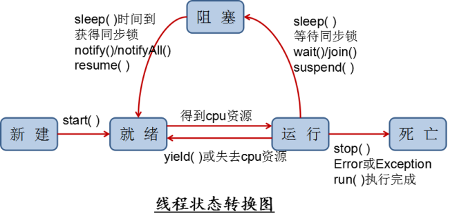

###### 新建

​	当一个Thread类或自雷对象被声明并创建时，新生的线程对象处于新建状态,仅仅由JVM为其分配了内存，并初始化了实例变量的值,此时也没有调用run()方法

###### 就绪

​	当线程对象调用start()方法之后，线程从新建状态转为就绪状态，JVM会为其创建方法调用栈和程序计数器，处于就绪状态的线程并没有开始运行，只是表示已经具备了运行的条件，随时可以被调度，至于什么时候被调用，取决于JVM中的线程调度器的调度

###### 运行

​	处于就绪状态的线程获得了CPU,开始执行run()方法的线程体代码，多个处理器，将会有多个线程并行执行,对于抢占式策略的系统而言，系统会给每个可执行的线程一段时间处理任务，当该事件用完，系统会剥夺线程所占用的资源，让其回到就绪状态等待下一次被调度，

###### 阻塞

​	当运行过程中的线程遇到如下情况，会进入阻塞状态	

- 线程调用sleep()方法

- 调用一个阻塞式IO方法，在该方法返回之前，该线程被阻塞

- 线程获取同步锁,

- 调用wait() /join()方法

  当发生如下情况时，会解除阻塞，让线程重新进入就绪状态，等待线程调度器再次调度它

- 线程sleep()睡眠时间到
- 线程调用的阻塞时IO方法返回
- 线程成功获取的同步锁
- wait后得到通知notify() /join()的线程结束了

###### 死亡

- run()方法执行完成，线程正常结束
- 线程执行过程中抛出一个未捕获的异常(Exception)或错误(Error)
- 直接调用该线程的stop()方法结束该线程(已过时，容易产生思索)

可以调用线程的isAlive()方法判断该线程是否死亡，当线程处于就绪，运行，阻塞三种状态，返回true, 当线程处于新建，死亡两种状态时，该方法返回false

##### Thread类的方法

###### 创建线程对象

###### **构造器：**

​	①　Thread()：创建新的Thread对象

​	②　Thread(String threadname)：创建线程并指定线程实例名

​	③　Thread(Runnable target)：指定创建线程的目标对象，它实现了Runnable接口中的run方法

​	④　Thread(Runnable target, String name)：创建新的Thread对象 

###### **编写线程体和启动线程：**

​	①　public void run()：子类必须重写run()以编写线程体

​	②　public void start()：启动线程                     


###### 获取和设置线程信息

- public static Thread currentThread(): 静态方法，返回当前执行的线程对象

- public final boolean isALive():判断线程是否处于活动状态，如果线程已经启动且未终止，则为活动状态

- public final String getName(): 返回当前线程的名字

- public final void setName(String name) : 设置当前线程的名称

- public final int getPriority() : 返回线程的优先级

- public final void setPriority(int new Priority) : 改变线程的优先级

  优先级[1,10] 通常推荐设置Thread三个优先级常量

  - MAX_PRIORITY（10）：最高优先级 
  - MIN _PRIORITY （1）：最低优先级
  -  NORM_PRIORITY （5）：普通优先级，默认情况下main线程具有普通优先级。

##### 控制线程

###### 线程睡眠：sleep

```
public static void sleep(long millis) 
```

###### 线程让步:yield

作用：可以正在执行的线程暂停，但不会阻塞该线程，只是将该线程转入就绪状态(效果不能完全保证)

```
Thread.yield()
```

###### 线程加塞join

作用：当在某个线程的线程体中调用了另一个线程的join()方法，当前线程将被阻塞,直到join进来的线程执行完成才继续

- void join():等待该线程终止
- void join(long millis):等待该线程终止的时间最长 millis冒号
-  void join(long millis, int nanos) ：等待该线程终止的时间最长为 millis 毫秒 + nanos 纳秒。 

###### 守护线程

在后台运行的线程，任务是为其他线程提供服务的，这种线程称为守护线程，JVM的垃圾回收线程就是典型的守护线程

- 特点：如果所有非守护线程都死亡，那么守护线程自动死亡
- 调用setDaemon(true)可将指定线程设置为守护线程
- isDaemon() 可判断线程是否是守护线程

###### 停止线程

Thread类提供stop() 方法停止线程--已过时不建议使用

- 可使用标记，进行判断--volatile关键字不会让编译器省略优化


##### 线程安全与线程同步

###### 同步代码块

```
synchronized (同步监视对象){}
```

- 选择共享资源对象作为锁
- 选择this对象作为同步监视器对象


###### 同步方法

定义：同步方法就是使用synchronized 关键字来修饰某个方法，则该方法称为同步方法

**静态方法的同步监视器对象是当前类的Class对象，非静态方法的同步监视器对象是this对象**

###### 线程安全的集合

```
Vector
```


##### 释放同步监视器的锁定

###### 释放锁的操作

- 当前线程的同步方法，同步代码块执行结束
- break, return 终止
- 出现未处理的Error, 或Exception
- 执行了wait() 方法， 当前线程被挂起，并释放锁

###### 不会释放锁的操作

- 调用Thread.sleep, Thread.yield() 方法暂停当前线程的执行
- suspend() 方法调用(避免使用)

###### 死锁

两个线程各拥有一个锁，都在等待对象释放锁


##### 线程通信

> Object类中提供了wait() , notify() , notifyAll() 

```java
public class Workbench {
	private static final int MAX_VALUE = 10;
	private int num;
	public synchronized void put() {
		while(num >= MAX_VALUE){
			try {
				this.wait();
			} catch (InterruptedException e) {
				e.printStackTrace();
			}
		}
		try {
			Thread.sleep(100);
			//加入睡眠时间是放大问题现象，去掉同步和wait等，可观察问题
		} catch (InterruptedException e) {
			e.printStackTrace();
		}
		num++;
		System.out.println("厨师制作了一份快餐，现在工作台上有：" + num + "份快餐");
		this.notifyAll();
	}
	public synchronized void take() {
		while(num <=0){
			try {
				this.wait();
			} catch (InterruptedException e) {
				e.printStackTrace();
			}
		}
		try {
			Thread.sleep(100);
			//加入睡眠时间是放大问题现象，去掉同步和wait等，可观察问题
		} catch (InterruptedException e) {
			e.printStackTrace();
		}
		num--;
		System.out.println("服务员取走了一份快餐，现在工作台上有：" + num + "份快餐");
		this.notifyAll();
	}
厨师和服务员线程的代码不变
package com.atguigu.part04;

public class TestManyAndMany {

	public static void main(String[] args) {
		Workbench bench = new Workbench();
		Cook c1 = new Cook(bench);
		Cook c2 = new Cook(bench);
		Waiter w1 = new Waiter(bench);
		Waiter w2 = new Waiter(bench);
		
		c1.start();
		c2.start();
		w1.start();
		w2.start();
	}

}
```

## 网络编程

###### 网络协议

OSI七层模型： 应用层，表示层，会话层，传输层，网络层，数据链路层，物理层

TCP/IP四层模型： 应用层，传输层，网络层，数据链路层

##### 基本的网络API

###### 使用InetAddress

​	此类表示互联网协议(IP)地址，它有两个子类，Inet4Address和Inet6Address,分别对应IPV4和IPV6，InetAddress类没有提供公共的构造器，而是提供了如下静态方法获取InetAddress实例

- public static InetAddress getLocalHost()

- public static InetAddress getByAddress(byte[] addr)

- public static InetAddress getByName(String host)

InetAddress提供了如下几个常用的方法：

- public String getHostAddress(): 返回IP地址字符串
- pulic String getHostName(): 获取IP地址的主机名
- public String getCanoicalHostName() : 获取IP地址的完全限定域名
- public boolean isReachable(int timeout): 测试是否可以到达该地址

###### 使用URL

URI: 统一资源标识符，用来唯一标识一个资源

URL： 统一资源定位符

```java
URL>URI
```

URL基本结构：

| <传输协议>://<主机名>:<端口号>/<文件名>#片段名    |
| ------------------------------------------------- |
| <传输协议>://<主机名>：<端口号>/<文件名>?参数列表 |


##### Socket

Socket叫做套接字网络通信其实就是Socket间的通信，Socket可分为

- 流套接字： 使用TCP提供可依赖的字节流服务
- 数据报套接字: 使用UDP提供数据报服务(不够安全)

Socket类常用构造方法：

- public Socket(InetAddress address, int port):创建一个流套接字并将其连接到指定IP地址的指定端口号

- public Socket(String host,int port) : 创建一个流套接字

###### Socket常用方法

- public InputStream getInputStream(): 返回此套接字的输入流，开用于接收消息
- public OutputStream getOutputStream(): 返回套接字的输出流，可以用于发送消息
- public InetAddress getInetAddress(): 获取套接字连接的IP地址
- public InetAddress getLocalAddress(): 获取套接字绑定的本地地址
- public int getPort(): 此套接字连接到的远程端口号，如果未连接套接字，返回0
- public int getLocalPort(): 返回绑定的本地端口号,未绑定返回0
- public void close():关闭套接字，

###### 基于TCP协议的网络编程

TCP(Transmission Control Protocol，传输控制协议)被称为一种端对端协议，是一种面向连接的，可靠的，基于字节流的传输层的通信协议，可以连续传输大量的数据


 **服务器程序的工作过程包含以下五个基本的步骤**：

1. 使用 ServerSocket(int port) ：创建一个服务器端套接字，并绑定到指定端口上。用于监听客户端的请求。
2. 调用 accept()方法：监听连接请求，如果客户端请求连接，则接受连接，创建与该客户端的通信套接字对象。否则该方法将一直处于等待状态。
3. 调用 该Socket对象的 getOutputStream() 和 getInputStream ()：获取输出流和输入流，开始网络数据的发送和接收。
4. 关闭Socket对象：某客户端访问结束，关闭与之通信的套接字。
5. 关闭ServerSocket：如果不再接收任何客户端的连接的话，调用close()进行关闭。


客户端Socket的工作过程包含以下四个基本的步骤：
1. 创建 Socket：根据指定服务端的 IP 地址或端口号构造 Socket 类对象，创建的同时会自动向服务器方发起连接。若服务器端响应，则建立客户端到服务器的通信线路。若连接失败，会出现异常。
2. 打开连接到Socket 的输入/出流：使用 getInputStream()方法获得输入流，使用 getOutputStream()方法获得输出流，进行数据传输。
3. 进行读/写操作：通过输入流读取服务器发送的信息，通过输出流将信息发送给服务器。
4. 关闭 Socket：断开客户端到服务器的连接


```
import java.net.ServerSocket;
import java.net.Socket;

public class Server {

	public static void main(String[] args)throws Exception {
		// 1、准备一个ServerSocket
		ServerSocket server = new ServerSocket(8888);
		System.out.println("等待连接...");
		
		int count = 0;
		while(true){
			// 2、监听一个客户端的连接
			Socket socket = server.accept();
			System.out.println("第" + ++count + "个客户端连接成功！！");
			
			ClientHandlerThread ct = new ClientHandlerThread(socket);
			ct.start();
		}
		
		//这里没有关闭server，永远监听
	}
}
```

```
import java.io.BufferedReader;
import java.io.IOException;
import java.io.InputStreamReader;
import java.io.PrintStream;
import java.net.Socket;

public class ClientHandlerThread extends Thread{
	private Socket socket;

	public ClientHandlerThread(Socket socket) {
		super();
		this.socket = socket;
	}
	
	public void run(){
		
		try{
			//（1）获取输入流，用来接收该客户端发送给服务器的数据
			BufferedReader br = new BufferedReader(new InputStreamReader(socket.getInputStream()));
			//（2）获取输出流，用来发送数据给该客户端
			PrintStream ps = new PrintStream(socket.getOutputStream());
			String str;
			// （3）接收数据
			while ((str = br.readLine()) != null) {
				//（4）反转
				StringBuilder word = new StringBuilder(str);
				word.reverse();
				
				//（5）返回给客户端
				ps.println(word);
			}
		}catch(Exception  e){
			e.printStackTrace();
		}finally{
			try {
				//（6）断开连接
				socket.close();
			} catch (IOException e) {
				e.printStackTrace();
			}
		}
	}
}
```

```java

import java.io.BufferedReader;
import java.io.InputStream;
import java.io.InputStreamReader;
import java.io.OutputStream;
import java.io.PrintStream;
import java.net.Socket;
import java.util.Scanner;

public class Client {

	public static void main(String[] args) throws Exception {
		// 1、准备Socket，连接服务器，需要指定服务器的IP地址和端口号
		Socket socket = new Socket("127.0.0.1", 8888);

		// 2、获取输出流，用来发送数据给服务器
		OutputStream out = socket.getOutputStream();
		PrintStream ps = new PrintStream(out);
		
		// 3、获取输入流，用来接收服务器发送给该客户端的数据
		InputStream input = socket.getInputStream();
		BufferedReader br = new BufferedReader(new InputStreamReader(input));
		
		Scanner scanner = new Scanner(System.in);
		while(true){
			System.out.println("输入发送给服务器的单词或成语：");
			String message = scanner.nextLine();
			if(message.equals("stop")){
				socket.shutdownOutput();
				break;
			}
			
			// 4、 发送数据
			ps.println(message);
			// 接收数据
			String feedback  = br.readLine();
			System.out.println("从服务器收到的反馈是：" + feedback);
		}
		
		//5、关闭socket，断开与服务器的连接
		scanner.close();
		socket.close();
	}
}
```


##### 基于UDP协议的网络编程

​	UDP(User Datagram Protocol, 用户数据报协议) :是一个无连接的传输层协议，提供面向事务的简单的不可靠的信息传递服务

###### 特点

- 将数据，源，目的封装成数据包，不需要建立连接
- 每个数据报的大小限制在64K
- 因无需连接，故不可靠，速度快

###### DatagramSocket常用方法：

- DatagramSocket(int port)

- DatagramSocket(int port,InetAddress laddr)

- close()关闭此数据报套接字

- send(DatagramPacket p)

- receive(DatagramPacket p)

- getLocalAddress()获取套接字绑定的本地地址

- getLocalPort()返回此套接字绑定的本地主机上的端口号

- getInetAddress()返回此套接字连接的地址。如果套接字未连接，则返回 null

- getPort()返回此套接字的端口

- DatagramPacket类的常用方法

- DatagramPacket(byte[] buf,int length)， length 参数必须小于等于 buf.length

- DatagramPacket(byte[] buf,int length,InetAddress address,int port)构造数据报包，用来将长度为 length 的包发送到指定主机上的指定端口号。length 参数必须小于等于 buf.length。

- InetAddress getAddress()返回某台机器的 IP 地址

- int getPort()返回某台远程主机的端口号

- int getPort()返回某台远程主机的端口号

- int getLength()返回将要发送或接收到的数据的长度

  ###### 流程

  1. 建立发送端的DatagramSocket，需要指定本端的端口号
  2. 建立数据包DatagramPacket
     数据
     接收端的IP地址
     接收端的端口号
  3. 调用Socket的发送方法
  4. 关闭Socket 

```java
//发送端
import java.net.DatagramPacket;
import java.net.DatagramSocket;
import java.net.InetAddress;

public class Send {

	public static void main(String[] args)throws Exception {
//		1、建立发送端的DatagramSocket，需要指定本端的端口号
		DatagramSocket ds = new DatagramSocket(8888);
//		2、建立数据包DatagramPacket
//		数据
//		接收端的IP地址
//		接收端的端口号
		byte[] data = "新年好".getBytes();
		InetAddress ip = InetAddress.getByName("127.0.0.1");
		DatagramPacket dp = new DatagramPacket(data, data.length, ip, 9999);
		
//		3、调用Socket的发送方法
		ds.send(dp);
		
//		4、关闭Socket
		ds.close();
	}
}
```


```java
//接收端
import java.net.DatagramPacket;
import java.net.DatagramSocket;

public class Receiver {

	public static void main(String[] args) throws Exception{
//		1、建立接收端的DatagramSocket，需要指定本端的IP地址和端口号
		DatagramSocket ds = new DatagramSocket(9999);
		
//		2、建立数据包DatagramPacket
//		装数据的数组
		byte[] buffer = new byte[1024];
		DatagramPacket dp = new DatagramPacket(buffer , buffer.length);
		
//		3、调用Socket的接收方法
		ds.receive(dp);
		
		//4、拆封数据
		String str = new String(dp.getData(),0,dp.getLength());
		System.out.println(str);
		
//		5、关闭Socket
		ds.close();
	}
}
```


### 反射

##### 反射机制

定义：反射机制指的是可以运行时加载，使用编译期间完全未知的类

- 可以动态加载一个只有名称的类，当然必须存在，否则会报ClassNotFoundException
- 对于已加载的类，可以知道这个类的属性和方法
- 对于任意一个类，可以调用它的方法和属性

###### 反射的根源:java.lang.Class

java.lang.Class也是一个类，但十分特殊，用来表示java中类型本身(class/interface/enum/annotation/primitive type/void/[])

###### 获取Class对象

- 根据任意一个对象来获取Class对象 : XXX.getClass
- 根据已知类型，获取Class对象： String.class
- 通过Class类的静态方法：Class.forName()实现
- 通过ClassLoader : ClassLoader.getSystemClassLoader().loadClass("类的全类名")

###### 反射机制的常见作用

- 动态加载类
- 动态获取类的信息(属性，方法，构造器)
- 动态构造对象
- 动态调用类和对象的方法
- 获取泛型信息
- 处理注解


#### JVM运行与类加载全过程

​	一个运行时的Java虚拟机(JVM)负责运行一个Java程序

当启动一个Java程序时，一个虚拟机实例诞生，当程序关闭退出，这个虚拟机实例也随之小王

如果在同一台计算机上同时运行多个Java程序，将得到多个Java虚拟机实例，每个Java程序都运行在自己的JVM虚拟机实例中

###### 以下几种情况，Java虚拟机将会结束生命周期

1. 执行了System.exit() 方法
2. 程序正常执行结束
3. 程序在执行过程中遇到了异常或错误而异常终止
4. 由于操作系统出现错误而导致Java虚拟机进程终止

###### 类加载过程

> 分为三个步骤： 装载Load ，链接Link，初始化Initialize 

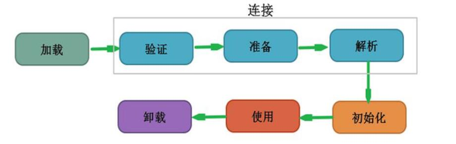

- 装载：将class字节码文件加载到内存中，并将静态数据转换成方法区的运行时数据结构，然后生成一个代表这个类的java.lang.Class对象，作为方法区中的类数据的访问入口(引用地址),所有需要访问和使用类数据只能通过这个CLass对象，这个加载的过程需要类加载器参与

- 链接： 将java类的字节码合并到JVM的运行状态之中的过程

  - 验证：确保加载的类信息符合JVM规范
  - 准备：正式为类变量(static)分配内存并设置类变量默认初始值的阶段，这些内存都将在方法区中进行分配
  - 解析：虚拟机常量池内的符号引用(常量名)替换为直接引用(地址)的过程

- 初始化：

  - 执行类构造器<clinit>()方法的过程，若发现父类还未初始化，会先初始化父类
  - 保证类的<clinit>()方法在多线程环境中被正确枷锁和同步

  

##### 类加载器

###### 作用： 

​	类加载的作用：将class文件字节码内容加载到内存中，并将这些静态数据转换成方法区的运行时数据结构，然后在堆中生成一个代表这个类的java.lang.Class对象，作为方法区中类数据的访问入口

类缓存：标准的JavaSE类加载器可以按要求查找类，但一旦某个类被加载到类加载器中，它将维持加载（缓存）一段时间。不过JVM垃圾回收机制可以回收这些Class对象。

###### 类加载器的层次结构(树状结构)

1. 引导类加载器(bootstrap class loader)

   - 用来加载Java的核心库(JAVA_HOME/jre/lib/rt.jar) 
   - 加载扩展类和应用程序类加载器，并制定为他们的父类加载器
2. 扩展类加载器(extensions class loader)

   - 用来加载Java的扩展库(JAVA_HOME/jre/ext/*.jar)，java虚拟机的实现会提供一个扩展库目录，类加载器会在这个目录中查找并加载Java类
3. 应用程序类加载器(application class loader)
   - 负责加载自己编写的类classpath下

4. 自定义类加载器
   - 开发人员可通过继承java.lang.ClassLoader类的方式实现自己的类加载器，以满足特殊的需求

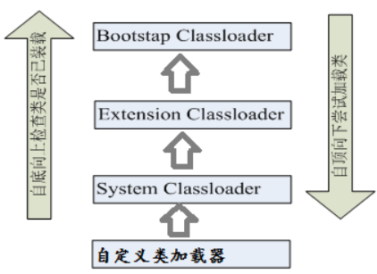

###### 类加载器的代理模式

代理模式： 交给其他类加载器来加载指定的类

**双亲委托机制**： 某个特定的类加载器在接到加载类的请求时，首先将任务委托给父加载器，直到委托给最高的引导类加载器，如果引导类加载器可以完成加载任务，就成功返回，如果不能完成，委托给扩展类加载器，直到自己。

**目的**： 是为了保证java核心库的类型安全，保证类加载器不会优先加载自己的类，导致系统安全

```
验证方法之一：
//自己写一个java.lang.String
package java.lang;

public class String {
}
package com.reflection.classloader;

public class TestClassLoader {
	public static void main(String[] args) throws Exception {
		String str = new String();
		ClassLoader classLoader = str.getClass().getClassLoader();
		System.out.println(classLoader);//null  引导类加载器
		//说明还是加载的核心类库中的java.lang.String,不是你自己写的String
		System.out.println(str.getClass().getMethod("substring", int.class));
	}
}
//验证方法二：
package java.lang;

public class String {
	public static void main(String[] args)throws Exception {
		String str = new String();
		//运行错误: 在类 java.lang.String 中找不到 main 方法, 请将 main 方法定义为:
		//	   public static void main(String[] args)
	}
}
```

