#### scala概述

###### Scala的

###### 	Scala执行流程分析

> .scala文件 经过scalac 编译生成.class文件，执行scala命令运行在jvm虚拟机上

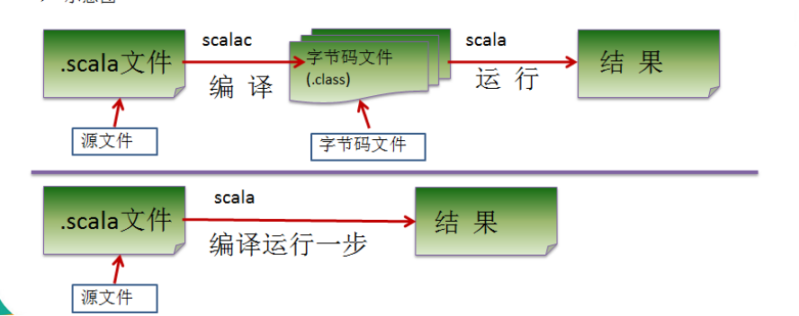


###### Scala语言输出的三种方式

- 字符串通过+ 号连接
- printf 用法(类似c语言)字符串通过%传值(格式化输出)
- 字符串通过$引用(类似php)

#### 变量

##### 变量的介绍

> 基本语法：var | val 变量名 [:变量类型] = 变量值

注意事项：

- scala支持类型推断，类型可以省略
- 类型确定后，就不能修改，说明scala是强数据类型语言
- var 修改的变量可改变，val修饰的变量不可改

##### 数据类型

- scala与java有相同的数据类型，在Scala中数据类型都是对象
- Scala中数据分为两大类：AnyVal(值类型)和AnyRef(引用类型)==>都是对象

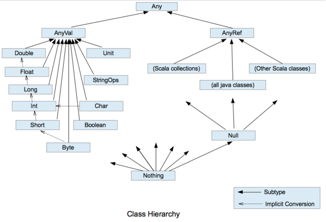

1. Any是所有类的父类
2. Scala中分为两个大的类型AnyVal(值类型) 和AnyRef(引用类型)
3. Scala中有两个特别的类型Null,还有一个Nothing
4. Null类型只有一个实例null,他是bottom class,是AnyRef的子类
5. Nothing是所有类型的子类
6. Scala中，Unit类型比较特殊，这个类型也只有一个实例()

##### 数据类型

###### scala数据类型列表


| 数据类型 | 描述                                                         |
| -------- | ------------------------------------------------------------ |
| Byte     | 8位有符号补码整数。数值区间为 -128 到 127                    |
| Short    | 16位有符号补码整数。数值区间为 -32768 到 32767               |
| Int      | 32位有符号补码整数。数值区间为 -2147483648 到 2147483647     |
| Long     | 64位有符号补码整数。数值区间为 -9223372036854775808 到 9223372036854775807 |
| Float    | 32 位, IEEE 754标准的单精度浮点数                            |
| Double   | 64 位 IEEE 754标准的双精度浮点数                             |
| Char     | 16位无符号Unicode字符, 区间值为 U+0000 到 U+FFFF             |
| String   | 字符序列                                                     |
| Boolean  | true或false                                                  |
| Unit     | 表示无值，和其他语言中void等同。用作不返回任何结果的方法的结果类型。Unit只有一个实例值，写成()。 |
| Null     | null                                                         |
| Nothing  | Nothing类型在Scala的类层级的最低端；它是任何其他类型的子类型。 |
| Any      | Any是所有其他类的超类                                        |
| AnyRef   | AnyRef类是Scala里所有引用类(reference class)的基类           |

### 运算符

###### 运算符介绍

- 算术运算符
- 赋值运算符
- 比较运算符(关系运算符)
- 逻辑运算符(与或非)
- 位运算符(~| ^ >> << >>>)

###### 算术运算符

| **运算符** | **运算**   | **范例**   | **结果** |
| ---------- | ---------- | ---------- | -------- |
| **+**      | 正号       | +3         | 3        |
| **-**      | 负号       | b=4; -b    | -4       |
| **+**      | 加         | 5+5        | 10       |
| **-**      | 减         | 6-4        | 2        |
| *****      | 乘         | 3*4        | 12       |
| **/**      | 除         | 5/5        | 1        |
| **%**      | 取模(取余) | 7%5        | 2        |
| **+**      | 字符串相加 | “He”+”llo” | “Hello”  |

scala中没有 ++ ， --

###### 关系运算符

> 关系运算符的结果都是boolean，要么true,要么false

| **运算符** | **运算                                 范例                                         结果** |
| ---------- | ------------------------------------------------------------ |
| **==**     | 相等于                               4==3                                                false |
| **!=**     | 不等于                               4!=3                                                 true |
| **<**      | 小于                                   4<3                                                   false |
| **>**      | 大于                                   4>3                                                   true |
| **<=**     | 小于等于                           4<=3                                                false |
| **>=**     | 大于等于                           4>=3                                                true |

###### 逻辑运算符

| 运算符 | 描述                      | 实例                       |
| ------ | ------------------------- | -------------------------- |
| &&     | 逻辑与 【同样遵守短路与】 | (A && B) 运算结果为 false  |
| \|\|   | 逻辑或  【遵守短路或】    | (A \|\| B) 运算结果为 true |
| !      | 逻辑非                    | !(A && B) 运算结果为 true  |

###### 赋值运算符

> 赋值运算符就将某个运算后的值，赋值给指定的变量

| 运算符 | 描述                                           | 实例                                  |
| ------ | ---------------------------------------------- | ------------------------------------- |
| =      | 简单的赋值运算符，将一个表达式的值赋给一个左值 | C = A + B 将 A + B 表达式结果赋值给 C |
| +=     | 相加后再赋值                                   | C += A 等于 C = C + A                 |
| -=     | 相减后再赋值                                   | C -= A 等于 C = C - A                 |
| *=     | 相乘后再赋值                                   | C *= A 等于 C = C * A                 |
| /=     | 相除后再赋值                                   | C /= A 等于 C = C / A                 |
| %=     | 求余后再赋值                                   | C %= A 等于 C = C % A                 |

###### 位运算符

| 运算符 | 描述           | 实例                                                         |
| ------ | -------------- | ------------------------------------------------------------ |
| &      | 按位与运算符   | (a & b) 输出结果 12 ，二进制解释： 0000 1100                 |
| \|     | 按位或运算符   | (a \| b) 输出结果 61 ，二进制解释： 0011 1101                |
| ^      | 按位异或运算符 | (a ^ b) 输出结果 49 ，二进制解释： 0011 0001                 |
| ~      | 按位取反运算符 | (~a ) 输出结果 -61 ，二进制解释： 1100 0011， 在一个有符号二进制数的补码形式。 |
| <<     | 左移动运算符   | a << 2 输出结果 240 ，二进制解释： 1111 0000                 |
| >>     | 右移动运算符   | a >> 2 输出结果 15 ，二进制解释： 0000 1111                  |
| >>>    | 无符号右移     | A >>>2 输出结果 15, 二进制解释: 0000 1111                    |

> scala不支持三目运算符,在Scala中使用if ..else..方式实现

###### 运算符优先级

> 运算符的优先级就是表达式运算中的运算顺序

- ()[]可以直接提高优先级
- 弹幕运算符(!~)
- 算术运算符
- 位移运算符 
- 关系运算符
- 位运算
- 逻辑运算
- 赋值运算

###### scala键盘输入

```scala
StdIn.readLine() /readInt() ...
```

### 流程控制

- 分类

```
顺序控制 :从上而下逐行执行
分支控制(单分支，双分支，多分支):if()/if() else/ if() else if else
	无switch分支结构
循环控制:
```

###### for循环控制

1. for(i <- 1to 3) {} //to表示[ ] 
2. for(i<- 1 until 3){} //until 表示[ ) 前闭后开
3. 循环守卫 for(i<- 1 to 3 if i!=2){} : if保护式为true时进入循环内部


###### 循环返回值

> yield：将遍历过程中的结果存储在新的Vector集合中，当做返回值返回

```scala
val res = for(i <- 1 to 10) yield i * 2
println(res) //Vector(2, 4, 6, 8, 10, 12, 14, 16, 18, 20)
```

> yield 后面还可以写代码块

```
 def test02(): Unit ={
    //将1到10数中的奇数放入到新的集合
    val res2 = for (i <- 1 to 10) yield  {
      if (i % 2 == 1) {
        i
      }else {
        ()
      }
    }
    println("res2=" + res2)
  }
```


###### 使用花括号{}代替小括号()

```
    for {i<- 1 to 3
         j=i*2}{
      println("i="+i+"j="+j)
    } //for后面的()变为了{}
```

###### 循环控制步长

###### 方式一：Range

从start =1便利到end-1 =9  step 为3

```
    for (i<- Range(1,10,3)){
      println(i) //1 4 7
    }
```

###### 方式二：守卫

```
 for (i <- 1 to 10 if i % 3 == 1 ) {
      println("i=" + i)
    }
```


##### While循环

```
循环变量初始化
while(循环条件){
    循环体
    循环变量迭代
}
```

- while语句的结果是Unit类型
- 不推荐使用，推荐使用for(从设计思想上来讲，希望使用纯函数,while变量声明在外部，不推荐使用)

###### do..while

```
 //统计1——200之间能被5整除但不能被3整除的个数
    var n=1
    var max=200
    var count =0
    do {
      if (n%5==0 && n%3!=0){
        count+=1
      }
      n+=1 //while循环变化条件
    }while(n<=max)
    println(count)
```


##### while循环中断

> breakable和continue

```scala
import util.control.Breaks._
 breakable({
      for (i <- 0 until(array.length)){
        if(array(i)==7) break()
      }
    })
```

- 使用循环守卫方式控制

```
  //100以内的数求和，求出当和 第一次大于20的当前数是多少
    val  max =100
    var sum =0
    var flag=true
    for (i<- 1 to max if flag==true){
      sum+=i
      if (sum>20){
        println("当前i="+i)
        flag=false
      }
    }
```


### 函数式编程介绍

- 函数式编程是一种编程范式
- 它属于结构化编程的一种，主要思想是把运算过程尽量携程一系列嵌套的函数调用
- 函数式编程中，将函数当做数据类型，因此可以接受函数当做输入(参数)和输出(返回值)
- 函数式编程中，最重要的就是函数

##### 函数/方法的定义

###### 介绍

- scala中，方法和函数几乎可以等同

- 函数式编程从编程范式来讲： 函数是一等公民，可以像变量一样，作为函数的参数，也可以将函数赋值给变量,函数的创建不用依赖于类或对象
- scala中函数式编程和面向对象融合在一起了
- 函数四编程的主要思想是把运算过程尽量携程一系列嵌套的函数调用

###### 基本语法

```
def 函数名([参数名:参数类型]...)[[:返回值类型]=]{
	语句...
	返回值  //如果没有return ,默认以执行到最后一行的结果作为返回值
}
//说明
返回值类型：
	1.形式1： :返回值类型= :表示有返回值，且指定了返回值类型
	2.形式2：= ：表示有返回值类型，但使用自动类型推导
	3.形式3： 空 : 无返回值类型，为Unit
```

###### 函数递归需要遵守的原则

1. 程序执行一个函数时，就创建一个新的栈帧(函数栈)

2. 递归必须有结束条件，且向递归条件逼近

   

函数/方法

TODO


##### 惰性求值

> 惰性计算(尽可能延迟表达式求值), 在真正需要的时候进行计算表达式的值


```scala
object LazyDemo {
  def main(args: Array[String]): Unit = {
    lazy val res = sum(1, 2)
    println("--------------")
    println("res="+res) //在真正使用的时候才进行求res的值
  }

  def sum(n1: Int, n2: Int) = {
    println("sum 被调用")
    n1 + n2
  }
}
```

###### 惰性函数

> 函数的返回值声明为lazy时，函数的执行被推迟, 知道对此进行首次取值，该函数才会执行(惰性函数)

##### 异常

> try和catch块处理异常

- code

```scala
object ScalaException {
  def main(args: Array[String]): Unit = {
    try{
      var res = 10/0
    }catch {
      case  e:ArithmeticException=> {
        println("算术异常="+e.getMessage)
      }
      case e:Exception => println("异常信息="+e.getMessage)
    }finally {
      println("finally...")
    }
  }
}
```

###### scala异常总结

- 将可能发生异常的代码放在try块中，使用catch捕获异常，finally中是一定会执行的代码
- scala的异常工作机制和java一样，但是Scala没有编译时异常,所有异常都是在运行期进行捕获的
- 可以用throw关键字抛出异常，throw表达式的类型是nothing, 因为nothing是任何类型的子类，所以可以用在任何需要类型的地方

###### Throw

```scala
object ThrowTest {
  def main(args: Array[String]): Unit = {
    try {
      val res = test()
      println(res.toString+"1")
    }catch {
      case e:Exception=>{
        println(e.getMessage)
      }
    }
  }
  def test(): Nothing = {
    throw new Exception("不对")
  }
}
```

- 可以用注解的方式声明异常

```
def main(args: Array[String]): Unit = {
    fun()
  } 
  //利用注解的方式声明可能会抛出一个异常
 @throws(classOf[NumberFormatException])//等同于NumberFormatException.class
  def fun()  = {
    "abc".toInt
  }
```

###### 过程

将函数的返回类型为Unit的函数成为过程(procedure)


### 面向对象

> scala是纯粹的面向对象的语言，在scala中，一切皆对象

##### 定义类

```
[修饰符] 类名{
    类体
}
```

###### 类的注意事项

- 类不声明为public(默认为public )
- 一个文件中可以定义多个类，每个类都是public属性的

###### 属性的注意事项

- 属性的定义语法同变量 ex:  [修饰符] var 属性名称[: 数据类型] = 数据值
- 属性必须显式初始化，数据类型可以省略，可以根据初始值自动类型推导
- 如果属性赋值为null,一定要写类型，否则为Null类型

###### 如何创建对象

> var| val  对象名[:类型] = new 对象类型()

- val表示对象不可变,scala设计者推荐使用val，因为通常只改变对象的属性，不改变对象引用

###### 构造器

> scala构造器也支持重载，可以有多个构造器
>
> scala中有一个主构造器，多个辅助构造器

- 基本语法

```scala
class 类名(形参列表 value:type) { //主构造器
    def this(形参列表){} //辅构造器
    def this(形参列表){} //辅构造器
} //辅助构造器的名称为this,
```

辅助构造器==一定要调用主构造器==,无论是直接还是间接，都会调用主构造器,所以一定要将调用写在第一行

1. 主构造器会执行类中(主构造器)所有的语句--也可以体现scala将函数式编程和面向对象融合在一起的思想，即构造器也是方法(函数)
2. 如果主构造器无参数，小括号可以省略

```scala
object ConstructorTest {
  def main(args: Array[String]): Unit = {
    val person = new Person //如果没有通过主构造器的方式构造，就会调用恰当的辅助构造器
    person.show()
  }

}
class Person(pName: String, pAge:Int){
  var name = pName
  var age= pAge

  def this(){
    this("pangdi",23)
  }

  def show(): Unit ={
    println("name:="+this.name + " age="+this.age)
  }
}
```

3. 可以在构造器前加private，使构造器私有化

```
class Person private (pName: String, pAge:Int){
  var name = pName
  var age= pAge

   private def this(){
    this("pangdi",23)
  }
```


##### 属性高级

###### 构造器参数

1. 主构造器中形参未用var /val进行修饰，那么就是局部变量
2. val修饰形参，为只读变量
3. var修饰形参，为私有的成员变量，并提供get/set方法
4. 注解生成标准javabean: @BeanPropetry

###### 对象创建流程

1. 加载类的属性信息和方法信息
2. 在内存中-堆为对象开辟内存
3. 使用父类主构造器为父类初始化
4. 使用本类的主构造器初始化
5. 使用本类的辅助构造器继续初始化
6. 将对象在内存中的地址复制给p


### 数据结构上

##### 数据结构特点

- Scala同时支持不可变集合和可变集合

- 两个主要的包：
  - 不可变集合：scala.collection.immutable
  - 可变集合：scala.collection.mutable

- scala默认采用不可变集合，几乎所有的集合类，都同时提供了可变和不可变的两种版本

- Scala的集合有三大类：序列Seq, 集Set,映射Map，所有集合都扩展自Iterable特质

  

  ####  数组

   ##### 定义**定长**数组方式(Array)

  1. 方式一：

    	 ```
    	 val arr= new Array[Int](10)
    	 ```

     

  2. 方式二：定义数组时，直接赋值--使用apply方法创建数组对象

     ```
     val arr= Array(1,2,"hello")
     ```

  ##### 定义变长数组(ArrayBuffer)

  

  1. 方式一

     ```
     //定义，声明
     val arr = ArrayBuffer[Int]()
     //追加元素
     arr.append(7)
     //重新赋值
     arr(0)=6 //使用()的方式进行访问
     //删除元素
     arr.remove(0) //删除第一个元素
     //遍历
     for(item <- arr){
         println(item)
     }
     ```


   ###### 		定长数组与变长数组的转换

```
arr.toBuffer //转为可变数组
arr.toArray //转为定长数组
```


###### 多维数组

```
Array.ofDim[Double](3,4)
```

##### 数组的转换

- 使用for 推导式

  ```
  object ArrayDemo04 {
    def main(args: Array[String]): Unit = {
      var arr = Array(1,2,3,4,5,6).toBuffer
      //使用关键字yield产生一个新的数组缓冲--yield 将产生的数组累加到一个新的集合中
      var arr2 = for(ele <- arr) yield ele* ele
      println(arr2)
    }
  }
  ```

> 如果只想对特定的元素进行处理，可以使用守卫

- 使用守卫

  ```
    def main(args: Array[String]): Unit = {
      var arr = Array(1,2,3,4,5,6).toBuffer
      var arr2 = for (ele <- arr if(ele %2 == 0)) yield ele*ele
      println(arr2)//ArrayBuffer(4, 16, 36)
    }
    //这些操作产生的结果不会影响原有的容器
  ```

 ###### 常用算法API

```
 def main(args: Array[String]): Unit = {
    var arr = Array(10,21,32,4,15,46,17)
    println(arr.sum)  //求和
    println(arr.max)//求取最大值
    println(arr.min)//求取最小值

    println(arr.mkString) //tostring(),转为字符串类型
    println(arr.mkString(",")) //以,为分隔，调用toString()

    println("===========排序================")
    //排序
    val sorted = arr.sorted //调用arr.sorted方法
    println(sorted.mkString(","))

    println("=========降序排序==============")
    //降序  -- _ > _ 降序    _< _升序
    val ints = arr.sortWith(_ > _) //使用arr.sortWich  >左边大于右边，降序
    println(ints.mkString(","))
  }


```

###### Java数组和Scala数组之间的相互转换

- Scala数组转Java数组(List)

```
  def main(args: Array[String]): Unit = {
    val arrScala = ArrayBuffer("a","b","c")
    val listJava: util.List[String] = arrScala.asJava
    println(listJava)
  }
```

- Java数组转Scala数组

  ```
    def main(args: Array[String]): Unit = {
      val arrScala = ArrayBuffer("a","b","c")
      val listJava:util.List[String]= arrScala.asJava
      println(listJava)
      //javaList 转为scala List 需要调用asScala 
      var buf:mutable.Buffer[String] = listJava.asScala
      println(buf.mkString(","))
    }
  ```

  

- 其他操作方法

   - 可变和不可变共同有用的

     1. ++连接两个数组
     2. ++: 连接两个数组
     3. :+ 一个数组连接一个元素
     4. +: 一个元素连接一个数组
     5. /: 左折叠
     6. :\ 右折叠
     7. head :第一个元素
     8. tail : 出去第一个元素的其他元素组成的数组
     9. last : 最后一个元素
     10. max: 找到最大值
     11. min : 最小值

   - 可变数组拥有

     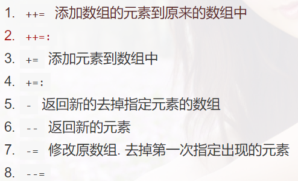

##### 元祖（tuple）

	##### 定义

> 将多个无关的数据封装成一个整体，成为元祖，元素最大的特点灵活，对数据没有过多的约束

注： 元祖中最大只有22个元素

##### 元祖的创建

```
  def main(args: Array[String]): Unit = {
    //第一种：
    val t1:(String,Int,String,Boolean)=("a",1,"2",true)
    //第二种：
    val t2:Tuple4[String, Int,String,Boolean]=("a",1,"2",true)
    println(t1)
    println(t2)
    //访问元祖中的数据
    println(t1._1)
    println(t1._2)
    println(t1._3)
    println(t1._4)
    //遍历元祖
    //for循环遍历
    for (ele<- t1.productIterator){
      println(ele)
    }
  }
```


##### 列表List

###### 列表List-元素的追加

```
  //方式一
  var list1 = List(1, 2, 3, "abc")
    val list2 = list1 :+ 4 //在列表后面添加新元素
    println(list2)
  //方式二
    //在列表前面增加元素
    val list3 = 100 +: list1
    println("list3=" + list3)
 //方式三
 	//::表示想集合中，新建集合添加元素
    //运算时，集合对象一定要放置在最右边
    //运算规则：从右向左
    val list4=List(1,2,3,"abc")
    val list5= 4::5::6::list4::Nil//从右向左，先有list4,
    //然后6 list  =>4 5 6 list4=> 4 5 6 list4
    println("list5="+list5)
```

##### ListBuffer

```
   //++= 
    list0++= list1 //++表示加入的是集合中的各个元素
    println(list0) //将list1中的每一个元素加入到list0中
```

##### Queue

> 基本介绍：
>
> 队列是一个有序列表，在底层可以用数组或是链表来实现
>
> 输入和输出要遵循陷入先出的原则，即：先存入队列的数组，要先取出

1. 队列Queue的创建

   new mutable.Queue[Int]

2. 出队

   - dequeue()
3. 入队

   - enqueue
4. head

   - head --返回队列首元素
5. tail

   - tail -- 返回队列除了head头元素之外组成的队列

​    def main(args: Array[String]): Unit = {
​       //创建队列
​       val q1 = new mutable.Queue[Int]
​       println(q1)
​       //追加元素
​       q1+=1
​       q1+=2
​       //将List中的元素添加到队列中
​       q1 ++= List(1,2,3)
​       println(q1)

​       //添加数组中的元素
​       q1++= Array(5,6,7)
​       println(q1)
​       //使用方法进行添加元素
​       q1.enqueue(100,200)// 参数时* ，可以添加无限个
​       println("======= head ======")
​       //返回队列头部元素
​       println(q1.head) //返回头结点信息
​       //删除队列头节点信息
​       val head  = q1.dequeue()
​       println(q1)

​       println("======  tail =====")
​       //返回队尾元素--除了队列头结点的所有元素组成的队列
​       println("queue.tail = "+ q1.tail)
​     }

   

##### 映射Map

​	Scala中的Map和Java类似，也是一个散列表，它存储的内容是键值对key-value映射，scala中不可变Map是有序的，可变的Map是无序的


###### 	构建不可变Map

```
val map = Map("Alice" -> 10, "Bob" -> 20, "Kotlin" -> "北京")
```

- 输出顺序和声明顺序一致

- 构建Map集合中，集合中的元素其实是Tuple2类型

- 默认情况下，Map是不可变map

  ###### 构建可变map

  ```
    val map = scala.collection.mutable.Map("Alice" -> 10, "Bob" -> 20, "Kotlin" -> 30)
  ```

  ###### 创建空的映射Map

  ```
      val map2 = new mutable.HashMap[String, Int]()
      println(map2)
  ```

  ###### 利用对欧元组创建

  ```
   val map4 = mutable.Map( ("A", 1), ("B", 2), ("C", 3),("D", 30) )
  ```

  ##### 映射map--取值

  ###### 	方式一：

  ```
  map(key)
  ```

  ###### 	方式二：contains--检查是否存在key

  ```
  map.contains("A")
  ```

  ###### 	方式三：

  ```
  map.get(key).get // 通过映射.get(key) 调用返回的一个Option对象，要么是some,要么是None
  ```

  ###### 	方式四：

  ```
  getOrElse //如果存在，返回key对应的值，如果不存在，返回默认值
  ```

##### 映射Map--增删改查

###### 		

```
   val map4 = mutable.Map( ("A", 1), ("B", 2), ("C", 3),("D", 30) )
    println("map4=" + map4)
    println(map4("A"))

    //map更新
    map4("A")=20 //map 必须是可修改的，否则会报错
    println(map4)//如果key不存在，会进行添加

    //添加
    map4+=("D"->40)
    println(map4) //如果已经存在，会进行修改
    //删除map元素
    map4-= ("B","A") //通过可以进行删除i
    println(map4)

    //遍历
    for ((k,v)<- map4){
      println(k+" "+v)
    }
```

TODO--Set


## 数据结构下-集合应用操作

##### 集合元素的映射-map映射操作

> ###### 将集合中的每一个元素通过制定功能映射成新的结果集 //将函数作为参数传递给另外一个函数，这就是函数式编程的特点


```
  def main(args: Array[String]): Unit = {
    //需求：将list中的所有元素全部*2
    val list  = List(1,3,5,7)
    val ints = list.map(f1)
    println(ints)
  }
  //map映射函数
  def f1(n:Int): Int={
    n*2
  }
```

```
/*
请将 val names = List("Alice", "Bob", "Nick") 中的所有单词，全部转成字母大写，返回到新的List集合中.
 */
object MapTest01 {
  def main(args: Array[String]): Unit = {
    val names=List("Alice","Bob","Nick")
    val names2 = names.map(upper)
    println("names2="+names2)
  }
  def upper(str:String):String={
    str.toUpperCase
  }
}

```

##### flatmap映射：flat即压扁，亚平，扁平化映射

###### 基本介绍

> 效果是将集合中的每个元素的子元素映射到某个函数并返回新的集合

```
object FlatMapTest01 {
  def main(args: Array[String]): Unit = {
    val names = List("Alice","Bob","Nick")
    //作用于集合中每个元素的子元素--映射到新的集合中
    println(names.flatMap(upper))
  }
  def upper(s:String) ={
    s.toUpperCase
  }
}
```

##### 集合元素的过滤-filter

> 基本介绍：filter，将符合要求的数据(筛选)放置到新的集合中

案例：将集合首字母为"C"的筛选到新的集合中

```
/*
将  val names = List("pangdi", "wangyg", "Com") 集合中首字母为'C'的筛选到新的集合
 */
object FilterTest {
  def main(args: Array[String]): Unit = {
    val names = List("pangdi", "wangyg", "Com")
    val list = names.filter(startC)
    println("list="+list)
  }
  def startC(str:String) :Boolean={
    if(str.startsWith("C"))  true else false
  }
}
```

##### 化简

###### 基本定义：将二元函数引用于集合中的函数

需求：求出list的和

```
object ReduceLeftTest {
  def main(args: Array[String]): Unit = {
    val list = List(1, 2, 3, 4, 5)
    //方式一：
    // val res = list.reduceLeft(f1)
    //方式二：
    val res = list.reduceLeft(_ + _)
    println("res=" + res)
  }

  def f1(n1: Int, n2: Int): Int = {
    n1 + n2
  }
}
```


##### 综合案例：WordCount


## Akka

##### Akaka介绍

1. akka是java虚拟机jVM平台上构建的高并发，分布式和容错应用的工具包--Akka是编写并发程序的框架
2. akka用scala语言携程，同时提供scala和java的开发接口
3. 主要解决的问题：可以轻松写出高效稳定的并发程序，程序员不用过多的考虑线程，锁和资源竞争细节

  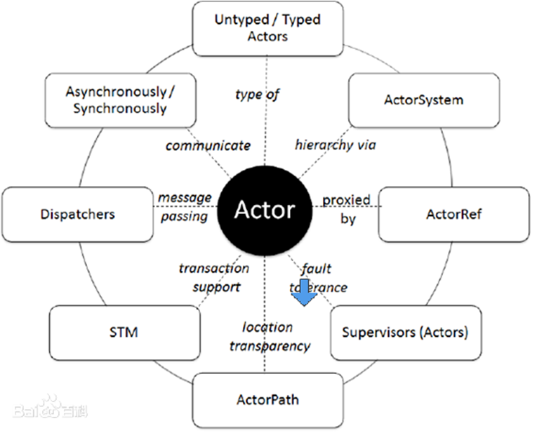

##### Akka中Actor模型

actor简化了并发编程，提升程序性能

##### actor模型

- 所有事物都是actor，一切皆actor

- actor模型作为一个并发模型设计和架构，actor与actor之间只能通过消息通信（消息的发送必须通过actorRef发送）

- actor和actor之间只能用消息进行通信，当一个actor给另一个actor发送消息，消息是有序的

- 消息的处理方式由接收方的actor决定，发送消息的actor可以阻塞等待或异步处理

- actorSystem的职责负责管理并创建actor，actorsystem是一个单例的[工厂模式],一个JVM进程中有一个即可，而actor是可以有多个的

  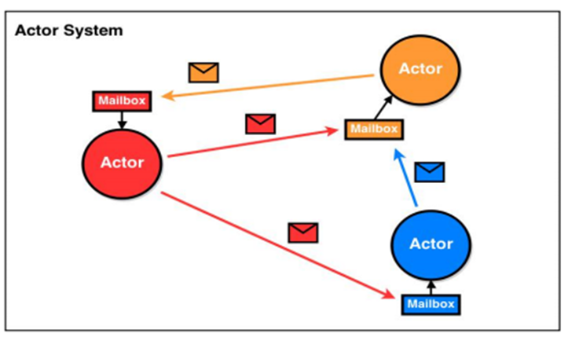

##### 示意图

###### actor模型工作机制说明

1. actorsystem创建Actor

2. ActorRef：可以理解为Actor的代理或引用，消息是通过actorRef来发送，通过哪个ActorRef就表示要将消息发送给哪个actor

3. 消息通过actorRef发送后，会首先发送给Dispatcher Message(消息分发器),Dispatcher Message得到消息后，会将消息发送到对应的MailBox。dispatcher Message可以理解为一个线程池，mailbox可以理解成是消息队列，可以缓冲多个消息，遵循FIFO

4. Actor可以通过receive方法来获取消息，然后进行处理

   ```
   1. actorsystem创建Actor，返回该actor的引用
   2. AActor通过actorRef来发送message,将消息发送给Dispatcher Message
   3. Dispatcher（消息分发器 --线程池）Dispatcher拥有所有Actor的引用
   4. Dispatcher将message发送给BActor邮箱,mailBox是一个消息队列，可以缓存多个消息，实现了runable,是一个runable线程
   5. BActor通过receive()方法接收和处理消息，通过sender()给发送者发送消息
   ```

   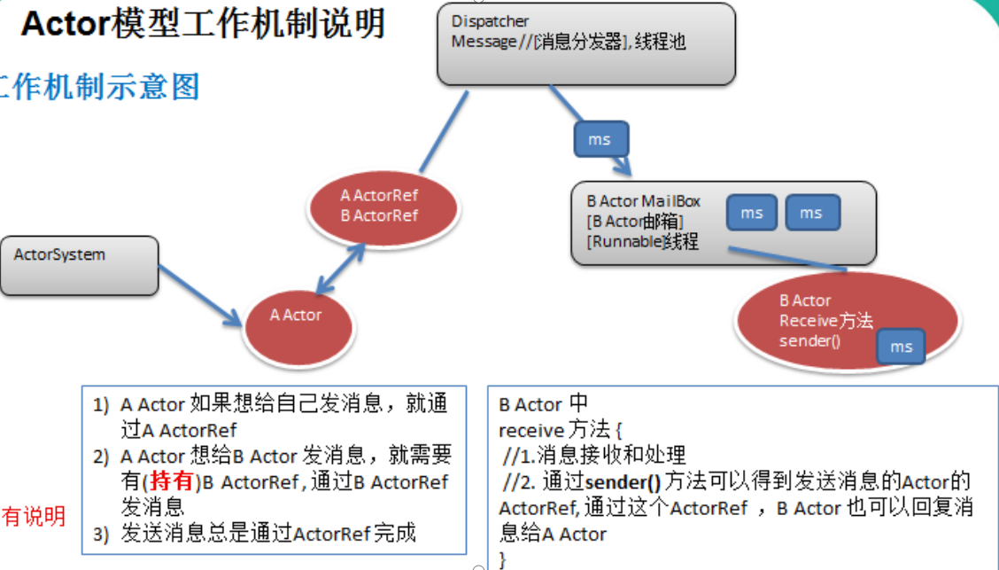


##### 代码1

需求：编写一个Actor，可以给自己发送消息

```
import akka.actor.{Actor, ActorSystem, Props}

/*
1. 继承Actor
2. 实现receive方法
 */
class TalklSelfActor extends  Actor{
  override def receive: Receive = {
    case "start"=> println("actor 开始运行...")
    case "hello"=> println("hello too...")
    case "fish" =>  println("<・)))><< 鱼")
    case "cat" => println("(>^ω^<)喵..")
    case  "exit"=>{
      println("准备退出...")
      context.stop(self)  //self 就是一个akka.actor.actorRef--
      context.system.terminate()//停止一切
    }
  }
}

object TalklSelfActorTest{
  def main(args: Array[String]): Unit = {
    //创建一个aActorsystem
    val actorFactory = ActorSystem("actorFactory")
    //通过actorFactory创建需要的actor
    val talklSelfActor = actorFactory.actorOf(Props[TalklSelfActor], "TalklSelfActor")
    talklSelfActor ! "start"
    talklSelfActor ! "hello"
    talklSelfActor ! "fish"
    talklSelfActor ! "cat"
    talklSelfActor ! "exit"
  }
}

```

##### ! 剖析

```
def !(message: Any)(implicit sender: ActorRef = Actor.noSender) = underlying.sendMessage(message, sender)
```

- 实质上调用了sendMessage方法，进行发送消息

##### Actor模型应用实例-Actor间通讯

- 需求：编写两个Actor，AActor，BActor

- AActor和BActor之间可以相互发送消息

  

```
//AActor
package TwoActorTalk

import akka.actor.{Actor, ActorRef}

/*
AActor需要拥有BActor的引用，所以在创建时，最好先创建BActor ,在创建AActor
 */
class AActor(iBActorRef: ActorRef) extends Actor {
  //AActor最好有BActor的引用
  var bActorRef = iBActorRef
  var count = 0

  override def receive: Receive = {
    case "start" => {
      println("AActor启动")
      println("start Ok~")
      println("我打")
      bActorRef ! "我打"
    }
    case "我打" => {
      count += 1
      println(s"AActor(黄飞鸿) 挺猛 看我佛山无影脚 第${count}脚")
      Thread.sleep(1000)
      bActorRef ! "我打"
    }
  }
}

//BAtor
package TwoActorTalk

import akka.actor.Actor

class BActor extends  Actor{
  var count =0

  //重写receive函数
  override def receive: Receive = {
    case "我打"=>{
      count+=1//计数器+1
      println(s"BActor(乔峰) 厉害，看我降龙十八掌第 ${count}掌")
      Thread.sleep(1000)
      sender() ! "我打"//发送消息
    }
  }
}
//入口函数
package TwoActorTalk

import akka.actor.{ActorRef, ActorSystem, Props}

object ActorTalk extends App {
  //先创建BActor的实例
  private val actorfactory = ActorSystem("actorfactory")
  val bActor: ActorRef = actorfactory.actorOf(Props[BActor], "BActor")
  val aactor: ActorRef = actorfactory.actorOf(Props(new AActor(bActor)), "Aactor")

  //在将BActor的实例的引用在创建AActor的时候赋值给A
  aactor ! "start"
}

```

#### Akka网络编程

###### OSI与Tcp/Ip参考模型

> OSI: 应用层，表示层，会话层，传输层，网络层，网络链路层, 物理层
>
> TCP/Ip ：应用层，传输层，网络层，链路层


##### Akka网络编程-demo客服

> 需求：服务端进行监听某端口，客户端可以通过键盘输入，发送咨询问题，服务端回答客户的问题

```
//消息协议体
package yellowchickenServer.common

/*
客户端发送的消息体
 */
case class ClientMessage(msg:String)
//服务端发送到的消息体
case class ServerMessage(msg:String)

```

```
//客户端code
package yellowchickenServer.client
import akka.actor.{Actor, ActorRef, ActorSelection, ActorSystem, Props}
import com.typesafe.config.ConfigFactory
import yellowchickenServer.common.{ClientMessage, ServerMessage}

import scala.io.StdIn
class CustomerActor extends Actor {
  //我们这里需要持有Server的Ref
  var yellowChickenServerRef: ActorSelection = _

  //preStart , 在启动Actor之前会先运行，因此变量,初始化写入preStart

  override def preStart(): Unit = {
    //println("preStart")
    //说明
    //1. 在AKKA 的Actor模型中， 认为 每个Actor都是一个资源（角色），通过一个Path来定位一个actor
    //2. path 的组成 akka.tcp://Server的actorfactory名字@ServerIp:Server的port/user/ServerActor名字
    yellowChickenServerRef = context.actorSelection("akka.tcp://Server@127.0.0.1:9999/user/YellowChickenServer")
  }

  override def receive: Receive = {
    case "start" => {
      println("客户端启动，可以咨询问题~~")
    }
    case mes: String => {
      //将mes 发送给Server
      yellowChickenServerRef ! ClientMessage(mes)
    }
    case ServerMessage(mes) => {
      println("收到客服回复的消息: " + mes)
    }

  }
}

object CustomerActor extends App {

  //编写必要的配置信息
  val serverHost = "127.0.0.1"
  val serverPort = 9999
  val clientHost = "127.0.0.1"
  val clientPort = 10000

  val config = ConfigFactory.parseString(
    s"""
       |akka.actor.provider="akka.remote.RemoteActorRefProvider"
       |akka.remote.netty.tcp.hostname=$clientHost
       |akka.remote.netty.tcp.port=$clientPort
       """.stripMargin)

  //创建CustomerActor
  val clientActorSystem = ActorSystem("Client", config)

  val customerActorRef: ActorRef = clientActorSystem.actorOf(Props[CustomerActor], "CustomerActor")

  customerActorRef ! "start"

  println("可以咨询问题了")
  while (true) {
    val mes = StdIn.readLine()
    customerActorRef ! mes //先发给自己，然后让  CustomerActor 发

  }
}
```

```
//服务端code
package yellowchickenServer.server

import akka.actor.{Actor, ActorRef, ActorSystem, Props}
import com.typesafe.config.ConfigFactory
import yellowchickenServer.common.{ClientMessage, ServerMessage}

class YellowChickenServer extends Actor{
  override def receive:Receive = {
    case "start" => {
      println("小妹开始监听程序，可以咨询问题~~")

    }
    case ClientMessage(mes) => {
      //怎么匹配他的内容
      println("客户咨询的问题是" + mes)
      mes match {
        case "姓名" => {
          sender() ! ServerMessage("wangyg")
        }
        case "地址" => {
          sender() ! ServerMessage("昌平区龙锦苑东一区")
        }
        case "工作" => {
          sender() ! ServerMessage("程序猿...")
        }
        case _ => {
          sender() ! ServerMessage("啥也不是~")
        }
      }
    }
  }
}
  object YellowChickenServer extends App{

    //创建ActorSystem
    //因为这时，我们需要监听网络，所以使用如下方法创建工厂
    //Config 就是我们的网络配置 ip , port..
    //def apply(name: String, config: Config): ActorSystem = apply(name, Option(config), None, None)

    val host = "127.0.0.1" //ip4
    val port = 9999
    //Config 就是我们的网络配置 ip , port..
    //
    val config = ConfigFactory.parseString(
      s"""
         |akka.actor.provider="akka.remote.RemoteActorRefProvider"
         |akka.remote.netty.tcp.hostname=$host
         |akka.remote.netty.tcp.port=$port
       """.stripMargin)

    val serverActorSystem = ActorSystem("Server",config)

    val yellowChickenServerRef: ActorRef = serverActorSystem.actorOf(Props[YellowChickenServer],"YellowChickenServer")

    //akka.tcp://Server@127.0.0.1:9999  就是Actor 路径
    yellowChickenServerRef ! "start"

  }
```

##### 扩展项目-spark Master Worker进程通讯项目

###### 需求分析

> 1. worker注册到Master，Master完成祖册，并回复worker注册成功--注册功能
>
> 2. worker 定时并发送心跳--3s一次，并在Master接收到
>
> 3.  Master接收到worker心跳后，要更新该worker的最近一次发送心跳的时间
> 4.  给Master启动定时任务，定时检测注册的worker有哪些没有更新心跳,并将其从hashmap中删除


```
//协议类
package SparkMasterWorker.common

//具体协议
//样例类--注册的协议：保存id,cpu,ram内存
case class RegisterWorkerInfo(id:String,cpu:Int,ram:Int)
//实体类
class WorkerInfo(val id:String, val cpu:Int, val ram:Int){
  //保存默认的心跳时间--最后的心跳时间
  var lastHeartBeatTime:Long = System.currentTimeMillis()
}

//最后一个类，用于返回注册成功后的信息--object类
case object RegisteredWorkerInfo //单例类
```


```
//SparkMaster Code
package SparkMasterWorker.master

import SparkMasterWorker.common.{RegisterWorkerInfo, RegisteredWorkerInfo, WorkerInfo}
import akka.actor.{Actor, ActorRef, ActorSystem, Props}
import com.typesafe.config.{Config, ConfigFactory}

import scala.collection.mutable

class SparkMaster extends Actor {
  var registMap = mutable.HashMap[String, WorkerInfo]()

  //实现receive方法
  override def receive: Receive = {
    //case--模式匹配，匹配各种情况，然后针对各种情况进行处理
    case "start" => {
      println("spark master启动，开始监控...")
    }
    //匹配worker向master发送注册时间的情况
    case RegisterWorkerInfo(id, cpu, ram) => {
      //向hashMap中添加信息
      if (!registMap.contains(id)) {
        // 如果不存在，原容器中不存在
        registMap += (id -> new WorkerInfo(id, cpu, ram))
        println("添加成功。。。。。。")
        //容器中添加成功后，向原发送者发送成功消息
        sender() ! RegisteredWorkerInfo
      }
    }
  }
}

//程序入口
object SparkMaster extends App {
  val masterHost = "127.0.0.1"
  val masterPort = 10000

  //设置配置
  val config: Config = ConfigFactory.parseString(
    s"""
akka.actor.provider="akka.remote.RemoteActorRefProvider"
akka.remote.netty.tcp.hostname=$masterHost
akka.remote.netty.tcp.port=$masterPort
     """.stripMargin)

  //获取actorsystem
  val sparkmasterFactory = ActorSystem("SparkMaster", config)//第一个参数：指定actorSystem的名称，第二个参数：指定配置
  //获取创建sparkMaster和引用
  val sparkMasterRef: ActorRef = sparkmasterFactory.actorOf(Props[SparkMaster], "SparkMaster01")//第一个参数：使用给定的名称作为上下文鉴定
  //发送消息
  sparkMasterRef ! "start" //sendmessage 发送消息

}

```


```
//SparkWorker code
package SparkMasterWorker.worker
import java.util.UUID

import SparkMasterWorker.common.{RegisterWorkerInfo, RegisteredWorkerInfo}
import akka.actor.{Actor, ActorRef, ActorSelection, ActorSystem, Props}
import com.typesafe.config.ConfigFactory

//第一步:继承Actor
class SparkWorker(masterHost: String, masterPort: Int) extends Actor { //通过主构造器将主机和端口号进行初始化
  //第三步：需要持有对方的引用--spark master
  var masterProxy: ActorSelection = _
  var id = UUID.randomUUID().toString //产生一个随机的UUID

  //第四步：在preStart()中对master的代理有一个初始化
  override def preStart(): Unit = {
    masterProxy = context.actorSelection(s"akka.tcp://SparkMaster@${masterHost}:${masterPort}/user/SparkMaster01") //传入一个路径
  }

  //第二部：实现receive方法
  override def receive: Receive = {
    case "start" => {
      println("spark worker启动...")
      //启动后，发送注册的请求
      masterProxy ! RegisterWorkerInfo(id, 8, 8 * 1024) //进行注册，发送RegisterWorkerInfo--id随机产生，只是模拟
    }
    //发送注册请求后，服务端会回发一个成功消息，在这里进行接收
    case RegisteredWorkerInfo => {
      println(s"收到回复，${id}已成功注册...")
    }
  }
}

object SparkWorker extends App {
  val (masterHost, masterPort, workerHost, workerPort) =
    ("127.0.0.1", 10000, "127.0.0.1", 10001)

  //创建config
  val config = ConfigFactory.parseString(
    s"""
       |akka.actor.provider="akka.remote.RemoteActorRefProvider"
       |akka.remote.netty.tcp.hostname=$workerHost
       |akka.remote.netty.tcp.port=$workerPort
       """.stripMargin)
  //创建actorsystem
  val sparkWorker = ActorSystem("sparkWorker",config)
  //创建actor
  val sparkWorkerActorRef: ActorRef = sparkWorker.actorOf(Props(new SparkWorker(masterHost,masterPort)),"SparkMaster01")
  //通过ref 进行发送消息
  sparkWorkerActorRef ! "start"

}
```

##### 	功能2：实现定时心跳

```
 //使用定时器机制，每隔3s给自己先发送一个信息，然后在发送信息给服务器端
 import context.dispatcher //需要导入一个包
      //注册成功后，进行发送3s心跳请求
      context.system.scheduler.schedule(0 millis,3000 millis,self,SendHeartBeat)
  
```

##### 	功能3：Master启动定时任务，定时检测注册的worker

> 需求：Master启动定时任务(**10**秒)，定时检测注册的worker有哪些没有更新心跳，已经超时的worker(**6秒**)，将其从hashmap中删除掉

```
//核心逻辑
case StartTimeOutWorker =>{
      //启动定时器
      import context.dispatcher //还需要import scala.concurrent.duration._
      context.system.scheduler.schedule(0 millis, 10000 millis, self, RemoveTimeOutWorker)
    }
    case RemoveTimeOutWorker =>{
      //定时清理超时6s的worker,scala
      //获取当前的时间
      val currentTime = System.currentTimeMillis()
      val workersInfo = registMap.values //获取到所有注册的worker信息
      //先将超时的一次性过滤出来，然后对过滤到的集合一次性删除
      workersInfo.filter( //进行过滤
        currentTime - _.lastHeartBeatTime > 6000
      ).foreach(workerInfo=>{
        registMap.remove(workerInfo.id)
      })

      printf("当前有%d个worker存活\n", registMap.size)
    }
```

##### 泛型

###### 基本介绍

> 如果我们要求函数的参数接收任意类型，有使用泛型，这个类型可以代表任意的数据类型, 

泛型案例：编写message类，可以构建Int类型的message，String类型的message

```
package day08

object GenericUst {
  def main(args: Array[String]): Unit = {
    val mesg = new StrMessage[String]("10")
    println("mesg="+mesg.get)
    val mesg2 = new IntMessage[Int](20)
    println("mesg2="+mesg2.get)
  }
}
//定义抽象父类
abstract class Message[T](s:T){
  def get:T = s
}
//子类继承抽象父类
class StrMessage[String](msg:String) extends Message(msg)

class IntMessage[Int](msg:Int) extends Message(msg)
```

泛型案例2：

```
package day08

import day08.SeasonEm.SeasonEm


object GenericUst2 {
  def main(args: Array[String]): Unit = {
    //[指定泛型]
    val cla01 = new EnglishClass[SeasonEm,String,String](SeasonEm.spring,"aaa","高级班")
    println(cla01.season + " "+cla01.name+" "+cla01.classType)
  }
}
/*设计一个EnglishClass(英语班级类),在创建Englishclass的一个实例
需要制定[班级开班季节spring,autumn,summer,winter] 班级名称，班级类型
开班季节只能是指定的，班级名称为String，班级类型是(字符串类型“高级班”，“初级班”..)
或是Int类型（1,2,3)
使用泛型来完成本案例
*/
object SeasonEm extends Enumeration{
  type SeasonEm = Value //自定义seasionEm,是value类型，这样才能使用
  val spring,summer,winter,autumn = Value
}

//根据业务需要，设计带有泛型的类
class EnglishClass[A,B,C](val season:SeasonEm,val name:B, val classType:C)
```

泛型案例3：

```
object GenericUst3 {
  def main(args: Array[String]): Unit = {
    val list = List("hello","world","scala")
    //获取list中间元素
    println(getEle[String](list)) //调用函数时，可以限定类型
  }
  //返回值类型自动类型推倒
  //T 使用泛型
  def getEle[T](l:List[T]) ={
    l(l.length/2) //返回list中间值
  }
}
```

##### 类型约束-上界/下界

###### scala中上界

> scala中表示某个类型是A类型的子类型，也称上界或上限，使用<: 关键字表示

```scala
[T<:A] 或使用通配符：[_<: A]
```

###### scala中下界

```
[T>:A]//A是T的下界，下限
[_>:A] //通配符形式
```

视图界定

基本介绍

> <%的意思是view bounds(视图)  它比<:使用的范围更广，除了所有的子类，还允许隐式类型转换

```scala
	<%  --支持隐式转换
```

视图界定demo1

```

object ViewBoundsTest01 {
  def main(args: Array[String]): Unit = {
    //支持隐式类型转换--11.f为scala中的Float,不需要手动转换成java.lang.Float
    val comparaComm = new CompareComm[java.lang.Float](11.1f, 10.3f)
    println("comparaComm="+comparaComm.greater)
  }
}
/*
T <% Comparable[T] 表示视图界定
T 是Comparable[T]子类型，同时也支持隐式类型转换
 */
class CompareComm[T<% Comparable[T]](obj1:T, obj2:T){
  def greater = if (obj1.compareTo(obj2)>0) obj1 else obj2
}
```

视图界定demo2

```
//package day08

//定义Person类，进行两个Person对象比较
class Person(val name: String, val age: Int) extends Ordered[Person] {
  //重写Compare方法
  override def compare(that: Person): Int = {
    //1 省略return
    println("compare方法被调用...")
    this.age - that.age
  }

  //重写tostring 方法
  override def toString: String = {
    this.name + "\t" + this.age
  }
}

//使用视图界定方式进行比较两个person类
class CompareComm2[T <% Ordered[T]](obj1: T, obj2: T) {
  def greater = if (obj1 > obj2) obj1 else obj2

  //使用compareTo方法
  def greater2 = if (obj1.compareTo(obj2) > 0) obj1 else obj2
}

object ViewBoundsTest02 {
  def main(args: Array[String]): Unit = {

    val jack = new Person("jack", 35)
    val tom = new Person("tom", 30)
    val compare = new CompareComm2(jack, tom)
    println(compare.greater)

  }
}

```

##### 类型约束-上下文界定

###### 基本介绍：

> context bounds(上下文界定)也是隐式参数的语法糖，为语法上的方便，引入了上下文界定

- 更加凸显了隐式值的价值

案例：使用上下文界定+隐式参数的方式，比较两个Person对象的年龄大小，要求：使用Ordering实现比较

```
ordered和ordering的区别：
Ordered继承了java中的Comparator接口，而Ordered继承了java中的Comparable接口，在Java中，Comparator是一个外部比较器(需要自己定义一个类实现比较器)，而Comparable是一个内部比较器，在类内部重载compareTO函数
```

上下文界定demo--要求：使用上下文界定+隐式参数的方式，比较大小

```
package com.atguigu.chapter17.contextbounds

object ContextBoundsDemo {

  //隐式参数
  implicit val personComparetor = new Ordering[Person] {
    override def compare(p1: Person, p2: Person): Int = {
      println("隐式值的 personComparetor 比较器被调用")
      p1.age - p2.age
    }
  }


  def main(args: Array[String]): Unit = {

    val p1 = new Person("mary", 30)
    val p2 = new Person("smith", 35)

    //完成p1 和 p2 的年龄的比较
    //上下文界定有三种写法

    val compareComm4 = new CompareComm4(p1, p2)
    println(compareComm4.greatter)

//    //方式2的使用方法
//    val compareComm5 = new CompareComm5(p1, p2)
//    println("compareComm5.greatter" + compareComm5.greatter)
//
//
//    //方式3的使用
//    val compareComm6 = new CompareComm6(p1,p2) //p1 =>Person
//    println("compareComm6.greatter=" + compareComm6.greatter)
  }
}

//一个普通的Person类
class Person(val name: String, val age: Int) {
  override def toString = this.name + "\t" + this.age
}

//方式1
//说明
//1. T: Ordering 表示 实现了 Ordering -> 实现 comparetor 接口
//2. implicit comparetor: Ordering[T] 隐式参数
class CompareComm4[T: Ordering](obj1: T, obj2: T)(implicit comparetor: Ordering[T]) {
  //编写了一个greatter 返回 较大的对象
  def greatter =
    if (comparetor.compare(obj1, obj2) > 0) obj1 else obj2
}

//方式2,将隐式参数放到方法内
class CompareComm5[T: Ordering](o1: T, o2: T) {
  def greatter = {
    //f1 是一个方法.
    def f1(implicit cmptor: Ordering[T]) = cmptor.compare(o1, o2)

    //使用f1
    if (f1 > 0) o1 else o2
  }
}


//方式3,使用implicitly语法糖，最简单(推荐使用)
class CompareComm6[T: Ordering](o1: T, o2: T) {
  def greatter = {

    //这句话就是会发生隐式转换，获取到隐式值 personComparetor
    //implicitly[Ordering[T]] 作用是进行上下文的匹配，如果有
    //Ordering[T] 类型 就会匹配到， 并赋给 comparetor
    val comparetor = implicitly[Ordering[T]] //Ordering[Person]

    if (comparetor.compare(o1, o2) > 0) o1 else o2
  }
}
```


##### 协变，逆变，不变

###### 基本介绍

> scala的协变(+),逆变(-),不变invariant
>
> 协变：如果A和子类型B，满足List[B]也是List[A]的子类型，就称为协变+
>
> 逆变：如果A和子类型B，满足List[A]是List[B]的子类型，就成为逆变，和原关系相反
>
> Java中，泛型类型都是不变invariant,比如List<String>不是List<Object>的子类型

```
package day08

object Convariant {
  def main(args: Array[String]): Unit = {
    //不变
    val t1: Temp3[Sub] = new Temp3[Sub]("hello")
    //    val t2:Temp3[Sub] = new Temp3[Super]("hello")
    //协变 super是sub的父类，Temp[super]是Temp[Sub]的父类
    val t4: Temp4[Super] = new Temp4[Sub]("hello")

    //逆变--super是sub的父类 temp[super]是super[sub]的子类
    val t5: Temp5[Sub] = new Temp5[Super]("hello")

  }
}

//逆变
class Temp5[-A](title: String) {
  override def toString: String = {
    title
  }
}

//协变
class Temp4[+A](title: String) {
  override def toString: String = {
    title
  }
}


//不变
class Temp3[A](title: String) {
  override def toString: String = {
    title
  }
}


class Super //父类
//sub是super的子类
class Sub extends Super
```


## Scala数据结构

##### 稀疏矩阵


##### 队列

> 队列特点：先进先出

###### 环形队列：

条件:

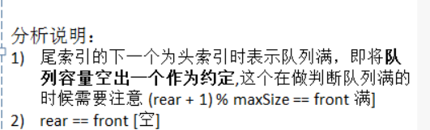

> 此方式将队列**空出一个空间**作为约定
>
> 队列满:   (rear+1)%maxSize == front
>
> 队列空: rear == front 


> 非环形队列的坏处：无法使用已经出队的空间，造成只能使用一次，所以改进为环形队列


- code

> 注意点：
>
> 1. 两个成员变量：front和 rear
> 2. size()方法：求取front到rear的两个变量的距离，要模除maxsize

```scala
package datastructure.circleQueue

import scala.io.StdIn

object CircleQueueTest {
  def main(args: Array[String]): Unit = {
    val q = new CircleArrayQueue(4)

    //环形队列
    var key =""
    while(true){
      println("show: 显示队列")
      println("exit: 退出程序")
      println("add:  添加数据")
      println("get : 取出对首元素数据")
      println("head: 查看队列中所有元素")

      key = StdIn.readLine()
      key match { // 模式匹配
        case  "show" =>q.showQueue()
        case "exit"=> System.exit(0) //以正常模式退出
        case "add" => {
          println("请输入一个数字")
          val num = StdIn.readInt()
          q.addQueue(num)
        }
        case "get" => {
          val res = q.getQueue()
          if (res.isInstanceOf[Exception]) {
            println(res.asInstanceOf[Exception].getMessage)
          } else {
            println(s"取出数据是 $res")
          }
        }
        case "head" => {
          val res = q.headQueue()
          if(res.isInstanceOf[Exception]) {
            //显示错误信息
            println(res.asInstanceOf[Exception].getMessage)
          }else {
            println("队列头元素值为=" + res)
          }
        }

      }
    }
  }
}

class CircleArrayQueue(arrMaxSize: Int) {
  //定义数组，存放容量
  var maxSize = arrMaxSize
  val array = new Array[Int](maxSize) //以maxSize作为大小
  //两个变量--环形队列中两个指针front指针和rear指针，分别指向队列头元素和队列尾元素
  var front = 0
  var rear = 0

  //定义环形队列方法
  /**
    * 判断队列是否已满 --队列满的条件是一个公式: (rear+1)%maxsize == front
    * 因为是环形队列，所以使用模除的方法,并且将一个位空出，用作标记位
    */
  def isFull(): Boolean = {
    (rear + 1) % maxSize == front
  }

  /**
    * 判断是否为空--环形队列空的条件是两个指针指向同一个位置
    *
    * @return
    */
  def isEmpty(): Boolean = {
    rear == front
  }

  //添加数据到环形队列中
  /**
    * 添加到尾部
    * @param n
    */
  def addQueue(n: Int): Unit = {
    if (isFull()) {
      println("环形队列已满，无法添加...")
      return
    }
    //将数据添加进入
    array(rear) = n
    rear = (rear + 1) % maxSize //因为是环形队列方式，所以需要模除
  }

  def getQueue(): Any = {
    if (isEmpty()) {
      println("环形队列已空,没有数据")
      return new Exception("环形队列空...")
    }
    val tmp = array(front)
    front = (front + 1) % maxSize
    return tmp
  }


  /**
    * 显示队列中所有元素
    */
  def showQueue(): Unit ={
    //先考虑一般性的特殊情况
    if (isEmpty()){
      println("环形队列空，没有数据...")
      return
    }
    //从front开始，循环
    for (i <- front until  size()){
      printf("下标 %d 值%d \n" , i, array(i))
    }
  }
  def size(): Int = {
    (rear+maxSize -front)%maxSize
  }

  def headQueue(): Any ={
    if (isEmpty()){
      return new Exception("环形队列空...")
    }
    return array(front)
  }
}
```


##### 链表

链表是有序的列表,内存中的地址不是紧邻在一起的(在内存空间中不一定是连续分布的)

- 有效利用碎片空间

#### 单链表

##### 带有头结点

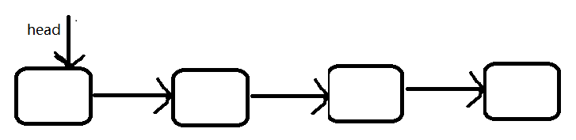

> 头结点中不带有数据,只是为了**方便操作**而设计的

- code

```scala

object SingleLinkedTest {
  def main(args: Array[String]): Unit = {
    test1()
  }
  def test1(): Unit = {
    val list = new SingleLinkedList()
    val node1 = new ListNode(1, "胖迪1")
    val node2 = new ListNode(2, "胖迪2")
    val node3 = new ListNode(3, "胖迪3")
    list.list()
    list.addSorted(node1)
    list.addSorted(node3)
    list.addSorted(node2)
    println("======================")
    list.list()
    println("=========update===========")
    var node4 = new ListNode(3, "迪丽热巴")
    list.update(node4) //将3号name改为迪丽热巴
    list.list()
    var node5 = new ListNode(5,"迪丽热巴")
    list.update(node5) //测试no不存在情况

    println("========delete1=========")
    list.delete(3)
    list.delete(1)
    list.delete(2)
    list.list()
    println("=====delete2======")
    list.delete(5) //删除一个不存在节点
    list.list()

  }
}

class SingleLinkedList{
  //头结点
  val head = new ListNode(0, "")

  //add
  /**
    * 添加到尾部，没有进行排序
    * @param node
    */
  def add(node:ListNode): Unit = {
    //使用临时变量进行查找
    var tmp = head
    while(tmp.next != null){
      tmp = tmp.next
    }
    //找到尾节点后
    tmp.next = node
  }

  //addsorted
  /**
    * 重点：链表按照no排序插入
    * @param node
    */
  def addSorted(node:ListNode): Unit ={
    //处理第一次插入情况
    if (head == null){
      head.next = node
      return
    }

    var tmp = head
    //两种情况，一：按照no找到合适的插入位置 2：如果no有重复的返回false,表示已有重复的，错误
    var existFlag = false
    breakable {
      while (true) {
        //处理循环结束条件
        if (tmp.next == null){ //最后一个节点位置
          break()
        }

        //按照no从小到大的位置进行插入
        if (tmp.next.no > node.no) {
          break()
        } else if (tmp.next.no == node.no) {
          existFlag = true
          break()
        }

        //while变化条件
        tmp= tmp.next
      }
    }
    //找到插入位置
    if (existFlag){
      println("节点已存在,无法插入...")
    }else{
      //先处理后面的逻辑链表逻辑
      node.next = tmp.next
      //在处理前面的链表逻辑
      tmp.next = node
    }
  }
  //del //删除节点，根据no进行删除
  def delete(no:Int): Unit ={
    if (head.next == null){
      println("链表为空,无数据...")
      return
    }
    //因为单链表的删除需要找到节点的前一个节点，然后进行改变链表指向关系，所以是head
    var tmp = head //head,不是head.next
    var findFlag= false
    while(tmp!=null && tmp.next != null){
      //找到no相同的
      if (tmp.next.no == no){
        findFlag= true
        tmp.next = tmp.next.next
      }
      tmp = tmp.next
    }
    if (!findFlag){
      println("id="+ no+"的节点不存在...")
    }

  }
  //update--更新
  /**
    * 更新操作
    * @param node
    */
  def update(node:ListNode): Unit = {
    if (head.next == null){
      println("链表为空...")
      return
    }
    var tmp = head.next
    var existFlag = false
    while(tmp!= null){
      //no相同，进行替换
      if(tmp.no == node.no){
        existFlag= true
        tmp.name = node.name
      }
      //while变化条件
      tmp = tmp.next
    }
    if (!existFlag){
      println("节点不存在，不能进行替换...")
    }
  }
  //查看list
  /**
    * 显示所有节点信息
    */
  def list(): Unit ={
    if (head.next ==null){
      println("空链表...")
      return
    }
    var tmp = head.next
    while(tmp!= null){
      println(tmp) //打印tmp的信息
      //while循环变化条件
      tmp=tmp.next
    }
  }


}

class ListNode(hereNo: Int, heroName: String) {
  var no = hereNo
  var name = heroName

  var next: ListNode = null //next默认为null
  override def toString: String = no + "\t" + name  //重写toString方法
}
```


##### 双向链表的应用案例

> 使用带有head头结点的双向链表实现

- 单链表的缺点
  - 单向链表：查找的方向只能是一个方向，只能从前到后，双向链表都可以
  - 单链表不能自我删除，需要辅助节点，双链表可实现自我删除

- code

```
package datastructure.DoubleLinkedList

import  scala.util.control.Breaks._
object DoubleLinkedListTest {
  def main(args: Array[String]): Unit = {

  }
}

class DoubleLinkedList{
  //先初始化一个头结点
  val head= new DoubleListNode(0,"")
  def add(heroNode: DoubleListNode): Unit = {
    //因为头结点不能动, 因此我们需要哟有一个临时结点，作为辅助
    var temp = head
    //找到链表的最后
    breakable {
      while (true) {
        if (temp.next == null) { //说明temp已经是链表最后
          break()
        }
        //如果没有到最后
        temp = temp.next
      }
    }
    //当退出while循环后，temp就是链表的最后
    temp.next = heroNode
    heroNode.prev = temp

  }

  //遍历方法一样, 可以直接使用单链表的，
  def list(): Unit = {

    //判断当前链表是否为空
    if (head.next == null) {
      println("链表为空!!")
      return
    }
    //因为头结点不能动, 因此我们需要哟有一个临时结点，作为辅助
    //因为head 结点数据，我们不关心，因此这里 temp=head.next
    var temp = head.next
    breakable {
      while (true) {
        //判断是否到最后
        if (temp == null) {
          break()
        }
        printf("结点信息 no=%d name=%s \n",
          temp.no, temp.name)
        temp = temp.next
      }
    }
  }

  //更新无更改--可以使用单链表的
  def update(newHeroNode: DoubleListNode): Unit = {
    if (head.next == null) {
      println("链表为空")
      return
    }
    //先找到节点
    var temp = head.next
    var flag = false
    breakable {
      while (true) {
        if (temp == null) {
          break()
        }
        if (temp.no == newHeroNode.no) {
          //找到.
          flag = true
          break()
        }
        temp = temp.next //
      }
    }
    //判断是否找到
    if (flag) {
      temp.name = newHeroNode.name
    } else {
      printf("没有找到 编号为%d 节点，不能修改\n", newHeroNode.no)
    }

  }

  //删除
  //思路，因为双向链表可以实现自我删除
  //双向链表可以实现自我删除，所以需要重新实现
  def del(no: Int): Unit = {

    //判断当前链表是否为空
    if (head.next == null) {
      println("链表空")
      return
    }

    var temp = head.next
    var flag = false // 标志变量用于确定是否有要删除的节点
    breakable {
      while (true) {
        if (temp == null) {
          break()
        }
        if (temp.no == no) {
          //找到了
          flag = true
          break()
        }
        temp = temp.next //temp后移
      }
    }

    if (flag) {
      //可以删除
      //temp.next = temp.next.next
      temp.prev.next = temp.next
      //思考
      if (temp.next != null) {
        temp.next.prev = temp.prev
      }
    } else {
      printf("要删除的no=%d 不存在\n" , no)
    }
  }

}


//双向链表节点
class DoubleListNode(hereNo:Int, heroName:String){
  var no :Int = hereNo
  var name = heroName
  var prev :DoubleListNode = null; //默认置为空
  var next:DoubleListNode = null; //默认置为空
}
```


#### 栈(stack)

##### 介绍

- 栈是一个**先入后出**的有序列表
- 栈是一个插入和删除只能在线性表的同一端进行插入和删除的特殊线性表，允许插入和删除的一端成为栈顶(Top) ,另一端为固定的一端，成为栈底(Bottom)


##### 用数组模拟实现栈

```

import scala.io.StdIn

object ArrayStackTest {
  def main(args: Array[String]): Unit = {
    test()
  }

  def test(): Unit ={

    //创建给栈
    val arrayStack = new ArrayStack(4)

    //测试栈的基本使用是否正确
    var key = ""
    while (true) {
      println("show: 表示显示栈")
      println("exit: 表示退出程序")
      println("push: 表示添加数据到栈")
      println("pop: 表示从栈取出数据")

      key = StdIn.readLine()
      key match {
        case "show" => arrayStack.list()
        case "push" => {
          println("请输入一个数")
          val value = StdIn.readInt()
          arrayStack.push(value)
        }
        case "pop" => {
          val res = arrayStack.pop()
          if (res.isInstanceOf[Exception]) {
            println(res.asInstanceOf[Exception].getMessage)
          }else {
            printf("取出的数为 %d\n", res)
          }
        }
        case "exit" => {
          System.exit(0)
        }
      }
    }

  }

}


class ArrayStack(size: Int) {
  val maxSize = size //栈的大小
  var stackArr = new Array[Int](maxSize)

  //栈顶，初始化为-1
  var top = -1

  //判断栈满
  def isFull(): Boolean = {
    top == maxSize - 1
  }

  //判断栈空
  def isEmpty(): Boolean = {
    top == -1
  }

  //入栈
  def push(num: Int): Unit = {
    if (isFull()) {
      //如果已经满了
      println("栈满...")
      return
    }
    top += 1 //初始时指向-1,所以先+=1
    stackArr(top) = num

  }

  //出栈
  def pop(): Any = {
    if (isEmpty()) {
      return new Exception("栈空")
    }
    val value = stackArr(top) //临时存放
    top -= 1 //然后将top--
    return value //最后返回value
  }

  //遍历栈
  def list(): Unit = {
    if (isEmpty()) {
      println("栈空,没有数据..")
      return
    }
    for (i <- 0 to top reverse) { //反转，从栈顶到栈底
      printf("stack[%d]=%d\n", i, stackArr(i))
    }
  }

}
```

##### 栈实现综合计算器

使用栈来实现综合计算器-自定义优先级[priority]


- code

```
package datastructure.Calculator

import util.control.Breaks._

/**
  * 用栈计算表达式[7*2*2-5+1-5+3-3]
  *
  * 使用两个栈的方式，一个数字栈，一个符号栈
  */
object CalculatorTest {
  def main(args: Array[String]): Unit = {
    val expression = "7*2*2-5+1-5+3-4"
    var numStack= new ArrayStack(10)
    var operStack= new ArrayStack(10)


    var index =0
    var num1 =0
    var num2 =0
    var oper =0
    var res =0
    var ch =' '
    var keepNum =""

    //设计两个栈，树栈和符号栈
    //一个一个的去除char
    //判断当前去除的字符是符号时，直接入栈，
    //会循环的取出expression 字符
    breakable {
      while (true) {

        //扫描expression
        ch = expression.substring(index, index + 1)(0)

        if (operStack.isOper(ch)) { //如果是操作符..

          if (!operStack.isEmpty()) {
            //如果当前符号的优先级 小于等于符号栈的栈顶的符号的优先级，则取出该符号，并从数栈依次 //pop 出两个数据，进行运算，将结果重新puhs到 数栈，再将当前符号push 到符号栈
            if (operStack.priority(ch) <= operStack.priority(operStack.array(operStack.top))) {
              //开始计算
              num1 = numStack.pop().toString.toInt
              num2 = numStack.pop().toString.toInt
              oper = operStack.pop().toString.toInt
              res = numStack.cal(num1, num2, oper)
              //入数字栈
              numStack.push(res)
              //把当前ch入符号栈
              operStack.push(ch)
            } else {
              //如果当前的符号的优先级大于符号栈顶的符号优先级，直接入栈
              operStack.push(ch)
            }
          } else {
            //符号就直接入栈
            operStack.push(ch) // '+' => 43
          }

        } else { // 是数
          //处理多位数的逻辑
          keepNum += ch

          //如果ch 已经是expression 最后一个字符
          if (index == expression.length - 1) {
            numStack.push(keepNum.toInt)
          }else {

            //判断ch 的下一个字符是不是数字, 如果是数字，则进行一次扫描，如果是操作符，就直接入栈
            //看到expresson的下一个字符时，不要真正的移动index ,只是探测一下
            if (operStack.isOper(expression.substring(index + 1, index + 2)(0))) {
              //是操作符入栈
              numStack.push(keepNum.toInt)
              keepNum = "" // 清空
            }
          }

          //numStack.push((ch + "").toInt) // ? '1' => 49 '3' "1"=> 1
        }

        //index 后移
        index += 1
        //判断是否到表达式的最后
        if (index >= expression.length()) {
          break()
        }

      }
    }

    //当整个表达式扫描完毕后，依次从数栈和符号栈取出数据，进行运行，最后在数栈中的数据就是结果
    breakable {
      while (true) {
        if (operStack.isEmpty()) {
          break()
        }
        //运算
        //开始计算
        num1 = numStack.pop().toString.toInt
        num2 = numStack.pop().toString.toInt
        oper = operStack.pop().toString.toInt
        res = numStack.cal(num2, num1, oper)
        numStack.push(res) //入栈
      }
    }

    //将数字栈的最后结果pop
    val res2 = numStack.pop()
    printf("表达式 %s = %d", expression, res2)
  }
}


//还要设计一个栈,用于专门的计算 --有一个专门用于计算的方法
//底层使用array实现栈，有一个记录栈顶的指针

class ArrayStack(maxSize:Int){
  val size = maxSize
  var array = new Array[Int](size) //初始化
  var top = -1  //指向栈顶的指针，初始化为-1

  //判断栈满
  def isFull(): Boolean={
    top == size-1
  }
  //判断栈空
  def isEmpty():Boolean={
    top == -1
  }
  //push
  def push(num:Int): Unit ={
    if (isFull()){
      println("栈已满，无法添加...")
      return
    }
    //正常情况，添加数据
    top+=1 //先将top改变，top默认指向-1
    array(top) = num
  }
  //pop
  def pop():Int={
    if (isEmpty()){
      println("栈空...")
      return -1
    }
    var value= array(top)
    top-=1  //top栈顶指针向下移动一个单位
    value //返回value
  }
  //遍历list
  /**
    * 遍历
    */
  def list(): Unit ={

    for (i <- 0 to top reverse){
      println("栈id="+i+"元素="+array(i))
    }
  }
  //计算 num1 num2 oper--获取计算结果
  def cal(num1:Int, num2:Int, oper:Int): Int ={
    oper match {
      case '+' =>{
          num1+num2
      }
      case '-' =>{
        num1-num2
      }
      case '*'=>{
        num1*num2
      }
      case '/' =>{
        num1/num2
      }
      case _=>{
        0
      }
    }
  }


  //返回运算符的优先级, 是程序员定, 数字越大，优先级越高
  // + 1 => 0 *[] /[] => 1
  def priority(oper: Int): Int = {
    if (oper == '*' || oper == '/') {
      return 1
    } else if (oper == '+' || oper == '-') {
      return 0
    } else {
      -1 //不正确
    }
  }

  def isOper(value: Int): Boolean = {
    value == '+' || value == '-' || value == '/' || value == '*'
  }
}
```


###### 扩展--带有()优先级

> 双栈方式，符号栈中优先级：() >  乘除(*/ )  >  加减(+-)  ,括号优先执行，遇到右括号就弹出, 没有遇到右括号就像对应栈中压入元素 


##### 递归问题

- 递归实现迷宫问题

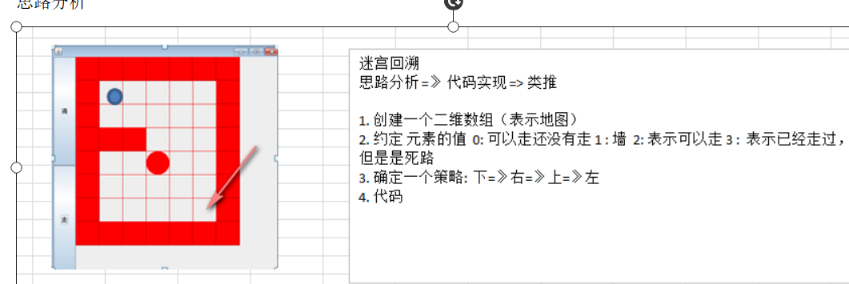

```
package datastructure.Recursive

/**
  * 迷宫问题
  */
object RecursiveTest {
  def main(args: Array[String]): Unit = {
    test01()
  }

  def test01(): Unit = {
    //创建二维数组模仿迷宫--上下左右四周为数字1，表示迷宫
    val array = Array.ofDim[Int](8, 7)
    //上下 全部置为1
    for (i <- 0 to 6){
      array(0)(i) = 1
      array(7)(i) =1
    }
    //左右全部置为1
    for (i<- 0 to 7){
      array(i)(0)=1
      array(i)(6) =1
    }

    //设置两个格挡
    array(3)(1) = 1
    array(3)(2) = 1

    //打印地图
    for (i <- 0 until 8) {
      for (j <- 0 until 7) {
        print(array(i)(j) + " ")
      }
      println()
    }
    println("================")
    // 参数：数组，起始坐标
    setWay(array, 1,1)

    //查找结束后，再次进行打印地图
    for (i <- 0 until 8) {
      for (j <- 0 until 7) {
        print(array(i)(j) + " ")
      }
      println()
    }
  }

  /**
    * 定义一个策略：
    * 数字0表示可以走，还没走
    * 数字1表示墙
    * 数字2表示可以走
    * 数字3表示已经走过，死路
    * 确定一个行走策略： 下=>右=>上=》左
    * 其实位置从(1,1)开始
    */
  def setWay(array: Array[Array[Int]], i:Int,j:Int): Boolean = {
    //设置递归结束条件
    if (array(6)(5) ==2){
      return true
    }
    if (array(i)(j) ==0){
      array(i)(j)=2 //立刻置为2，表示可以走的路
      //进行递归策略
      //下
      if (setWay(array,i+1,j)){
        return true
      }else if (setWay(array,i,j+1)){
        //右
        return true
      }else if (setWay(array,i-1,j)){
        //上
        return true
      }else if (setWay(array,i,j-1)){
        //左
        return true
      }else{ //上下左右不都行，
        return false;
      }
    }else{ //非0 1,2,3
      return false
    }
  }
}
```


##### 查找

###### 二分查找

> 二分查找的前提是：查找的数组有序，

```

object BinarySearchTest {
  def main(args: Array[String]): Unit = {
    //二分查找数组前提，数组有序
    var arr = Array(1, 2,3,4,5,6,7,8,9)
    println(binarySearch(arr, 5, 0, arr.length - 1))
  }
  def binarySearch(array: Array[Int], find:Int, left:Int, right:Int):Int ={
    if (left>right){
      return -1
    }
    var mid = (left+right)/2
    //递归方式进行二分法查找
    if (array(mid) >find){ //中间值大于想要查找的值
      binarySearch(array,find, left,mid-1)
    }else if (array(mid) < find){
      binarySearch(array,find, mid+1,right)
    }else{
      println("找到...下标 "+mid +"值：" +array(mid))
      return mid
    }

  }
}
```


#### Scala排序

参考资料：https://www.cnblogs.com/onepixel/articles/7674659.html


##### 冒泡排序

> 排序思想： 
>
> 依次比较相邻的元素，将大(从小到大)的元素放在最后面，类似于冒泡一样

```

/**
  * 冒泡排序
  */
object BubbleSort {
  def main(args: Array[String]): Unit = {
    var arr = Array(1,3,5,7,9,2,4,6,8)
    bubbleSort(arr)
    println(arr.mkString(" "))
  }
  def bubbleSort(array: Array[Int]): Unit ={
    for (i<- 0 until array.length-1){
      for(j<- 0 until array.length-i-1){ //最大的已经排在最后面了，所以内层循环到arr.legth-i-1
        if (array(j) >array(j+1)){//交换
          val tmp = array(j)
          array(j) = array(j+1)
          array(j+1) = tmp
        }
      }
    }
  }
}

```


##### 选择排序

> 排序思想：
>
> 第一次从Arr[0] 到Arr[n-1]中选出最小的，和Arr[0]进行交换
>
> 第二次从Arr[1] 到Arr[n-1]中选出最小的，和Arr[1]进行交换
>
> ...

```scala

object SelectionSort {
  def main(args: Array[String]): Unit = {

    var arr = Array(1,3,5,2,4)
    selectionSort(arr)

    println(arr.mkString(" "))
  }

  def selectionSort(array: Array[Int]): Unit = {
    for (i <- 0 until array.length - 1) {
      var minValue = array(i)
      var minIndex = i
      //内层循环
      for (j <- (i + 1) until array.length) {
        if (minValue > array(j)) {
          minValue = array(j)
          minIndex = j
        }
      }
      //判断索引是否相同
      if (minIndex != i) {
        array(minIndex) = array(i)
        array(i) = minValue
      }
    }
  }

}
```


##### 插入排序

> ###### 从后向前比较

> 排序思想：
>
> 将n个元素分成两部分，一部分是有序序列， 一部分是无序序列，第一次时，第一个为有序序列，其余都是无序序列，每次从无序序列中取出一个元素，然后和有序序列进行比较，找到合适的位置进行插入(从后向前进行比较)


```
package datastructure.sort

object InsertSortTest {
  def main(args: Array[String]): Unit = {
    var array = Array(1,3,5,7,9,2,4,6,8)
    insertSort(array)

    println(array.mkString(" "))
  }

  /**
    * var insertIndex = i-1 //插入位置为前一个，从后向前查找插入  记得-1
    * @param array
    */
  //插入排序
  def insertSort(array: Array[Int]): Unit ={
    //从后向前
    for (i <- 1 until array.length){
      var insertIndex = i-1 //插入位置为前一个，从后向前查找插入
      var insertValue = array(i)
      while(insertIndex>=0  && insertValue < array(insertIndex)){
        array(insertIndex+1) = array(insertIndex) //后面的数据覆盖前面的数据
        insertIndex-=1 //向前移动
      }
      array(insertIndex+1) = insertValue
    }
  }

}
```


##### 快速排序

> 快速排序思想：
>
> 找到一个数，通过一趟排序，左边的比这个数小，右边的都比这个数大，然后类推，通过递归思想进行全部排序


```scala

object QuickSortTest {
  def main(args: Array[String]): Unit = {
    var arr = Array(1, 3, 5, 7, 9, 2, 4, 6, 8)
    quickSort(arr, 0, arr.length - 1)
    println(arr.mkString(" "))
  }

  def quickSort(array: Array[Int], left: Int, right: Int): Unit = {
    if (left >= right)
      return
    val key = SinglePartSort(array, left, right)
    quickSort(array, left, key - 1)
    quickSort(array, key + 1, right)
  }
  //挖坑法，把第一个数字当成一个坑
  def SinglePartSort(a: Array[Int], l: Int, r: Int): Int = {
    var left = l
    var right = r //不能指向常量
    var key = a(right)

    while (left < right) {
      while (left < right && a(left) <= key) {
        left += 1
      }
      a(right) = a(left) //交换
      while (left < right && a(right) >= key) {
        right -= 1
      }
      a(left) = a(right)
    }
    a(left) = key //最后left一定等于right,所以理论上，这里写left还是right都是一样的
    return left
  }
}
```

##### 归并排序

> 归并排序思想：
>
> 采用分治的思想，将一个大的问题拆分成一个个的小问题解决，将n个元素递归拆分成单个元素，然后进行逐个的合并排序

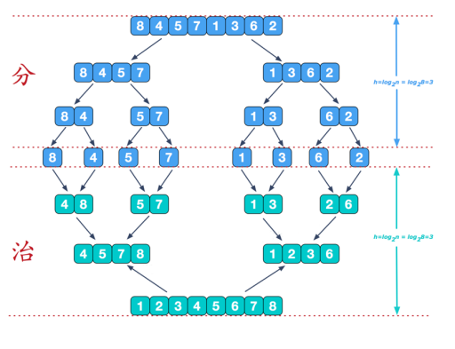

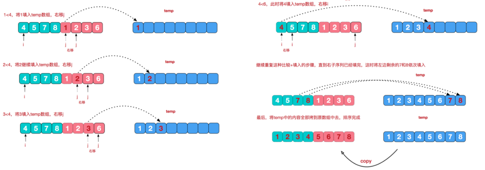

- code

```scala

object MergeSort {
  def main(args: Array[String]): Unit = {
//    var arr = Array(5, 7, 4)
    var arr = Array(1,3,5,7,2,4,6,8)
    mergeSort(arr,0, arr.length-1)
    println(arr.mkString(" "))
  }
  def mergeSort(array: Array[Int], left:Int, right:Int): Unit ={
    var tmp = new Array[Int](array.length)
    mergeSort(array, left, right, tmp)
  }

  def merge(array: Array[Int], left: Int, mid: Int, right: Int, tmp: Array[Int]): Unit = {
    //三个索引指针，第一个指向left 起始位置，第二个指向mid+1 的起始位置，第三个指向tmp的起始位置
    var l = left
    var m = mid+1
    var t = 0

     //先进行比较两个部分的较小值，然后放入到tmp中，使变得有序
    while(l<= mid && m <= right){
      if (array(l)< array(m)){ //如果l的数据小
        tmp(t)=array(l)
        t+=1 //将较小的数据放入后，t指针向后移动一个单位
        l+=1 //l向后移动一个单位
      }else {
        tmp(t) =array(m)
        m+=1 //m指针向后移动一个单位
        t+=1  //t指针向后移动一个单位
      }
    }
    //然后判断这两个部分数据，是否还有剩余--有剩余将之放入到tmp中
    while(l<=mid){
      tmp(t) = array(l)
      l+=1
      t+=1
    }
    while(m<= right){
      tmp(t) = array(m)
      m+=1
      t+=1
    }
    //最后将数据从tmp拷贝到array中
    t=0
    var tmpLeft = left
    while(tmpLeft<=right){ //拷贝数据
      array(tmpLeft) = tmp(t)
      tmpLeft+=1
      t+=1
    }
  }

  def mergeSort(array: Array[Int], left:Int, right:Int, tmp:Array[Int]): Unit ={
    var mid = (left+right)/2
    if (left<right) {
      mergeSort(array, left, mid, tmp)
      mergeSort(array, mid + 1, right, tmp)
      //merger合并操作
      merge(array, left, mid, right, tmp)
    }
  }
}

```

### 哈希表(hash table)

- code

```
package datastructure.HashTab


import scala.io.StdIn
import util.control.Breaks._

object HashTabDemo {
  def main(args: Array[String]): Unit = {

    //创建HashTab
    val hashTab = new HashTab(2)
    //写一个简单菜单
    var key = " "
    while (true) {
      println("add:  添加雇员")
      println("list: 显示雇员")
      println("find: 查找雇员")
      println("exit: 退出系统")

      key = StdIn.readLine()
      key match {
        case "add" => {
          println("输入id")
          val id = StdIn.readInt()
          println("输入名字")
          val name = StdIn.readLine()
          val emp = new Emp(id, name)
          hashTab.add(emp)
        }
        case "find" => {
          println("输入要查找的雇员的id")
          val id = StdIn.readInt()
          hashTab.findEmpById(id)
        }
        case "list" => {
          hashTab.list()
        }
      }

    }
  }
}

//创建Emp类
class Emp(eId: Int, eName: String) {
  val id = eId
  var name = eName
  var next: Emp = null
}

//创建EmpLinkedList
class EmpLinkedList {
  //定义头指针, 这里head 我们直接回指向一个雇员
  var head: Emp = null

  //添加雇员方法
  //假定，添加的雇员的id是自增的，即雇员分配的id总是从小到大
  //找到链表的最后加入即可
  def add(emp: Emp): Unit = {

    //如果是第一个雇员
    if (head == null) {
      head = emp
      return
    }
    //定义辅助指针
    var cur = head

    breakable {
      while (true) {
        if (cur.next == null) {
          break()
        }
        cur = cur.next
      }
    }
    //这时cur 指向了链表的最后
    cur.next = emp

  }

  def addSorted(emp: Emp): Unit = {
    if (head == null) {
      head = emp
      return
    }

    var temp = head

    var prev = new Emp(-1, "")
    prev.next = temp
    var findFlag = false
    var existFlag = false // flag 是用于判断是否该编号已经存在, 默认为false
    breakable {
      while (true) {
        if (temp == null) {
          break()
        }
        if (temp.id > emp.id) {
          findFlag = true
          //找到位置
          break()
        } else if (temp.id == emp.id) {
          //重复
          existFlag = true
          break()
        }
        prev = temp
        temp = temp.next
      }
    }

    if (existFlag) { // 不可以加入
      printf("待插入的id %d 已经有了，不能加入\n", emp.id)
    } else {
      //加入，注意顺序
      if (findFlag) {// 需要在非尾部插入
        emp.next = temp
        prev.next = emp
        head = emp
      } else { //需要在尾部插入，prev跟随者temp进行移动
        prev.next = emp
      }

    }
  }

  //遍历链表的方法
  def list(i: Int): Unit = {
    if (head == null) {
      println(s"第${i}条链表为空")
      return
    }

    print(s"第${i}条链表信息为\t")
    //定义辅助指针
    var cur = head
    breakable {
      while (true) {
        if (cur == null) {
          break()
        }
        //输出雇员信息
        printf(" => id=%d name=%s\t", cur.id, cur.name)
        cur = cur.next //
      }
    }
    println()
  }

  //如果有，返回emp ,没有返回null
  def findEmpById(id: Int): Emp = {
    //遍历
    if (head == null) {
      println("链表为空，没有数据~~")
      return null
    }

    var cur = head

    breakable {
      while (true) {
        if (cur == null) {
          break()
        }
        if (cur.id == id) {
          break()
        }
        cur = cur.next
      }
    }
    return cur
  }
}


class HashTab(val size: Int) { //size 会称为只读属性
  val empLinkedListArr: Array[EmpLinkedList] = new Array[EmpLinkedList](size)
  //初始化我们的empLinkedListArr 的各个元素
  for (i <- 0 until size) {
    empLinkedListArr(i) = new EmpLinkedList
  }

  def add(emp: Emp): Unit = {
    //返回该员工，应该加入到那条链表
    val empLinkedListNo = hashFun(emp.id)
    //排序方式
    empLinkedListArr(empLinkedListNo).addSorted(emp)
  }

  def list(): Unit = { //遍历整个hash表
    for (i <- 0 until size) {
      empLinkedListArr(i).list(i)
    }
  }

  //编写一个findEmpById
  def findEmpById(id: Int): Unit = {
    //返回该员工，应该加入到那条链表
    val empLinkedListNo = hashFun(id)
    val emp = this.empLinkedListArr(empLinkedListNo).findEmpById(id)
    if (emp != null) {
      printf(s"在第 $empLinkedListNo 找到id=%d name=%s\n", id, emp.name)
    } else {
      printf("没有找到id为 %d \n", id)
    }
  }

  //散列函数, 可以定制
  def hashFun(id: Int): Int = {
    id % size
  }
}
```


> 权：节点的值
>
> 叶子节点：
>
> 满二叉树: 所有的叶子节点都在最后一层，且节点个数总数=2^n -1，n为层数
>
> 完全二叉树：TODO

##### 二叉树遍历：


##### 顺序存储二叉树

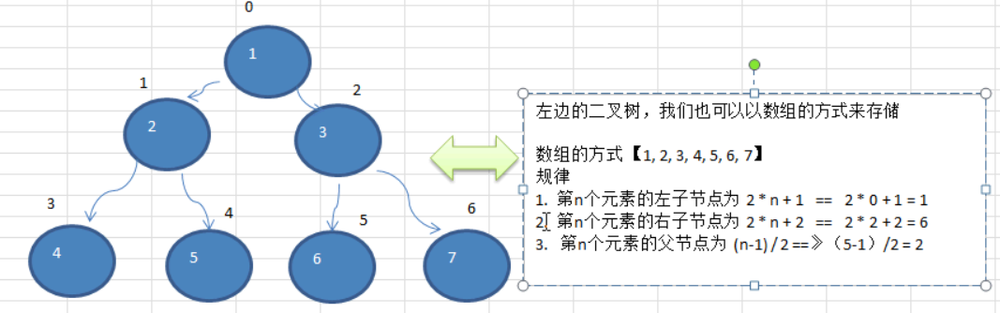


## 其他

Scala中的breakable

```scala
import scala.util.control.Breaks._
 breakable({
      for (i <- 0 until(array.length)){
        if(array(i)==7) break()
      }
    })
```

> 要导入头文件: scala.util.control.Breaks._


scala二维数组

```
ofDim(x,y)//TODO
```

