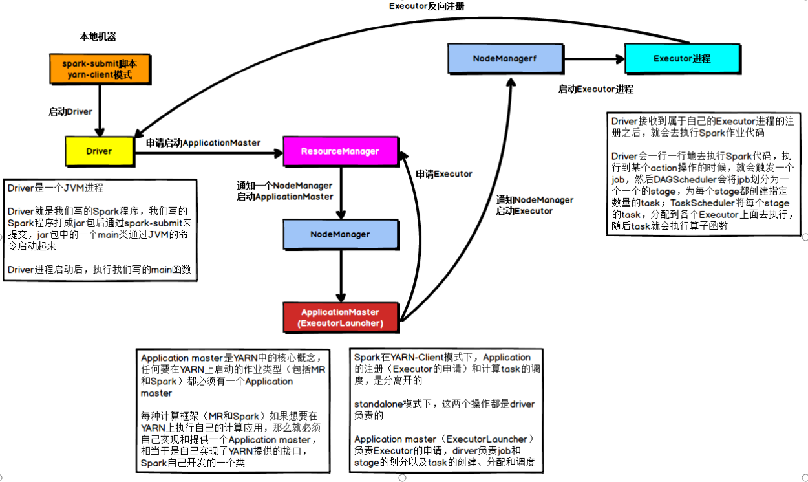
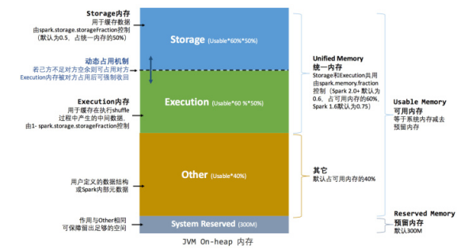

## Spark概述

> spark定义：Spark是一个基于内存，快速，通用，可扩展的数据搜索引擎

spark内置模块 = spark core+spark SQL+spark Streaming+spark Mlib+spark GraghX+集群管理器

###### Spark特点：

- 快: spark是基于内存的运算
- 易用: 支持多种语言，支持多种高级算法，可以使用户快速构建不同的应用
- 通用: 提供了同一的解决方案
- 兼容性:spark可以和其他框架进行融合

###### 集群角色

1. Master和Worker ==（Master worker只在standlone模式下）==
   1. Master：监听Worker，对Worker进行管理,类似于Yarn的resourceManager
   2. Worker：掌握每个节点的资源，类似于Yarn的nodemanager

2. Driver和Executor
   1.  Driver: 驱动器, 创建SparkContext，把用户程序转为任务，跟踪Executor的运行状态，为执行器节点调度任务
   2. Executor：执行器, 运行spark应用任务，并将状态信息返回给Driver驱动器

总结：==Master和Worker是Spark的守护进程，即Spark在特定模式下正常运行所必须的进程。Driver和Executor是临时进程，当有具体任务提交到Spark集群才会开启的进程。==

**tips**:查看LINUX线程数TODO

```
cat /proc/cpuinfo | grep 'procesoor'  | wc -l
```

###### local本地模式

> 可以在本地模式下练习和调试，local[*]表示计算机自动按照CPU最多的cores设置线程数

###### spark-submit

```shell
bin/spark-submit --class <main-class> --master <master-url> --deploy-mode <deploy-mode> --conf <key>=<value>  #other options <application-jar> [application-arguments]
```

参数说明：

```
-- master: 指定master地址
--class:指定应用的启动类
--deploy-mode: client/cluster方式运行程序
--conf : 任意的spark配置属性
--executor-memory 1G 指定每个executor可用内存为1G；
--total-executor-cores 2 指定每个executor使用的cup核数为2个。
```

```
//更多详细内容可直接bin/spark-submit ，点击确定查看
```

###### spark-shell

```shell
bin/spark-shell
spark-shell退出:     :quit
```

###### WordCound案例

```
sc.textFile("input").flatMap(_.split(" ")).map((_,1)).reduceByKey(_+_).collect
```

- collect延时计算方式

##### Standalone模式：(完全分布式模式)

> 主从架构


流程：(client方式)

1. SparkContext(driver) 向master进行注册，向资源管理者(这里是master)申请资源，然后启动Executor, Executor会向Driver进行反向注册，Driver会进行任务切分(task)，资源分配，Executor执行任务时，会向Driver报告Task状态，直至结束,任务结束后Driver进行注销


###### 安装使用

```
cd spark/conf
修改配置文件名称:
	mv slaves.template slaves
	mv spark-env.sh.template spark-env.sh
修改slave文件，添加work节点: vim slaves
	hadoop102
	hadoop103
	hadoop104
修改spark-env.sh文件：
	SPARK_MASTER_HOST=hadoop102 #设置master节点
	SPARK_MASTER_PORT=7077 #设置主端口
分发spark包： 设置完成后，进行分发
启动： sbin/start-all.sh
设置sbin/spark-config.sh 
	export JAVA_HOME=xxx #导出java_home
```

###### 官方求PI案例：

- spark-submit

```
 bin/spark-submit \
--class org.apache.spark.examples.SparkPi \
--master spark://hadoop102:7077 \
--executor-memory 1G \
--total-executor-cores 2 \
./examples/jars/spark-examples_2.11-2.1.1.jar \
100
```

###### 启动spark-shell

```
bin/spark-shell \
--master spark://hadoop102:7077 \
--executor-memory 1g \
--total-executor-cores 2
```

###### standalone模式执行wordcount

```shell
sc.textFile("./work/input.txt").flatMap(_.split(" ")).map((_,1)).reduceByKey(_+_).collect
//输出：res1: Array[(String, Int)] = Array((hello,2), (wortd,1), (wangyigang,1))    
//注意点：standalone模式下，执行本地文件，需要每个节点上都有文件，否则会找不到文件
```


##### HA配置

```
vi spark-env.sh
注释掉如下内容：
#SPARK_MASTER_HOST=hadoop102
#SPARK_MASTER_PORT=7077
添加上如下内容：
export SPARK_DAEMON_JAVA_OPTS="
-Dspark.deploy.recoveryMode=ZOOKEEPER 
-Dspark.deploy.zookeeper.url=hadoop102,hadoop103,hadoop104 
-Dspark.deploy.zookeeper.dir=/spark"
```

```
进行分发配置文件 :spark-env.sh
启动全部节点： sbin/start-all.sh
另一个节点上单独启动master节点： sbin/start-master.sh
spark HA集群访问
	bin/spark-shell \
	--master spark://hadoop102:7077,hadoop103:7077 \
	--executor-memory 2g \
	--total-executor-cores 2
```

##### Yarn模式

> yarn模式细分为 yarn-client模式和 yarn-cluster模式，两种模式的区别是Dirver程序的运行节点不同, yarn-client的Driver运行在客户端，yarn-cluster程序运行在RM启动的appmaster中


流程:客户端client提交任务, RM选择一个节点启动appMaster,appMaster启动Driver(初始化sc) , AM向RM申请资源启动Executor， Executor进行反向注册,Driver进行任务切分，资源分配，Executro进行执行任务,并向Driver反馈执行状态，执行完成后，Driver进行注销

> 开发环境下不会使用client模式，都会使用cluster模式,client模式的好处是执行结果可以直接打印显示出来，cluster结果在其他节点上, clutser中Driver分散在不同节点上，不同的Driver和对应的Executor进行沟通


```
1. spark-submit通过客户端client访问yarn
2. 将数据提交给RM,RM会选择一个NM创建AM,启动Driver
3. Driver对计算任务进行划分后，由AM申请资源，RM返回资源列表，
4.Driver将数据和资源进行匹配后，利用资源启动Executor
5. Executor启动后反向注册到Driver，建立Driver和Executor之间的关系
6.Driver调度任务给Executor执行，Executor将任务的执行情况周期的发给Driver进行报告
7.Executor执行完成后，通知Driver，释放资源
```


client模式：

ExecutorLaucher: Executor启动器，sparkAppMaster

SparkSubmit: clinet模式下和Driver在一起


Cluster模式：

​	


###### 安装使用

```shell
1.修改hadoop配置文件yarn-site.xml
	 <!--是否启动一个线程检查每个任务正使用的物理内存量，如果任务超出分配值，则直接将其杀掉，默认是true -->
        <property>
                <name>yarn.nodemanager.pmem-check-enabled</name>
                <value>false</value>
        </property>
        <!--是否启动一个线程检查每个任务正使用的虚拟内存量，如果任务超出分配值，则直接将其杀掉，默认是true -->
        <property>
                <name>yarn.nodemanager.vmem-check-enabled</name>
                <value>false</value>
        </property>
2. 修改spark-env.sh
	YARN_CONF_DIR=/opt/module/hadoop-2.7.2/etc/hadoop
3. 分发配置文件: 分发yarn-site.xml
4.执行程序进行测试
	bin/spark-submit \
--class org.apache.spark.examples.SparkPi \
--master yarn \
--deploy-mode client \
./examples/jars/spark-examples_2.11-2.1.1.jar \
100

```

###### 日志查看

```
//作用：可以将spark的日志映射到yarn的日志，可以通过yarn历史日志查看spark
1. 修改spark-defaults.conf
	spark.yarn.historyServer.address=hadoop102:18080
	spark.history.ui.port=18080
2. 重启spark历史服务
	sbin/stop-history.sh
	sbin/start-history.sh
3. 提交任务执行
4. web网页查看hadoop103:8088，继续点击单条日志会跳转到spark日志中
```


##### IDEA编写WordCount程序，提交在集群中执行

1. 创建Maven项目

```xml
<dependencies>
    <dependency>
        <groupId>org.apache.spark</groupId>
        <artifactId>spark-core_2.11</artifactId>
        <version>2.1.1</version>
    </dependency>
</dependencies>
<build>
        <finalName>WordCount</finalName>
        <plugins>
<plugin>
                <groupId>net.alchim31.maven</groupId>
<artifactId>scala-maven-plugin</artifactId>
                <version>3.2.2</version>
                <executions>
                    <execution>
                       <goals>
                          <goal>compile</goal>
                          <goal>testCompile</goal>
                       </goals>
                    </execution>
                 </executions>
            </plugin>
<plugin>
                <groupId>org.apache.maven.plugins</groupId>
                <artifactId>maven-assembly-plugin</artifactId>
                <version>3.0.0</version>
                <configuration>
                    <archive>
                        <manifest>
                            <mainClass>WordCount</mainClass>
                        </manifest>
                    </archive>
                    <descriptorRefs>
                        <descriptorRef>jar-with-dependencies</descriptorRef>
                    </descriptorRefs>
                </configuration>
                <executions>
                    <execution>
                        <id>make-assembly</id>
                        <phase>package</phase>
                        <goals>
                            <goal>single</goal>
                        </goals>
                    </execution>
                </executions>
</plugin>
        </plugins>
</build>
```

2. 编写代码

```scala
  def main(args: Array[String]): Unit = {
    //创建sparkConf并设置app名称
    var conf = new SparkConf().setAppName("WC")
    //创建sparkcontext
    var sc = new SparkContext(conf)

    //使用sc创建RDD并执行相应的transformation和action
    sc.textFile(args(0)).flatMap(_.split(" ")).map((_,1)).reduceByKey(_+_,1)
      .saveAsTextFile(args(0)+"/output")
    //关闭连接
    sc.stop()
  }
```


3. 打包提交到集群测试

```
bin/spark-submit \
--class WordCount \
--master spark://hadoop102:7077 \
WordCount.jar \
/word.txt \
/out
```

```
spark-shuffle过程落盘
```


## SparkCore

##### RDD是啥

> RDD(Resilient Distributed Dataset), 弹性分布式数据集,是Sparkd中最基本的数据抽象,spark计算的基石，为用户屏蔽了底层对数据的复杂抽象和处理，为用户提供了一组方便的数据转换与求值方法
>
> 不可变，可分区(把数据分成多个), 弹性

```
//RDD源码
abstract class RDD[T: ClassTag](
    @transient private var _sc: SparkContext,
    @transient private var deps: Seq[Dependency[_]]
  ) extends Serializable with Logging {

```

> 分布式指的是同一个RDD中数据存储在不同机器上
>

##### RDD编程

> RDD也体现装饰者设计模式

###### RDD特点

```
1. 弹性
	存储的弹性：内存与磁盘的自动切换(如果内存不足，自动存储在磁盘)
	容错的弹性：数据丢失可以自动恢复:数据丢失会从上游重计算(通过血统关系)
	计算的弹性：计算出错重试机制，
	分片的弹性： 可根据需要重新分片
```

###### RDD都做了什么

```
RDD的创建->RDD的转换->RDD的缓存->RDD的行动(action)->RDD输出
```


###### 三种模式下RDD分区规则

> local模式：默认是CPU核数
>
> yarn模式：cpu*线程数
>
> standalone模式：cpu*线程数


###### 编程模型:

```
transformations : 转换，RDD是延迟计算的，只有遇到action后，才会进行计算,(懒执行，会自动进行优化)
actions ： 向应用程序返回结果,一个action就是一个job
```

###### RDD创建的三种方式

```
1.从集合中创建：paralize(), makeRDD
2.外部系统创建RDD:从HDFS, Hbase中读取数据创建
3.从其他RDD中创建
```

###### 从集合中创建RDD

1. makeRDD

```
  def makeRDD[T: ClassTag](
      seq: Seq[T],
      numSlices: Int = defaultParallelism): RDD[T] = withScope {
    parallelize(seq, numSlices)
  }
```

2. parallelize

```c
  def parallelize[T: ClassTag]( seq: Seq[T],
      numSlices: Int = defaultParallelism): RDD[T] = withScope {
    assertNotStopped()
    new ParallelCollectionRDD[T](this, seq, numSlices, Map[Int, Seq[String]]())
  }
```

makeRDD重载版本：指定每个分片的存放位置

```scala
  def makeRDD[T: ClassTag](seq: Seq[(T, Seq[String])]): RDD[T] = withScope {
    assertNotStopped()
    val indexToPrefs = seq.zipWithIndex.map(t => (t._2, t._1._2)).toMap
    new ParallelCollectionRDD[T](this, seq.map(_._1), math.max(seq.size, 1), indexToPrefs)
  }
  //使用方式
  sc.makeRDD(Array(1,List("slave01"),(2,List("slave02"))))
```

 

###### RDD类型

数值型RDD：   RDD.scala

键值对RDD：    PairRDDFunctions.scala[所有键值对RDD都可以使用数值型RDD的操作]

###### RDD的转换

如何区分转换操作还是行动操作:判断函数返回值类型(返回值Array的为行动类型)

###### 常用的Transformation

- map

```
def map[U: ClassTag](f: T => U): 一对一进行转换
```

```scala
scala> rdd.map(_*2).collect
scala> rdd.map(_*2).collect
```

- mapPartitions(func)：独立的在RDD的每一个分片上运行,效果类似，效率高(作用次数少)--==传入的是集合,对整个分区做处理==

```scala
scala> var rdd = sc.makeRDD(Array(1,2,3,4))
scala> rdd.mapPartitions(x => x.map(_*2))

scala> res4.collect
res5: Array[Int] = Array(2, 4, 6, 8)
```

mapPartition():每次处理一个分区的数据，这个分区的数据处理完后，原RDD分区中的数据才能释放，所以可能会导致OOM

- mapPartitionsWithIndex(func)

```scala
def mapPartitionsWithIndex[U: ClassTag](
      f: (Int, Iterator[T]) => Iterator[U],
      preservesPartitioning: Boolean = false): RDD[U] 
//作用：类似于mapPartitions,但func有一个int表示index索引
```

```scala
//需求：创建一个RDD,使每个元素和所在分区形成一个元素组成一个新的RDD
scala> var rdd = sc.makeRDD(Array(1,2,3,4,5))

scala> rdd.mapPartitionsWithIndex((index,items)=>(items.map((index,_)))).collect
res13: Array[(Int, Int)] = Array((0,1), (0,2), (1,3), (1,4), (1,5)
```


- filter

```
def filter(f: T => Boolean):传入一个Boolean方法，过滤数据
```

```
scala> var rdd = sc.makeRDD(Array(1,2,3,4))

scala> rdd.filter(_%3==0).collect
res9: Array[Int] = Array(3)
```

- flatmap--将内部数据打散，

```
def flatMap[U: ClassTag](f: T => TraversableOnce[U]):RDD[U] //一对多，并将多压平
```

```scala
//需求：创建元素1-5的RDD,并运用flatMap将每个元素扩展(1, 1,2,1,2,3,1,2,3,4,1,2,3,4,5)
scala> var rdd = sc.makeRDD(Array(1,2,3,4,5))

scala> rdd.flatMap(1 to _).collect
res11: Array[Int] = Array(1, 1, 2, 1, 2, 3, 1, 2, 3, 4, 1, 2, 3, 4, 5)
```

- sample

```
 def sample(
      withReplacement: Boolean, //放回式抽样，无放回式抽样
      fraction: Double, //不是精确值，相差不多
      seed: Long = Utils.random.nextLong): RDD[T]
//true为放回抽样，false为不放回抽样
```

- glom

```
//作用：将每一个分区形成一个数组，形成新的RDD类型是：RDD[Array[T]]

```

- groupBy(func)案例

作用：分组，按照传入函数的返回值进行分组，将相同的key对应的放入到同一个迭代器

```
//需求:创建一个RDD,按照元素模2的值进行分组

scala> var rdd = sc.makeRDD(1 to 4)

scala> rdd.groupBy(_%2).collect                                              #res1: Array[(Int, Iterable[Int])] = Array((0,CompactBuffer(4, 2)), (1,CompactBuffer(1, 3)))
```

- distinct

> 作用：对源RDD进行去重，返回一个新的RDD

```scala
scala> rdd = sc.makeRDD(List(1,2,3,1,2,3,4,5))

scala> rdd.distinct.collect
res4: Array[Int] = Array(4, 2, 1, 3, 5)
```

- coalesce(numPartitions)

> 作用：==重新设置分区数==,   用于大数据集过滤后，提高小数据体的执行效率

```
//需求：创建一个4个分区的RDD，对其缩减分区
scala>  val rdd = sc.parallelize(1 to 16,4)

scala> rdd.partitions.size
res9: Int = 4

scala> val coalesceRDD = rdd.coalesce(3)

scala>  coalesceRDD.partitions.size
res10: Int = 3
```

- repartitions(numPartitions)

> 根据分区数，重新通过网络随机洗牌所有数据

```
scala> sc.makeRDD(1 to 64, 4)
res11: org.apache.spark.rdd.RDD[Int] = ParallelCollectionRDD[17] at makeRDD at <console>:25

scala> res11.getNumPartitions
res12: Int = 4

scala> res11.repartition(2)
res13: org.apache.spark.rdd.RDD[Int] = MapPartitionsRDD[21] at repartition at <console>:27

scala> res13.getNumPartitions
res14: Int = 2
```

coalesce 和repatition的区别

coalesce重新分区，可以选择是否进行shuffle过程，有参数shuffle:Boolean=true/false决定

repatition实际上是调用colesce，然后进行shuffle，但是底层调用时第二个参数默认设置为true

- sortBy

> 作用：使用func先对数据进行处理，按照处理后的数据对比结果排序，默认为true,正序，false--倒叙


- pipe

> 管道，针对每个分区，都执行一个shell脚本，返回输出的RDD

```
 rdd.pipe("/opt/module/spark/pipe.sh").collect() //pipe(脚本路径)
```

##### 双Value类型交互

- union

> 对源TDD和参数RDD求并集，并返回一个新的TDD，(不进行去重)

```
val rdd3 = rdd1.union(rdd2)
```

- subtract

> 去除两个RDD中相同的元素

```
rdd.subtract(rdd1).collect()//有shuffle过程
```

- intersection

> 作用：求交集，返回一个新的RDD

```
al rdd3 = rdd1.intersection(rdd2)
```

- cartesian笛卡尔积

> 计算两个RDD的笛卡尔积，少使用

```
rdd1.cartesian(rdd2).collect()
```

- zip

```
将两个RDD组合成key/value形式的RDD， 默认两个RDD的partition数量和元素数量相同，否则抛异常
```

```
 rdd2.zip(rdd1).collect
```


##### shuffle

> 有分区改变的需要shuffle ,只是结构变化的不需要shuffle


##### 算子

##### value类型：

```
map(func):映射，返回一个新的RDD
mapPartitions(func):以分区为单位进行运行
mapPartitionsWithIndex(func):输出index
flatMap(func): 扁平化，将结构发生改变
glom: 生成一个数组,形成新的RDD[Array[T]]
groupBy(func): 按照传入函数分组
filter(func): 过滤，过滤掉为false结果的
sample(withReplacement, fraction,seed):是否又放回抽样，true有放回，fraction:概率/次数,seed种子
distinct([numTasks]):去重
coalesce(numPartitions):缩减分区数
repartition(numPartitions): shuffle，重新分区
sortBy(func, [ascending],[numberTasks]):true-正序，false-逆序
pipe(command, [envVars]):管道，每个分区执行脚本

```

##### 双Value

```
union(otherDataset): 并集
subtract(otherDataset) :差集
intersection(otherDataset):交集
cartesian(otherDataset):笛卡尔积
zip(otherDataset):拉链，合并成(k,v)
```

##### Key-value

```
partitionBy(partitioner):重新分区
reduceByKey(func,[numTasks]):按照key聚合
groupByKey():进行分组，然后进行shuffle
aggregateByKey(zeroValue)(seqOp)(combOp):零值，分区内算法，分区间算法
foldByKey(zeroValue)(func): 分区内和分区间算法相同
combineByKey[C](createCombiner: V => C,  mergeValue: (C, V) => C,  mergeCombiners: (C, C) => C) 
sortByKey([asc],[numTasks]):按照key排序
mapValues:只针对v进行操作
join():内连接
cogroup():外链接

```

#### Actition

```
reduce(func):聚合，先集合分区内数据，在聚合分区间数据
collect():以数组的形式返回所有元素
count():返回RDD中个数
first():返回第一个元素
take(n): 返回前n个元素
takeOrdered(n):返回排序后的前n个元素
aggregate(zeroValue: U)(seqOp: (U, T) ⇒ U, combOp: (U, U) ⇒ U)：分区间也会有初始值
fold:折叠,分区内，分区间算法相同
saveAsTextFile():保存
 saveAsSequenceFile(path) 
作用：将数据集中的元素以Hadoop sequencefile的格式保存到指定的目录下，可以使HDFS或者其他Hadoop支持的文件系统。
saveAsObjectFile(path) 作用：用于将RDD中的元素序列化成对象，存储到文件中。
countByKey()：返回每一个key对应的元素个数
foreach(func):遍历
```

#### 依赖关系

##### 血统(lineage)

RDD的血统会记录RDD的元数据信息和转换信息, 当数据丢失时，可以根据信息重新运算获的数据

###### 查看血缘关系方式

```
rdd.toDebugString
```


```scala
方式二：
res2.dependencies //同样可以查看
```


> ==宽窄依赖从父类角度看是否是一对一==

窄依赖：父RDD的每一个分区partition被子RDD的一个partition使用

```
底层源码中使用 NarrowDependency表示窄依赖
abstract class NarrowDependency[T](_rdd: RDD[T]) extends Dependency[T] {}
```

宽依赖：父RDD的分区会被多个子RDD的一个partition使用

DAG:有向无环图, RDD通过一系列转换形成有向无环图，由于宽依赖有shuffle过程，所以宽依赖是划分stage的依据 

```
阶段stage = 1+ n(n 为shuffle次数)
```

###### 任务划分

Application:初始化一个SparkContext =>生成一个application

Job: 一个Action算子就会生成一个Job


stage: 遇到一个宽依赖就会划分为一个stage

Task: stage是一个TaskSet,含有多个task

> ==Application->Job->Stage->Task每一层都是1对n的关系==

###### 源码分析

```
  def foreach(f: T => Unit): Unit = withScope {
    val cleanF = sc.clean(f)
    sc.runJob(this, (iter: Iterator[T]) => iter.foreach(cleanF))
  }
  //最终会调用到DAGScheduler中的runjob方法中，进行submitJob(提交作业)
 //如下图所示
```


```
submitJob中创建一个jobWaiter
val waiter = new JobWaiter(this, jobId, partitions.size, resultHandler)
最终会触发 handleJobSubmitted--》
```


```
从源码中可以看到shuffle中类型只有两种 ShuffledMapStage 和resultStage
```


```
 
 /** Submits stage, but first recursively submits any missing parents. */
  private def submitStage(stage: Stage) {
    val jobId = activeJobForStage(stage)
    if (jobId.isDefined) {
      logDebug("submitStage(" + stage + ")")
      if (!waitingStages(stage) && !runningStages(stage) && !failedStages(stage)) {
        val missing = getMissingParentStages(stage).sortBy(_.id)
        logDebug("missing: " + missing)
        if (missing.isEmpty) {
          logInfo("Submitting " + stage + " (" + stage.rdd + "), which has no missing parents")
          submitMissingTasks(stage, jobId.get)
        } else {
          for (parent <- missing) {
            submitStage(parent)
          }
          waitingStages += stage
        }
      }
    } else {
      abortStage(stage, "No active job for stage " + stage.id, None)
    }
  }

```

##### RDD缓存

通过persist(持久化)方法或cache方法将前面的计算结果缓存，persist和cache是在触发action时，这个RDD将会被缓存在内存

```
cache实质上调用的是persist()
```


存储级别分为：硬盘，内存，备份，硬盘和内存，序列化等进行组合

##### RDD CheckPoint

检查点机制，(本质是将RDD写入Disk做检查点) ，首先使用 sc.setCheckpointDir()设置的,在checkpoint的过程中，RDD的所有依赖于父RDD中的信息将全部被移除,

```
 sc.setCheckpointDir("hdfs://hadoop102:9000/checkpoint")
 var ch = rdd.map((_,1))
 ch.checkpoint
```

##### 键值对RDD数据分区

> Hash分区
>
> Range分区
>
> 自定义分区


##### 数据读取与保存

> Text文件
>
> Json文件
>
> Sequence文件
>
> 对象文件

##### 文件系统类数据读取与保存

> HDFS
>
> MySQL
>
> HBase

```scala
//JDBCRdd
package JDBCRDDTest

import java.sql.DriverManager

import org.apache.spark.rdd.JdbcRDD
import org.apache.spark.{SparkConf, SparkContext}

/*
有两点错误需要注意：一：url中协议格式： jdbc:mysql(子协议)://主机:端口号/数据库名
                 二：从结果集中获取数据时，一定要对应具体的类型,getString  getInt要和数据本身类型对应
 */
import org.apache.log4j.{Level, Logger}
object TestJDBCRDD {
  Logger.getLogger("org").setLevel(Level.ERROR)
  def main(args: Array[String]): Unit = {
    //jdbcRead()
    jdbcWrite()
  }
  //jdbc写操作
  def jdbcWrite(): Unit ={
    val conf = new SparkConf().setMaster("local[*]").setAppName("test")
    val sc = new SparkContext(conf)
    //jdbc写操作
    //准备数据

    var rdd = sc.makeRDD(Array(("pangdi", "femail")))

    //以分区方式进行
    rdd.foreachPartition(t => {  //先分区

      //创建jdbc驱动
      Class.forName("com.mysql.jdbc.Driver")
      var url = "jdbc:mysql://hadoop102:3306/company"
      val connection = DriverManager.getConnection(url, "root","1")
      var sqlString = "insert into staff(name, sex) values(?,?)"
      val statement = connection.prepareStatement(sqlString) //预编译
      //设置相应蛇形
     t.foreach( data =>{ //再分区内数据
       //设置属性
        statement.setString(1,data._1)
        statement.setString(2,data._2)
       //设置完成后，进行执行
       statement.execute()
     })

    })


  }


  //读数据
  def jdbcRead(): Unit ={
    val conf = new SparkConf().setMaster("local[*]").setAppName("test")
    val sc = new SparkContext(conf)
    //jdbc
    var url = "jdbc:mysql://hadoop102:3306/company"
    val driver = "com.mysql.jdbc.Driver"
    val username = "root"
    val password = "1"

    var sqlString = "select * from staff where id>= ? and id<= ?"

    val resultrdd = new JdbcRDD(sc,
      () => {
        Class.forName(driver) //driver写错了
        val connection = DriverManager.getConnection(url, username, password)
        connection
      },
      sqlString,
      1,
      10,
      1, //分区个数
      r => {
        //回调函数，返回的结果集
        (r.getInt(1), r.getString(2), r.getString(3))
      }
    )
    resultrdd.foreach(println)

    //关闭资源
    sc.stop()
  }


  /*
    注意点：insertData中的参数类型
            prepareStatement参数 预编译软件
   */
//  def jdbcWrite(): Unit ={
//    var conf = new SparkConf().setMaster("local[*]").setAppName("test")
//    var sc = new SparkContext(conf)
//
//    //写数据
//    //准备数据
//    val data = sc.parallelize(List(("wang","Female")))
//    data.foreachPartition(insertData)
//    //foreach 和foreachPartition
//
//    //事件的准备在driver中，事件的执行在Executor中
//  }
//  def insertData(iterator: Iterator[(String,String)]): Unit ={
//    Class.forName ("com.mysql.jdbc.Driver").newInstance()
//    val conn = java.sql.DriverManager.getConnection("jdbc:mysql://hadoop102:3306/company", "root", "1")
//    iterator.foreach(data => {
//      val ps = conn.prepareStatement("insert into staff(name,sex) values (?,?)")
//      ps.setString(1, data._1)
//      ps.setString(2, data._2)
//      ps.executeUpdate()
//    })
//  }

//  def jdbcRead(): Unit ={
//    //spark配置信息
//    val conf = new SparkConf().setMaster("local[*]").setAppName("test")
//    //创建spakrContext上下文信息
//    val sc = new SparkContext(conf)
//
//    var driver = "com.mysql.jdbc.Driver"
//    var url = "jdbc:mysql://hadoop102:3306/company"
//    var username = "root"
//    var password = "1"
//
//    var sqlString="select * from  staff where id>=? and id<= ?"
//    //创建JDBCrdd
//    val rdd = new JdbcRDD(
//      sc,
//      () => {
//        Class.forName(driver)
//        val connection = DriverManager.getConnection(url, username, password)
//        connection
//      },
//      sqlString,
//      1,
//      10,
//      1,
//      r => (r.getInt(1), r.getString(2), r.getString(3))
//    )
//    rdd.foreach(println)
//
//    //关闭资源
//    sc.stop()
//
//  }
}


```


#### 累加器

> 分布式只写变量

存在原因：分布式系统中，每个Task中会得到变量的副本，变量的副本在Executor中发生改变，但不会影响Driver中的变量，所以Driver中声明的变量值不会发生改变

作用：累加器是一个分布式只写变量，可以解决上述问题

- code

```scala
import org.apache.spark.{SparkConf, SparkContext}

object TestAccumulator {
  import org.apache.log4j.{Level, Logger}
  Logger.getLogger("org").setLevel(Level.ERROR)
  def main(args: Array[String]): Unit = {
    // 准备Spark配置信息
    val conf: SparkConf = new SparkConf().setMaster("local[*]").setAppName("Test")

    // 创建Spark上下文对象
    val sc : SparkContext = new SparkContext(conf)

    var rdd = sc.makeRDD(1 to 5)
//    println(rdd.reduce(_ + _))
    val sum = sc.longAccumulator("sum")
    rdd.foreach( x =>{
      sum.add(x) //加数据
    })
    println(sum.value)
  }
}
```

##### 自定义累加器

1. 需要继承AccumulatorV2[in , out] 声明两个泛型, 然后重写几个方法
2. 使用时需要进行regist注册, 然后和系统的变量使用就一样了

```scala
package accumulator

import java.util

import org.apache.spark.{SparkConf, SparkContext}
import org.apache.spark.util.AccumulatorV2

object CustomerAccumulatorTest {
  def main(args: Array[String]): Unit = {
    // 准备Spark配置信息
    val conf: SparkConf = new SparkConf().setMaster("local[*]").setAppName("Test")

    // 创建Spark上下文对象
    val sc : SparkContext = new SparkContext(conf)

    var rdd = sc.makeRDD(Array("hadoop","pangdi","dilireba","wangyg"))
    //声明累加器
    var acc = new CustomerAccumulator()
    //注册
    sc.register(acc)
    //rdd处理
    rdd.foreach(word =>{
      acc.add(word)
    })
    //获取
    println(acc.value)

    //关闭资源
    sc.stop()
  }
}

//泛型[in, out]
class CustomerAccumulator extends AccumulatorV2[String, util.ArrayList[String]] {
  var blackList = new util.ArrayList[String]()

  //是否是初始值
  override def isZero: Boolean = {
    blackList.isEmpty
  }

  //复制，拷贝
  override def copy(): AccumulatorV2[String, util.ArrayList[String]] = {
    var acc = new CustomerAccumulator()
    acc
  }

  //重置
  override def reset(): Unit = {
    blackList.clear()
  }

  override def add(v: String): Unit = {
    if (v.contains("h")) {
      blackList.add(v)
    }
  }

  //合并
  override def merge(other: AccumulatorV2[String, util.ArrayList[String]]): Unit = {
    blackList.addAll(other.value)
  }

  //获取累加器的值
  override def value: util.ArrayList[String] = blackList
}
```


#### 广播变量

> 分布式只读变量

```scala
def test1(): Unit = {
    // 准备Spark配置信息
    val conf: SparkConf = new SparkConf().setMaster("local[*]").setAppName("Test")
    // 创建Spark上下文对象
    val sc: SparkContext = new SparkContext(conf)

    val rdd1: RDD[(String, Int)] = sc.makeRDD(Array(("a", 1), ("b", 1)))
    var arr = Array(("a", 3), ("b", 4))
    var arrBroadcast = sc.broadcast(arr)

    //    //通过只写变量获取结果数据
    var acc = new CustomerAccumulator()
    sc.register(acc)

    val resultRDD = rdd1.map(t => {
      val rddkey = t._1
      arrBroadcast.value.map(t1 => {
        val key = t1._1
        if (rddkey.equals(key)) {
          val strResult = "(" + rddkey + t._2 + t1._2 + ")"
          acc.add(strResult)
        }
      })
    })
    resultRDD.collect()

    println(acc.value)
    //关闭
    sc.stop()
  }
}


//泛型[in, out]
class CustomerAccumulator extends AccumulatorV2[String, util.ArrayList[String]] {
  var blackList = new util.ArrayList[String]()

  //是否是初始值
  override def isZero: Boolean = {
    blackList.isEmpty
  }

  //复制，拷贝
  override def copy(): AccumulatorV2[String, util.ArrayList[String]] = {
    var acc = new CustomerAccumulator()
    acc
  }

  //重置
  override def reset(): Unit = {
    blackList.clear()
  }

  //累加
  override def add(v: String): Unit = {
    blackList.add(v)
  }

  //合并
  override def merge(other: AccumulatorV2[String, util.ArrayList[String]]): Unit = {
    blackList.addAll(other.value)
  }

  //获取累加器的值
  override def value: util.ArrayList[String] = blackList
}
```

#### RDD总结

###### 弹性

```
基于内存的计算框架，但也可能会使用磁盘进行处理
分区的弹性：shuffle会重新分片
容错的弹性： checkpoint&cache 数据丢失可恢复
```

###### DAG

```
有向无环图，划分阶段
```


###### 数量

```
Executor: 提交应用时指定
分区: 内存中：max(cpu核数,2)
	 文件读取：min(cpu核数，2)--指定最小分区,具体取决于hadoop切片规则
阶段: 1 （resultStage）+n(shufflem个数)
Task:如果没有指定并行度，采用上一个阶段的分区数，若指定，会按照指定的作为分区数(任务数一般是cpu的2-3倍)
```


## SparkSQL

###### 是什么：

​	 sparkSQL是spark处理结构化数据的一个模块，有两个编程抽象：DataFrame和DataSet，==将sparkSQL转换成RDD,然后提交到集群执行==，执行效率非常快

##### DataFrame

​	DataFrame是一个以RDD为基础的分布式数据集，类似于二维表格，DataFrame记录==结构信息==

```
DataFrame也是懒执行，性能比RDD高，因为执行计划优化了
```

###### 创建

```
通过Spark数据源创建
	spark.read.json("/user.json")
	res4: org.apache.spark.sql.DataFrame = [age: bigint, name: string]
	scala> res4.show
	res4.createTempView("user") //创建临时视图
	scala>spark.sql("select * from user where age>24").show
从RDD进行转换
同HiveTable查询放回
```

创建全局视图

```
res4.createGlobalTempView("student")
park.sql("select * from global_temp.student where age>24").show //使用时加范围global_temp
```

##### RDD，DataFrame, DataSet三者之间转换

###### RDD，DataFrame转换

```
1. RDD转化成DataFrame
	var rdd =sc.makeRDD(Array((1,"zhangsan")))
	scala> rdd.toDF()
	res14: org.apache.spark.sql.DataFrame = [_1: int, _2: string]
2.DataFrame转RDD
	df.rdd
```

###### DataFrame,DataSet之间的转换

```
DataFrame=>DataSet
	df.as[Person]
DataSet=>DataFrame
	ds.toDF
```

###### RDD，DataSet转换

```
RDD=>DataSet
	var classRDD=rdd.map(t=>{
        Person(t._1, t._2)
	})
	classRDD.toDS
DataSet=>RDD
	dataset.rdd
```

> 三者全是惰性机制
>
> 三者之间有共同的函数
>
> 三者都是弹性分布式数据集
>
> 注意隐式转换: import spark.implicits._

###### DataSet

​	分布式数据集合，是DataFrame的一个扩展，最新的数据抽象,DataSet是一个具有强类型的数据集合

```scala
DataSet带有类型信息,既带有结构信息又带有类型信息
DataSet创建
	//首先创建样例类
	case class Person(name:String, age:Long)
	scala> var caseDs = Seq(Person("reba",23)).toDS()
	caseDs: org.apache.spark.sql.Dataset[Person] = [name: string, age: bigint]
	caseDs.createOrReplaceTempView("person") //创建临时视图
```

##### IDEA创建SparkSQL程序

```scala

import org.apache.spark.sql.SparkSession
import org.apache.spark.{SparkConf, sql}

object SparkSQLTest {
  import org.apache.log4j.{Level, Logger}
  Logger.getLogger("org").setLevel(Level.ERROR)

  def main(args: Array[String]): Unit = {
    //创建sparkconf
    val conf = new SparkConf().setMaster("local[*]").setAppName("test")
    //创建sparksession
    val spark = SparkSession.builder().config(conf)
      .getOrCreate() //获取或者创建

    //增加隐式转换规则
    import  spark.implicits._


    val dataFrame = spark.read.json("input/user.json")
    val ds = dataFrame.as[Person]

//    dataFrame.show()
    ds.createOrReplaceTempView("person")

    spark.sql("select * from person ").show()

    //关闭资源
    spark.close()
  }
}

case class Person(var name:String, var age:Long)
```


##### 自定义UDAF函数

```scala
/*
  注意点：错误一：忘记导入隐式转换，所以出现编译错误,由于插件的原因，在真正运行的时候才爆出来
          错误二：user中数据不能是int类型，只能是long类型，当前从文件获取，不能进行类型推断，所以会用bigint范围扩展，不能用int类型接收
 */
object UDAFClassTest {
  import org.apache.log4j.{Level, Logger}
  Logger.getLogger("org").setLevel(Level.ERROR)

  def main(args: Array[String]): Unit = {
    //强类型
    test1()
  }
  def test1(): Unit ={
    val conf = new SparkConf().setMaster("local[*]").setAppName("test")
    val spark = SparkSession.builder().config(conf).getOrCreate()

    //需要导入隐式依赖，否则会报错
    import spark.implicits._

    //创建函数对象
    val avgClassUDAF = new AgeAvgClassUDAF
    //构建UDAF函数
    val column = avgClassUDAF.toColumn.name("avgName")

    //准备数据
    val dataFrame = spark.read.json("input/user.json")
    val userDs = dataFrame.as[User]
    userDs.select(column).show()

    //关闭资源
    spark.stop()
  }
}
case class User(name:String, age:Long)
case class AvgBuffer(var sum:Long, var count:Long)

/**
  * 强类型语言
  */
//泛型
class AgeAvgClassUDAF extends Aggregator[User, AvgBuffer, Double]{
  /**
    * 初始值
    * @return
    */
  override def zero: AvgBuffer = {
    AvgBuffer(0L, 0L)
  }

  /**
    * 同一个节点（分区）的数据合并
    * @param b
    * @param a
    * @return
    */
  override def reduce(b: AvgBuffer, a: User): AvgBuffer = {
    b.sum+= a.age
    b.count+=1
    b
  }

  override def merge(b1: AvgBuffer, b2: AvgBuffer): AvgBuffer = {
    b1.sum+=b2.sum
    b1.count+=b2.count
    b1
  }

  override def finish(reduction: AvgBuffer): Double = {
    reduction.sum.toDouble /reduction.count
  }

  override def bufferEncoder: Encoder[AvgBuffer] = {
    Encoders.product
  }

  override def outputEncoder: Encoder[Double] = {
    Encoders.scalaDouble
  }
}
```


###### SparkSession

​	SparkSsssion是Spark最新的SQL查询起始点，SparkSession内部封装了sparkContext


##### 三者之间的关系


#### SparkSql数据的加载与保存

##### 加载数据

```
format:指定加载数据类型
load :通用接口，默认格式是Parquet
```

##### 写数据

```
write:写数据
format：指定数据类型,csv,json,orc..
saveMode(): Append/Overwrite/Error/Ignore
```


## SparkStreaming

spark Streaming 用于流式处理的数据,支持多种数据源：kafka，Flume,和套接字等,数据输入后，可以用spark的高度抽象原语：map,reduce, join, window等进行运算，而结果也能保存到很多地方，HDFS，数据库等

##### SparkStreaming架构


##### Dstream

###### wordcount案例

```

import org.apache.spark.SparkConf
import org.apache.spark.streaming.dstream.{DStream, ReceiverInputDStream}
import org.apache.spark.streaming.{Seconds, StreamingContext}

/**
  *   步骤一：导入pom.xml依赖--sparkStreaming 2.1.11
  *	  可以把log4j日志级别改为error，容易查看显示信息
  */
object StreamWordCountTest {
  def main(args: Array[String]): Unit = {
    //初始化sparkconf
    val conf: SparkConf = new SparkConf().setMaster("local[*]").setAppName("test")
    //创建sparkstreamingcontext--微批次处理
    val ssc = new StreamingContext(conf, Seconds(3)) //参数说明: 1. conf配置信息 2.duration持续时间3
    //采集数据，封装为Dstream--从指定端口获取数据
    val listenStream: ReceiverInputDStream[String] = ssc.socketTextStream("hadoop102",8888)
    //处理数据
    val tupleRDD: DStream[(String, Int)] = listenStream.flatMap(_.split(" ")).map((_,1))
    //统计结果
    val resultRDD: DStream[(String, Int)] = tupleRDD.reduceByKey(_+_)
    //打印结果
    resultRDD.print()

    //启动流式处理
    ssc.start()
    //等待
    ssc.awaitTermination()
  }
}
```

##### 文件数据源

```scala

/*
    注意点: 1.hdfs协议： hdfs://hadoop102:9000/path
    
 */
object TestTextFileWordCount {
  def main(args: Array[String]): Unit = {
    val conf: SparkConf = new SparkConf().setMaster("local[*]").setAppName("TestTextFileWordCount")

    //创建streamingContext
    val streamingContext = new StreamingContext(conf, Seconds(4))

    //监控接收数据源 --将数据通过命令上传到hdfs上 hadoop fs -put a.tsv /fileStream
    val Dstream: DStream[String] = streamingContext.textFileStream("hdfs://hadoop102:9000/fileStream")
    println(Dstream)

    //将数据进行处理
    val resultRDD: DStream[(String, Int)] = Dstream
      .flatMap(_.split(" ")).map((_,1)).reduceByKey(_+_)

    //打印查看是否正确
    resultRDD.print()

    streamingContext.start()
    streamingContext.awaitTermination()

  }
}

```

##### 自定义数据源

继承Receiver,并实现onStart, onStop方法定义数据源采集

```scala

/*
    自定义数据源
 */
object CustomerRecevier {
  def main(args: Array[String]): Unit = {
    //创建sparkconf
    val conf: SparkConf = new SparkConf().setMaster("local[*]").setAppName("CustomerRecevier")
    //创建streaming
    val streamingContext = new StreamingContext(conf, Seconds(5))
    //创建自动以数据源类，然后进行接收数据
    val receiver: ReceiverInputDStream[String] = streamingContext.receiverStream(
      new CustomerReceiver("hadoop102",9999))

    receiver.print()
    //接收到数据后，对数据进行处理
    val resultRDD: DStream[(String, Int)] = receiver.flatMap(_.split(" ")).map((_,1)).reduceByKey(_+_)

    resultRDD.print()
    //启动
    streamingContext.start()
    //等待数据
    streamingContext.awaitTermination()

  }
}

//自定义数据源，实现监控某个端口号，获取该端口号内容。
class CustomerReceiver(host:String, port:Int) extends Receiver[String](StorageLevel.MEMORY_ONLY){

  /**
    * 开始时调用
    */
  override def onStart(): Unit = {
    //socket编程--启动一个线程，不断接收数据
    new Thread("Socket Receiver"){
      override def run(): Unit = {
        receive();
      }
    }.start() //启动线程
  }

  /**
    *  结束时调用
    */
  override def onStop(): Unit = {

  }

  def receive(): Unit ={
    var socket = new Socket(host,port)
    //创建IO流
    val reader = new BufferedReader(new InputStreamReader(socket.getInputStream,"UTF-8"))

    var str:String =""
    while( !isStopped() &&(str=reader.readLine())!=null){
      store(str)
    }

    //跳出循环则关闭资源
    reader.close()
    socket.close()

    //重启任务
    restart("restart")
  }
}
```

##### kafka数据源

###### 导入依赖

```xml
    <groupId>org.apache.spark</groupId>
    <artifactId>spark-streaming-kafka-0-8_2.11</artifactId>
    <version>2.1.1</version>
</dependency>
<dependency>
    <groupId>org.apache.kafka</groupId>
    <artifactId>kafka-clients</artifactId>
    <version>0.11.0.2</version>
</dependency>
```

###### code

```scala
import kafka.serializer.StringDecoder
import org.apache.kafka.clients.consumer.ConsumerConfig
import org.apache.spark.SparkConf
import org.apache.spark.storage.StorageLevel
import org.apache.spark.streaming.dstream.{DStream, ReceiverInputDStream}
import org.apache.spark.streaming.kafka.KafkaUtils
import org.apache.spark.streaming.{Seconds, StreamingContext}


//从kafka中采集数据
object SparkKafkaTest {
  def main(args: Array[String]): Unit = {
    //创建sparkconf并初始化ssc
    var conf = new SparkConf().setMaster("local[*]").setAppName("test")
    //创建streamingContext
    val ssc = new StreamingContext(conf, Seconds(5))

    //通过KafkaUtils工具类，进行操作
    //K--分区
    val kafkaDS: ReceiverInputDStream[(String, String)] = KafkaUtils.createStream[String, String, StringDecoder, StringDecoder](
      ssc,
      Map(
        "zookeeper.connect" -> "hadoop102:2181",
        ConsumerConfig.GROUP_ID_CONFIG -> "spark",
        ConsumerConfig.KEY_DESERIALIZER_CLASS_CONFIG -> "org.apache.kafka.common.serialization.StringDeserializer",
        ConsumerConfig.VALUE_DESERIALIZER_CLASS_CONFIG -> "org.apache.kafka.common.serialization.StringDeserializer"
      ),
      Map(
        "ss" -> 3
      ),
      StorageLevel.MEMORY_ONLY //导包
    )
    val mapDS: DStream[(String, Int)] = kafkaDS.map(t => {
      (t._2, 1)
    })
    val resultDS: DStream[(String, Int)] = mapDS.reduceByKey(_+_)
    //打印结果
    resultDS.print()
    //启动流式处理
    ssc.start()
    //等待数据
    ssc.awaitTermination()
  }
}
```

```
kafka命令：
//创建主题
bin/kaftopics.sh --zookeeper hadoop102:2181 --create --replication-factor 2 --partitions 3 --topic ss
//查看主题
bin/kaftopics.sh --zookeeper hadoop102:2181 --list
//生产消息
 bin/kafka-console-producer.sh --broker-list hadoop102:9092 --topic ss
```

#### DStream转换

DStream上的原语 分为Transformations(转换)和Output Operation(输出) 两种，此外转换还有一些特殊的原语，如： updateStateByKey(), transform() 和各种Window相关原语

##### 无状态转化操作

​	无状态转化操作不会对不同时间批次的数据进行累加处理。

##### 有状态转换操作

​	无状态转换是分别应用到每个RDD上，例如，reduceByKey()会规约每个时间区内的数据，但不会规约不同区间之间的数据

###### UpdateStateByKey

==用于记录历史记录==，当需要跨批次维护状态时，可以使用updateStateByKey()提供对一个状态变量的访问

**使用updateStateByKey需要对检查点目录进行配置，会使用检查点checkpoint保存状态**

```scala

import org.apache.spark.SparkConf
import org.apache.spark.streaming.dstream.{DStream, ReceiverInputDStream}
import org.apache.spark.streaming.{Seconds, StreamingContext}

/**
  * 注意需要start()
  * 注意点2： 当前需求中不需要进行扁平化 flatmap
  */
object WordCountFromDIR {
  def main(args: Array[String]): Unit = {
    val conf: SparkConf = new SparkConf().setMaster("local[*]").setAppName("test")
    //设置streamingcontext
    val ssc = new StreamingContext(conf,Seconds(5))

    //设置检查点
    ssc.sparkContext.setCheckpointDir("input")

    //从指定端口采集数据，封装为DStream，但是需要保留每一次统计结果
    val sockSM: ReceiverInputDStream[String] = ssc.socketTextStream("hadoop102", 8888)
    //拆分为单词

    val mapDStream: DStream[(String, Int)] = sockSM.map((_,1))

    //注意写明类型
    val resultDStream: DStream[(String, Int)] = mapDStream.updateStateByKey((item: Seq[Int], opt: Option[Int]) => {
      var total: Int = item.sum + opt.getOrElse(0)
      Option(total)
    })
    //打印输出信息
    resultDStream.print()
    //注意开启
    ssc.start()
    //等待
    ssc.awaitTermination()
  }
}
```

##### 滑动窗口 Window Operations

  通过设置窗口的大小和滑动窗口的间隔动态获取当前Steaming的状态，

> 所有基于窗口的操作都需要两个步骤，分别为窗口时长及滑动步长，两者都必须是StreamContext的批次间隔的整数倍

```scala

import org.apache.spark.SparkConf
import org.apache.spark.streaming.dstream.{DStream, ReceiverInputDStream}
import org.apache.spark.streaming.{Seconds, StreamingContext}

object WordCountWindow {
  def main(args: Array[String]): Unit = {
    //创建conf
    val conf: SparkConf = new SparkConf().setMaster("local[*]").setAppName("WordCountWindow")
    //创建streamingcontext
    val ssc = new StreamingContext(conf, Seconds(5))

    //设置checkpoint--窗口函数需要设置检查点，进行保存数据
    ssc.sparkContext.setCheckpointDir("input")

    //从指定的端口获取数据
    val sockStream: ReceiverInputDStream[String] = ssc.socketTextStream("hadoop102",8888)
    //获取一行并转化成 word 1
    val tupleStream: DStream[(String, Int)] = sockStream.flatMap(_.split(" ")).map((_,1))
    //聚合统计结果
    val window: DStream[(String, Int)] = tupleStream.reduceByKeyAndWindow((s:Int, i:Int)=> s+i,Seconds(15),Seconds(5))
    //打印结果
    window.print()
    //开始
    ssc.start()
    //等待
    ssc.awaitTermination()
  }
}
//nc -lk 8888 然后输入测试数据
```

##### Transform 

允许在DStream上执行任意的RDD-to-RDD函数，==函数每一批次调用一次==

##### Join

​	允许两个stream进行连接，leftOuterjoin, rightOuterJoin, fullOuterJoin

#### DStream输出

```
1.print(): 在Driver节点上打印DStream，用于开发和调试
2.saveAsTextFile(prefix,[suffiex]): 以text文件形式存储DStream内容
3. saveAsObjectFiles(prefix,[suffix]) : 以Java对象序列化方式存储	为sequencefile文件
4.foreachRDD(func)： 将func作用于每一个rdd
```


## 源码解析

##### Spark-submit

```
#spark-submit脚本中，最终执行spark-class
exec "${SPARK_HOME}"/bin/spark-class org.apache.spark.deploy.SparkSubmit "$@"

```

执行org.apache.spark.deploy.SparkSubmit中的main方法


```
 new SparkSubmitArguments中进行参数的解析
 submit中是执行入口
```

submit中


```
1. 首先准备提交环境
val (childArgs, childClasspath, sysProps, childMainClass) = prepareSubmitEnvironment(args)
2. doRunMain ==> runMain ==> 调用org.apache.spark.deploy.yarn.Client类的main方法
```

runMain方法

```
1. 设置classLoader-类加载器
Thread.currentThread.setContextClassLoader(loader)
2. ClassForName
mainClass = Utils.classForName(childMainClass)
3.invoke进行调用
mainMethod.invoke(null, childArgs.toArray)
```

yarn.Client


```
1.  new ClientArguments--进行准备参数
		parseArgs --具体解析参数的
2. new Client(args, sparkConf).run()
		private val yarnClient = YarnClient.createYarnClient//创建yarn的客户端对象
		//创造一个YarnClientImpl实例，记录rmAddress
3.val launcherBackend = new LauncherBackend() //创建一个backend后台
```


执行run()方法


```
 // 获取Yarn中全局应用对象（包含一个appID）
                val newApp = yarnClient.createApplication()
```


```
   val containerContext = createContainerLaunchContext(newAppResponse)
      val appContext = createApplicationSubmissionContext(newApp, containerContext)
yarnClient.submitApplication(appContext)

//
command = "bin/java org.apache.spark.deploy.yarn.ApplicationMaster
                                        org.apache.spark.deploy.yarn.ExecutorLauncher"//ExecutorLauncher调用ApplicationMaster,实质上无区别
```

ApplicationMaster


```
am = new ApplicationMaster  
   // RPC环境对象
   var rpcEnv: RpcEnv = null
   // RPC数据交互终端--endpoint终端,节点
   var amEndpoint: RpcEndpointRef = _
am.run()
   // 运行Driver
   runDriver
           
        // 启动用户应用
        // 启动Driver线程执行Spark业务逻辑
        // Driver ==> main ==> job ==> stage ==> task
        userClassThread = startUserApplication()
                
        registerAM
                
        // 运行Executor
        ExecutorRunnable.run
             
        nmClient
           startContainer
                    
            // 准备指令参数
            val commands = prepareCommand()
                        
            // 拼接指令
          bin/java org.apache.spark.executor.CoarseGrainedExecutorBackend               
```


```
启动Driver线程的逻辑
```


```
进行比对资源，进程本地化优先级>节点本地化>机架本地化> 非本地化
```


```
CoarseGrainedExecutorBackend：  
    main 
        run()--main方法中调用run方法进行调用
    // 接收消息
    receive ：
        // 创建执行器对象
        executor = new Executor
        // 执行任务
        executor.launchTask
```


##### 最终形成的大致流程图


```
yarn->appMaster->Driver :appMaster是一个中转(连接计算和资源的中转点)
```


```
RDD元数据缓存在内存中，并不是数据本身(太大)
```

```
Driver 在client模式下压力太大，IO，网络较慢
```

## Spark内核解析

##### Driver

​	Spark驱动器节点，用于执行Spark中的main方法，负责实际代码的执行工作，Driver在SPark作业执行时主要负责：

1. 将用户程序转化为作业job 
2. 调度Executor执行任务
3. 跟踪Executor的任务执行情况
4. 通过UI反馈情况

##### Executor

从底层代码角度来讲：是一个对象，(粗粒度执行器后台的成员变量)

主要负责 1：执行Driver分配的任务，并将结果反馈给Driver 2.利用自身的块管理器，缓存需要缓存的RDD

```
ApplicationMaster.scala
	1. run（）方法调用runDriver()进行启动Driver
		runDriver()
			userClassThread = startUserApplication()
			userClassThread.join()阻塞等待
	
	
```

##### YARN Client模式：




##### YARN Cluster模式


```
Cluster模式中：
1.本地机器通过spark-submit脚本向 RM 提交 申请启动ApplicationMaster
2.RM分配一个节点，通知NodeManager启动ApplicationMaster
3. AM在内部启动Driver线程，
4. AM向RM申请资源，启动Executor,进行本地化的匹配，
5. 将资源分配好后，启动Executor
6. Executor进行反向注册,建立两者之间的关系
```

#### Spark通讯架构解析


```
1. 终端的生命周期
	constructor -> onStart -> receive*(多次) -> onStop
2. CoarseGrainedExecutorBackend(执行器后台对象-消息通信体)
	extends ThreadSafeRpcEndpoint with ExecutorBackend(继承了执行器后台)
	@volatile var driver: Option[RpcEndpointRef] = None//RPC远端引用
	//因为继承了RpcEndpoint,所以也遵循终端的生命周期，有那几个方法
	main()方法中
		setupEndpoint() //NettyRpcEnv类实现，利用dispatcher调度器注册
			dispatcher.registerRpcEndpoint(name, endpoint)
				inbox / outbox 将数据放入其中
	onStart()：
		ref.ask[Boolean](RegisterExecutor
	receive()：
    	模式匹配接收到注册信息
 3. 行动算子中runJob()
 	dagScheduler.runJob
 		submitJob()//提交job,对Job进行封装
 		handleJobSubmitted()
 			create createResultStage()
 			submitStage()//提交stage()
 				taskScheduler.submitTasks
 					 backend.reviveOffers()
 					 	//在receive方法中模式匹配makeOffers
 					 	makeOffers()
 					 		launchTasks()中调用下面方法，send消息
 					 		 executorData.executorEndpoint.send(LaunchTask)
 4. CoarseGrainedExecutorBackend
 	receive()方法中模式匹配
 		LaunchTask
 		1. deserialize进行反序列化
 			new TaskRunner()
 				threadPool.execute(tr)
 5. TaskRunner
	run()//调用run()方法，因为是thread
		task.run() //进而各个人物进行调用
 6. job
	 eventProcessLoop.post
	 	//take put方法可能会阻塞
	 	eventQueue: BlockingQueue[E] = new LinkedBlockingDeque[E]()//阻塞式队列
 		run()
 			onReceive(event)
 				//实现类中--DAGSchedulerEventProcessLoop
 				doOnReceive()
 				//进行模式匹配，JobSubmitted
 				dagScheduler.handleJobSubmitted()
 7. 任务调度
 	createResultStage()
 		getOrCreateParentStages()//获取或创建父阶段
 			getShuffleDependencies
 				//只要有shuffle过程，一定有shuffle依赖
 				parents = new H ashSet//parents是返回结果，利用stack查找父类依赖是否存在
 				//创建shuffleMapStage
 		new ResultStage()
 			submitMissingTasks()
 			//模式匹配ShuffleMapStage, ResultStage
 			ShuffleMapStage
 				 writer.write()//map阶段写文件
 			ResultStage
 				runTask()
 				func(context, rdd.iterator(partition, context))
 					getOrCompute
 						compute()//所有RDD都有这个方法
 						
 	ShuffledRDD中的compute
 		SparkEnv.get.shuffleManager.getReader().read()  读操作
 //DAGScheduler中
 taskScheduler.submitTasks
 //TaskSchedulerImpl
 schedulableBuilder.addTaskSetManager()//任务池中，有两个实现类,FIFO, FAIR
 	 rootPool.addSchedulable(manager)//放入任务池中
```

###### RPC终端生命周期


##### Shuffle核心要点

​	最后一个stage成为finalStage,本质上是一个ResultStage对象，前面的所有Stage都成为ShuffleMapStage

ShuffleMapStage的最后进行Shuffle文件的写磁盘

ResultStage将进行文件的读操作，从各个partition收集数据


##### RPC架构原理


##### BIO, NIO, AIO

```
BIO: 阻塞式IO
NIO: 非阻塞式IO
AIO：异步IO
```


### shuffle解析

##### Shuffle核心要点：

ShuffleMapStage 与 ResultStage

##### HashShuffle解析

###### 未优化的HashShuffle

shuffle过程中会产生多个小文件， 小文件个数= task个数*最终task个数, 所以导致整体性能低

###### 优化后的HashShuffle

优化后， 每个Executor生成一个文件， 生成的小文件比以前的少很多，但是效率还是不够好

##### Sortshuffle

只生成两个文件，一个Data，一个Index, 要求进行排序

###### bypass机制

由于排序会造成性能上的损耗，所以，默认情况下task数量小于200不进行排序

```
spark.shuffle.sort. bypassMergeThreshold参数的值时（默认为200）
```


#### 内存管理



动态内存管理： Storage和Execution 两者之间的内存自动进行管理


## 其他

##### redis读写工具

```
Redis Lab: 从Redis中读写数据，第三方工具
```

##### 算子

```
operator: 操作,方法

```

##### spark中设置log日志输出级别

```
//方式一：
import org.apache.log4j.{Level, Logger}
Logger.getLogger("org").setLevel(Level.ERROR)
//方式二：
将第一行的log4j.rootCategory=INFO, console改成log4j.rootCategory=ERROR, console，只显示ERROR级别的日志。
```

##### RDD文件读取textFile与分区个数

makeRDD中使用 Math.max(总核数, 2) 的较大值 

```
conf.getInt("spark.default.parallelism", math.max(totalCoreCount.get(), 2))
```

textFile文件读取时，使用较小值

```
 //源码中的体现
 math.min(defaultParallelism, 2)--最小的分区数量，真正使用hadoopfs的切片系统
 //这个是最小分区，但真正的分区可能会比数字大，如果文件大小和个数不能整除，会多出一个分区
```

