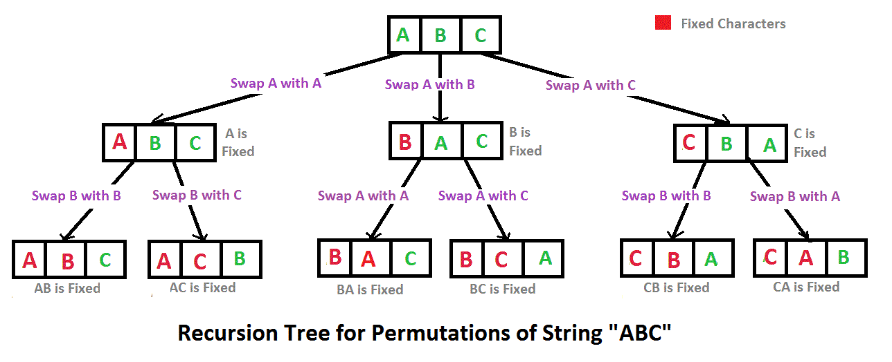

## 字符串的排列

##### 题目描述

输入一个字符串,按字典序打印出该字符串中字符的所有排列。例如输入字符串abc,则打印出由字符a,b,c所能排列出来的所有字符串abc,acb,bac,bca,cab和cba。

##### 输入描述:

```
输入一个字符串,长度不超过9(可能有字符重复),字符只包括大小写字母。
```



```

import java.util.ArrayList;
import java.util.Collections;

public class Solution {
    public ArrayList<String> Permutation(String str) {
        ArrayList<String> result = new ArrayList<>();
        if(str == null || str.length() ==0){
            return result;
        }
        findPermutation(str.toCharArray(),0,result);
        //结果要进行排序
        Collections.sort(result);
        return result;
    }

    private void findPermutation(char[] arr, int i, ArrayList<String> result) {
        //递归结束条件
        if(i == arr.length-1){
            //转为字符串
            String s = new String(arr);
            if(!result.contains(s)){
                result.add(s);
            }
        }else{
            for(int j= i; j<arr.length; j++){
                swap(arr, i, j);
                findPermutation(arr, i+1, result);
                swap(arr, i, j);
            }
        }

    }
    
    private void swap(char[] arr, int index, int j) {
        char tmp= arr[index];
        arr[index]= arr[j];
        arr[j]= tmp;
    }

    public static void main(String[] args) {
        String str = "abc";
        ArrayList<String> permutation = new Solution().Permutation(str);
        for (String s : permutation) {
            System.out.println(s);
        }
    }
}
```

## 数组中出现次数超过一半的数字

###### 题目描述

数组中有一个数字出现的次数超过数组长度的一半，请找出这个数字。例如输入一个长度为9的数组{1,2,3,2,2,2,5,4,2}。由于数字2在数组中出现了5次，超过数组长度的一半，因此输出2。如果不存在则输出0。

###### code

```

```

