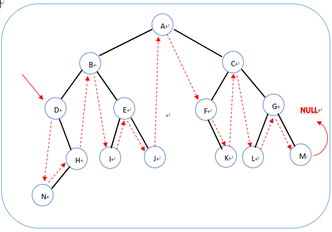

## 01二维数组中查找

> 题目要求：
>
> 在一个二维数组中（每个一维数组的长度相同），每一行都按照从左到右递增的顺序排序，每一列都按照从上到下递增的顺序排序。请完成一个函数，输入这样的一个二维数组和一个整数，判断数组中是否含有该整数。

```
import org.junit.Test;
import java.util.Vector;
/*
题目描述
在一个二维数组中（每个一维数组的长度相同），每一行都按照从左到右递增的顺序排序，
每一列都按照从上到下递增的顺序排序。请完成一个函数，输入这样的一个二维数组和一个整数，
判断数组中是否含有该整数。
 */
public class Test01 {
    @Test
    public void  test(){

    }
    public boolean Find(int target, int [][] array) {
        int row=array.length;
        int col=array[0].length;
        int m=0,n=col-1;
        while(n>=0&&m<row){
            if(array[m][n]>target){
                n--;
            }
            else if(array[m][n]<target){
                m++;
            }
            else
                return true;
        }
        return false;

    }
}
```


## 02替换空格

> 题目描述：
>
> 请实现一个函数，将一个字符串中的每个空格替换成“%20”。例如，当字符串为We Are Happy.则经过替换之后的字符串为We%20Are%20Happy。


```
package test02;

import org.junit.Test;
/*
请实现一个函数，将一个字符串中的每个空格替换成“%20”。
例如，当字符串为We Are Happy.则经过替换之后的字符串为We%20Are%20Happy。
 */
public class Test02 {
    @Test
    public void test(){

    }
    public String replaceSpace(StringBuffer str) {
        return str.toString().replace(" ", "%20");
    }
}
```


## 03从尾到头打印链表

> 题目描述：
>
> 输入一个链表，按链表值从尾到头的顺序返回一个ArrayList。

方法一：

```
/**
*    public class ListNode {
*        int val;
*        ListNode next = null;
*
*        ListNode(int val) {
*            this.val = val;
*        }
*    }
*
*/
import java.util.*;
public class Solution {
    public ArrayList<Integer> printListFromTailToHead(ListNode listNode) {
        Stack<Integer> s = new Stack<>();
		
		while(listNode != null){
			s.push(listNode.val);
			listNode = listNode.next;
		}
		
		ArrayList<Integer> ret = new ArrayList<>();
		while(!s.empty()){
			ret.add(s.peek());
			s.pop();
		}
		return ret;
    }
}
```

方法二：利用递归方式

```
import java.util.ArrayList;
import java.util.Stack;
public class Solution {
    private ArrayList<Integer> re = new ArrayList<Integer>();
    public ArrayList<Integer> printListFromTailToHead(ListNode listNode) {
       if(listNode==null)//递归结束条件，防御性编程
           return re;
        printListFromTailToHead(listNode.next); //递归
        re.add(listNode.val);//从内层到外层,逐层添加到容器中
        return re;
    }
}
```


## 04重建二叉树

> 题目描述:
>
> 输入某二叉树的前序遍历和中序遍历的结果，请重建出该二叉树。假设输入的前序遍历和中序遍历的结果中都不含重复的数字。例如输入前序遍历序列{1,2,4,7,3,5,6,8}和中序遍历序列{4,7,2,1,5,3,8,6}，则重建二叉树并返回。

```java
/**
 * Definition for binary tree
 * public class TreeNode {
 *     int val;
 *     TreeNode left;
 *     TreeNode right;
 *     TreeNode(int x) { val = x; }
 * }
 */
class Solution {
	public TreeNode reConstructBinaryTree(int[] pre, int[] in) {
		if(pre == null || in == null || pre.length ==0 || in.length ==0){
			return null;
		}
		return buildTree(pre, 0, pre.length-1, in, 0, in.length-1);
	}

	public TreeNode buildTree(int[] pre, int preStart, int preEnd, int[] in, int inStart, int inEnd) {
		TreeNode root = new TreeNode(pre[preStart]);
		int rootIn =0;//前序遍历特点，所以第一个一定为0;然后找根节点在中序遍历中的位置index
		for(; rootIn<inEnd; ++rootIn){
			if(in[rootIn] == root.val){
				break;//直接break即可，此时rootIn中存储了中序数组中的根节点的位置
			}
		}
		//算出中序数组中左子树的长度
		int leftLength = rootIn - inStart; //不需要减一
		//算出中序数组中右子树的长度
		int rightLefth = inEnd-rootIn;
		if(leftLength>0){//递归
			//递归中，preStart+1属于第二次起始位置，到preStart+leftLength,  核心思想是把属于左子树的范围给他们
			root.left = buildTree(pre, preStart+1, preStart+leftLength, in, inStart, rootIn-1);
		}
		if(rightLefth>0){//递归
			//核心思想是把属于右子树的范围给右子树进行递归
			root.right = buildTree(pre, preStart+leftLength+1, preEnd, in, rootIn+1, inEnd);
		}
		return root;
	}
}
```

## 05用两个栈实现队列

> 题目描述
>
> 用两个栈来实现一个队列，完成队列的Push和Pop操作。 队列中的元素为int类型。


```
//code
import java.util.Stack;

public class Solution {
    Stack<Integer> stack1 = new Stack<Integer>();
    Stack<Integer> stack2 = new Stack<Integer>();
    
	public void push(int node) {
		stack1.push(node);
	}

	public int pop() {
		if (stack2.isEmpty()) {
			while (!stack1.isEmpty()) {
				stack2.push(stack1.peek());
				stack1.pop();
			}
			return stack2.pop();
		} else {
			return stack2.pop();
		}
	}
}
```

## 06旋转数组中的最小数字

> 题目要求：
>
> 把一个数组最开始的若干个元素搬到数组的末尾，我们称之为数组的旋转。 输入一个非减排序的数组的一个旋转，输出旋转数组的最小元素。 例如数组{3,4,5,1,2}为{1,2,3,4,5}的一个旋转，该数组的最小值为1。 NOTE：给出的所有元素都大于0，若数组大小为0，请返回0。

```java
import java.util.ArrayList;
public class Solution {
    public int minNumberInRotateArray(int [] array) {
    	int min=array[0];
    	for (int i : array) {
			if(min>i){
				min =i;
			}
		}
    	return min;
    }
}
```


## 07斐波那契数列

> 题目要求：
>
> 大家都知道斐波那契数列，现在要求输入一个整数n，请你输出斐波那契数列的第n项（从0开始，第0项为0）。
>
> n<=39

```
public class Solution {
    public int Fibonacci(int n) {
    	if(n==0){
    		return 0;
    	}
    	if(n==1){
    		return 1;
    	}
    	return Fibonacci(n-1)+Fibonacci(n-2);
    }
}
```

- 方式二：非递归版

```
public class Solution {
    public int Fibonacci(int n) {
        int a=1,b=1,c=0;
        if(n<0){
            return 0;
        }else if(n==1||n==2){
            return 1;
        }else{
            for (int i=3;i<=n;i++){
                c=a+b;
                b=a;
                a=c;
            }
            return c;
        }
    }
}
```


## 08跳台阶

> 题目描述：
>
> 一只青蛙一次可以跳上1级台阶，也可以跳上2级。求该青蛙跳上一个n级的台阶总共有多少种跳法（先后次序不同算不同的结果）。

```
public class Solution {
    public int JumpFloor(int target) {
    	if(target == 1){
    		return 1;
    	}
    	if(target ==2){
    		return 2;
    	}
    	return JumpFloor(target-1)+JumpFloor(target-2);
    }
}
```


## 09变态跳台阶

> 题目描述：
>
> 一只青蛙一次可以跳上1级台阶，也可以跳上2级……它也可以跳上n级。求该青蛙跳上一个n级的台阶总共有多少种跳法。

```
public class Solution {
public int JumpFloorII(int target) {
    	  return (int) Math.pow(2, target-1);
    }
}
```

## 10矩形覆盖

> 题目描述
>
> 我们可以用2`*`1的小矩形横着或者竖着去覆盖更大的矩形。请问用n个2`*`1的小矩形无重叠地覆盖一个2*n的大矩形，总共有多少种方法？

```
public class Solution {
    public int RectCover(int target) {
        if(target<=1){
            return 1;
        }
        else if(target==2){
            return 2;
        }else{
            return RectCover(target-1)+RectCover(target-2);
        }
    }
}
```


## 11二进制中1的个数

> 题目描述：
>
> 输入一个整数，输出该数二进制表示中1的个数。其中负数用补码表示。


```
public class Solution {
    public int NumberOf1(int n) {
    	int count=0;
        char[] charArray = Integer.toBinaryString(n).toCharArray();System.out.println(charArray);
        for (char c : charArray) {
			if((c & 1) == 1){
				count++;
			}
		}
        return count;
    }
}
```

## 12数值的整数次方

> 题目描述
>
> 给定一个double类型的浮点数base和int类型的整数exponent。求base的exponent次方。

```
public class Solution {
public double Power(double base, int exponent) {
		// 由于exponent是int类型的整数，则可能包含正整数、0以及负整数三种情况。
		double temp = 1;
		if (exponent > 0) {
			for (int i = 1; i <= exponent; i++) {
				temp = temp * base;
				if (temp > 1.7976931348623157E308) {
					System.out.println("已经超出double类型的取值范围。");
					return -1;
				}
			}
			return temp;

		}
		if (exponent < 0) {
			exponent = -exponent;
			for (int i = 1; i <= exponent; i++) {
				temp = temp * base;
				if (temp > 1.7976931348623157E308) {
					System.out.println("已经超出double类型的取值范围。");
					return -1;
				}
			}
			temp = 1.0 / temp;
			return temp;
		} else {
			return 1;
		}
	}
}
```

## 13调整数组顺序使奇数位于偶数前面

> 题目描述：
>
> 输入一个整数数组，实现一个函数来调整该数组中数字的顺序，使得所有的奇数位于数组的前半部分，所有的偶数位于数组的后半部分，并保证奇数和奇数，偶数和偶数之间的相对位置不变。

```
public class Solution {
    public void reOrderArray(int [] array) {
          for(int i= 0;i<array.length-1;i++){
	            for(int j=0;j<array.length-1-i;j++){
	                if(array[j]%2==0&&array[j+1]%2==1){
	                    int t = array[j];
	                    array[j]=array[j+1];
	                    array[j+1]=t;
	                }
	            }
	        }
    }
}
```

## 14链表中倒数第k个结点

> 题目描述：
>
> 输入一个链表，输出该链表中倒数第k个结点。

```
/*
public class ListNode {
    int val;
    ListNode next = null;

    ListNode(int val) {
        this.val = val;
    }
}*/
public class Solution {
  public ListNode FindKthToTail(ListNode head, int k) {
		if(head ==null){
			return null;
		}
		ListNode cur = head;
		ListNode kToTail = head;
         while(k-- >0 ){
			if(cur!=null){
				cur =cur.next;				
			}else{
				return null;
			}
		}
		while(cur!= null){
			cur = cur.next;
			kToTail = kToTail.next;
		}
		return kToTail;
	}
}
```


## 15反转链表

> 题目描述：
>
> 输入一个链表，反转链表后，输出新链表的表头。

```
/*
public class ListNode {
    int val;
    ListNode next = null;

    ListNode(int val) {
        this.val = val;
    }
}*/
public class Solution {
   public ListNode ReverseList(ListNode head) {
         ListNode reverseHead = null;
         ListNode prev = null;
         ListNode cur= head;
         while(cur !=null){
        	 ListNode next = cur.next;
        	 if(next == null){
        		 reverseHead = cur;
        	 }
        	 //改变连接方向
        	 cur.next= prev;
        	 
        	 //移动元素
        	 prev = cur;
        	 cur = next;
        	 
         }
         return reverseHead;
    }
}
```


## 16合并两个排序的链表

> 题目描述：
>
> 输入两个单调递增的链表，输出两个链表合成后的链表，当然我们需要合成后的链表满足单调不减规则。

```
/*
public class ListNode {
    int val;
    ListNode next = null;

    ListNode(int val) {
        this.val = val;
    }
}*/
public class Solution {
 public ListNode Merge(ListNode list1, ListNode list2) {
        //防御性编程
        if(list1==null){
            return list2;
        }
        if(list2==null){
            return list1;
        }
        //先找到一个头结点，从list1 和list2中
        ListNode newHead = null;
        if(list1.val <list2.val){
            newHead = list1;
            list1=list1.next;
        }else{
            newHead = list2;
            list2=list2.next;
        }
        ListNode cur = newHead;
        while(list1!=null && list2!=null){
            if(list1.val < list2.val){
                cur.next= list1;
                list1=list1.next;
            }else{
                cur.next=list2;
                list2=list2.next;
            }
            cur=cur.next;
        }
        //list1或者list2 当长度不相同的情况，会有一个还有剩余的情况
        if(list1!=null){
            cur.next=list1;
        }
        if(list2!=null){
            cur.next=list2;
        }

        //进行比较
        return newHead;
    }
}
```


## 17树的子结构

> 题目描述：
>
> 输入两棵二叉树A，B，判断B是不是A的子结构。（ps：我们约定空树不是任意一个树的子结构）

```
/**
public class TreeNode {
    int val = 0;
    TreeNode left = null;
    TreeNode right = null;

    public TreeNode(int val) {
        this.val = val;

    }

}
*/
public class Solution {
    public boolean HasSubtree(TreeNode root1, TreeNode root2) {
        //防御性编程，第一次进入判断
        if(root2 == null){
            return false;
        }
        if(root1 == null && root2 != null){
            return false;
        }
        boolean flag = false;
        if(root1.val == root2.val){
            flag = isHasSubTree(root1, root2);
        }
        if (!flag){
            flag = HasSubtree(root1.left, root2);
            if(!flag){
                flag = HasSubtree(root1.right, root2);
            }
        }
        return flag;
    }

    private boolean isHasSubTree(TreeNode root1, TreeNode root2) {
        if(root2 == null){
            return true;
        }
        if(root1 == null && root2 != null){//说明root2还有数据没有验证完，此时不是
            return false;
        }
        if(root1.val == root2.val){
            return isHasSubTree(root1.left, root2.left) && isHasSubTree(root1.right, root2.right);
        }else{
            return false; // 如果不相同，直接返回false; --因为值已经不相同了，直接返回false
        }
    }
}
```


## 19顺时针打印矩阵

> 题目描述：
>
> 输入一个矩阵，按照从外向里以顺时针的顺序依次打印出每一个数字，例如，如果输入如下4 X 4矩阵： 1 2 3 4 5 6 7 8 9 10 11 12 13 14 15 16 则依次打印出数字1,2,3,4,8,12,16,15,14,13,9,5,6,7,11,10.


```
import java.util.ArrayList;
public class Solution {
  //==>3
    public ArrayList<Integer> printMatrix(int[][] matrix) {
        if (matrix == null) {
            return null;
        }
        int left = 0;
        int right = matrix[0].length - 1;
        int top = 0;
        int bottom = matrix.length - 1;

        ArrayList<Integer> list = new ArrayList<>();
        while (left <= right && top <= bottom) {
            //从左到有
            for (int i = left; i <= right; ++i) {
                list.add(matrix[top][i]);
            }
            //从上到下
            for (int i = top+1; i <= bottom; ++i) {
                list.add(matrix[i][right]);
            }
            //从右向左
            if (top != bottom) {
                for (int i = right-1; i >=left;--i) {
                    list.add(matrix[bottom][i]);
                }
            }
            if(left!=right){
                for (int i= bottom-1; i> top; --i){
                    list.add(matrix[i][left]);
                }
            }
            //缩小全
            left++;
            right--;
            top++;
            bottom--;
        }
        return list;

    }
}
```


## 20包含min函数的栈

> 题目描述
>
> 定义栈的数据结构，请在该类型中实现一个能够得到栈中所含最小元素的min函数（时间复杂度应为O（1））。

```


import java.util.Iterator;
import java.util.Stack;

public class Solution {
    private Stack<Integer> stack = new Stack<>();

    public void push(int node) {
        stack.push(node);
    }

    public void pop() {
        stack.pop();
    }

    public int top() {
        return stack.peek();
    }

    public int min() {
        int cur = stack.peek();
        Iterator<Integer> iterator = stack.iterator();
        while(iterator.hasNext()){
            int tmp = iterator.next();
            if(cur>= tmp){
                cur = tmp;
            }
        }
        
        return  cur;
    }
}
```


## 21栈的压入、弹出序列

> 题目描述：
>
> 输入两个整数序列，第一个序列表示栈的压入顺序，请判断第二个序列是否可能为该栈的弹出顺序。假设压入栈的所有数字均不相等。例如序列1,2,3,4,5是某栈的压入顺序，序列4,5,3,2,1是该压栈序列对应的一个弹出序列，但4,3,5,1,2就不可能是该压栈序列的弹出序列。（注意：这两个序列的长度是相等的）

```
import java.util.ArrayList;
import java.util.Stack;
public class Solution {
  public boolean IsPopOrder(int[] pushA, int[] popA) {
        //防御性编程--判断异常情况
        if(pushA.length ==0 || popA.length ==0){
            return false;
        }
        Stack<Integer> stack = new Stack<>();
        int j=0;
        for(int i=0; i<pushA.length; ++i){
            stack.push(pushA[i]);
            while(j<pushA.length && stack.peek() == popA[j]){
                //1.不能越界 2.模拟栈出方式，如果相同，
                stack.pop();
                j++;
            }

        }
        return stack.empty()? true:false;
    }
}
```


## 22从上往下打印二叉树

> 题目描述：
>
> 从上往下打印出二叉树的每个节点，同层节点从左至右打印。

```
import java.util.ArrayList;
import java.util.Deque;
import java.util.LinkedList;
/**
public class TreeNode {
    int val = 0;
    TreeNode left = null;
    TreeNode right = null;

    public TreeNode(int val) {
        this.val = val;
    }
}
*/
public class Solution {
    public ArrayList<Integer> PrintFromTopToBottom(TreeNode root) {
        ArrayList<Integer> list  = new ArrayList<>();
        if(root == null){
           return list; 
        }
        //队列方式
        Deque<TreeNode> deque = new LinkedList<>();
        deque.addLast(root);
        while(!deque.isEmpty()){
            TreeNode node = deque.pop();
            list.add(node.val);
            
            if(node.left!=null){
                deque.addLast(node.left);
            }
            if(node.right!=null){
                deque.addLast(node.right);
            }
        }
        return list;
    }
}
```


## 23二叉搜索树的后续遍历序列

> 题目描述：
>
> 输入一个整数数组，判断该数组是不是某二叉搜索树的后序遍历的结果。如果是则输出Yes,否则输出No。假设输入的数组的任意两个数字都互不相同。

```
public class Solution {

   //==>3
    public boolean VerifySquenceOfBST(int[] arr) {
        //防御性编程
        if(arr.length ==0){
            return false;
        }
        //使用递归方式
        return isCorrect(arr,0,arr.length-1);
    }

    private boolean isCorrect(int[] sequence, int start, int end) {
        //递归结束条件
        if(start >= end){
            return true;
        }
        //先进行查找左右子树交界处
        int i = start;
        for(; i<end ;i++){
            if(sequence[i]>sequence[end]){
                break;
            }
        }
        for(int j= i; j<end; j++){
            if(sequence[j]<sequence[end]){
                return false;
            }
        }
        return isCorrect(sequence, start, i-1)&& isCorrect(sequence, i, end-1);
    }
}
```


## 24二叉树中和为某一值的路径

> 题目要求：
>
> 输入一颗二叉树的跟节点和一个整数，打印出二叉树中结点值的和为输入整数的所有路径。路径定义为从树的根结点开始往下一直到叶结点所经过的结点形成一条路径。(注意: 在返回值的list中，数组长度大的数组靠前)

```
import java.util.ArrayList;
/**
public class TreeNode {
    int val = 0;
    TreeNode left = null;
    TreeNode right = null;

    public TreeNode(int val) {
        this.val = val;

    }
}
*/
public class Solution{
    private ArrayList<ArrayList<Integer>>  allList = new ArrayList<>();
    private ArrayList<Integer> list = new ArrayList<>();
    public ArrayList<ArrayList<Integer>> FindPath(TreeNode root,int target) {
        if(root == null){
            return  allList;
        }
        list.add(root.val);
        target-= root.val;

        if (target == 0 && root.left == null && root.right == null) {
            allList.add(new ArrayList<>(list));
        }
        FindPath(root.left ,target );
        FindPath(root.right, target);

        //去除尾元素
        list.remove(list.size()-1);

        return allList;
    }
}
```


## 27字符串的排列

##### 题目描述

输入一个字符串,按字典序打印出该字符串中字符的所有排列。例如输入字符串abc,则打印出由字符a,b,c所能排列出来的所有字符串abc,acb,bac,bca,cab和cba。

##### 输入描述:

```
输入一个字符串,长度不超过9(可能有字符重复),字符只包括大小写字母。
```


```

import java.util.ArrayList;
import java.util.Collections;

public class Solution {
    public ArrayList<String> Permutation(String str) {
        ArrayList<String> result = new ArrayList<>();
        if(str == null || str.length() ==0){
            return result;
        }
        findPermutation(str.toCharArray(),0,result);
        //结果要进行排序
        Collections.sort(result);
        return result;
    }

    private void findPermutation(char[] arr, int i, ArrayList<String> result) {
        //递归结束条件
        if(i == arr.length-1){
            //转为字符串
            String s = new String(arr);
            if(!result.contains(s)){
                result.add(s);
            }
        }else{
            for(int j= i; j<arr.length; j++){
                swap(arr, i, j);
                findPermutation(arr, i+1, result);
                swap(arr, i, j);
            }
        }

    }
    
    private void swap(char[] arr, int index, int j) {
        char tmp= arr[index];
        arr[index]= arr[j];
        arr[j]= tmp;
    }

    public static void main(String[] args) {
        String str = "abc";
        ArrayList<String> permutation = new Solution().Permutation(str);
        for (String s : permutation) {
            System.out.println(s);
        }
    }
}
```

## 28数组中出现次数超过一半的数字

###### 题目描述

数组中有一个数字出现的次数超过数组长度的一半，请找出这个数字。例如输入一个长度为9的数组{1,2,3,2,2,2,5,4,2}。由于数字2在数组中出现了5次，超过数组长度的一半，因此输出2。如果不存在则输出0。

###### code

```
package Test28;

import org.jruby.ast.IterNode;
import org.junit.Test;

import java.util.Arrays;

/*
题目描述
数组中有一个数字出现的次数超过数组长度的一半，请找出这个数字。
例如输入一个长度为9的数组{1,2,3,2,2,2,5,4,2}。
由于数字2在数组中出现了5次，超过数组长度的一半，因此输出2。如
果不存在则输出0。
 */
public class Test28 {
    @Test
    public void test() {
        int[] arr = new int[]{1, 2, 3, 2, 2, 2, 5, 4, 2};
        int i = MoreThanHalfNum_Solution(arr);
        System.out.println(i);
    }

    //方式一：时间复杂度O(N)
    public int MoreThanHalfNum_Solution(int[] array) {
        //先找到，然后判定是不是
        int count = 1;
        int tmp = array[0];
        for (int i = 0; i < array.length; i++) {
            if (tmp == array[i]) {
                count++;
            } else if (count > 0) { //不相等，次数>0 ，表示有重复的,
                count--;
            } else {
                tmp = array[i];
                count = 1;
            }
        }
        count=0;
        for(int i=0; i<array.length; i++){
            if(tmp== array[i]){
                count++;
            }
        }
        return count >array.length/2?tmp:0; //最后进行判定，是否是正确的
    }

	//方式二：
    //利用题意的规则：进行判断，先进行排序，然后判断中间值的那个是否正确
    //时间复杂度N*log(N)
//    public int MoreThanHalfNum_Solution(int[] array) {
//        if(array.length <1){
//            return 0;
//        }
//        int count = 0;
//        Arrays.sort(array);
//        int num = array[array.length/2];
//        for(int i=0; i<array.length; i++){
//            if(num == array[i])
//                count++;
//        }
//        if(count<= (array.length/2)){
//            num=0;
//        }
//        return num;
//    }
}

```

## 29最小的K个数

##### 题目描述

>  输入n个整数，找出其中最小的K个数。例如输入4,5,1,6,2,7,3,8这8个数字，则最小的4个数字是1,2,3,4,。

```

import java.util.ArrayList;
import java.util.Arrays;


/*
题目描述
输入n个整数，找出其中最小的K个数。例如输入4,5,1,6,2,7,3,8这8个数字，则最小的4个数字是1,2,3,4,。
 */
public class Solution {
    public ArrayList<Integer> GetLeastNumbers_Solution(int[] input, int k) {
        ArrayList<Integer> result = new ArrayList<>();
        if (input == null || input.length == 0) {
            return result;
        }
        if(input.length<k){
            return result;
        }

        Arrays.sort(input);
        //存在k大于数组长度的情况
        for (int i = 0; i < k; i++) {
            result.add(input[i]);
        }
        return result;
    }
}
```

## 31整数中1出现的次数（从1到n整数中1出现的次数）

##### 题目描述

> 求出1~13的整数中1出现的次数,并算出100~1300的整数中1出现的次数？为此他特别数了一下1~13中包含1的数字有1、10、11、12、13因此共出现6次,但是对于后面问题他就没辙了。ACMer希望你们帮帮他,并把问题更加普遍化,可以很快的求出任意非负整数区间中1出现的次数（从1 到 n 中1出现的次数）。

```
/*
题目描述
求出1~13的整数中1出现的次数,并算出100~1300的整数中1出现的次数？为此他特别数了一下1~13中
包含1的数字有1、10、11、12、13因此共出现6次,但是对于后面问题他就没辙了。ACMer希望你们帮帮他,
并把问题更加普遍化,可以很快的求出任意非负整数区间中1出现的次数（从1 到 n 中1出现的次数）。
 */
public class Solution {
    public int NumberOf1Between1AndN_Solution(int n) {
        int count=0;
        //遍历
        for (int i = n; i > 0; --i) {
            //转换成string字符串
            String str = String.valueOf(i);
            for (char c : str.toCharArray()) {
                if(c == '1'){
                    ++count;
                }
            }
        }
        return count;
    }
}
```


## 32把数组排成最小的数

```
题目描述
输入一个正整数数组，把数组里所有数字拼接起来排成一个数，
打印能拼接出的所有数字中最小的一个。例如输入数组{3，32，321}，
则打印出这三个数字能排成的最小数字为321323。
```

```

import org.junit.Test;

import java.util.ArrayList;
import java.util.Collections;
import java.util.Comparator;

/*
题目描述
输入一个正整数数组，把数组里所有数字拼接起来排成一个数，
打印能拼接出的所有数字中最小的一个。例如输入数组{3，32，321}，
则打印出这三个数字能排成的最小数字为321323。
 */
public class Solution {
    @Test
    public void test(){
        int[] arr = {3,32,321};
        System.out.println(PrintMinNumber(arr));
    }
    public String PrintMinNumber(int [] numbers) {
        String str="";
        ArrayList<String> list = new ArrayList<>();
        for (int number : numbers) {
            list.add(number+"");
        }
        Collections.sort(list, new Comparator<String>() {
            //比较器的目的是：超出字符串拼接成的字符比较小的，数字本身小，但并不代表，拼接而成的字符串小
            @Override
            public int compare(String o1, String o2) {
                String s1 = o1+o2;
                String s2= o2+o1;
                return s1.compareTo(s2);
            }
        });


        for (String s : list) {
            str+= s;
        }
        return str;
    }
}
```


## 33丑数

> 题目要求：把只包含质因子2、3和5的数称作丑数（Ugly Number）。例如6、8都是丑数，但14不是，因为它包含质因子7。 习惯上我们把1当做是第一个丑数。求按从小到大的顺序的第N个丑数。

```
package test32;

import org.junit.Test;

/*
把只包含质因子2、3和5的数称作丑数（Ugly Number）。例如6、8都是丑数，但14不是，因为它包含质因子7。
习惯上我们把1当做是第一个丑数。求按从小到大的顺序的第N个丑数。
 */
public class Soulution {
    @Test
    public void test() {
        System.out.println(GetUglyNumber_Solution(4));
    }


    public int GetUglyNumber_Solution(int index) {
        //异常情况处理
        if (index <= 0)
            return 0;
        //创建一个数组
        int[] result = new int[index];
        int count = 0;
        int i2 = 0;
        int i3 = 0;
        int i5 = 0;

        result[0] = 1;
        int tmp = 0;
        while (count < index - 1) {
            tmp = min(result[i2] * 2, result[i3] * 3, result[i5] * 5);
            if (tmp == result[i2] * 2) i2++;//三条if防止值是一样的，不要改成else的
            if (tmp == result[i3] * 3) i3++;
            if (tmp == result[i5] * 5) i5++;
            result[++count] = tmp;
        }
        return result[index - 1];
    }

    /**
     *  返回三者之中最小值
     * @param a
     * @param b
     * @param c
     * @return
     */
    private int min(int a, int b,int c) {
        int tmp= (a > b) ? b : a;
        return tmp>c? c : tmp;
    }

    //方法一：缺点：效率偏低，
//    public int GetUglyNumber_Solution(int index) {
//        //考虑异常情况
//        if (index <= 0) {
//            return 0;
//        }
//        int number =0;
//        int uglyFount=0;
//        while (uglyFount<index){
//            ++number;
//            if(isUglyFound(number)){
//                ++uglyFount;
//            }
//        }
//        return number;
//    }
//
//    private boolean isUglyFound(int number) {
//        while(number %2==0)
//            number/=2;
//        while(number%3==0)
//            number/=3;
//        while (number%5==0)
//            number/=5;
//
//        return (number==1)?true:false;
//    }
}

```


## 34第一个只出现一次的字符

> 题目描述:
>
> 在一个字符串(0<=字符串长度<=10000，全部由字母组成)中找到第一个只出现一次的字符,并返回它的位置, 如果没有则返回 -1（需要区分大小写）.

```
import org.junit.Test;

import java.util.HashMap;

/*
题目描述
在一个字符串(0<=字符串长度<=10000，全部由字母组成)中找到第一个只出现一次的字符,
并返回它的位置, 如果没有则返回 -1（需要区分大小写）.
 */
public class Solution {
    @Test
    public void test() {
        String str = "aaabccddee";
        System.out.println(FirstNotRepeatingChar(str));
    }

    public int FirstNotRepeatingChar(String str) {
        HashMap<Character, Integer> map = new HashMap<>();
        for(int i=0 ; i<str.length(); i++){
            char c = str.charAt(i);
            if(map.containsKey(c)){
                Integer cnt = map.get(c);
                cnt++;
                map.put(c, cnt);//count次数+1
            }else{ //没有
                map.put(c, 1);
            }
        }
        for(int i=0; i<str.length(); i++){
            char c = str.charAt(i);
            if(map.get(c)==1){
                return i;
            }
        }
        return -1;
    }
}
```


## 35数组中的逆序对

###### 题目描述

在数组中的两个数字，如果前面一个数字大于后面的数字，则这两个数字组成一个逆序对。输入一个数组,求出这个数组中的逆序对的总数P。并将P对1000000007取模的结果输出。 即输出P%1000000007

###### 输入描述:

```
题目保证输入的数组中没有的相同的数字数据范围：	对于%50的数据,size<=10^4	对于%75的数据,size<=10^5	对于%100的数据,size<=2*10^5
```

示例1

###### 输入

复制

```
1,2,3,4,5,6,7,0
```

###### 输出

复制

```
7
```


```
public class Solution {
  public int InversePairs(int[] array) {
        //异常情况判断
        if (array == null || array.length == 0) {
            return 0;
        }
        //创建一个数组，以array数组的长度
        int[] copy = new int[array.length];
        for (int i = 0; i < array.length; i++) {
            copy[i] = array[i];
        }
        int count = InversePairsCore(array, copy, 0, array.length - 1);//数值过大求余
        return count;

    }

    private int InversePairsCore(int[] array, int[] copy, int low, int high) {
        if (low == high) {
            return 0;
        }
        int mid = (low + high) >> 1;
        int leftCount = InversePairsCore(array, copy, low, mid) % 1000000007;
        int rightCount = InversePairsCore(array, copy, mid + 1, high) % 1000000007;
        int count = 0;
        int i = mid;
        int j = high;
        int locCopy = high;
        while (i >= low && j > mid) {
            if (array[i] > array[j]) {
                count += j - mid;
                copy[locCopy--] = array[i--];
                if (count >= 1000000007)//数值过大求余
                {
                    count %= 1000000007;
                }
            } else {
                copy[locCopy--] = array[j--];
            }
        }
        for (; i >= low; i--) {
            copy[locCopy--] = array[i];
        }
        for (; j > mid; j--) {
            copy[locCopy--] = array[j];
        }
        for (int s = low; s <= high; s++) {
            array[s] = copy[s];
        }
        return (leftCount + rightCount + count) % 1000000007;
    }
}
```


## 36两个链表的第一个公共结点

> 题目描述
>
> 输入两个链表，找出他们的第一个公共结点

```
/*
public class ListNode {
    int val;
    ListNode next = null;

    ListNode(int val) {
        this.val = val;
    }
}*/
//第一种解法： 网上看到
public class Solution {
    ListNode FindFirstCommonNode( ListNode pHead1, ListNode pHead2) {
        ListNode p1 = pHead1;
        ListNode p2 = pHead2;
        while(p1!=p2){
            p1 = (p1==null ? pHead2 : p1.next);
            p2 = (p2==null ? pHead1 : p2.next);
        }
        return p1;
    }
}
```


## 37数字在排序数组中出现的次数

> 题目描述：
>
> 统计一个数字在排序数组中出现的次数

方式一：遍历统计

```
package test36;
import org.junit.Test;
/**
 * 题目描述
 * 统计一个数字在排序数组中出现的次数。
 */
public class Solution {
    @Test
    public void  test(){
        int[] arr= new int[]{1,2,2,2,3,4,5,6,7};
        System.out.println(GetNumberOfK(arr, 2));
    }
    //获取一个数字在排序数组中出现的次数
    public int GetNumberOfK(int [] array , int k) {
        int count =0;
        for (int num : array) {
            if(num == k){
                count++;
            }
        }
        return count;
    }
}
```


## 38二叉树的深度

> 题目描述：
>
> 输入一棵二叉树，求该树的深度。从根结点到叶结点依次经过的结点（含根、叶结点）形成树的一条路径，最长路径的长度为树的深度。

```
public class Solution {
    @Test
    public void test(){

    }
    //递归思想：判断左子树和右子树的深度，
    public int TreeDepth(TreeNode root) {
        if(root == null){
            return 0;  //如果是空节点，深度为0
        }
        int leftDepth = TreeDepth(root.left);
        int rightDepth = TreeDepth(root.right);
        return leftDepth>rightDepth? leftDepth+1: rightDepth+1;
    }
}
```


## 39平衡二叉树

> 题目描述：
>
> 输入一棵二叉树，判断该二叉树是否是平衡二叉树。


```java
public class Solution {
 public boolean IsBalanced_Solution(TreeNode root) {
        //防御性编程
        if(root== null){
            return true;
        }
        int leftDepth= TreeDepth(root.left);
        int rightDepth = TreeDepth(root.right);
        int diff = leftDepth-rightDepth;
        if(diff>1 || diff <-1)
            return false;

        return IsBalanced_Solution(root.left) && IsBalanced_Solution(root.right);
    }

    private int TreeDepth(TreeNode root) {
        if(root == null){
            return 0;  //如果是空节点，深度为0
        }
        int leftDepth = TreeDepth(root.left);
        int rightDepth = TreeDepth(root.right);
        return leftDepth>rightDepth? leftDepth+1: rightDepth+1;
    }
}
```

## 40数组中只出现一次的数字

> 题目描述：
>
> 一个整型数组里除了两个数字之外，其他的数字都出现了偶数次。请写程序找出这两个只出现一次的数字。

```

/**
 * 题目描述
 * 一个整型数组里除了两个数字之外，其他的数字都出现了偶数次。
 * 请写程序找出这两个只出现一次的数字。
 */
public class Solution {
    @Test
    public void test(){
        int[] arr = new int[]{1,1,2,3,4,4};
        int[] ret1= new int[1];
        int[] ret2= new int[1];
        FindNumsAppearOnce(arr, ret1, ret2);
        System.out.println(ret1[0]);
        System.out.println(ret2[0]);
    }
    //异或思想：题中除了两个数之外，其余都是偶数次
    public void FindNumsAppearOnce(int [] array,int num1[] , int num2[]) {
        if (array == null || array.length <2) {
            return;
        }
        int res = 0;
        for (int num :array) {
            res ^= num;
        }

        int index = 0;
        while((res & 1)==0) {
            index++;
            res = res >> 1;
        }
        for (int num :array) {
            if ((num>>index & 1) != 0){
                num1[0] ^= num;
            } else {
                num2[0] ^= num;
            }
        }
    }
}
```


## 41和为s的两个数字、

> 题目描述：
>
> 输入一个递增排序的数组和一个数字S，在数组中查找两个数，使得他们的和正好是S，如果有多对数字的和等于S，输出两个数的乘积最小的。对应每个测试案例，输出两个数，小的先输出。


```
/*
题目描述
输入一个递增排序的数组和一个数字S，在数组中查找两个数，使得他们的和正好是S，
如果有多对数字的和等于S，输出两个数的乘积最小的。
输出描述:
对应每个测试案例，输出两个数，小的先输出。
 */
import org.junit.Test;

import java.util.ArrayList;
public class Solution {
    @Test
    public void test(){
        int[] arr = new int[]{1,2,4,7,11,15};
        for (Integer integer : FindNumbersWithSum(arr, 15)) {
            System.out.println(integer);
        }
    }

    public ArrayList<Integer> FindNumbersWithSum(int [] array,int sum) {
        ArrayList<Integer> list = new ArrayList<>();
        //防御性编程
        if(array== null||array.length==0){
            return list;
        }
        int left =0;
        int right= array.length-1;

        while (left <= right) {
            int tmp = array[left] + array[right];
            if(tmp == sum){
                list.add(array[left]);
                list.add(array[right]);
                break;
            }else if(tmp > sum){
                right--;
            }else{
                left++;
            }
        }
        return list;
    }
}	
```


## 42和为s的连续正数序列

> ## 题目描述
>
> 小明很喜欢数学,有一天他在做数学作业时,要求计算出9~16的和,他马上就写出了正确答案是100。但是他并不满足于此,他在想究竟有多少种连续的正数序列的和为100(至少包括两个数)。没多久,他就得到另一组连续正数和为100的序列:18,19,20,21,22。现在把问题交给你,你能不能也很快的找出所有和为S的连续正数序列? Good Luck!
>
> ## 输出描述:
>
> ```
> 输出所有和为S的连续正数序列。序列内按照从小至大的顺序，序列间按照开始数字从小到大的顺序
> ```


```java
package test42;

/*
题目描述
小明很喜欢数学,有一天他在做数学作业时,要求计算出9~16的和,他马上就写出了正确答案是100。但是他并不满足于此,
他在想究竟有多少种连续的正数序列的和为100(至少包括两个数)。没多久,他就得到另一组连续正数和为100的序列:
18,19,20,21,22。现在把问题交给你,你能不能也很快的找出所有和为S的连续正数序列? Good Luck!

输出描述:
输出所有和为S的连续正数序列。序列内按照从小至大的顺序，序列间按照开始数字从小到大的顺序
 */
import org.junit.Test;

import java.util.ArrayList;
public class Solution {
    @Test
    public void test(){
        ArrayList<ArrayList<Integer>> list = FindContinuousSequence(100);
        for (ArrayList<Integer> integers : list) {
            for (Integer integer : integers) {
                System.out.print(integer+" ");
            }
            System.out.println();
        }
    }
    //==>2
    public ArrayList<ArrayList<Integer> > FindContinuousSequence(int sum) {
        ArrayList<ArrayList<Integer>> list = new ArrayList<>();
        if(sum<3){ //连续正整数的和必须大于等于3,所以不过小于3表示错误数据
            return list;
        }
        //small 和big两个指针方式
        int small = 1;
        int big = 2;
        int curSum = small+big;
        int middle= (1+sum)/2;
        while(small <middle){
            //进行一次判断，判断sum 和此时的curSum是否相同
            insertIntoList(sum, list, small, big, curSum);

            while(curSum> sum && small < middle){ //数字综合大的范围
                //1234 10 此时已经大于sum ,所以将第一位的small减去，然后small++;
                curSum-= small; //这两处不能调换位置，否则出错
                small++;
                insertIntoList(sum, list, small, big, curSum);
            }
            big++;
            curSum+= big;

        }
        return list;
    }
    private void insertIntoList(int sum, ArrayList<ArrayList<Integer>> list, int small, int big, int curSum) {
        if(curSum == sum){
            ArrayList<Integer> integers = new ArrayList<>();
            for(int i= small; i<= big; i++){
                integers.add(i);
            }
            list.add(integers);
        }
    }
}
```


## 43左旋转字符串

> 题目描述：
>
> 汇编语言中有一种移位指令叫做循环左移（ROL），现在有个简单的任务，就是用字符串模拟这个指令的运算结果。对于一个给定的字符序列S，请你把其循环左移K位后的序列输出。例如，字符序列S=”abcXYZdef”,要求输出循环左移3位后的结果，即“XYZdefabc”。是不是很简单？OK，搞定它！


```
public class Solution {
    @Test
    public void test(){
        String str="abcXYZdef";
        String s = LeftRotateString(str, 3);
        System.out.println(s);
    }
    public String LeftRotateString(String str,int n) {
        return (str == null || str.length() ==0)? "" : (str.substring(n)+str.substring(0, n));
    }
}
```


## 44翻转单词顺序列

> 题目描述：
>
> 牛客最近来了一个新员工Fish，每天早晨总是会拿着一本英文杂志，写些句子在本子上。同事Cat对Fish写的内容颇感兴趣，有一天他向Fish借来翻看，但却读不懂它的意思。例如，“student. a am I”。后来才意识到，这家伙原来把句子单词的顺序翻转了，正确的句子应该是“I am a student.”。Cat对一一的翻转这些单词顺序可不在行，你能帮助他么？


```
//code
import java.util.ArrayList;
import java.util.Collections;
public class Solution {
  public String ReverseSentence(String str) {
     if("".equals(str.trim()))
          return str;

        String[] split = str.split(" ");
        ArrayList<String> list = new ArrayList<>();
        for (String s : split) {
            list.add(s);
        }
        Collections.reverse(list);
        String ret= "";
        for (String s : list) {
            ret+=s+" ";
        }
        return ret.trim();
    }
}
```


## 45扑克牌顺子

> 题目描述：
>
> LL今天心情特别好,因为他去买了一副扑克牌,发现里面居然有2个大王,2个小王(一副牌原本是54张^_^)...他随机从中抽出了5张牌,想测测自己的手气,看看能不能抽到顺子,如果抽到的话,他决定去买体育彩票,嘿嘿！！“红心A,黑桃3,小王,大王,方片5”,“Oh My God!”不是顺子.....LL不高兴了,他想了想,决定大\小 王可以看成任何数字,并且A看作1,J为11,Q为12,K为13。上面的5张牌就可以变成“1,2,3,4,5”(大小王分别看作2和4),“So Lucky!”。LL决定去买体育彩票啦。 现在,要求你使用这幅牌模拟上面的过程,然后告诉我们LL的运气如何， 如果牌能组成顺子就输出true，否则就输出false。为了方便起见,你可以认为大小王是0。

```java
package test45;

import org.junit.Test;

import java.util.Arrays;

/*
题目描述
LL今天心情特别好,因为他去买了一副扑克牌,发现里面居然有2个大王,2个小王(一副牌原本是54张^_^)...
他随机从中抽出了5张牌,想测测自己的手气,看看能不能抽到顺子,如果抽到的话,他决定去买体育彩票,
嘿嘿！！“红心A,黑桃3,小王,大王,方片5”,“Oh My God!”不是顺子.....LL不高兴了,他想了想,
决定大\小 王可以看成任何数字,并且A看作1,J为11,Q为12,K为13。上面的5张牌就可以变成
“1,2,3,4,5”(大小王分别看作2和4),“So Lucky!”。LL决定去买体育彩票啦。
现在,要求你使用这幅牌模拟上面的过程,然后告诉我们LL的运气如何，
如果牌能组成顺子就输出true，否则就输出false。为了方便起见,你可以认为大小王是0。
 */
public class Solution {
    @Test
    public void  test(){

    }

    public boolean isContinuous(int [] numbers) {
        if(numbers == null|| numbers.length==0)
            return false;
        Arrays.sort(numbers);  //先排序
        int zero = 0, i = 0;
        for(; i < numbers.length && numbers[i] == 0; i++){
            zero ++;  //统计0的个数--统计大小王的个数
        }

        int small = zero;
        int big = small+1;

        int numberOfGap =0;
        while(big< numbers.length){
            //如果两个数相等，有对子，直接返回false
            if(numbers[small] == numbers[big]){
                return false;
            }
            numberOfGap += numbers[big] -numbers[small]-1;
            small = big;
            ++big;
        }
        return (numberOfGap> zero) ? false: true;
    }
}
```


## 46孩子们的游戏(圆圈中最后剩下的数)

> 题目描述:
>
> 每年六一儿童节,牛客都会准备一些小礼物去看望孤儿院的小朋友,今年亦是如此。HF作为牛客的资深元老,自然也准备了一些小游戏。其中,有个游戏是这样的:首先,让小朋友们围成一个大圈。然后,他随机指定一个数m,让编号为0的小朋友开始报数。每次喊到m-1的那个小朋友要出列唱首歌,然后可以在礼品箱中任意的挑选礼物,并且不再回到圈中,从他的下一个小朋友开始,继续0...m-1报数....这样下去....直到剩下最后一个小朋友,可以不用表演,并且拿到牛客名贵的“名侦探柯南”典藏版(名额有限哦!!^_^)。请你试着想下,哪个小朋友会得到这份礼品呢？(注：小朋友的编号是从0到n-1)


- 递推公式：


```
public class Solution {
  public int LastRemaining_Solution(int n, int m) {
        if (n < 1 || m < 1) {
            return -1;
        }
        int last = 0;
        for (int i = 2; i <= n; i++) {
            last =(last+m)%i;
        }
        return last;
    }
}
```


## 47 求1+2+3+...+n

> 题目描述：
>
> 求1+2+3+...+n，要求不能使用乘除法、for、while、if、else、switch、case等关键字及条件判断语句（A?B:C）。


```
    //递归方式
    public int Sum_Solution(int n) {
        int sum = n;
        //利用短路与特点--当第一个条件不满足时，不进行右边的操作，所以递归结束
        boolean ans = (n > 0) && ((sum += Sum_Solution(n - 1)) > 0);
        return sum;
    }
```


## 48不用加减乘除做加法

> 题目描述：
>
> 写一个函数，求两个整数之和，要求在函数体内不得使用+、-、*、/四则运算符号。

- 使用位运算

```java
package test48;

import org.junit.Test;

/*
题目描述
写一个函数，求两个整数之和，要求在函数体内不得使用+、-、*、/四则运算符号。
 */
public class Solution {
    @Test
    public void test(){
        System.out.println(Add(1, 2));
    }

    public int Add(int num1,int num2) {
        int sum=0;
        int carry =0;
        do{
            sum= num1^num2;
            carry = (num1& num2) <<1;

            num1= sum;
            num2= carry;

        }while(num2!= 0);
        return num1;
    }
}
```


## 49把字符串转换成整数

###### 题目描述

将一个字符串转换成一个整数(实现Integer.valueOf(string)的功能，但是string不符合数字要求时返回0)，要求不能使用字符串转换整数的库函数。 数值为0或者字符串不是一个合法的数值则返回0。

###### 输入描述:

```
输入一个字符串,包括数字字母符号,可以为空
```

###### 输出描述:

```
如果是合法的数值表达则返回该数字，否则返回0
```


###### 输入

```
+2147483647
    1a33
```

###### 输出

```
2147483647
    0
```

> 五个注意点：
>
> 1. str == null
> 2. str.length() ==0
> 3. 首位的符号位
> 4. 循环判断的起始位
> 5. 是否超出Integer的范围

- code

```java

import org.junit.Test;

public class Solution {
    @Test
    public void test() {
        System.out.println(StrToInt("+2147483647"));
        System.out.println(StrToInt("1a33"));

    }
    //=>2
    public int StrToInt(String str) {
        //防御性编程
        if(str ==null || str.length() ==0){
            return 0;
        }
        //判断符号位和起始位
        int start =0;
        boolean positiveFlag = false;
        if(str.charAt(0) == '+'){
            start=1;
            positiveFlag= true;
        }else if(str.charAt(0) =='-'){
            start=1;
        }else{
            positiveFlag = true;
        }
        long result=0;
        for(int i=start; i<str.length(); i++){
            char tmp = str.charAt(i);
            if(tmp>'0' && tmp<'9'){
                //
                result= result*10+tmp-'0';
                //判断是否越界
                if(positiveFlag){
                    if(result>Long.MAX_VALUE){
                        throw new RuntimeException("上溢出...");
                    }
                }else {
                    if(result< Long.MIN_VALUE){
                        throw new RuntimeException("下溢出..");
                    }
                }
            }else{
                return 0; //直接返回0
            }
        }
        //判断符号位
        if(positiveFlag){
            return (int) result;
        }else{
            return (int) (-1*result);
        }
    }


    /*
        两个错误：一：测试数据有误:数字+""会将+去掉
                 二： 正常数字情况下 ：符号位标逻辑错误positiveFlag
     */
    //=>1
//    public int StrToInt(String str) {
//        //防御性编程
//        if (str == null || str.length() == 0) {
//            return 0;
//        }
//        //常规性编程，首先判断首位是否是符号位
//        int start = 0; //起始位
//        boolean positiveFlag = false; //判断是否是整数
//        if (str.charAt(0) == '+') {
//            positiveFlag = true;
//            start = 1;
//        } else if (str.charAt(0) == '-') {
//            start = 1;
//        } else {
//            //正常情况，首位是正数,起始位为0，
//            positiveFlag = true;
//        }
//        //long接收，判断是否溢出的情况
//        long result = 0;
//        for (int i = start; i < str.length(); i++) {
//            //判断是否符合是数字 0-9
//            char tmp = str.charAt(i);
//            if (tmp > '0' && tmp < '9') {
//                result = result * 10 + tmp - '0';
//                if (positiveFlag) {
//                    //正数，判断是否超过integer的正数最大值
//                    if (result > Integer.MAX_VALUE) {
//                        throw new RuntimeException("上溢出...");
//                    }
//                } else { //负数
//                    if (result * -1 < Integer.MIN_VALUE) {
//                        throw new RuntimeException("下溢出...");
//                    }
//                }
//            } else { //之中包含非数字0-9
//                return 0;
//            }
//        }
//
//        //最后根据正负号判断
//        if (positiveFlag) {
//            return (int) result;
//        } else {
//            return (int) (-1 * result);
//        }
//
//    }
}
```


## 50数组中重复的数字


> 题目描述:
>
> 在一个长度为n的数组里的所有数字都在0到n-1的范围内。 数组中某些数字是重复的，但不知道有几个数字是重复的。也不知道每个数字重复几次。请找出数组中任意一个重复的数字。 例如，如果输入长度为7的数组{2,3,1,0,2,5,3}，那么对应的输出是第一个重复的数字2。

- code

```
//code
import org.junit.Test;

import java.util.HashMap;
import java.util.Map;

/*
题目描述
在一个长度为n的数组里的所有数字都在0到n-1的范围内。 数组中某些数字是重复的，
但不知道有几个数字是重复的。也不知道每个数字重复几次。请找出数组中任意一个重复的数字。
例如，如果输入长度为7的数组{2,3,1,0,2,5,3}，那么对应的输出是第一个重复的数字2。

 */
public class Solution {
    @Test
    public void test() {
        int[] ints = {2, 1, 3, 1, 4};
        int[] ret = new int[1];
        System.out.println(duplicate(ints, ints.length, ret));
    }

    // Parameters:
    //    numbers:     an array of integers
    //    length:      the length of array numbers
    //    duplication: (Output) the duplicated number in the array number,length of duplication array is 1,so using duplication[0] = ? in implementation;
    //                  Here duplication like pointor in C/C++, duplication[0] equal *duplication in C/C++
    //    这里要特别注意~返回任意重复的一个，赋值duplication[0]
    // Return value:       true if the input is valid, and there are some duplications in the array number
    //                     otherwise false

    /**
     *  注意点： 一定要注意防御性编程  2. 注意提议，duplication是需要返回的, true和false的含义不同
     * @param numbers
     * @param length
     * @param duplication
     * @return
     */
    public boolean duplicate(int numbers[], int length, int[] duplication) {
        //防御性编程
        if (numbers == null || numbers.length == 0) {
            return false;
        }
        HashMap<Integer, Integer> map = new HashMap<>();
        for (int num : numbers) {
            if (map.containsKey(num)) {
                Integer cnt = map.get(num);
                map.put(num, cnt + 1);
            } else { //map中还没有
                map.put(num, 1);
            }
        }
        for (Map.Entry<Integer, Integer> entry : map.entrySet()) {
            if (entry.getValue() >= 2) {
                duplication[0] = entry.getKey();
                return true;
            }
        }
        return false;
    }
}
```


## 51构建乘积数组

> 题目描述：
>
> 给定一个数组A[0,1,...,n-1],请构建一个数组B[0,1,...,n-1],其中B中的元素B[i]=A[0]*A[1]*...*A[i-1]*A[i+1]*...*A[n-1]。不能使用除法。

- code

```
package test51;


public class Solution {
    public int[] multiply(int[] A) {
        if (A == null || A.length == 0) {
            return new int[1];
        }
        int[] B = new int[A.length];
        int tmp1 = 1;
        int[] tmp2 = new int[A.length];
        tmp2[A.length - 1] = 1;
        for (int i = 1; i < A.length; i++) {
            tmp2[A.length - i - 1] = tmp2[A.length - i] * A[A.length - i];
        }
        for (int i = 0; i < A.length; i++) {
            if(i!=0){
                tmp1 *=A[i-1];
            }
            B[i] = tmp1 * tmp2[i];
        }
        return B;
    }
}
```


## 52正则表达式匹配

> 题目描述：
>
> 请实现一个函数用来匹配包括'.'和'*'的正则表达式。模式中的字符'.'表示任意一个字符，而'*'表示它前面的字符可以出现任意次（包含0次）。 在本题中，匹配是指字符串的所有字符匹配整个模式。例如，字符串"aaa"与模式"a.a"和"ab*ac*a"匹配，但是与"aa.a"和"ab*a"均不匹配


```java
package test52;

import org.junit.Test;

/*
题目描述
请实现一个函数用来匹配包括'.'和'*'的正则表达式。模式中的字符'.'表示任意一个字符，
而'*'表示它前面的字符可以出现任意次（包含0次）。 在本题中，匹配是指字符串的所有字符匹配整个模式。
例如，字符串"aaa"与模式"a.a"和"ab*ac*a"匹配，但是与"aa.a"和"ab*a"均不匹配

 */
/*
1>两个字符串都为空，返回true
         2>当第一个字符串不空，而第二个字符串空了，返回false（因为这样，就无法
            匹配成功了,而如果第一个字符串空了，第二个字符串非空，还是可能匹配成
            功的，比如第二个字符串是“a*a*a*a*”,由于‘*’之前的元素可以出现0次，
            所以有可能匹配成功）
    之后就开始匹配第一个字符，这里有两种可能：匹配成功或匹配失败。但考虑到pattern
    下一个字符可能是‘*’， 这里我们分两种情况讨论：pattern下一个字符为‘*’或
    不为‘*’：
          1>pattern下一个字符不为‘*’：这种情况比较简单，直接匹配当前字符。如果
            匹配成功，继续匹配下一个；如果匹配失败，直接返回false。注意这里的
            “匹配成功”，除了两个字符相同的情况外，还有一种情况，就是pattern的
            当前字符为‘.’,同时str的当前字符不为‘\0’。
          2>pattern下一个字符为‘*’时，稍微复杂一些，因为‘*’可以代表0个或多个。
            这里把这些情况都考虑到：
               a>当‘*’匹配0个字符时，str当前字符不变，pattern当前字符后移两位，
                跳过这个‘*’符号；
               b>当‘*’匹配1个或多个时，str当前字符移向下一个，pattern当前字符
                不变。（这里匹配1个或多个可以看成一种情况，因为：当匹配一个时，
                由于str移到了下一个字符，而pattern字符不变，就回到了上边的情况a；
                当匹配多于一个字符时，相当于从str的下一个字符继续开始匹配）
 */
public class Solution {
    @Test
    public void test() {
       String str1= "";
       String str2="";
        System.out.println(match(str1.toCharArray(), str2.toCharArray()));

    }

    public boolean match(char[] str, char[] pattern) {
        if (str == null || pattern == null) {
            return false;
        }
        int strIndex = 0;
        int patternIndex = 0;
        return matchCore(str, strIndex, pattern, patternIndex);
    }

    private boolean matchCore(char[] str, int strIndex, char[] pattern, int patternIndex) {
        //有效性检验：str到尾，pattern到尾，匹配成功
        if (strIndex == str.length && patternIndex == pattern.length) {
            return true;
        }
        //pattern先到尾，匹配失败
        if (strIndex != str.length && patternIndex == pattern.length) {
            return false;
        }
        //模式第2个是*，且字符串第1个跟模式第1个匹配,分3种匹配模式；如不匹配，模式后移2位
        if (patternIndex + 1 < pattern.length && pattern[patternIndex + 1] == '*') {
            if ((strIndex != str.length && pattern[patternIndex] == str[strIndex]) || (pattern[patternIndex] == '.' && strIndex != str.length)) {
                return matchCore(str, strIndex, pattern, patternIndex + 2)//模式后移2，视为x*匹配0个字符
                        || matchCore(str, strIndex + 1, pattern, patternIndex + 2)//视为模式匹配1个字符
                        || matchCore(str, strIndex + 1, pattern, patternIndex);//*匹配1个，再匹配str中的下一个
            } else {
                return matchCore(str, strIndex, pattern, patternIndex + 2);
            }
        }
        //模式第2个不是*，且字符串第1个跟模式第1个匹配，则都后移1位，否则直接返回false
        if ((strIndex != str.length && pattern[patternIndex] == str[strIndex]) || (pattern[patternIndex] == '.' && strIndex != str.length)) {
            return matchCore(str, strIndex + 1, pattern, patternIndex + 1);
        }
        return false;
    }

}
```


## 53表示数值的字符串

> 题目描述:
>
> 请实现一个函数用来判断字符串是否表示数值（包括整数和小数）。例如，字符串"+100","5e2","-123","3.1416"和"-1E-16"都表示数值。 但是"12e","1a3.14","1.2.3","+-5"和"12e+4.3"都不是。


```
package test53;

import org.junit.Test;
/*
题目描述
请实现一个函数用来判断字符串是否表示数值（包括整数和小数）。例如，字符串"+100","5e2","-123","3.1416"
和"-1E-16"都表示数值。 但是"12e","1a3.14","1.2.3","+-5"和"12e+4.3"都不是。
 */
public class Solution {
    @Test
    public void test() {
        String str = "+100";
        String str2 = "5e2";
        String str3 = "-123";
        String str4 = "3.1416";
        System.out.println(isNumeric(str.toCharArray()));
        System.out.println(isNumeric(str2.toCharArray()));
        System.out.println(isNumeric(str3.toCharArray()));
        System.out.println(isNumeric(str4.toCharArray()));
    }
    /*正则表达式前面
        前面符号位+-
        数字[0-9]
        .小数点
        [0-9]
        [eE]
        后面是+-
        数字0-9
        
        char[]数组转化为String时使用String.valueOf()
        正则表达式中不能出现空格，否则会出错
     */
    public boolean isNumeric(char[] str) {
        return String.valueOf(str).matches("[+-]?[0-9]*(\\.[0-9]*)?([eE][+-]?[0-9]+)?");
    }

}
```


## 54字符流中第一个不重复的字符


> 题目描述：
>
> 请实现一个函数用来找出字符流中第一个只出现一次的字符。例如，当从字符流中只读出前两个字符"go"时，第一个只出现一次的字符是"g"。当从该字符流中读出前六个字符“google"时，第一个只出现一次的字符是"l"。
>
> 输出描述：
>
> ```
> 如果当前字符流没有存在出现一次的字符，返回#字符。
> ```


注：==要使用可以保持插入顺序的容器,HashMap不可以保持插入顺序==

```java

import java.util.LinkedHashMap;
import java.util.Map;

/*
题目描述
请实现一个函数用来找出字符流中第一个只出现一次的字符。例如，当从字符流中只读出前两个字符"go"时，
第一个只出现一次的字符是"g"。当从该字符流中读出前六个字符“google"时，第一个只出现一次的字符是"l"。
输出描述:
如果当前字符流没有存在出现一次的字符，返回#字符。
 */
public class Solution {
//    @Test
//    public  void test(){
//        Insert('g');
//        Insert('o');
//        Insert('o');
//        Insert('g');
//        Insert('l');
//        Insert('e');
//        System.out.println(FirstAppearingOnce());
//    }

    Map<Character, Integer> map = new LinkedHashMap<>();

    public void Insert(char ch)
    {
        if(map.containsKey(ch)){
            Integer cnt = map.get(ch);
            map.put(ch, cnt+1);
        }else{
            map.put(ch, 1);
        }
    }
    //return the first appearence once char in current stringstream
    public char FirstAppearingOnce()
    {
        for (Map.Entry<Character, Integer> entry : map.entrySet()) {
            if(entry.getValue() ==1){
                return entry.getKey();
            }
        }
        return '#';
    }

}
```


## 55链表中换的入口结点

> 题目描述
>
> 给一个链表，若其中包含环，请找出该链表的环的入口结点，否则，输出null。


```java
package test55;


import org.junit.Test;

class ListNode {
    int val;
    ListNode next = null;

    ListNode(int val) {
        this.val = val;
    }
}


/*
题目描述
给一个链表，若其中包含环，请找出该链表的环的入口结点，否则，输出null。
 */
public class Solution {
    @Test
    public void test(){
        ListNode listNode1 = new ListNode(1);
        ListNode listNode2 = new ListNode(2);
        ListNode listNode3 = new ListNode(3);
        ListNode listNode4 = new ListNode(4);
        ListNode listNode5 = new ListNode(5);
        ListNode listNode6 = new ListNode(6);
        listNode1.next = listNode2;
        listNode2.next=listNode3;
        listNode3.next = listNode4;
        listNode4.next = listNode5;
        listNode5.next = listNode6;
        listNode6.next = listNode3;
        System.out.println(EntryNodeOfLoop(listNode1).val);
    }

    /*
        注： 有两点： 一：第一步查找是否有环时，使用快慢指针方式，快指针走两步，慢指针走一步
                     二：当确定有环以后，满指针重新指向头结点，然后两个一起走，同时每次走一步，这样可以找到入口节点
     */
    public ListNode EntryNodeOfLoop(ListNode pHead) {
        //防御性编程
        if(pHead == null || pHead.next == null || pHead.next.next==null){
            return null;
        }
        ListNode slow = pHead.next;
        ListNode fast = slow.next;
        while(slow != fast){
            if(slow.next != null && slow.next.next !=null){
                slow = slow.next; //慢指针走一步
                fast= fast.next.next; //快指针走两步
            }else{
                return null;
            }
        }
        //此时循环出来以后，就是有环链表
        slow = pHead;//重新指向头结点
        while(slow!= fast){
            slow=slow.next;
            fast=fast.next;
        }
        return slow;

    }
}
```


## 56删除链表中重复的结点

> 题目描述：
>
> 在一个排序的链表中，存在重复的结点，请删除该链表中重复的结点，重复的结点不保留，返回链表头指针。 例如，链表1->2->3->3->4->4->5 处理后为 1->2->5

```java
package test56;

import org.junit.Test;

class ListNode {
    int val;
    ListNode next = null;

    ListNode(int val) {
        this.val = val;
    }
}

/*

题目描述
        在一个排序的链表中，存在重复的结点，请删除该链表中重复的结点，重复的结点不保留，
        返回链表头指针。 例如，链表1->2->3->3->4->4->5 处理后为 1->2->5
        */
public class Solution {
    @Test
    public void test(){
        ListNode l1 = new ListNode(1);
        ListNode l2 = new ListNode(2);
        ListNode l3 = new ListNode(3);
        ListNode l4 = new ListNode(3);
        ListNode l5 = new ListNode(4);
        ListNode l6 = new ListNode(4);
        ListNode l7 = new ListNode(5);

        l1.next = l2;
        l2.next = l3;
        l3.next = l4;
        l4.next = l5;
        l5.next = l6;
        l6.next = l7;

        ListNode result = deleteDuplication(l1);
        while (result!=null){
            System.out.print(result.val+" ");
            result = result.next;
        }
    }
    //=>3
    public ListNode deleteDuplication(ListNode pHead) {
        ListNode cur = pHead;
        ListNode prev = new ListNode(-1); //假头节点
        prev.next = cur;
        ListNode result = prev;
        while(cur!= null){
            //相同
            if(cur.next!= null && cur.val == cur.next.val){
                //进行查找
                while(cur.next!= null && cur.val == cur.next.val){
                    cur = cur.next;
                }
                //找到后
                cur=cur.next;
                prev.next=cur;
            }else{//不同
                cur=cur.next;
                prev=prev.next;
            }
        }
        return result.next;
    }


//    public ListNode deleteDuplication(ListNode pHead) {
//        ListNode cur = pHead;
//        ListNode prev = new ListNode(-1);
//        prev.next = cur;
//        ListNode result = prev;
//        while(cur!= null){
//            if(cur.next!= null && cur.next.val == cur.val){
//                //while循环找到不相同的节点
//                while(cur.next!= null && cur.val == cur.next.val){
//                    cur = cur.next;
//                }
//                //不同
//                cur=cur.next;
//                prev.next = cur;
//            }else{
//                prev = prev.next;
//                cur = cur.next;
//            }
//        }
//        return result.next;
//    }

    /*
        场景一： 头结点即为重复节点
        场景二： 头结点不是重复节点，重复节点在后面

        index是前一个
        temp是当前节点
//     */
    public ListNode deleteDuplication2(ListNode pHead) {

        ListNode cur=pHead;
        ListNode prev=new ListNode(-1); //借用一个假头
        prev.next=pHead;
        ListNode result=prev;  //result指向index 假头
        while(cur!=null){
            if(cur.next!=null&&cur.next.val==cur.val){
                while(cur.next!=null&&cur.next.val==cur.val){
                    cur=cur.next;
                }
                cur=cur.next; //先指向下一个temp下一个节点
                prev.next=cur; //index假头.next 指向temp
            }
            else{
                prev=prev.next;
                cur=cur.next;
                //没有改变头结点，头结点还是在index.next指向处
            }
        }
        return result.next;
    }
}

```


## 57二叉树的下一个节点

> 题目描述：
>
> 给定一个二叉树和其中的一个结点，请找出中序遍历顺序的下一个结点并且返回。注意，树中的结点不仅包含左右子结点，同时包含指向父结点的指针。


思路： 

结合图，我们可发现分成两大类：1、有右子树的，那么下个结点就是右子树最左边的点；（eg：D，B，E，A，C，G） 2、没有右子树的，也可以分成两类，a)是父节点左孩子（eg：N，I，L） ，那么父节点就是下一个节点 ； b)是父节点的右孩子（eg：H，J，K，M）找他的父节点的父节点的父节点...直到当前结点是其父节点的左孩子位置。如果没有eg：M，那么他就是尾节点。



```java

class TreeLinkNode {
    int val;
    TreeLinkNode left = null; //左子树
    TreeLinkNode right = null;//右子树
    TreeLinkNode next = null; //父节点

    TreeLinkNode(int val) {
        this.val = val;
    }
}

public class Solution {
    //GetNext--请返回某个节点按照中序遍历返回的下一个节点
    public TreeLinkNode GetNext(TreeLinkNode node) {
        //防御性编程,如果为空，直接返回
        if (node == null)
            return null;
        //如果节点的右子树不为空,直接返回下一个节点
        if (node.right != null) {
            node = node.right;
            while (node.left != null) { //有右子树的情况下，一直沿着最左边，查找到最左边的节点就是下一个节点
                node = node.left;
            }
            return node;
        }
        //没有右子树的情况，分为两种场景，左子树和右子树两种场景
        //左子树的下一个节点就是右子树，
        //右子树场景,沿父指针一直找到父节点最左边的节点
        while (node.next != null) {
            if (node.next.left == node) //判断是否是左子树，如果是左子树，直接返回父节点，
                return node.next;
            node = node.next; //一直向上查找父节点，一直找到当前节点是父节点的左子节点位置
        }
        return null; //若没有返回null
    }
}
```


## 58对称的二叉树

> 题目描述
>
> 请实现一个函数，用来判断一颗二叉树是不是对称的。注意，如果一个二叉树同此二叉树的镜像是同样的，定义其为对称的。


```
public class Solution {
      boolean isSymmetrical(TreeNode pRoot) {
        if (pRoot == null) return true;
        return isSymmetrical(pRoot.left, pRoot.right);
    }

    private boolean isSymmetrical(TreeNode left, TreeNode right) {
        if (left == null && right == null) return true;
        if (left == null || right == null) return false;
        if (left.val == right.val)
            return isSymmetrical(left.left, right.right) && isSymmetrical(left.right, right.left);
        return false;
    }
}

```


## 59按之字形顺序打印二叉树

> 题目描述:
>
> 请实现一个函数按照之字形打印二叉树，即第一行按照从左到右的顺序打印，第二层按照从右至左的顺序打印，第三行按照从左到右的顺序打印，其他行以此类推。


```java

import java.util.ArrayList;
import java.util.Iterator;
import java.util.LinkedList;


class TreeNode {
    int val = 0;
    TreeNode left = null;
    TreeNode right = null;

    public TreeNode(int val) {
        this.val = val;
    }
}

/*
题目描述
请实现一个函数按照之字形打印二叉树，即第一行按照从左到右的顺序打印，
第二层按照从右至左的顺序打印，第三行按照从左到右的顺序打印，其他行以此类推。
使用双端队列方式

 */

public class Solution {
    public ArrayList<ArrayList<Integer> > Print(TreeNode pRoot) {
        ArrayList<ArrayList<Integer>> ret = new ArrayList<>();
        if(pRoot== null){
            return ret;
        }
        //创建一个队列和一个arraylist
        ArrayList<Integer> list = new ArrayList<>();
        LinkedList<TreeNode> queue = new LinkedList<>(); //创建双端队列，进行存放数据，好处，可以从左边或者右边都可以访问
        
        queue.addLast(null); //将null作为分层器
        //先将根节点添加进去
        queue.addLast(pRoot);

        boolean leftToright = true; //标志方向
        while(queue.size() !=1){
            TreeNode node = queue.removeFirst();
            if(node == null){
                //根据标志位判断迭代器方向
                Iterator<TreeNode> iterator = null;
                if(leftToright){
                    iterator = queue.iterator();
                }else{
                    iterator = queue.descendingIterator();// 反向迭代器
                }
                //标志位置反
                leftToright=!leftToright;

                //利用迭代器将数据放入容器中
                while(iterator.hasNext()){
                    list.add(iterator.next().val);
                }
                //迭代完成后，将所有数据放入到ret中
                ret.add(new ArrayList<>(list));
                list.clear(); //清除原来的数据
                //添加分层符
                queue.add(null);
                continue;

            }
            if(node.left != null){
                queue.addLast(node.left);
            }
            if(node.right != null){
                queue.addLast(node.right);
            }

        }
        return ret;
    }
```


## 60把二叉树打印成多行

> 题目描述：
>
> 从上到下按层打印二叉树，同一层结点从左至右输出。每一层输出一行。

```java
import org.junit.Test;
import java.util.ArrayList;
import java.util.Iterator;
import java.util.LinkedList;

class TreeNode {
    int val = 0;
    TreeNode left = null;
    TreeNode right = null;

    public TreeNode(int val) {
        this.val = val;
    }
}

/*
题目描述
从上到下按层打印二叉树，同一层结点从左至右输出。每一层输出一行。
 */
public class Solution {
    @Test
    public void test(){
//        [[8],[6,10],[5,7,9,11]]
//        [[8],[6,10],[5,7,9,11]]
//
//        你的输出为:
//        [[6,10],[5,7,9,11]]
    }

    ArrayList<ArrayList<Integer> > Print(TreeNode pRoot) {
        ArrayList<ArrayList<Integer>> ret = new ArrayList<>();
        if(pRoot == null){
            return ret;
        }
        LinkedList<TreeNode> queue = new LinkedList<>();
        ArrayList<Integer> list = new ArrayList<>();
        queue.add(null); //先添加分隔符
        queue.add(pRoot);

        while(queue.size()!= 1){
            TreeNode node = queue.removeFirst();
            if(node ==null){
                Iterator<TreeNode> iter = queue.iterator();
                while(iter.hasNext()){
                    list.add(iter.next().val);
                }
                ret.add(new ArrayList<>(list));
                list.clear();
                queue.add(null);
                continue;
            }

            if(node.left!= null){
                queue.add(node.left);
            }
            if(node.right!= null){
                queue.add(node.right);
            }
        }
        return ret;
    }
}
```


## 61序列化二叉树

> 题目描述：
>
> 请实现两个函数，分别用来序列化和反序列化二叉树


```java

class TreeNode {
    int val = 0;
    TreeNode left = null;
    TreeNode right = null;

    public TreeNode(int val) {
        this.val = val;
    }
}

public class Solution {
    private int index =-1;
    String Serialize(TreeNode root) {
        StringBuffer sb = new StringBuffer();
        if(root== null){
            sb.append("#,");
            return  sb.toString();
        }
        //前序遍历
        sb.append(root.val+",");
        sb.append(Serialize(root.left));
        sb.append(Serialize(root.right));
        return sb.toString();
    }
    //反序列化--前序遍历
    TreeNode Deserialize(String str) {
        index++;
        int len = str.length();
        if(index>= len){
            return null;
        }
        String[] strr = str.split(",");
        TreeNode node= null;
        if (!strr[index].equals("#")) {
            node = new TreeNode(Integer.valueOf(strr[index]));
            node.left = Deserialize(str);
            node.right = Deserialize(str);
        }
        return node;
    }
}
```


## 62二叉搜索树的第k个结点

> 题目描述
>
> 给定一棵二叉搜索树，请找出其中的第k小的结点。例如， （5，3，7，2，4，6，8）    中，按结点数值大小顺序第三小结点的值为4。


```
package test62;
import org.junit.Test;

class TreeNode {
    int val = 0;
    TreeNode left = null;
    TreeNode right = null;

    public TreeNode(int val) {
        this.val = val;
    }
}
/*
题目描述
给定一棵二叉搜索树，请找出其中的第k小的结点。例如， （5，3，7，2，4，6，8）    中，按结点数值大小顺序第三小结点的值为4。
 */

//前序遍历可以解决左中右
public class Solution {
    private int index = 0;

    //中序遍历
    TreeNode KthNode(TreeNode root, int k) {
        //首先判断root节点是否为null，也是递归条件
        if (root != null) {
            //中序遍历
            TreeNode treeNode = KthNode(root.left, k);
            if(treeNode != null){
                return treeNode;
            }
            index++;
            if(index==k){
                return root;
            }
            treeNode = KthNode(root.right, k);
            if(treeNode != null){
                return treeNode;
            }
        }
        return null;
    }


    //前序遍历时根左左右，，按照大小排序的是左根右，所以是中序遍历
//    int index = 0; //计数器
//    TreeNode KthNode(TreeNode root, int k)
//    {
//        if(root != null){ //中序遍历寻找第k个
//            TreeNode node = KthNode(root.left,k);
//            if(node != null)  //node是递归的返回值，如果不为空，表示已经返回正确index ==k 的结果，所以正确返回Node节点即可
//                return node;
//            index ++;
//            if(index == k)
//                return root;
//            node = KthNode(root.right,k);
//            if(node != null)
//                return node;
//        }
//        return null;
//    }
    @Test
    public void test() {
        //{8,6,10,5,7,9,11},1
        TreeNode root = new TreeNode(8);
        TreeNode node5 = new TreeNode(5);
        TreeNode node6 = new TreeNode(6);
        TreeNode node7 = new TreeNode(7);
        TreeNode node9 = new TreeNode(9);
        TreeNode node10 = new TreeNode(10);
        TreeNode node11 = new TreeNode(11);

        //拼接树
        root.left = node6;
        root.right = node10;

        node6.left = node5;
        node6.right = node7;

        node10.left = node9;
        node10.right = node11;

        TreeNode treeNode = KthNode(root, 1);
        System.out.println(treeNode.val);
    }
}
```


## 63


# Leetcode

## 01. Two Sum

> Given an array of integers, return **indices** of the two numbers such that they add up to a specific target.
>
> You may assume that each input would have **exactly** one solution, and you may not use the *same* element twice.
>
> **Example:**
>
> ```
> Given nums = [2, 7, 11, 15], target = 9,
> 
> Because nums[0] + nums[1] = 2 + 7 = 9,
> return [0, 1].
> ```


```
class Solution {
  public int[] twoSum(int[]nums, int target ){
        Map<Integer, Integer> map = new HashMap<>();
        for(int i=0; i<nums.length; i++){
            int diff = target - nums[i];
            if(map.containsKey(diff)){
                return new int[]{map.get(diff), i}; //返回两个的下标
            }
            //存储的是原始数据和原始数据对应的下标，因为需要返回两个下标，
            map.put(nums[i], i);
        }

        throw new RuntimeException("no two element...");
    }
}
```


## 数论

##### String=>Int

```
注意点： 0， 负数， 小数，错误输入, 最大值，最小值是否越界
```

