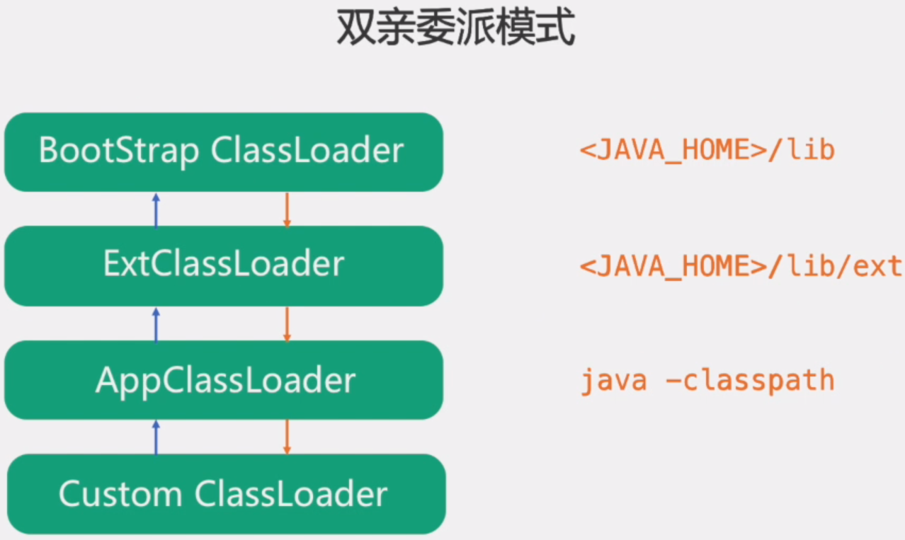
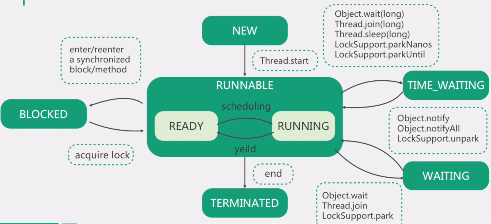
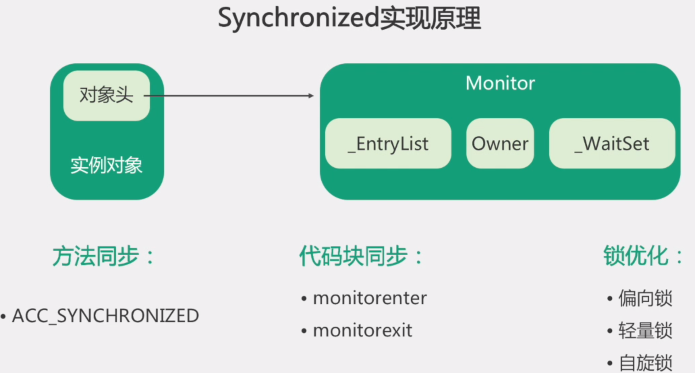
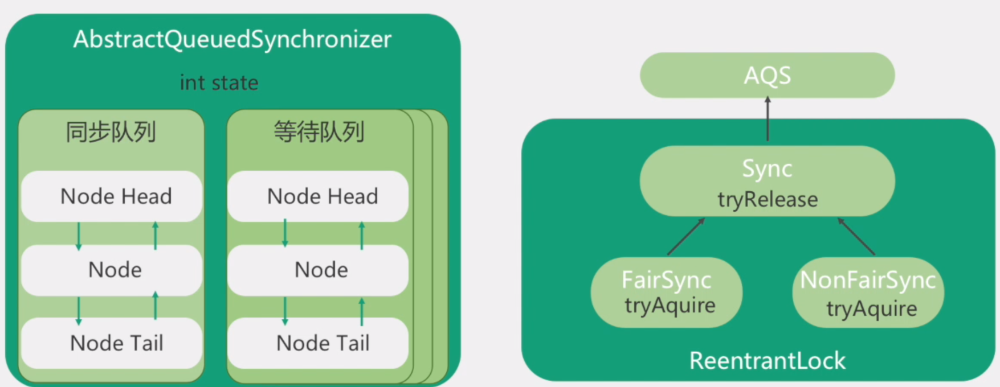
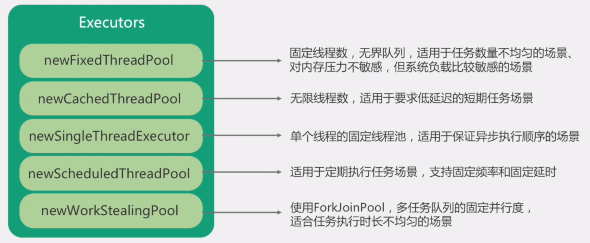
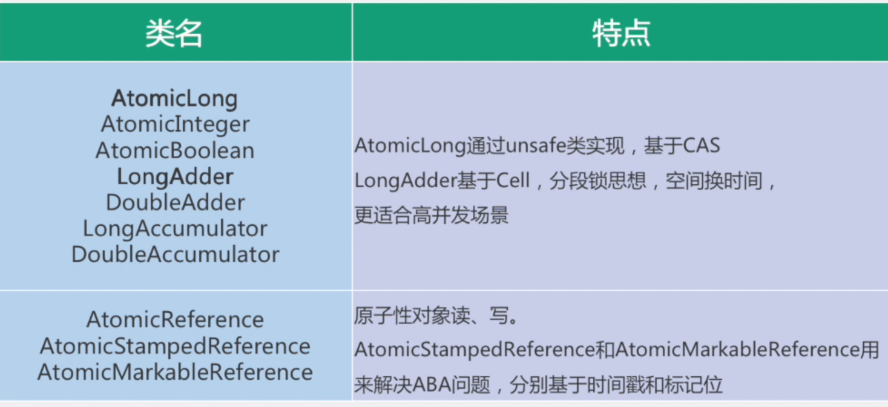
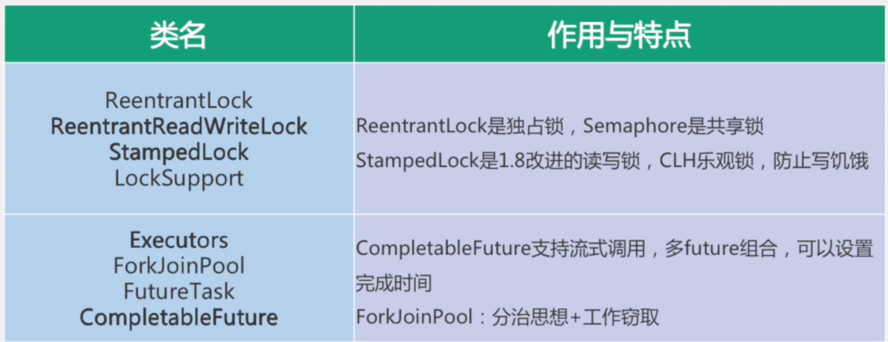
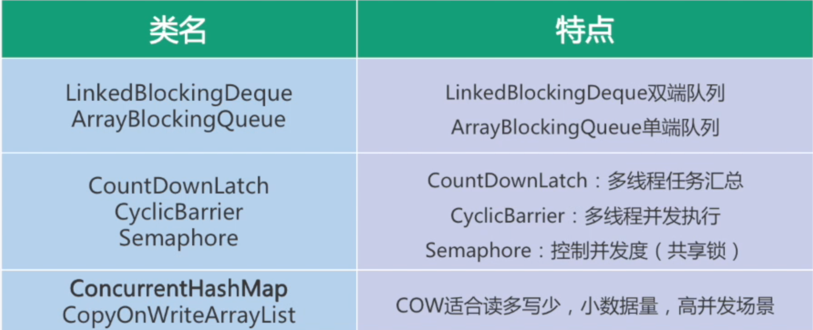

## 大数据架构介绍


LAMBDA架构


```
主要思想：将大数据系统架构分为多个层级，三层架构：批处理层，实时梳理层，服务层
由Storm坐着Nathan Marz提出,旨在设计出一个能满足实时大数据系统关键个性的架构，具有高容错性，低延时性和扩展性等
批处理层：批量处理数据，生成离线结果
实时处理层：实时处理在线数据，生成增量结果
服务层：结合离线，在线计算结果，推送上层
```

## 思考题：从零开始组建公司的大数据集群

```
1.如何确定集群规模？ 假设每台服务器8T硬盘
2. 使用Apache/CDH/HDP 版本?
3.服务器使用物理机还是云主机
3.大数据服务组建规划(出表)
```


```
平台搭建准备工作：
1.如何确认集群规模(主要根据数据量)
	按照每条日志1k, 每天1亿条，半年内不扩容，约100G(100000000 / 1024 / 1024),保留半年时间约18T, 副本数3， 共54T,预留20% buf缓存余地， 媒体爱服务器8T, 共需要约9台
2.如何选择Apache/CDH/HDP版本？
	1、Apache：运维麻烦，组件间兼容性需要自己调研。(一般大厂使用，技术实力雄厚，有专业的运维人员)
	2、CDH：国内使用最多的版本，但CM不开源，但其实对中、小公司使用来说没有影响（建议使用）
	3、HDP：开源，可以进行二次开发，但是没有CDH稳定
3.服务器使用物理机还是云主机
	成本考虑：
	1、物理机：以128G内存,20核物理CPU，40线程，8THDD和2TSSD硬盘，单台报价4W出头，需考虑托管服务器费用。一般物理机寿命5年左右
	2、云主机，以阿里云为例，差不多相同配置，每年5W
	运维成本考虑：
	1、物理机：需要有专业的运维人员
	2、云主机：很多运维工作都由阿里云已经完成，运维相对较轻松 
```


##### 集群安装过程中注意事项

```
尽量使用离线方式安装
非root用户免密sudo权限
确认HDFS的存储目录，保证存储在空间最大硬盘上： df -h
元数据备份(名字信息，创建时间，修改时间，父目录...) namenode中元数据进行备份
配置机架感知(集群规模稍大的时候效果好)
基准测试:测试集群的吞吐量，性能
参数调优：进行集群间参数调优
```

##### 机架感知

```
配置机架感知脚本RackAware.py：注意python语法换行时要使用4个空格 #!/usr/bin/python
#-*-coding:UTF-8 -*-  
import sys 
rack = {"RS1-1":"rack1",
		"RS1-2":"rack1", 
        "RS2-1":"rack2",
        } 
if __name__=="__main__":     print "/" + rack.get(sys.argv[1],"rack0")
 
脚本原理：如rack的服务器IP或主机名会使用对应的机架，不在的会使用rack0 
2、在Namenode所在机器的core-site.xml中配置topology.script.file.name <property>
	<name>net.topology.script.file.name</name> 		  	   <value>/home/hadoop/RackAware.py</value>
</property> 

3、对RackAware.py脚本赋与执行权限，重启Namenode
4、重启过程中，如日志出现类似下面内容代表配置生效
	2016-10-10 10:00:00:000 INFO  	org.apache.hadoop.net.NetworkTopology:Adding a new  node:/rack1/192.168.137.31:50010
5、可通过命令查看：hdfs dfsadmin -printTopology 
```

##### 参数调优

```
dfs.namenode.handler.count=20 * log2(Cluster Size)，比如集群规模为20台时，此参数设置为80
The Hadoop RPC server consists of a single RPC queue per port and multiple handler (worker) threads that dequeue and process requests. If the number of handlers is insufficient, then the RPC queue starts building up and eventually overflows. You may start seeing task failures and eventually job failures and unhappy users. It is recommended that the RPC handler count be set to 20 * log2(Cluster Size) with an upper limit of 200.
dfs.namenode.service.handler.count=上面参数的一半
There is no precise calculation for the Service RPC handler count however the default value of 10 is too low for most production clusters. We have often seen this initialized to 50% of the dfs.namenode.handler.count in busy clusters and this value works well in practice.
dfs.namenode.edits.dir设置与dfs.namenode.name.dir尽量分开，达到最低写入延迟
dfs.namenode.accesstime.precision=0
The setting dfs.namenode.accesstime.precision controls how often the NameNode will update the last accessed time for each file. It is specified in milliseconds. If this value is too low, then the NameNode is forced to write an edit log transaction to update the file's last access time for each read request and its performance will suffer.
The default value of this setting is a reasonable 3600000 milliseconds (1 hour). We recommend going one step further and setting it to zero so last access time updates are turned off. Add the following to your hdfs-site.xml.
```

###### 上述解释和翻译

```
1.dfs.namenode.handler=20*log(集群大小)
Hadoop RPC服务器由每个端口的一个RPC队列和多个worker线程组成,worker线程从队列中取出并处理请求，如果处理程序的数量不足，RPC队列会开始累积并最终溢出，建议将RPC处理程序计数设置为20*log(集群大小),上限200
2.dfs.namenode.service.hanler.count=上面的一半
默认值10太低了，在繁忙的集群中，这个值设置为dfs.namenode.handler.count的50%，效果非常好
3.dfs.namenode.edits.dir设置和dfs.namenode.name.dir分开设置，达到最低写入延迟
4.dfs.namenode.accesstime.precision=0 //关闭最后访问时间更新
参数控制更新每个文件的最后访问时间的频率，如果值太低，namenode会被迫写编辑日志，从而影响性能，直接设置为零，表示关闭最后的访问时间更新
```


```
元数据备份:
配置机架感知：有文档，配置机架感知
基准测试： 评估集群的吞吐量，计算能力
参数调优： 4条
```


#### 用户行为分析(离线)

###### 数据流图

```
server->flume->hdfs->MR/Spark->Hive->Sqoop->Mysql
```

##### 数据采集

```
要求：
实时采集数据到HDFS
保证数据不丢失
```

######  Taildir和Exec Spooling DIR的区别?

```
1. Exec
其实使用的就是linux 命令tail -F ，用于监控某个文件的更新变化
a1.sources.r1.type= exec
a1.sources.r1.command= tail -F /XXX/app.log
2.Spooling Dir
功能：监控目录，对指定目录进行实时监控，如果发现目录新增文件，会进行发送
缺点： 不能对目录文件进行修改，如果有追加内容的文本文件，不允许
	一个文件收集完之后，默认就把该文件的后缀名称给改变了，后续无法操作 
3。tail dir
支持断点续传功能，具有很强的及安装新，可以使用正则监控目录下的变化
```

###### batchSize大小如何设置

```
event 1k左右时， 500-1000合适
```


```
flume优化：
batchSize: 100  event1k左右的，500-1000比较合适

RAID5: 了解下
memoryChannel:理解event是存储在JVM堆内存中
吞吐量： 单位时间内读写数据的大小
checkpointDir和backupCheckpointDir


元数据：hdfs元数据查看
小文件影响： 占用namenode内存， 增加计算压力，  增加查找namenode时间

hdfs.rollInterval=600
hdfs.rollSize=128M
hdfs.rollCount=0 //不使用


a1.sinks.k1.hdfs.round=true        //控制时间结尾
a1.sinks.k1.hdfs.roundValue=10     //每十分钟
a1.sinks.k1.hdfs.roundUnit= minute //分钟

Flume:
双层Flume:单层flume并行写hdfs，hdfs压力较大
		二层flume, 后序配置修改，修改的配置较小

supervior方式实现挂掉后自动重启

flume JVM设置？？
设置堆内存

保证数据至少处理一次 
```

###### 采集层flume设置

```
#定义hadoop112组件
agent-app.sources = r1
agent-app.channels= c1
agent-app.sinks=s1 s2

#定义source--使用taildir
agent-app.sources.r1.type = TAILDIR
agent-app.sources.r1.positionFile =/opt/module/task/data/tmp/tail_position.json
agent-app.sources.r1.filegroups=f1
agent-app.sources.r1.filegroups.f1=/opt/module/task/data/20190408/app.log
agent-app.sources.r1.fileHeader = true

#配置channel
agent-app.channels.c1.type = file
agent-app.channels.c1.checkpointDir = /opt/module/task/data/tmp
agent-app.channels.c1.dataDirs = /opt/module/task/data/filechannel/app_ch1_tmpdata
agent-app.channels.c1.maxFileSize = 104857600
agent-app.channels.c1.capacity= 10000

#sink --批处理设置 sink1
agent-app.sinks.s1.type=avro
agent-app.sinks.s1.batchSize = 10
agent-app.sinks.s1.hostname = hadoop113
agent-app.sinks.s1.port = 4444

 #sink2
agent-app.sinks.s2.type = avro
agent-app.sinks.s2.batchSize = 10
agent-app.sinks.s2.hostname = hadoop114
agent-app.sinks.s2.port = 4444

#设置sinkgroups
agent-app.sinkgroups=sg1
agent-app.sinkgroups.sg1.sinks=s1 s2
agent-app.sinkgroups.sg1.processor.type=load_balance
agent-app.sinkgroups.sg1.processor.selector=round_robin
agent-app.sinkgroups.sg1.processor.backoff=true
agent-app.sinkgroups.sg1.processor.selector.maxTimeOut=10000


#第五部分：进行各个组件的拼接
agent-app.sources.r1.channels=c1
agent-app.sinks.s2.channel=c1
agent-app.sinks.s1.channel=c1

```

##### Flume双层配置

```
1.为何双层flume
  日志采集层服务器非常多，会有很多歌flume agent， 同时向HDFS写数据会产生多个client, 对HDFS来说压力过大
 只有一层flume时，部分业务配置只能在这层配置，如果后序配置修改，则要修改的位置太多，不利于后期维护，利于后期维护
2.采集层
	使用supervior方式实现挂掉后自动重启
	采集层JVM设置为512M
	与业务服务器部署在一起
3. 汇聚层
	使用load_balance
	JVM一般设置为4G
	部署在单独的服务器上(4核8线程16G内存)
4. JVM调优
	-Xms与-Xmx设置一样，减少内存抖动带来的性能影响	
```

###### 如何保证数据不丢失，至少处理一次

```
1.采集层agent挂掉： 使用tailfir 有断点续传功能
2.fileChannel： 写入文件中，比memorychannel  更加安全些
3.采集层服务器挂掉：  这个无法避免，如果服务器挂掉，无论如何也无法写
4.汇总层：使用load_balance 负载均衡，也可以加监控程序  
5.source到channel ,channel到sink 都是有事务性质的，可以保证不丢失数据
所以可以保证数据至少处理一次
```

###### flume调试

```
-Dflume.root.logger=DEBUG,console
//启动flume时，在最后加上这句话，会在控制台输出调用信息
```


## 数据清洗etl

```
提取，转换， 加载
```

###### 清洗过程

```
1.验证数据有效性
2.手机号脱敏
3.去掉username中带有\n的场景
4.过滤重复行(sql方式实现)
```

###### 测试时设置master 

```
不在代码中写死setMaster("local[*]")
优先级： 代码code  >  submit 进行提交时 --matser yarn > 配置文件spark-default.xml
解决方案：在VM options 中添加设置 -Dspak.master=local[*]
-Dspark.master=local[*]
```

##### 远程调试

> 适用场景：生产环境下有错误，但是测试环境下没有发现

```
run->Edits configuration-> +号 ->Remote ->起名 -> 修改host ->修改端口 -> 会生成一个配置设置，
```


```
启动运行jar包时，添加生成的指令,然后调试运行
```


## sqoop

```
sqoop默认的mapreduce个数： 4个
sqoop任务的本质只是MR任务的map任务

sqoop如何保证导出数据不丢失? 业务场景说明
 使用--staging-table方式
 sqoop export --connect jdbc:mysql://192.168.137.10:3306/user_behavior --username root --password 123456 --table app_cource_study_report --columns watch_video_cnt,complete_video_cnt,dt --fields-terminated-by "\t" --export-dir "/user/hive/warehouse/tmp.db/app_cource_study_analysis_${day}" --staging-table app_cource_study_report_tmp --clear-staging-table --input-null-string '\N'
 
 upsert模式与staging-table模式不兼容，二者只能选一，一般staging_table方式更多
 
 hive中卡到的Null在底层存储的什么内容
 TODO
```


##### sqoop导出export


```
sqoop export --connect jdbc:mysql://192.168.137.10:3306/user_behavior --username root --password 123456 --table app_cource_study_report --columns watch_video_cnt,complete_video_cnt,dt --fields-terminated-by "\t" --export-dir "/user/hive/warehouse/tmp.db/app_cource_study_analysis_${day}" --input-null-string '\\N'
```

##### sqoop导出深入

```
sqoop导出时使用upsert模式：
sqoop export --connect jdbc:mysql://192.168.137.10:3306/user_behavior --username root --password 123456 --table app_cource_study_report --columns watch_video_cnt,complete_video_cnt,dt --fields-terminated-by "\t" --export-dir "/user/hive/warehouse/tmp.db/app_cource_study_analysis_${day}" --update-key dt --update-mode allowinsert --input-null-string '\\N'

使用这种模式的前提：
1. --update-key后面跟的字段要设置为唯一索引
create unique index app_cource_study_report_dt on app_cource_study_report (dt);
2.同时要想update_at字段自动更新，需要创建触发器
ALTER TABLE app_cource_study_report MODIFY updated_at TIMESTAMP DEFAULT CURRENT_TIMESTAMP ON UPDATE CURRENT_TIMESTAMP NOT NULL;

再次使用sqoop导入，发现updated_at的日期没有变化，但是数据确实是插入了，这里面有个误区，只有记录的值被修改过，updated_at才会更新，使用如下语句再次测试：
UPDATE app_cource_study_report SET watch_video_cnt = 88888
```

##### zookeeper配置比例

```
20台  ：5台
50台：7台
100： 9台
```


##### 思考题

```
什么情况下数据重复？ hdfs 接收到数据后向sink发送信号，但是没有接收到(因为网络原因)，所以会重新发送
增加批处理能力
使用多个sink同时处理数据
```


##### ORC

```
最开始时使用textFile，根据自己的知识体系，觉得使用orc或parquet会效率高些,在当前的业务数据下进行测试，查询速度比以前快3-5倍
```

###### orc原理

```
由一个或多个stripe组成，每个stipe一般为一个HDFS的块大小，每一个stripe包含多条记录，记录独立存储，每个stripe三部分组成：
index data ： 轻量级index, 默认每隔1w行一个索引, 记录offset
row data ： 存储具体数据，取部分行，按照列进行存储，按照stream存储
stripe Footer : 存的是各个Stream的类型，长度信息
```


```
set("spark.hadoop.validateOutputSpecs", "true");
```


```

drop table if exists ods.user_behavior;
create external table ods.user_behavior(
uid string comment '用户唯一标识',
username string comment '用户昵称',
gender string comment '性别',
level TINYINT comment "1代表小学，2代表初中，3代表高中",
is_vip TINYINT comment "0代表不是会员，1代表是会员",
os STRING comment "操作系统:os,android等",
channel STRING comment "下载渠道:auto,toutiao,huawei",
net_config STRING comment "当前网络类型",
ip STRING comment "IP地址",
phone STRING comment "手机号码",
video_id INT comment "视频id",
video_length INT comment "视频时长，单位秒",
start_video_time BIGINT comment "开始看视频的时间缀，秒级",
end_video_time BIGINT comment "退出视频时的时间缀，秒级",
version STRING comment "版本",
event_key STRING comment "事件类型",
event_time STRING comment "事件发生时的时间缀，秒级"
)COMMENT '原始数据ods层'
partitioned by(dt INT)  
row format delimited fields terminated by "\t" 
location "/user/hive/warehouse/ods.db/origin_user_behavior";


drop table if exists dwd.user_behavior;
create external table dwd.user_behavior(
uid string comment '用户唯一标识',
username string comment '用户昵称',
gender string comment '性别',
level TINYINT comment "1代表小学，2代表初中，3代表高中",
is_vip TINYINT comment "0代表不是会员，1代表是会员",
os STRING comment "操作系统:os,android等",
channel STRING comment "下载渠道:auto,toutiao,huawei",
net_config STRING comment "当前网络类型",
ip STRING comment "IP地址",
phone STRING comment "手机号码",
video_id INT comment "视频id",
video_length INT comment "视频时长，单位秒",
start_video_time BIGINT comment "开始看视频的时间缀，秒级",
end_video_time BIGINT comment "退出视频时的时间缀，秒级",
version STRING comment "版本",
event_key STRING comment "事件类型",
event_time STRING comment "事件发生时的时间缀，秒级"
)COMMENT '原始数据ods层'
partitioned by(dt INT)
location "/user/hive/warehouse/dwd.db/origin_user_behavior"
row format delimited fields terminated by "\t" stored as ORC


create external table if not exists dwd.user_behavior(
uid STRING comment "用户唯一标识",
username STRING comment "用户昵称",
gender STRING comment "性别",
level TINYINT comment "1代表小学，2代表初中，3代表高中",
is_vip TINYINT comment "0代表不是会员，1代表是会员",
os STRING comment "操作系统:os,android等",
channel STRING comment  "下载渠道:auto,toutiao,huawei",
net_config STRING comment "当前网络类型",
ip STRING comment "IP地址",
phone STRING comment "手机号码",
video_id INT comment "视频id",
video_length INT comment "视频时长，单位秒",
start_video_time BIGINT comment "开始看视频的时间缀，秒级",
end_video_time BIGINT comment "退出视频时的时间缀，秒级",
version STRING comment "版本",
event_key STRING comment  "事件类型",
event_time BIGINT comment  "事件发生时的时间缀，秒级") partitioned by(dt INT)  
row format delimited fields terminated by "\t" stored as ORC


#创建临时表
create table if not exists tmp.user_behavior_20190408(
uid STRING comment "用户唯一标识",
username STRING comment "用户昵称",
gender STRING comment "性别",
level TINYINT comment "1代表小学，2代表初中，3代表高中",
is_vip TINYINT comment "0代表不是会员，1代表是会员",
os STRING comment "操作系统:os,android等",
channel STRING comment  "下载渠道:auto,toutiao,huawei",
net_config STRING comment "当前网络类型",
ip STRING comment "IP地址",
phone STRING comment "手机号码",
video_id INT comment "视频id",
video_length INT comment "视频时长，单位秒",
start_video_time BIGINT comment "开始看视频的时间缀，秒级",
end_video_time BIGINT comment "退出视频时的时间缀，秒级",
version STRING comment "版本",
event_key STRING comment  "事件类型",
event_time BIGINT comment  "事件发生时的时间缀，秒级")
row format delimited fields terminated by "\t" 
location "/user/hive/warehouse/tmp.db/user_behavior_20190408";


insert overwrite table dwd.user_behavior partition(dt=20190408)
select 
uid,
username,
gender,
level,
is_vip,
os,
channel,
net_config,
ip,
phone,
video_id,
video_length,
start_video_time,
end_video_time,
version,
event_key,
event_time  
from (
select 
uid,
username,
gender,
level,
is_vip,
os,
channel,
net_config,
ip,
phone,
video_id,
video_length,
start_video_time,
end_video_time,
version,
event_key,
event_time,
row_number() OVER (PARTITION BY uid,event_key,event_time ORDER BY event_time) u_rank 
from tmp.user_behavior_20190408 
) temp where u_rank = 1


#!/bin/bash
date=$1

spark-submit --class com.atguigu.online.etl.ETLData \
--master local[*] \
ETLData-jar-with-dependencies.jar \
/user/hive/warehouse/ods.db/origin_user_behavior/$1 \
/user/hive/warehouse/tmp.db/origin_user_behavior/$1


#!/bin/bash

date=$1

sql="set hive.exec.dynamic.partition.mode=nonstrict;
insert overwrite table dwd_user_behavior partition(dt)
select uid,
username,gender,
level,is_vip,os,channel,
net_config,ip,phone,video_id,
video_length,start_video_time,end_video_time,
version,event_key,event_time,${date} from
(select uid,
username,gender,
level,is_vip,os,channel,
net_config,ip,phone,video_id,
video_length,start_video_time,end_video_time,
version,event_key,event_time,${date},row_number() 
over(partition by uid,event_key,event_time order by event_time)rk 
from tmp_user_behavior) tmp_rank where tmp_rank.rk=1;"


spark-sql -e "$sql"


```

##### 执行成功的local -spark-submit

```
bin/spark-submit \
--class com.wangyg.etl.UserBehaviorCleaner \
--executor-memory 1G \
--total-executor-cores 2 \
ETLOdsBehavior-jar-with-dependencies.jar \
hdfs://hadoop112:9000/user/hive/warehouse/ods.db/origin_user_behavior/20190408 \
hdfs://hadoop112:9000/user/hive/warehouse/tmp.db/user_behavior_20190408

```

##### Sqoop深入

```
Sqoop底层是MR中的map阶段
保证数据传输的任务的事务级别是一个map任务(每个map就是一个事务)
sqoop默认启动时4个map 任务
sqoop提供了一种方式保证数据的一致性
--staging-table 
--clear-staging-table
```


## 指标实现

##### 课程学习反馈

> 今日观看视频用户数
>
> 今日完成视频用户数


```
IO密集型：使用hive
计算密集型：spark
```


```
分区表中使用overwrite, 错误的时候还可以覆盖
密等型
```

```
executor cores  4个
executor memory 12G
TODO
```


```
share去掉

spark与sqoop区别
```

##### union和union all区别

```
union all:将所有结果都显示出来，不管是不是重复
union : 会进行去重操作，所以会有进行排序操作，这样会大量影响性能
```


## 实时项目：

###### 需求：

```
ip转换省份
保证数据不丢失

精确消费一次

direct模式

updateStatebykey

kafka
```


##### 选择spark-kafka集成版本


```
选择Stable稳定版本,生产环境中不能使用实验版本
1.pom依赖
 groupId = org.apache.spark
 artifactId = spark-streaming-kafka-0-8_2.11
 version = 2.1.1
2. 使用mysql进行存储自己的offset
```

#####  streaming消费kafka数据的方式

```
1.Receiver方式：不安全，kafka向streaming中推数据，offset自己维护，有风险
2.Direct 方式：
	好处：1.简化并行度，只用起一个direct就可以和分区进行对应
		 2.高效 ： Receiver实现零数据丢失要求数据存储在写WAL预写日志中，WAL进一步复制了数据。这实际上是低效的，因为数据被有效地复制了两次——一次由Kafka复制，一次由WAL复制
		 3.实现精确一次消费：Receiver方式使用Kafka的高级API在Zookeeper中存储消耗的偏移量。这是使用Kafka数据的传统方式。而这种方法(WA)可以确保零数据丢失(即至少一次semant)

优化：
对于设置checkpoint会影响吞吐量，所以对于不需要保持状态的不需要设置checkpoint， 当设置checkpoint时，设置checkpoint的最佳时间间隔是批处理时间的5-10倍
```

##### 偏移量offset保存在zk

```
偏移量保存在zookeeper中可能会出现以下几个问题：
1.当结果数据输出到Mysql后，在调用将offset保存在zk中，这个时候程序出现问题，offset没有保存到zk中，会重复进行消费
2.调用保存offset到zk程序放在输出结果数据到mysql之前， 执行保存offset到zk中，程序出现问题，会出现数据丢失问题
根本原因是：两个程序没有在一个事务中，无法保证两个数据的一致性
3.updateStateByKey 需要设置检查点目录checkpointDir
```

##### checkpointDie中保存了什么

```
1.Meatadata:
	configuration: 创建Spakr Streaming应用程序的配置信息，比如SparkConf中的信息
	DStream oprations: 定义了Spark Stream应用程序的计算逻辑
	Incomplete batches : job正在排队，还未处理的batch信息
2.Data
	保存的是数据的检查点, 将实时计算过程中产生的RDD的数据保存到可靠的存储系统中 

总结：
元数据checkpoint主要是为了从driver失败中进行恢复，而RDD checkpoint主要是为了，是用到有状态的transformation操作时，能够在其产生的数据丢失时，进行快速的失败恢复
```

###### 当遇到流量激增时如何处理？

```
设置  spark.streaming.backpressure.enabled=true
```

###### 如果程序down掉的瞬间正在写checkpoint保存状态怎么办？还是会丢失状态数据

```
设置优雅停止spark
spark.streaming.stopGracefullyOnShutdown：当为true时parks会优雅的关闭，提交所有任务，不会立即停止
```

###### 宕机后从checkpoint恢复状态的方式

```
 //如果检查点存在，就从检查点中拿出数据
 val ssc = StreamingContext.getOrCreate(checkPoint,
      () => {getVipIncrementByCountry(checkPoint)}
 )
企业中：1. 将chekcpoin中数据保存到新的hdfs路径中, "auto.offset.reset" -> "smallest" 
	   2. 晚上12点将原来的清除
	 Yarn: yarn.resuourcemanager.am.max-attempts
```

##### checkpoint带来的影响

```
checkpoint的最大弊端：一旦流失程序代码或配置改变了，或者更新迭代新功能，这个时候，先停止旧的parkstreaming程序，然后新的程序打包编译后执行，会出现两种情况：
1. 启动报错，反序列化异常
2. 启动正常，但是运行的代码仍是上一次的程序的代码
原因：
 checkpoint第一次持久化的时候会把整个相关的Jar给序列化成一个二进制文件，每次重启都会从里面回复，但当你新的程序打包后序列化加载的仍是就的序列化文件，就会导致报错或依旧执行旧代码, 若把checkpoint删除，就不能恢复原有的数据
解决办法：
1.将修改后的checkpoint指向一个新的路径下,将auto.offset.reset 设置为smallest，相当于从0开始重新消费，一直消费到当前offset，从而达到两个的一致性
2.删除原来的，不在使用，所以这种方法适合于晚上12:00进行上线
```


##### updatestatebyKey

```
updatestateBykey会把以前保存的状态全部读出来， 会一直保存以前的状态，所以导致越来越大
推荐：
mapWithState()保存状态数据
优点： 有一个Duration 持续时间，超过时间的会把超时的数据删除掉
```

##### kafka相关配置

```
部署：
一般为独立服务器， 推荐配置为 8核16G 32G内存服务器
原则上最少3台
```

###### 服务器配置

```
sudo vi /etc/security/limits.conf，追加2行内容，*号代表对所有用户生效
* soft nofile 65536  //设置最大文件句柄
* hard nofile 65536
配置：
log.dirs 设置多个磁盘对应的目录，提高吞吐量
JVM heap一般设置为4G即可，并且使用G1收集器
```

###### 面试题

```
1.kafka最大容错几个副本?
kafka副本数为3，最大能容错2个(最多可以挂2个), 副本不在ISR(同步副本队列)中，就不能容错2个
2.什么情况下副本不在ISR中? 0.9版本之后， follower落后Leader replica.log.time.max.ms的时间后，即不在ISR中，默认10s
3.让某些数据在 kafka中消息全局有序的消费
   1.设置一个分区(比较low)
   2.给相同的key， 让数据进入同一个分区中
4. 让同一个topic中的数据全局有效消费
   设置一个分区
5. kafka ACK机制
	有三种: -1(all) 1 0 
6.当3个副本时，为保证数据安全性，写入时设置ack=-1, 但这样会影响吞吐量，此时可以将 min.insync.replicas设置为2，即达到数据安全性，又提高吞吐量	
```

##### 为什么没有把offset保存到zk中

```
1. 需要将zk和数据输出保存在一个事务中
2. zk不适合频繁的IO读写,效率偏低
```

##### 使用getOrCreate()方式

```
 val ssc = StreamingContext.getOrCreate(checkPoint,
      () => {getVipIncrementByCountry(checkPoint)}
 ) //如果存在就使用原来的状态，如果不存在就创建
```


##### Driver失败恢复机制

```
在集群宕机后，自动进行重启设置，减少人工操作
standalone: 添加 --surpervise方式
yarn模式： yarn.resourcemanager.am.max-attempts
```


```
http://hadoop.apache.org/docs/stable/hadoop-project-dist/hadoop-hdfs/HdfsQuotaAdminGuide.html
```

##### 需不需要设置checkpoint

```
1.ssc.getOrCreate() //使用这种方式是需要从checkpoint中恢复状态，看业务场景是否需要设置checkpoint，设置checkpoint会影响吞吐量
```


## 用户画像

> 根据用户行为，或用户属性为用户打标签

###### 应用方向

```
1.根据标签筛选人群
2.精准营销 : 
```


## 企业中数据

##### 数据量

2亿条 200G ，150个左右


## 其他

###### shell调试

```
1. sh -x 脚本名称 //会将shell脚本执行过程打印出控制台
2. 或在shell脚本中 第一行加 -x命令
```

###### 查看日志位置

```
查看log4j中生成日志的位置
//如果没有修改配置，默认在/tmp目录下
```

###### hive和spark的选择

```
hive适合IO密集型场景
spark适合计算密集型场景
```

###### 小技巧

```
创建表的时候使用if not exists
insert overwrite方式： 适合于分区表，可以覆盖以前的旧的错误数据(密等)
```

##### jsp -ml


left semi join  on...


## 操作系统与计算机网络

##### 操作系统

###### 进程和线程区别

```
进程是系统资源分配的资源单位,进程使用独立的数据空间
线程是程序执行的最小单位,线程共享进程中的数据
```

###### 线程调度

```
时间片轮转算法,先来先服务调度， 优先级调度，多级反馈循环调度
```

##### 进程间通信IPC

```
Pipe:
MessageQueue:  数据交换的场景
共享内存：进程间数据共享的场景
UnixSocket:  数据交换的场景
Signal:
Semaphore:
```

###### 协程：

​	协程更加轻量化，是在用户态进行调度，上下文切换代价更加小

##### Linux常用命令

```
awk
top
netstat
grep
less
tail
```

##### 死锁

##### 内存分页管理和Swap机制

##### 任务队列与CPU Load

##### 扩展知识


##### 网络知识

```
h协议ttp
RPC协议
HTTP四层模型
HTTP七层模型
HTTP协议
TCP协议
滑动窗口与流量控制
HTTP协议
```


##### TCP协议特点

```
1.基于连接(点对点) -- 使用前，先要建立连接
2.双工通信
3.可靠传输
4.拥塞控制
5.基于字节流而非报文
```

###### 三次握手建立连接


```
将主动发起请求的一端成为client， 接收请求的成为server
1.server端进行监听，监听客户端发起的请求,此时server端处于listen状态
2.这时，client端准备建立连接，client端首先发送syn 同步包，发送完后，client端进入SYN_SENT状态
3.Server端收到SYN同步包后，同意进行连接，向client端发送ack确认信号，由于TCP是双工传输，所以一并发送一个SYN同步请求,申请server到client端的建立连接，发送完SYN,ACK信号后，Server端进入SYN_RECV状态
4.Clinet收到server端发送的ACK信号后，进入ESTABLISHED状态,同时向server端发送一个ack确认信号用于恢复syn信号
5.server端收到client端发送的ack，  进行ESTABLISHED状态
==>三次握手建立完成，可以进行数据传输
```

###### 四次挥手


```
起始状态， client端和server端 都是ESTABLISHED状态
1.client端先发起关闭连接请求，先发起一个FIN包，表示client端没有数据要进行发送了， 此时client端进入FIN_WAIT_1状态
2.server端收到FIN信号后，返回ACK，进入CLOSE_WAIT状态,此时进入半关闭状态，client端不会再想server端发送消息，但是server端可能还会想client端发送消息
3. 当server端数据发送完毕后，server端向client端发送FIN信号，这时server端进入LAST_ACK状态
4.client端收到server端发送的FIN信号，向server端发送ack确认信号,然后进入TIME_WAIT状态，此时需要等待2MSL时间(最大报文生成时间)保证连接的可靠关闭， 最后进行关闭
5.server端收到ack信号后，直接关闭

//为什么需要等待2MSL
1.保证TCP的全双工连接可靠的关闭
2.保证连接中重复的数据段能够从网络中消息，防止端口重用时，数据混淆
```

##### 设计模式

```
单例模式：
工厂模式: 
代理模式
构造这模式：
责任链模式
适配器模式
观察者模式
模板模式
其他模式
```

###### 单例模式-线程安全实现

```
静态初始化(饿汉式): 在类初始化的时候，完成单例对象的创建，不会有线程安全的问题，缺陷是，不管有没有使用，都会创建这个单例对象
双重检查(懒汉式):只有真正使用的时候才会创建对象,如果没有使用，不会创建，为了解决多线程的线程安全问题，使用synchronized,使用volatile修饰变量
单例注册表：spring中bean的单例方式
```

```
工厂模式：Spring如何创建Bean
代理模式：动态代理和静态代理,rpc中有使用
责任链模式：Netty消息处理的方式,pipline
适配器模式：SLF4J如何支持LOG4J
观察者模式：GRPC如何支持流失请求的
构造者模式：PB序列化中的Builder
```

## JAVA语言特性

##### 常用集合

##### 动态代理和反射

##### 对象引用

```
强引用：强引用不会被GC回收
弱引用: 在每次GC时都会被回收
软引用：软引用会在内存空间不足时被回收
虚引用：必须和引用队列联合使用,主要用于跟踪一个对象被垃圾回收的过程
```

##### 异常机制

```
try..cath..finally
error 和exception
```

###### Java基础最常考察的类型Map

```
1.HashMap
	实现方式：数组+链表方式实现(数组中的每一项是一个链表方式),通过hashcode 散列，算出在散列表中的位置, 用链表的方式解决hash冲突问题
	容量大小是2的幂次方: 原因： 可以通过按位与的方式来计算余数，效率更高写
	Hashmap是非线程安全的:多线程put的情况下，1.数据错误  2.也可能会出现死循环
2. ConcurrentHashMap
	并发控制与分段锁思想：使用分段锁的方式增加并发性能 
	1.7中使用segment进行分段加锁 1.8使用CAS自旋锁
	红黑树的启用条件：链表大于8， 容量大于64， 转为红黑树
```

```
jdk1.8:
	Lambada表达式
	Stream API
	方法引用
	接口提供默认方法
	Me他space 替换PermGen： 提升GC效率
```

##### JVM

##### JVM内存模型

```
-----线程独占-----
栈： 线程独有，存储局部变量表，操作栈，动态链接,方法出口等信息,调用方法时进行入栈，方法返回时执行出栈操作
本地方法栈：执行native方法时，使用本地方法栈
程序计数器：保存当前线程所执行的代码位置，每个线程工作时，都有一个独立的计数器
-----线程共享-----
堆 : JVM内存管理中最大的一块,所有线程共享，保存所有对象的实例,几乎所有对象的实例都会保存在这里，当堆内存满的时候，会抛出OOM异常,根据对象的周期不同，JVM将堆内存进行分代管理，由垃圾回收进行对堆内存的回收管理
方法区：存储已被虚拟机加载的类信息，常量，静态变量，编译器优化后的代码数据,JDK1.7的永久代和JDK1.8的metaspace都是方法区的实现方式
```

###### JMM

> jmm是java内存模型，JMM的目标是定义程序的访问规则
>
> 所有的共享变量都存储在主内存中，每个线程都有一个工作内存，工作内存中存储共享变量的副本，线程对变量的读写都是在自己的工作内存中进行,而不能读写主内存中的变量, 多线程进行交互时，线程a对变量进行赋值，线程b是不可见的，所以必须线程a将变量的赋值写回到主内存中，然后线程b再从主内存中重新读取这个值，才是正确的， 所以volatile 就是解决这个问题的
>
> 由于指令重排序的问题，读写顺序是会发生改变的，所以JMM需要对原子性，可见性，有序性进行保证
>
> volatile第二个作用就是防止指令重排序
>
> happens-before原则：
>
> 1. 程序次序原则:
> 2. 锁定规则,先执行unlock后，才能执行lock操作
> 3. 传递规则： a happens-before B , B happens-before C , 那么A happens-before C


##### 类加载

> 将编译好的字节文件放在内存中，并加载到方法区内，创建对应的class对象
>
> 加载 ->链接 ->初始化 
>
> ​		|--链接分为 验证  --准备 -- 解析
>
> ​			验证：文件格式的验证，元数据验证，字节码验证，符号引用的验证
>
> ​			准备：类变量的初始化，static类型初始化为0 或null  ，不包括final类型，编译期间已初始
>
> ​			解析：解析字段，接口，方法，将符号引用直接替换成直接引用，直接指向目标的指针或偏移量
>
> 初始化：执行静态块和静态变量	

###### 类加载器



###### 分代管理

​	分为年轻代  老年代  永久代

​	为什么需要分代： 便于进行垃圾回收

​	年轻代分为Eden区和Survivor1 和Survivor2 两个幸存者区

###### 垃圾回收算法

```
引用计数法: 记录变量被使用的个数,缺点是无法解决循环引用的问题
复制法 ： 需要 from 和to 两块大小相同的内存空间，对象分配时只在from块进行，回收时将存活对象放在to块中，清空from 块中的内存，然后交换from块和to块 ,缺点： 内存使用率较低
标记清除法: 标记对象和清除不在使用的对象两步骤，缺点，会产生内存碎片
```

###### CMS和G1 

```
使用标记清除法，优点：并发收集，停顿时间小
```

###### ZGC

针对大内存堆的低延迟垃圾回收算法

##### 性能调优

##### 执行模式

##### 编译器优化


##### 并发与多线程

###### 线程的状态转换

```
new(创建线程时) ->runnable(运行Thread.start)
```



```
1.new :创建一个线程的时候，线程处于new 状态
2.runnable: 执行Thread.start方法后，线程进入runnable状态,这个时候线程也不是马上就运行的，而是先进入就绪状态，等待线程被调度，这个时候是ready状态，在获取到cpu后，线程进入Running状态,Running状态会根据不同的运行条件，进入不同的状态中
3.blocked： Running状态线程进入synchronized block/ synchornized method时，没有获取锁，就会进入blocked状态,当获取到锁时，会从blocked状态恢复到就绪状态

4.time_waiting: 有时间的等待，running状态的线程调用Object.wait(long) Thread.join(long), Thread.sleep(long) 都会进入time_waiting状态,等时间到了后，又从time_waiting状态返回到runnable状态, 或通过Object.notify / Object.notifyAll / LockSupprot.unpark 方法

5.waiting ： 调用Object.wait() 或Thread.join() 或LockSupport.park方法进入waiting
6.terminated : 线程运行完成后，进入terminated状态
```

##### 解决线程互斥的方式

```
CAS:是一种乐观锁的实现机制，是一种轻量级锁，JUC中很多工具类的实现都基于CAS， CAS的思想比较乐观，主要认为任务不会被其他线程修改，所以不会进行加锁，线程在读取数据的时候，不进行加锁，在写会数据的时候，比较两个值是否发生改变，如果两个值相同，则证明没有被其他线程修改，则将值进行写会，若已修改，则重新进行读流程， 这时一种乐观策略，任务并发操作并不总是发生,compare and swap ,比较并写回的操作是通过原子性操作进行的，保证了不会被中断，(原子操作时atomic,原子操作，要么不执行，要么一次性执行完毕) , 但可能会出现ABA问题，可以增加额外变量，时间戳类型，避免这种操作

```



```
synchronized: 对对象进行加锁操作，保证同一时刻只有一个对象进入临界区中,在JVM中，对象在内存中分为三块内容，对象头，实例对象，对齐填充，在对象头中，包含了锁标志位和指向Monitor对象的起始地址,当monitor对象被某个对象占用后，就会处于锁定状态, Monitor中的Owner部分指向持有Monitor对象的线程, 另外Monitor还有两个队列，用来存放进入以及等待进入的获取锁的线程
Synchronized应用在方法同步时，在字节码中，是使用ACC_SYNCHRONIZED标志方式实现的，应用在同步块时，在字节码中是使用monitorenter和monitorexit实现的
针对synchronized获取锁的方式，JVM使用锁优化的方式，就是先使用偏向锁，优先同一线程再次获取锁， 如果失败，就升级为CAS轻量级锁，如果再失败，会进行短暂的自旋， 防止线程被短暂的挂起， 如果以上都失败，会升级为重量级锁
```

```
lock：
AQS:队列同步器，这时实现lock的基础, 会有一个int state标志位，值为1时，表示有线程占用, 其他线程需要进入到等待队列中进行等待, 同步队列是一个双向链表， 当获取锁的线程

ReentrantLock就是基于AQS实现的
```



##### 线程池方式

```
线程池五种创建方法
newFixedThreadPool: 固定线程数，无界队列，适用于任务数量不均匀的场景，对内存压力不敏感，但对系统负载比较敏感的场景
newCachedTHreadPool:不限制线程数，适用于要求低延迟的短期任务场景
newSingleThreadExecutor: 单个线程的固定线程池，适用于保证异步执行顺序的场景
newScheduledTHreadPool: 适用于定期执行任务场景，支持福鼎频率和固定延时进行定期执行的要求
newWorkStealingPool:工作窃取线程池,使用ForkJoinPool,多任务队列的固定并行度，适合任务执行时长不均匀的场景
```



##### JUC

```
java提供多线程的类库

```







```
线程的同步与异步： 任务是否在同一个线程中执行，
阻塞与非阻塞: 异步执行任务时，线程是否会阻塞等待结果 ,还是会继续执行后面的逻辑
```

###### wait和sleep

```
wait属于Object类 , wait会释放对象锁 . wait需要在同步块中使用, wait不需要捕获异常
sleep属于Thread类, sleep不会释放对象锁, sleep可以在任何地方使用, sleep需要捕获异常
```

```
读写锁使用场景适合读多写少的场景
ThreadLoaal是用来解决线程数据隔离的问题
```


##### Kafka

队列的作用：1.传递消息 提交异步任务,提交方不需要进行等待   2.削峰填谷，突发流量时可以做缓冲

```
消息协议：JMS  AMQP
常用队列：RabbitMQ  单机吞吐量1w
		ActiveMQ  单机吞吐量1w
		Kafka	  单机吞吐量10w，完全分布式消息系统
```

##### 数据库范式

范式级别越高，对数据库表的要求越严格

第一范式： 数据库中的每一个字段不可再切分

第二范式： 表中的字段不能存在部分依赖（联合主键中不能存在部分主键依赖）

第三范式： 不能存在传递函数依赖


##### mysql调优

```
尽量使用not null设置，mysql无法对null的搜索进行优化，所以会影响性能

优化方式：
1.找到最需要优化的sql语句，查询mysql的慢查询日志
2.利用mysql的分析工具 explain分析语句的执行计划, 或profile 查询各部分的使用耗时
3. 避免使用select * ,只取出需要的列
4. 尽量使用prepared statements ，原因：1.性能好  2.防止SQL注入场景出现
5. 优化场景: 明明设置了索引，但是查询效率并没有提升，然后使用explain 查询SQL语句，发现使用了错误的索引，所以才会有这种现象，然后在代码中显式声明使用use index 
```


##### 简历


```
star法则
```


